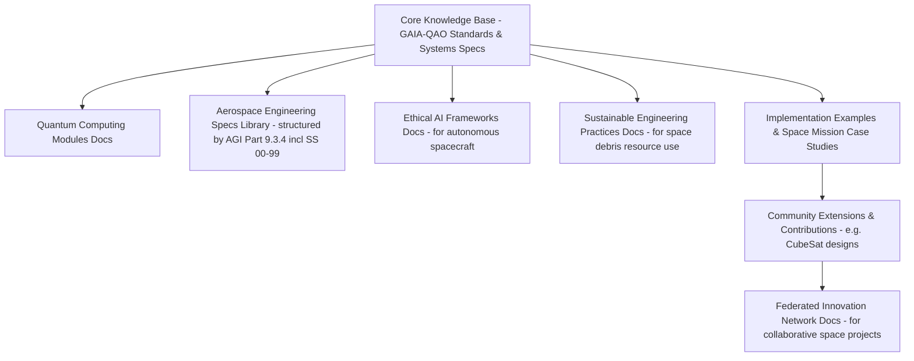
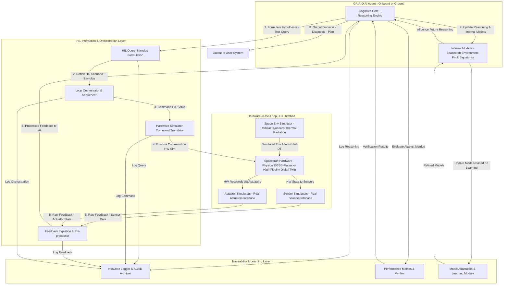
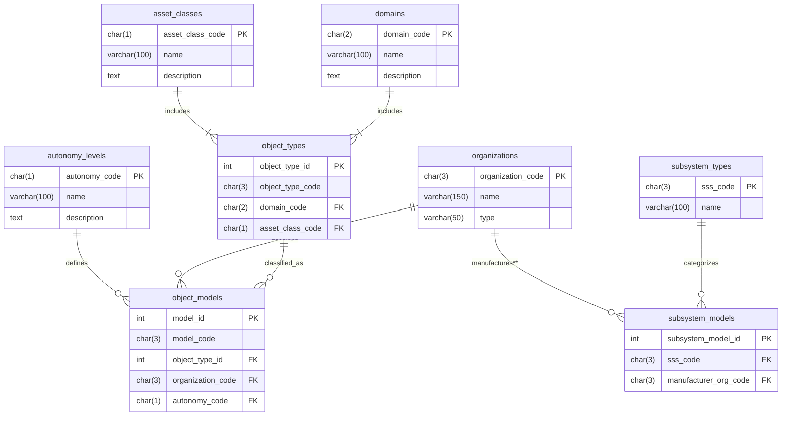
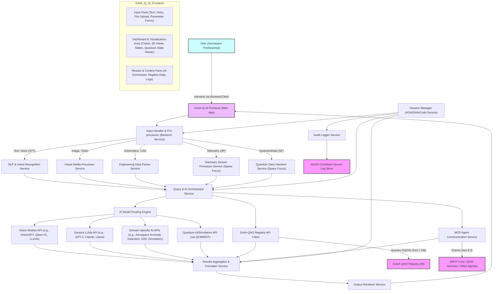
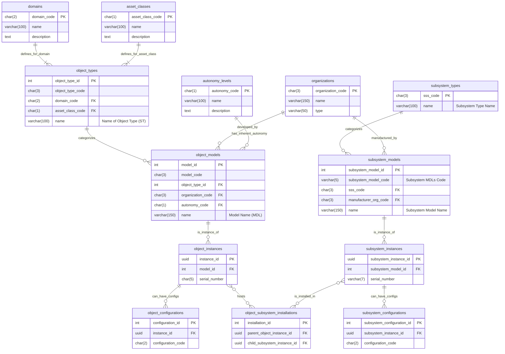
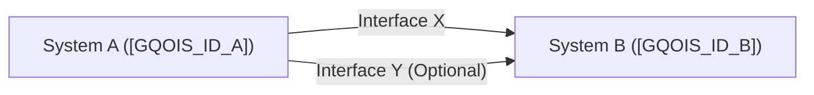
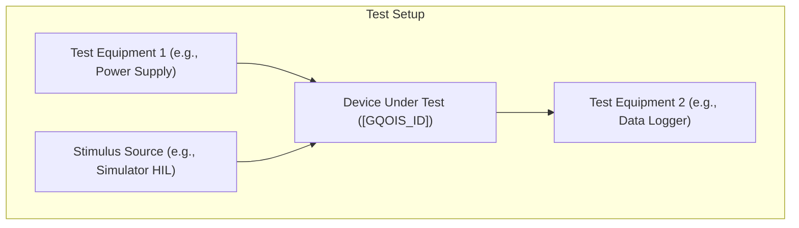

# Project Management Plan: [GAIA-Q-SPACE-TEAM-PROJECT]

---
## 0. Foundational Disambiguation: Components vs. Modules
(Quantum Collapsing Principle for Systems Integration)

### 0.1 Purpose
To prevent ambiguity (“superposition” of meaning) in technical, organizational, and certification documentation, the following explicit definitions and classification boundaries are established for components and modules within the GAIA-QAO project management and systems engineering context.

### 0.2 Definitions

| Term      | Definition                                                                                                                                                                                             | Example in GAIA-QAO                                                                                                |
| :-------- | :----------------------------------------------------------------------------------------------------------------------------------------------------------------------------------------------------- | :----------------------------------------------------------------------------------------------------------------- |
| Component | A fundamental, physically or logically distinct part of a system that provides a specific function or capability. Components may be hardware, software, data, or organizational artifacts, and are typically “atomic” in the sense that they are not subdivided further for design, manufacturing, or traceability purposes within the current system boundary. | “Antenna”, “Quantum Sensor”, “Flight Control Board”, “Telemetry Processor”, “Encryption Algorithm”                 |
| Module    | A composite, higher-order construct formed by a collection of components (and possibly sub-modules), representing a complete functional block or deployable unit within the system. Modules define clear interfaces, support reuse, and serve as the main units of integration, certification, and configuration management. | “Communications Module” (includes: Antenna + Transceiver + Encryption Component), “Power Module”, “Propulsion Module”, “User Interface Module” |

**Quantum Collapsing Metaphor:**

In GAIA-QAO, component and module distinctions are “collapsed” from conceptual superposition (where a part could be ambiguously both) into a single, explicit identity at each level of the WBS, documentation, and digital twin.

### 0.3 Boundary Rules & Principles
* **Traceability:** Every deliverable, requirement, and change must clearly reference either a component or a module (never both at once at a given level of breakdown).
* **Certification:** Certification, quality, and compliance processes are performed at the module level (with components forming auditable build/config records).
* **Reusability:** Components may be reused across modules; modules are the main units of system reconfiguration or up-versioning.
* **Unique Identification:**
    * Components: `GAIA-QAO-COMP-[Domain]-[Type]-[ID]`
    * Modules:    `GAIA-QAO-MOD-[Domain]-[Type]-[ID]`
    * All traceable in MetaNube and project configuration baselines.
* **Quantum Collapsing in Documentation:** At each integration or breakdown point (TPSL, TPWD, WBS), ambiguity is resolved:
    * Is this an indivisible “building block” (component) or an integrable, certifiable “block” (module)?
    * No “Schrödinger parts”—every part is resolved to one state by explicit declaration.

### 0.4 Example Table

| Item                 | Type      | ID Example                  | Notes                                  |
| :------------------- | :-------- | :-------------------------- | :------------------------------------- |
| High-Gain Antenna    | Component | GAIA-QAO-COMP-COMM-HGA-0001 | Used in multiple modules               |
| Telemetry Subsystem  | Module    | GAIA-QAO-MOD-AVIO-TEL-0010  | Contains sensor & data units           |
| Quantum Key Chip     | Component | GAIA-QAO-COMP-SEC-QKC-0005  | Embedded in Secure Module              |
| Power Control Module | Module    | GAIA-QAO-MOD-POWR-PCM-0002  | Includes PCBs & software               |

### 0.5 Practical Implementation
* Every WBS element and requirement must resolve (“collapse”) to a declared component or module.
* All documentation, versioning, and approval workflows must reference the explicit ID and type.
* Digital twin and compliance traces in MetaNube must enforce this disambiguation at ingestion and change.

This “foundational disambiguation” section is to be placed immediately before the main Project Management Plan to ensure universal clarity and to align all project actors, agents, and systems (human and AI) with GAIA-QAO’s quantum-informed documentation standard.

---
## Document Control

* **Document Title:** Project Management Plan for [Project Name]
* **Document ID:** [GAIA-QAO-PMP-YYYY-NNNN]
* **Version:** [X.Y]
* **Date:** [YYYY-MM-DD]
* **Project Manager:** [Name of Project Manager]
* **Issuing Authority:** [e.g., GAIA-QAO Project Management Office]
* **Security Classification:** [e.g., Unclassified, GAIA-Q Internal Use]
* **Approval Signatures:**
    * Project Manager: \_________________________ Date: \___________
    * Project Sponsor: \_________________________ Date: \___________
    * (Other Key Stakeholders as needed)

---
## Revision History

| Version | Date       | Author(s)     | Change Description Summary                     | Approver(s) |
| :------ | :--------- | :------------ | :--------------------------------------------- | :---------- |
| 0.1     | [YYYY-MM-DD] | [Name]        | Initial Draft                                  | [Name]      |
| 1.0     | [YYYY-MM-DD] | [Name]        | First Approved Release for [Project Phase]     | [Name]      |
| ...     | ...        | ...           | ...                                            | ...         |

---
## Table of Contents

*(Note: Generate a Table of Contents if your Markdown viewer supports it, or list key sections manually)*

1.  Introduction
2.  Project Scope Management
3.  Work Breakdown Structure (WBS)
4.  Project Organization & Stakeholders
5.  Schedule Management
6.  Cost Management
7.  Quality Management
8.  Resource Management
9.  Communication Management
10. Risk Management
11. Change Management
12. Project Acceptance Criteria
13. Supporting Documents & Appendices

---

## 1. Introduction

### 1.1 Project Purpose
This Project Management Plan (PMP) defines how the [Project Name] project (hereafter "the Project") will be executed, monitored, controlled, and closed.

The primary purpose of the Project is to:
* [Clearly state the main purpose of the Project, e.g., "develop and deploy the new Crew Communication System for the GAIA-Next Generation Spacecraft."]
* This project addresses the requirements outlined in [Reference to TPSL or other governing specification, e.g., "TPSL-CCS-2025-001"].

### 1.2 Project Goals and Success Criteria

**Project Goals:** (SMART: Specific, Measurable, Achievable, Relevant, Time-bound)
* **Goal 1:** [e.g., "Complete the design, development, and testing of the Crew Communication System by [YYYY-MM-DD]."]
* **Goal 2:** [e.g., "Ensure the system meets all performance specifications outlined in TPSL-CCS-2025-001, Section 4."]
* **Goal 3:** [e.g., "Deliver the project within the approved budget of €X,XXX,XXX."]
* **Goal 4:** [e.g., "Achieve user acceptance from the Astronaut Office by [YYYY-MM-DD]."]

**Success Criteria:** (How project success will be measured)
* **Criterion 1:** [e.g., "All critical system functionalities (as defined in TPSL Section 3.X) are verified through formal testing."]
* **Criterion 2:** [e.g., "Project expenditure does not exceed the allocated budget by more than [Y]% without approved change requests."]
* **Criterion 3:** [e.g., "No 'Severity 1' defects outstanding at the time of final system deployment."]
* **Criterion 4:** [e.g., "Key stakeholders (listed in Section 4.3) formally sign off on project completion."]

---

## 2. Project Scope Management

### 2.1 Project Scope Statement
The scope of the Project includes:
* [Provide a concise summary of the project scope, including major objectives and key activities. Example: "The project encompasses the full lifecycle of the Crew Communication System, from detailed design through component procurement, software development, system integration, comprehensive testing (unit, integration, system, user acceptance), documentation, and readiness for operational deployment. This includes development of new antenna subsystems, transceiver modules, and user interface software."]

### 2.2 Key Project Deliverables
The following are the major deliverables for this Project:
1.  **D01:** [Deliverable Name, e.g., "Detailed System Design Document"] ([Format, e.g., "PDF, S1000D XML Data Modules"])
2.  **D02:** [Deliverable Name, e.g., "Hardware Prototypes (Antenna, Transceiver)"] ([Format, e.g., "Physical Units, Test Reports"])
3.  **D03:** [Deliverable Name, e.g., "Software Build vX.Y (UI & Control)"] ([Format, e.g., "Executable, Source Code in MetaNube"])
4.  **D04:** [Deliverable Name, e.g., "Integrated Crew Communication System"] ([Format, e.g., "Verified System Unit"])
5.  **D05:** [Deliverable Name, e.g., "Complete Test Documentation (Procedures, Reports)"] ([Format, e.g., "PDF, Data in MetaNube"])
6.  **D06:** [Deliverable Name, e.g., "User Manuals and Training Materials"] ([Format, e.g., "IETP, PDF"])

### 2.3 Scope Exclusions
The following items are explicitly excluded from the scope of this Project:
* [e.g., "Long-term operational maintenance and support of the deployed system (to be covered by a separate service agreement)."]
* [e.g., "Development of the ground control segment interface (provided by a separate project team)."]
* [e.g., "Certification for non-nominal operational environments beyond those specified in TPSL-CCS-2025-001."]

### 2.4 Project Assumptions
The execution of this Project is based on the following assumptions:
* [e.g., "Required test facilities and specialized equipment will be available as per the project schedule."]
* [e.g., "Key personnel identified in this plan will remain available for the project duration."]
* [e.g., "Dependent components from other projects/suppliers will be delivered on time and to specification."]

### 2.5 Project Constraints
The Project must operate within the following constraints:
* **Schedule:** Project completion by [Fixed Date] due to [Reason, e.g., "integration window with spacecraft assembly"].
* **Budget:** Total project budget not to exceed [€X,XXX,XXX].
* **Resources:** Maximum of [N] Full-Time Equivalent (FTE) personnel allocated from [Department(s)].
* **Technical:** Adherence to [Specific Standard, e.g., "S1000D for documentation, ECSS-E-ST-50C for communications"].
* **Regulatory:** Compliance with [e.g., "EASA Part-21 Subpart J for design changes"].

---

## 3. Work Breakdown Structure (WBS)

### 3.1 WBS Overview
The Project's total scope of work is decomposed into manageable work packages using a Work Breakdown Structure (WBS). The WBS serves as the foundation for planning, scheduling, costing, and progress tracking.

* The WBS is structured [hierarchically by phase / by major deliverable].
* A detailed WBS Dictionary, outlining each work package's description, deliverables, responsible owner, effort, and dependencies, is maintained at: `[Link to WBS Dictionary Document or MetaNube Location]`

### 3.2 WBS Summary (Top Levels)
* **1.0 [Project Name]**
    * **1.1 Project Management**
        * 1.1.1 Project Planning & Control
        * 1.1.2 Stakeholder & Risk Management
    * **1.2 System Design & Engineering**
        * 1.2.1 Requirements Finalization
        * 1.2.2 Architectural Design (PDR)
        * 1.2.3 Detailed Design (CDR)
    * **1.3 Hardware Development & Procurement**
        * 1.3.1 [Component A] Development
        * 1.3.2 [Component B] Procurement
    * **1.4 Software Development**
        * 1.4.1 [Module X] Development
        * 1.4.2 [Module Y] Development
    * **1.5 System Integration & Verification**
        * 1.5.1 Hardware-Software Integration
        * 1.5.2 System Level Testing
        * 1.5.3 User Acceptance Testing (UAT)
    * **1.6 Documentation, Training & Deployment Preparation**
        * 1.6.1 Technical Documentation (S1000D)
        * 1.6.2 User Training Program
        * 1.6.3 Deployment Package Preparation

---

## 4. Project Organization & Stakeholders

### 4.1 Project Team Structure
* A visual Project Organization Chart is available at: `[Link to Org Chart Image/Document]`
* The project team operates within the [GAIA-QAO Program Name] structure and reports to [Steering Committee/Program Manager Name].

### 4.2 Key Roles & Responsibilities

| Role                    | Name / Department        | Key Responsibilities                                                                 |
| :---------------------- | :----------------------- | :----------------------------------------------------------------------------------- |
| Project Sponsor         | [Name]                   | Champions the project, provides resources, ultimate decision-maker.                  |
| Project Manager         | [Name]                   | Overall execution, planning, control, risk, budget, schedule, team leadership.       |
| Lead Systems Engineer   | [Name / Systems Eng. Dept] | Technical integrity, requirements, architecture, V&V lead.                             |
| Hardware Lead           | [Name / HW Dept]         | Manages hardware design, development, procurement, and testing activities.           |
| Software Lead           | [Name / SW Dept]         | Manages software design, development, integration, and testing activities.           |
| QA Manager              | [Name / QA Dept]         | Ensures quality processes, conducts audits, reviews deliverables for compliance.       |
| Procurement Officer     | [Name / Procurement Dept]| Manages acquisition of external components and services.                             |
| User Representative(s)  | [e.g., Astronaut Office] | Provides user input, participates in UAT, validates usability.                       |
| MetaNube Admin          | [Name / IT Dept]         | Manages project documentation and data configuration in MetaNube.                    |

### 4.3 Stakeholder Management
Key stakeholders for this Project include:

| Stakeholder Group        | Key Contact(s) | Interest / Influence                                      | Engagement Strategy                                 |
| :----------------------- | :------------- | :-------------------------------------------------------- | :-------------------------------------------------- |
| GAIA-QAO Program Office  | [Name]         | Funding, oversight, strategic alignment                   | Monthly progress reports, steering committee meetings |
| Astronaut Office         | [Name]         | End-user requirements, operational usability, UAT         | Regular demos, UAT participation, feedback sessions |
| EASA/FAA Regulatory Body | [Name]         | Compliance with aerospace standards, certification        | Formal review submissions, audit support            |
| Engineering Departments  | Dept. Heads    | Resource allocation, technical expertise                  | Bi-weekly coordination meetings                     |
| External Suppliers       | Account Mgrs.  | Component delivery, technical support                     | Regular supplier reviews, contract management       |

A detailed Stakeholder Register and Engagement Plan is maintained at: `[Link to Stakeholder Register]`

---

## 5. Schedule Management

### 5.1 Master Schedule / Timeline Summary
* A detailed Project Schedule (Gantt chart) is maintained in [Scheduling Tool, e.g., MS Project Online] and accessible via: `[Link to Live Schedule]`
* **Projected Start Date:** [YYYY-MM-DD]
* **Projected End Date:** [YYYY-MM-DD]
* **Total Estimated Duration:** [Number] Weeks/Months

### 5.2 Key Milestones

| ID  | Milestone Description                       | Planned Date | Responsible       | Verification Method                         |
| :-- | :------------------------------------------ | :----------- | :---------------- | :------------------------------------------ |
| M01 | Project Kick-Off                            | [YYYY-MM-DD] | Project Manager   | Meeting Minutes & Plan Baseline Approved    |
| M02 | System Requirements Review (SRR) Successful | [YYYY-MM-DD] | Lead Systems Eng. | SRR Board Approval                          |
| M03 | Preliminary Design Review (PDR) Successful  | [YYYY-MM-DD] | Lead Systems Eng. | PDR Board Approval                          |
| M04 | Critical Design Review (CDR) Successful     | [YYYY-MM-DD] | Lead Systems Eng. | CDR Board Approval                          |
| M05 | Key Long-Lead Items Procured                | [YYYY-MM-DD] | Procurement       | Goods Received & Inspected                  |
| M06 | Software Alpha Release Complete             | [YYYY-MM-DD] | Software Lead     | Alpha Test Report                           |
| M07 | Hardware Prototypes Ready                   | [YYYY-MM-DD] | Hardware Lead     | Hardware Test Readiness Review (TRR)        |
| M08 | System Integration Complete                 | [YYYY-MM-DD] | Lead Systems Eng. | Integration Test Report                     |
| M09 | User Acceptance Testing (UAT) Complete      | [YYYY-MM-DD] | User Rep.         | UAT Sign-off                                |
| M10 | Final Project Deliverables Accepted         | [YYYY-MM-DD] | Project Manager   | Project Sponsor Sign-off                    |
| M11 | Project Closure                             | [YYYY-MM-DD] | Project Manager   | Closure Report Approved                     |

### 5.3 Schedule Management Approach
* The schedule will be baselined after initial approval of this PMP.
* Progress will be tracked against the baseline schedule on a [weekly/bi-weekly] basis.
* The critical path will be monitored closely. Any delays impacting the critical path by more than [X days] will trigger an immediate review and corrective action plan.
* Schedule performance will be reported using Earned Value Management (EVM) metrics where appropriate.

---

## 6. Cost Management

### 6.1 Overall Project Budget
* Total Approved Project Budget: **€[XXX,XXX.XX]**
* Budget Baseline Date: [YYYY-MM-DD]

### 6.2 Budget Allocation Summary (by WBS Top Level or Cost Category)

| WBS / Cost Category    | Allocated Budget (€) | Notes                                          |
| :--------------------- | :------------------- | :--------------------------------------------- |
| 1.1 Project Management | [Amount]             | Labor, PM tools                                |
| 1.2 System Engineering | [Amount]             | Labor, simulation tools                        |
| 1.3 Hardware Dev.      | [Amount]             | Labor, materials, components, test equipment   |
| 1.4 Software Dev.      | [Amount]             | Labor, licenses, development tools             |
| 1.5 Integration & V&V  | [Amount]             | Labor, lab fees, consumables                   |
| 1.6 Documentation etc. | [Amount]             | Labor, publication costs                       |
| Travel                 | [Amount]             | For reviews, supplier visits, site integration |
| Contingency Reserve    | [Amount]             | ([Y]% of total, for identified risks)          |
| Management Reserve     | [Amount]             | (For unidentified risks, requires sponsor approval) |
| **Total Budget** | **[Amount]** |                                                |

A detailed cost baseline is maintained at: `[Link to Detailed Budget Spreadsheet/System]`

### 6.3 Cost Management Approach
* Costs will be tracked against WBS elements using [Financial System Name].
* Budget performance will be reviewed [monthly] by the Project Manager and reported to the Project Sponsor/Steering Committee.
* Earned Value Management (EVM) will be used to assess cost performance (CPI, CV).
* Any anticipated overrun exceeding [Z]% of a WBS element's budget or [Q]% of the total project budget requires a formal change request (see Section 11).

---

## 7. Quality Management

### 7.1 Quality Objectives
The Project aims to:
* Ensure all deliverables meet or exceed the requirements specified in [TPSL Document ID] and other applicable standards.
* Adhere to GAIA-QAO quality processes and aerospace best practices (e.g., S1000D, ATA, STE).
* Minimize rework through proactive quality assurance and verification activities.
* Achieve high stakeholder satisfaction with project deliverables.

### 7.2 Key Quality Activities
* **Reviews:** Formal reviews at key milestones (SRR, PDR, CDR, TRR, FAR). Peer reviews for design documents and code.
* **Audits:** [Periodic/milestone-based] internal quality audits. Support for external regulatory audits.
* **Testing:** Comprehensive V&V testing at all levels (unit, integration, system, UAT) as per the Test Plan: `[Link to Test Plan]`.
* **Standards Compliance:** Adherence to specified documentation standards (S1000D, STE) and technical standards ([ECSS, MIL-STD, etc.]). Automated checks (e.g., BREX for S1000D) will be used where applicable.
* **Non-conformance Management:** A process for identifying, documenting, tracking, and resolving non-conformances will be implemented using [Tool/System Name].

The overall Quality Management Plan for GAIA-QAO projects can be found at: `[Link to GAIA-QAO QMP]`

---

## 8. Resource Management

### 8.1 Key Resources Required
* **Personnel:** [List key roles and number of FTEs, e.g., "2x Senior Hardware Engineers, 3x Software Developers, 1x Technical Writer"].
* **Equipment:** [e.g., "Spectrum Analyzers, High-Performance Computing Cluster for simulations, Specific Test Rigs"].
* **Facilities:** [e.g., "Clean Room Access, RF Anechoic Chamber, Integration Lab Space"].
* **Software/Tools:** [e.g., "CAD Software (CATIA), PLM (MetaNube), Simulation Software (ANSYS), S1000D CSDB"].

### 8.2 Resource Allocation and Management
* Resources will be allocated based on the project schedule and WBS task requirements.
* A detailed Resource Plan is available at: `[Link to Resource Plan]`
* Resource availability and potential conflicts will be reviewed [weekly/bi-weekly] by the Project Manager in coordination with department heads.
* Any critical resource shortages will be escalated to the Project Sponsor.

---

## 9. Communication Management

### 9.1 Communication Strategy
Effective communication is critical for project success. The strategy includes:

| Audience                 | Communication Vehicle              | Frequency     | Owner           | Purpose                                         |
| :----------------------- | :--------------------------------- | :------------ | :-------------- | :---------------------------------------------- |
| Project Team             | Daily Stand-ups / Weekly Meetings  | Daily / Weekly| Project Manager | Progress, issues, coordination                  |
| Project Sponsor/Steering | Formal Progress Reports / Meetings | Monthly       | Project Manager | Status, risks, decisions needed                 |
| Key Stakeholders         | Email Updates / Review Meetings    | As Needed / Milestone | Project Manager | Information, feedback, involvement              |
| Wider GAIA-QAO Org.      | Intranet Updates / Newsletters     | Quarterly     | PM / Comms      | General awareness, major achievements         |
| Regulatory Bodies        | Formal Submissions / Audits        | As Required   | PM / QA Manager | Compliance, certification                       |

### 9.2 Reporting Plan
* **Weekly Status Snippets:** To Project Team and direct line management.
* **Bi-Weekly Progress Summaries:** To key internal stakeholders.
* **Monthly Formal Progress Reports:** To Project Sponsor and Steering Committee. Includes schedule, cost, risk, and quality updates. Template: `[Link to Report Template]`
* All formal project documentation will be managed and versioned in the MetaNube repository: `[Link to Project's MetaNube Folder]`

---

## 10. Risk Management

### 10.1 Risk Management Approach
A proactive approach to risk management will be followed throughout the project lifecycle:
1.  **Risk Identification:** Risks will be identified through team brainstorming, lessons learned, expert interviews, and checklists.
2.  **Risk Analysis:** Each identified risk will be assessed for its probability and impact (e.g., on cost, schedule, scope, quality).
3.  **Risk Evaluation/Prioritization:** Risks will be prioritized based on their overall score.
4.  **Risk Treatment:** Mitigation, avoidance, transference, or acceptance strategies will be developed for high-priority risks.
5.  **Risk Monitoring & Review:** Risks will be regularly monitored, and the Risk Register updated. New risks will be identified as they emerge.

### 10.2 Risk Register
A detailed Risk Register is maintained at: `[Link to Risk Register]`
This register includes: Risk ID, Description, Category, Probability, Impact, Overall Score, Owner, Response Plan, Status.

### 10.3 Initial Key Risks (Examples)
* **R001:** Delays in procurement of critical long-lead hardware components.
* **R002:** Unforeseen technical challenges during system integration.
* **R003:** Loss of key personnel with specialized skills.
* **R004:** Changes in regulatory requirements impacting design.

---

## 11. Change Management

### 11.1 Change Control Process
All changes to the project scope, schedule, cost, or quality baselines must follow a formal change control process:
1.  **Change Request (CR) Submission:** Any stakeholder can submit a CR using the official form: `[Link to Change Request Form]`. The CR must detail the proposed change, justification, and potential impacts.
2.  **CR Logging & Review:** The Project Manager logs the CR and conducts an initial impact assessment.
3.  **Impact Analysis:** Relevant team members analyze the full impact of the proposed change (technical, schedule, cost, resources, risk).
4.  **Change Control Board (CCB) Review:** The CCB (comprising [Project Manager, Project Sponsor, Key Technical Leads, QA Rep]) reviews the CR and impact analysis.
5.  **Decision & Communication:** The CCB approves or rejects the CR. The decision is documented and communicated to all relevant stakeholders.
6.  **Implementation:** If approved, the Project Manager updates project plans, baselines, and directs implementation of the change.

### 11.2 Change Control Board (CCB)
* **Chair:** [Project Manager / Project Sponsor]
* **Members:** [List key roles]
* **Meeting Frequency:** [As needed / Bi-weekly]

---

## 12. Project Acceptance Criteria

The overall Project will be considered complete and accepted when the following criteria are met:
1.  All key deliverables listed in Section 2.2 have been completed, formally reviewed, and accepted by the designated approvers (including the Project Sponsor).
2.  All critical success criteria defined in Section 1.2 have been demonstrably achieved.
3.  All mandatory requirements in the governing specification ([TPSL Document ID]) have been verified as per the V&V plan.
4.  User Acceptance Testing (UAT) has been successfully completed, and formal sign-off received from [User Representative Body, e.g., Astronaut Office].
5.  The Project has been completed within the approved budget and schedule, or any deviations have been formally approved through the change control process.
6.  A Final Project Report, including lessons learned, has been submitted and approved. `[Link to Final Project Report Template]`

---

## 13. Supporting Documents & Appendices

* **Referenced TPSL:** `[Link to TPSL Document]`
* **Detailed WBS & Dictionary:** `[Link]`
* **Detailed Project Schedule:** `[Link]`
* **Detailed Budget & Cost Baseline:** `[Link]`
* **Risk Register:** `[Link]`
* **Stakeholder Register & Engagement Plan:** `[Link]`
* **Quality Management Plan (Project Specific, if any):** `[Link]`
* **Test Plans & Procedures:** `[Link]`
* **Change Request Log:** `[Link]`
* **Lessons Learned Register:** `[Link]`
* **(Other relevant documents as needed)**

---
**End of Project Management Plan**
You're absolutely right! My apologies. In my enthusiasm to structure the Q-SPACE focused AGI, I presented the content for Parts 0, 1 (outline), and 2 (outline) without explicitly re-generating the full, detailed Markdown for them based on your "Prose Report" and "HIL Thinking" inputs *within this specific Q-SPACE focused output*.

Let's fix that immediately. I will now generate:

1.  **Part 0: Framework Overview** (as it was in Turn 131, which is good).
2.  **Part 1: Programming Languages, Development Environments, and Libraries in Aerospace and Defense Software** - This will be the **full prose report** you provided (from "paste.txt" / Turn 119 / Turn 123), with its internal headings correctly mapped to the AGI subsections 1.1 through 1.10 (with 1.11 for its references). I will ensure all tables from your prose report are included.
3.  **Part 2: Hardware-in-the-Loop (HIL) Thinking Specification** - This will include the **full "IDEA SUMMARY" and then the detailed sections 2.1 through 2.9**, fleshed out as we developed them, including the placeholder for your Mermaid diagram in 2.4.

This will correctly establish the beginning of the Q-SPACE focused AGI Master Document with the complete foundational content for Parts 0, 1, and 2. After this, we can then proceed to Part 3 (Object ID System, which you've just refined) and then Part 4 (SP Model Registry).

Thank you for catching that and keeping me on track!

Here are Parts 0, 1, and 2 fully marked down for the GAIA-QAO AGI (Q-SPACE Sector Focus):

---


**Author:** Amedeo Pelliccia
© GAIA-QAO / Quantum Aerospace Organization

---

<p align="center">
  <a href="https://github.com/Robbbo-T/">
    
  </a>
</p>

---

## Quantum Aerospace Organization Structure

The **Quantum Aerospace Organization (GAIA‑QAO)** comprises six federated modules (virtual teams), each operating synergistically across key aerospace and quantum domains. The **GAIA‑Q-SPACE** module focuses on orbital and vector systems, space mechanics, satellite AI agents, and quantum-secure communication frameworks for space applications.

- **GAIA-Q‑AIR**: Quantum-enhanced intelligent flight systems, avionics, and mission optimization.
- **GAIA‑Q-SPACE**: Orbital and vector systems, mechanics, satellite AI agents, and quantum-secure communication frameworks.
- **GAIA-Q-GreenTech**: Sustainable aerospace materials, energy efficiency models, and CO₂-reduction strategies.
- **GAIA‑Q-HPC**: High-performance computing infrastructure for quantum simulation, digital twins, and agentic orchestration.
- **GAIA‑SCIREF**: Scientific research team focusing on emerging technologies, ontology, ethics, and experimental models.
- **GAIA‑Q-Data-Governance**: Includes the GA-SToP-CO₂ Steering Committee, Sustainability Integration Board, Emissions Quantification Working Group, Resource Sustainability Working Group, Materials Science Advisory Board, Systems Integration Working Group, and Implementation Working Group.

---

## 🌐 Quick Access Links

- [Gaia‑Q-Air](https://github.com/Gaia-Q-Air)
- [Gaia‑Q-Space](https://github.com/Gaia-Q-Space) *(Relevant Sector)*
- [Gaia‑Q-GreenTech](https://github.com/Gaia-Q-GreenTech)
- [Gaia‑Q-High‑Performance‑Computing](https://github.com/Gaia-Q-High-Performance-Computing)
- [Gaia‑Science-Research](https://github.com/Gaia-Science-Research)
- [Gaia‑Q-Data-Governance](https://github.com/Gaia-Q-Data-Governance)

---

## 📄 Project Status & Metadata

[](#)
[](./CHANGELOG.md)
[](#)
[](#)
[](#)

---

<p align="center">
  <a href="https://github.com/Gaia-Q-Space">
    
  </a>
</p>

---
---
_The following is the GAIA-QAO Aerospace Documentation (Conceptual Master Version 0.8.0), with a focus on aspects relevant to the GAIA-Q-SPACE sector._
---

# GAIA-QAO Aerospace Documentation
## Aerospace General Index (AGI) - Q-SPACE Sector Focus

## Part 0: Framework Overview
    0.1 Vision Statement
    0.2 Guiding Principles & Philosophy
    0.3 Documentation Architecture
    0.4 Key Components of the Documentation Framework
    0.5 Governance Model for the Open Source Project
    0.6 High-Level Implementation Strategy
    0.7 Envisioned Potential Impact

## Part 1: Programming Languages, Development Environments, and Libraries in Aerospace and Defense Software
    *(This part details foundational software technologies applicable across all GAIA-QAO sectors, including Q-SPACE for flight software, ground control, simulation, and AI development for space systems.)*
    1.1 Introduction
    1.2 Common Programming Languages in Aerospace Systems
        1.2.1 Ada and SPARK: Design for Safety and High Integrity
        1.2.2 C and C++: Prevalence, Applications, and Safety Challenges
        1.2.3 Legacy Languages: Fortran, COBOL, JOVIAL and Modernization
        1.2.4 Emerging Languages: The Potential of Rust for Secure Systems
        1.2.5 Scripting and Specialized Languages: Python, HDL, and Others
        (Includes Table 1: Language Comparison)
    1.3 Development Environments and Toolchains
        1.3.1 Integrated Development Environments (IDEs)
        1.3.2 Compilers and Debuggers
        1.3.3 Static Analysis and Verification Tools
        1.3.4 Tool Qualification (DO-330 / ED-215)
        1.3.5 Configuration Management and Build Systems
        (Includes Table 2: Dev Tools Examples)
    1.4 Real-Time Operating Systems and Avionics Frameworks
        1.4.1 ARINC 653 Partitioned RTOS (More AS, but principles relevant for complex SP)
        1.4.2 Standardized APIs and Middleware (e.g., CCSDS, GMSEC for SP)
        1.4.3 Communication Libraries and Data Buses (e.g., SpaceWire, MIL-STD-1553 for SP)
        1.4.4 Geospatial and Mission-Specific Libraries (e.g., SPICE for SP)
    1.5 Certification Standards and Their Impact
        1.5.1 DO-178C / ED-12C (Primarily AS, but principles for high-integrity SP software)
        1.5.2 DO-254 (Relevant for FPGAs/ASICs in SP)
        1.5.3 MIL-STD-498 and MIL-STD-882 (Relevant for defense space systems)
        1.5.4 NASA and ESA Standards (NPR 7150.2, ECSS - Highly relevant for SP)
        1.5.5 Addressing Multi-Core Processors (Relevant for advanced SP onboard computing)
        (Includes Table 4: DALs, Table 5: Standards Comparison)
    1.6 Civil vs. Military Systems: Key Differences (Applies to SP as well)
    1.7 Software in Domain-Specific Applications
        1.7.1 Embedded Systems: (e.g., Satellite GNC, Payload Control for SP)
        1.7.2 Simulation Systems: (e.g., Orbital Mechanics, Space Mission Simulators)
        1.7.3 Mission Planning Systems: (e.g., Interplanetary Trajectory Planning for SP)
        1.7.4 Ground Control Systems: (e.g., Satellite Operations Centers, Deep Space Network Interfaces for SP)
        (Includes Table 6: Tech by Application Summary)
    1.8 Historical Evolution and Legacy Systems (Includes space software history)
    1.9 Conclusion and Strategic Recommendations (Applicable to SP software development)
    1.10 References (Conceptual from Prose Report)

## Part 2: Hardware-in-the-Loop (HIL) Thinking Specification
    *(HIL Thinking is a core methodology applicable to Q-SPACE for validating autonomous spacecraft, GNC systems, robotic operations, and quantum payloads using high-fidelity space environment simulators and hardware testbeds.)*
    2.0 IDEA SUMMARY: Hardware-in-the-Loop (HIL) Thinking
    2.1 Introduction (to HIL Thinking Specification)
    2.2 Core Principles of HIL Thinking
    2.3 Implementation Example: (e.g., AI-driven satellite anomaly diagnosis using HIL)
    2.4 Active Inference Loop Architecture (with Mermaid Diagram Placeholder)
    2.5 Technical Requirements for HIL Thinking (Tailored for space HIL testbeds)
    2.6 Benefits of HIL Thinking (For space system V&V)
    2.7 Integration with GAIA-Q Architecture (Focus on Q-SPACE applications)
    2.8 Implementation Roadmap for HIL Thinking (Pilot projects for space systems)
    2.9 Conclusion (HIL Thinking Specification)

## Part 3: Object Identification System (GQOIS)
    *(The GQOIS is fundamental for identifying all GAIA-QAO assets, including all Q-SPACE platforms and their subsystems. This section will use the definitions from Turn 133 where 'A' is Asset Class and 'CCC' is Controlling Org Code for Tier 1 IDs.)*
    3.1 System Overview
    3.2 Tier 1: Top-Level Object Identification
        3.2.1 Top-Level Object ID Structure (`DO-A-CCC-ST-MDL-SSSSS-CC`)
        3.2.2 Component Descriptions (DO, A-AssetClass, CCC-OrgCode, ST-ObjectType, MDL-ObjectModel)
    3.3 Tier 2: Subsystem Identification
        3.3.1 Subsystem ID Structure Concept (`{Parent_Tier_1_ID} :: SSS-MDLs-SERs-CCs`)
        3.3.2 Component Descriptions (SSS-SubsystemType, MDLs-SubsystemModel, SERs-SubsystemSerial, CCs-SubsystemConfig)
    3.4 Database Implementation (General Overview)
    3.5 ID Formation Process (Examples including Space Systems)
    3.6 Registry Management (Considerations for both Tiers)

## Part 4: Top-Level Object Model Registry
    4.1 Model Code Structure for Top-Level Objects (`[G][N][V]`)
    4.2 Air Systems (AS) Top-Level Object Models *(Referenced for AGI completeness, content omitted in this Q-SPACE focused view)*
    4.3 Space Systems (SP) Top-Level Object Models (Expanded Catalog for Q-SPACE)
        4.3.1 Satellite (SAT) Models
        4.3.2 Orbital Platform/Vehicle (ORB) Models
        4.3.3 Launch System (LCH) Models
        4.3.4 Probe (PRB) Models
        4.3.5 Experimental (Space) (XPS) Models
        4.3.6 Space Defense (DEF) Models
    4.4 Implementation Guidelines (Top-Level Object Models)

## Part 5: Subsystem Identification & Registry
    5.1 Defining Subsystem Type Codes (SSS)
    5.2 Subsystem Model Coding (`MDLs`)
    5.3 Subsystem Serialization (`SERs`)
    5.4 Example Subsystem Catalog Entries
        5.4.1 Avionics Subsystems (Space Examples)
        5.4.2 Propulsion Subsystems (Space Examples)
        5.4.3 Structural Subsystems (Space Examples)
        5.4.4 Payload Subsystems (Space Examples)
        5.4.5 GNC Subsystems (Space Examples)
    5.5 Database Considerations for Subsystems

## Part 6: Configuration Management
    6.1 Configuration Code Structure (`[T][N]`)
    6.2 Standard Configuration Types
    6.3 Domain-Specific Configurations (Focus on SP-Specific)
    6.4 Configuration Management in Registry

## Part 7: Database Schema
    7.1 Core ID Component Tables (Reflecting refined Tier 1 ID structure)
    7.2 Subsystem-Related Tables
    7.3 Object Instances and Configurations Tables
    7.4 Registry Management Tables
    7.5 Integration and Reference Tables
    7.6 Views and Functions

## Part 8: GAIA-Q-UI System Specification
    8.0 Introduction and Purpose (GAIA-Q-UI)
    8.1 UI Architecture Overview (GAIA-Q-UI)
    8.2 AI Model Routing Engine Logic (GAIA-Q-UI)
    8.3 MCP Event Schemas (GAIA-Q-UI)
    8.4 AGAD–InfoCode Trace Integration (GAIA-Q-UI)
    8.5 Initial Development Roadmap & Next Steps (GAIA-Q-UI)
    8.6 Security and Data Privacy Framework (GAIA-Q-UI)

## Part 9: Implementation Guidelines (Overall System)
    9.1 Database Implementation
    9.2 User Interface Recommendations
    9.3 Documentation Governance & Standards (GAIA-CO-ASD-LIB)
        9.3.1 INFOCODE-INDEX System
        9.3.2 GAIA-CO-ASD-LIB Standard Details
        9.3.3 Document Lifecycle and Control
        9.3.4 Standard AGI/AToC for System Technical Libraries (Focus on SS 00-99 for Space)
    9.4 Meta-Documentation
    9.5 Next Steps

## Appendices
    Appendix A: Top-Level Object Category Sub-Type (ST) Codes
        A.1 Air Systems (AS) Object Category ST Codes *(Referenced)*
        A.2 Space Systems (SP) Object Category ST Codes *(Fully listed)*
    Appendix B: ID Examples *(Focus on SP examples with new Tier 1 ID structure)*
    Appendix C: Database Schema Diagrams (Illustrative)
    Appendix D: Illustrative Aerospace Use Cases for GAIA-Q-UI *(Focus on space use cases)*
    Appendix E: Note on Detailed Survey of Aerospace Software Technologies
    Appendix F: Subsystem Type (SSS) Codes List (Initial Proposal - Highlighting SP)
    Appendix G: Documentation Templates *(Highlighting G.5 Space System & G.6 Quantum System)*

---

> **GENERAL DISCLAIMER:**
> This master document and all its parts represent an AI-generated proposal for the GAIA-Q & AMPEL framework and the GAIA-QAO object identification system. It has not been validated through implementation in aerospace systems nor by aerospace certification bodies. The concepts are based on current industry trends, open source, quantum computing, and federated aerospace engineering, as well as on the information provided.

---
## Part 0: Framework Overview

This part describes the overall vision, principles, documentation architecture, and governance of the GAIA-Q & AMPEL project, setting the context for its application within the GAIA-Q-SPACE sector.

### 0.1 Vision Statement

✨ ***I HAVE A DREAM:***

**GAIA-Q & AMPEL**
#### Open Source Quantum Aerospace Framework
**Science Research · Software · Hardware · Material Aerospace Solutions**

> *A new paradigm where quantum-enhanced intelligence, ethical autonomy, and sustainable engineering converge to define the aerospace systems of tomorrow, with a particular emphasis on pioneering new frontiers in space exploration and utilization through the GAIA-Q-SPACE initiative.*

### 0.2 Guiding Principles & Philosophy

The GAIA-Q & AMPEL project, and by extension the GAIA-Q-SPACE sector, is founded on the following principles:

*   **🇪🇸 Producimos documentación técnica open source para inspirar los diseños de hoy y de mañana, especialmente para los desafíos y oportunidades del dominio espacial.**
    **Ingeniería con propósito. Conocimiento compartido. Innovación federada en el espacio.**
*   **🇬🇧 We produce open-source technical documentation to inspire the designs of today and tomorrow, especially for the challenges and opportunities of the space domain.**
    **Engineering with purpose. Shared knowledge. Federated innovation in space.**

> "Knowledge shared is future engineered." – Amedeo Pelliccia

### 0.3 GAIA-Q & AMPEL Documentation Architecture (Conceptual)

The architecture of the technical documentation within the GAIA-Q & AMPEL framework is conceived as an interconnected network of knowledge modules, all supporting the development and understanding of advanced space systems.


*This GAIA-QAO Aerospace Documentation master document, particularly its space-focused sections, is a key part of the "Core Knowledge Base" and the "Aerospace Engineering Specs Library."*

### 0.4 Key Components of the GAIA-Q & AMPEL Documentation Ecosystem

1.  **Multilingual Knowledge Base:** Documentation planned in English and Spanish initially, vital for international space collaboration. Standardization of aerospace terminology with mapping to ISO/COAFI/CCSDS.
2.  **Federated Documentation Structure:** Distributed contributions with QA, Git-based, InfoCode/COAFI alignment. Crucial for managing complex space system documentation involving multiple partners.
3.  **Implementation Repository:** Open reference designs for satellite buses, launch vehicle stages, quantum payloads, simulation environments for orbital mechanics and space mission scenarios.

### 0.5 Governance Model for the GAIA-Q & AMPEL Open Source Project

1.  **Technical Oversight Committee (TOC):** Includes expertise in space systems engineering, orbital mechanics, quantum applications in space, and space law/ethics. Manages RFCs for space-related standards.
2.  **Contribution Pathways:** Specific tracks for contributing to GAIA-Q-SPACE projects, including mentorship for students in astronautical engineering.
3.  **Quality Assurance Framework:** Peer review for space system designs and documentation. Compliance checks against ECSS, NASA standards, and specific GAIA-QAO space system standards.

### 0.6 High-Level GAIA-Q & AMPEL Implementation Strategy (with Q-SPACE focus)

*   **Phase 1 (Foundation):** Define GAIA-QAO standards including the SS 00-99 index for space systems (Part 9.3.4). Publish initial templates for space system specifications (Appendix G.5, G.6).
*   **Phase 2 (Community Dev & Content):** Recruit contributors with space systems expertise. Develop alpha documentation for key GAIA-QAO space platform models (Part 4.3) and subsystems (Part 5).
*   **Phase 3 (Federation Impl & Pilot Projects):** Formalize GAIA-Q-SPACE team. Launch pilot projects, e.g., design of a GAIA-QAO quantum-enhanced CubeSat or a study for a GAIA-StationCore module.
*   **Phase 4 (Acceleration & Ecosystem Growth):** Publish guides for developing GAIA-QAO compliant space missions. Enable data exchange with existing space agency databases and standards.

### 0.7 Envisioned Potential Impact of GAIA-Q & AMPEL (for Q-SPACE)

1.  **Accelerated Space Innovation:** Providing open standards and reference designs for advanced space systems, including those leveraging quantum technologies, to lower barriers for new entrants and foster rapid prototyping.
2.  **Enhanced Mission Capabilities:** Enabling more sophisticated autonomous operations for deep space probes, resilient PNT services, secure global communications via quantum satellites, and novel scientific discovery through quantum sensors in space.
3.  **Standardized Interoperability for Space Assets:** Facilitating better collaboration and data sharing between different space missions and agencies through common identification (GQOIS) and documentation standards (SS 00-99 based AToC).
4.  **Promotion of Sustainable Space Operations:** Integrating principles for responsible space debris mitigation, efficient resource utilization in space missions, and design for serviceability/upgradability.
5.  **Development of Trustworthy Autonomous Space Systems:** Applying HIL Thinking and ethical AI frameworks to create verifiable and robust autonomous spacecraft for exploration, logistics, and defense.

---
## Part 1: Programming Languages, Development Environments, and Libraries in Aerospace and Defense Software

*(This section integrates the full prose report provided by the user in "paste.txt" [Turn 119]. The content covers an Introduction, Common Programming Languages (Ada/SPARK, C/C++, Legacy, Emerging like Rust, Scripting/Specialized), Development Environments (IDEs, Compilers, Static Analysis, Tool Qualification, Config Management), Real-Time Operating Systems & Avionics Frameworks (ARINC 653, APIs/Middleware like FACE/DDS, Communication Libraries/Buses like MIL-STD-1553/SpaceWire, Geospatial/Mission-Specific libraries), Certification Standards (DO-178C, DO-254, MIL-STDs, NASA/ESA standards, Multi-Core considerations), Civil vs. Military System Differences, Software in Domain-Specific Applications (Embedded, Simulation, Mission Planning, Ground Control), Historical Evolution, and a Conclusion with Recommendations. All tables from the original prose report are included within their respective sub-sections here. For Q-SPACE, this detailed software landscape is crucial for developing robust flight software, ground control systems, scientific data processing pipelines, and the AI/autonomy layers for satellites, probes, and launch systems.)*

### 1.1 Introduction
El software se ha convertido en un componente indispensable y cada vez más complejo en los dominios de la aviónica, la aeronáutica, la astronáutica y las aplicaciones militares. Desde el control de vuelo de una aeronave comercial hasta el guiado de una nave espacial interplanetaria o la gestión de sistemas de armas sofisticados, el software desempeña un papel crítico en la funcionalidad, la seguridad y la eficacia de la misión. La fiabilidad y la seguridad de estos sistemas son primordiales, ya que los fallos pueden tener consecuencias catastróficas, incluyendo la pérdida de vidas, el fracaso de misiones multimillonarias o la comprometida seguridad nacional.

Este informe técnico tiene como objetivo proporcionar un análisis exhaustivo de los lenguajes de programación, los entornos de desarrollo, las bibliotecas y, fundamentalmente, los regímenes de certificación que sustentan el desarrollo de software en estos dominios exigentes. Se explorarán tanto los estándares actuales como los sistemas heredados, destacando las distinciones clave entre aplicaciones civiles y militares. Se prestará especial atención a los niveles de certificación, como DO-178C para la aviación civil y los estándares MIL-STD para aplicaciones de defensa, y cómo estos influyen en la selección de tecnologías y metodologías de desarrollo. Además, se examinarán aplicaciones específicas del dominio, como sistemas embebidos de tiempo real, software de simulación, sistemas de planificación de misiones y software de control terrestre, para ilustrar la diversidad y especialización requeridas.

La interacción entre la elección del lenguaje de programación, el entorno de desarrollo, las bibliotecas de soporte y los rigurosos procesos de certificación es un factor determinante en el éxito y la seguridad del software aeroespacial y de defensa. A medida que los sistemas se vuelven más interconectados y autónomos, con la creciente incorporación de tecnologías como la inteligencia artificial y los procesadores multinúcleo, el panorama del desarrollo de software continúa evolucionando, presentando tanto nuevas oportunidades como desafíos significativos.

### 1.2 Common Programming Languages in Aerospace Systems

Históricamente, solo unos pocos lenguajes de programación han cumplido los estrictos requisitos para el software de vuelo. Los lenguajes de alto nivel ofrecen semánticas más seguras en comparación con el ensamblador, pero deben ser suficientemente deterministas y permitir una verificación exhaustiva. En el software aeroespacial crítico para la seguridad (como el control de vuelo), las características dinámicas a menudo están restringidas y se utilizan **subconjuntos seguros** de lenguajes.

#### 1.2.1 Ada and SPARK: Design for Safety and High Integrity
Ada es un lenguaje de programación estructurado, de tipado estático, imperativo y orientado a objetos, diseñado originalmente bajo contrato con el Departamento de Defensa de los Estados Unidos (DoD) para reemplazar a más de 450 lenguajes entonces en uso. Su diseño enfatiza la legibilidad del código, la robustez y la mantenibilidad, con características incorporadas para el diseño por contrato, un sistema de tipos extremadamente fuerte, concurrencia explícita (tareas, paso síncrono de mensajes, objetos protegidos) y manejo de excepciones. Estas características ayudan a detectar errores en tiempo de compilación en lugar de en tiempo de ejecución, lo cual es crucial para sistemas críticos donde las consecuencias de un fallo son severas. Ada ha evolucionado a través de varios estándares internacionales (Ada 83, Ada 95, Ada 2005, Ada 2012, Ada 2022), manteniendo la compatibilidad ascendente y adaptándose a nuevas necesidades.

SPARK es un subconjunto formalmente definido del lenguaje Ada, diseñado específicamente para el desarrollo de software de alta integridad donde la corrección puede demostrarse mediante análisis estático riguroso. Al restringir ciertas características de Ada que son difíciles de analizar formalmente, SPARK, junto con herramientas como el SPARK Examiner (ahora parte de GNATprove), permite la verificación formal de propiedades del programa, como la ausencia de errores en tiempo de ejecución y la conformidad con especificaciones funcionales detalladas. Esto lo hace particularmente adecuado para los niveles más altos de garantía de diseño (DAL A/B en DO-178C). La longevidad de Ada y la capacidad de verificación formal de SPARK les confieren una ventaja significativa en sistemas donde la falla no es una opción. AdaCore GNAT Pro es un entorno de desarrollo prominente para Ada y SPARK.

Aplicaciones comunes incluyen sistemas de control de vuelo, aviónica crítica, software de misiles, control de tráfico aéreo y sistemas espaciales donde la fiabilidad es primordial. Ejemplos notables incluyen el Boeing 777, Airbus A350, F-22 Raptor, y numerosos proyectos de la ESA.
*(Q-SPACE Relevance: Ada/SPARK are highly suitable for safety-critical GNC software, autonomous decision-making modules, and fault-tolerant systems in satellites, probes, and launch vehicles.)*

#### 1.2.2 C and C++: Prevalence, Applications, and Safety Challenges
Los lenguajes C y C++ son ampliamente utilizados en los sectores aeroespacial y de defensa debido a su rendimiento, flexibilidad y la vasta disponibilidad de desarrolladores y herramientas. C, por su cercanía al hardware y su eficiencia, es común en sistemas embebidos, controladores de bajo nivel y software donde la gestión directa de la memoria es esencial (e.g., el kernel de VxWorks, NASA cFS). C++ ofrece abstracciones de más alto nivel, incluyendo programación orientada a objetos (OOP), lo que lo hace adecuado para sistemas más grandes y complejos, como software de misión y simulación (e.g., F-35, Orion MPCV, software de Falcon 9/Dragon).

Sin embargo, la flexibilidad de C y C++ también introduce riesgos significativos de seguridad, como desbordamientos de búfer, punteros colgantes y corrupción de memoria. Para abordar estos desafíos en contextos de seguridad crítica, se emplean subconjuntos restringidos del lenguaje (por ejemplo, MISRA C/C++, JSF++ Air Vehicle C++) y se depende en gran medida de herramientas de análisis estático, pruebas rigurosas y procesos de revisión de código. La norma DO-332 proporciona orientación sobre el uso de tecnologías orientadas a objetos como C++ en el contexto de la certificación DO-178C, abordando aspectos como la herencia, el polimorfismo y la gestión de memoria dinámica.
*(Q-SPACE Relevance: C/C++ are staples for onboard flight software, payload instrument control, real-time data processing, scientific data analysis, and high-performance simulations of orbital mechanics and space environments.)*

#### 1.2.3 Legacy Languages: Fortran, COBOL, JOVIAL and Modernization
Una cantidad significativa de software crítico en sistemas aeroespaciales y de defensa de larga duración todavía está escrito en lenguajes heredados como Fortran (Formula Translation), COBOL (Common Business-Oriented Language, aunque menos común en sistemas embebidos), JOVIAL (Jules' Own Version of the International Algorithmic Language), y HAL/S (High-order Assembly Language/Shuttle). Fortran fue históricamente popular para cálculos numéricos intensivos en simulación y análisis. JOVIAL fue un lenguaje de alto nivel desarrollado específicamente para sistemas embebidos militares en los EE. UU. (e.g., B-2 Spirit, F-117 Nighthawk). HAL/S fue el lenguaje principal del Transbordador Espacial.

El mantenimiento de estas bases de código presenta desafíos significativos, incluyendo la disminución del número de programadores con experiencia en estos lenguajes y la dificultad de integrar estos sistemas con tecnologías modernas. La modernización, incluyendo el uso de herramientas de traducción de código asistidas por IA y la refactorización manual, se está explorando y aplicando para migrar estas funcionalidades a lenguajes modernos como C++, Ada o Java, mientras se preserva la lógica de negocio y los requisitos de seguridad probados.
*(Q-SPACE Relevance: Legacy Fortran code might still be found in orbital mechanics libraries or older ground control systems. Modernization is key for long-duration space missions and evolving ground infrastructure.)*

#### 1.2.4 Emerging Languages: The Potential of Rust for Secure Systems
Rust es un lenguaje de programación de sistemas moderno que está ganando atención para el desarrollo de software seguro y concurrente. Su principal atractivo son sus garantías de seguridad de memoria (ausencia de desbordamientos de búfer, punteros colgantes, carreras de datos) logradas en tiempo de compilación a través de su sistema de propiedad y préstamo, sin necesidad de un recolector de basura. Esto lo hace teóricamente atractivo para sistemas donde la fiabilidad y la seguridad son primordiales, y donde el rendimiento de C/C++ es deseado.

Aunque su ecosistema de certificación aún está madurando (con iniciativas como el consorcio Safety-Critical Rust y herramientas como Ferrocene abriendo camino para la calificación según estándares como ISO 26262 y DO-178C), Rust se presenta como una alternativa prometedora a C/C++, para nuevo desarrollo en sistemas embebidos y de infraestructura donde la seguridad es crítica. Proyectos experimentales en la ESA y en drones de investigación están explorando su uso.
*(Q-SPACE Relevance: Rust is promising for developing secure and concurrent software for space applications, including quantum communication protocols, resilient onboard operating systems, secure bootloaders, and fault-tolerant distributed satellite systems.)*

#### 1.2.5 Scripting and Specialized Languages: Python, HDL, and Others
*   **Python:** Ampliamente utilizado para el desarrollo de software de soporte en tierra, automatización de pruebas, análisis de datos de telemetría, prototipado rápido de algoritmos (especialmente en IA/ML), y como lenguaje de scripting en herramientas de simulación (e.g., el framework Basilisk de la NASA para simulación de dinámicas de naves espaciales). No se utiliza para software de vuelo certificado debido a su naturaleza interpretada y tipado dinámico.
    *(Q-SPACE Relevance: Python is invaluable for ground segment software, mission operations scripting, data analysis from scientific payloads, and developing AI models for space applications like autonomous navigation or image processing.)*
*   **HDLs (VHDL, Verilog, SystemVerilog):** Lenguajes de Descripción de Hardware (Hardware Description Languages) son esenciales para el diseño y verificación de Field-Programmable Gate Arrays (FPGAs) y Application-Specific Integrated Circuits (ASICs) utilizados en aviónica, astronáutica (e.g., implementación de SpaceWire) y procesamiento de señales de alta velocidad.
    *(Q-SPACE Relevance: FPGAs are ubiquitous in spacecraft for payload processing, communication systems, and control logic due to their reconfigurability and radiation tolerance options. HDLs are fundamental for their development.)*
*   **MATLAB/Simulink (MathWorks):** Ampliamente utilizados para el diseño de algoritmos de control (GNC), procesamiento de señales, simulación de sistemas dinámicos y generación automática de código C o Ada para ser desplegado en sistemas embebidos, previa calificación del generador de código según DO-331.
    *(Q-SPACE Relevance: Extensively used for GNC algorithm development, mission simulation, and modeling of spacecraft subsystems. Autocoded C/Ada can be part of flight software.)*
*   **Otros Lenguajes de Dominio Específico (DSLs):** Pueden existir DSLs para tareas muy concretas como la definición de pruebas, la configuración de sistemas de telemetría (e.g., XTCE), o la especificación de secuencias de misión.

##### Table 1: Comparison of Key Programming Languages in Aerospace and Defense

| Feature             | Ada                                                 | SPARK                                           | C                                             | C++                                                 | Rust                                                  | Legacy (Fortran/JOVIAL/HAL/S)      |
|---------------------|-----------------------------------------------------|-------------------------------------------------|-----------------------------------------------|-----------------------------------------------------|-------------------------------------------------------|------------------------------------|
| **Primary Paradigm**| Multi (Imperative, OO, Concurrent, Modular)          | Ada Subset, Formal Verification Focus           | Imperative, Procedural                        | Multi (Procedural, OO, Generic, Functional-style)   | Multi (Imperative, Functional, Concurrent, OO-style)| Procedural, Specialized Embedded    |
| **Typing**          | Static, Strong, Safe, Nominal                       | Static, Strong, Safe, Formal Subset of Ada      | Static, Weak                                  | Static, Relatively Strong                           | Static, Strong, Inferred, Algebraic Data Types        | Static (Fortran), Specialized      |
| **Memory Mgt.**     | Manual (access types, pools), Optional GC (Ravenscar profile for RT) | Ada-like, restrictions for formal analysis (no dynamic allocation typically) | Manual (pointers), Prone to errors            | Manual (pointers, RAII), Smart Pointers, Optional GC| Ownership & Borrowing (Compile-time, No GC)         | Static, Stack-based, Overlay (HAL/S)|
| **Key Strengths**   | Reliability, Safety, Maintainability, Robust Concurrency, Readability | Formal Verifiability (Absence of Runtime Errors), High Integrity | Performance, Low-level Control, Portability, Large Ecosystem | Scalability, OOP, Extensive Libraries, Performance  | Memory & Concurrency Safety (at compile-time), Performance, Modern Tooling | Optimized Numeric (Fortran), Proven on critical systems |
| **Key Weaknesses**  | Learning Curve, Perceived Verbosity, Smaller Dev Pool | Restrictive Subset, Steeper learning curve for formal methods | Prone to Memory Errors, Unsafe by default     | Complexity, Prone to Memory Errors, Verbose for safety | Maturing Cert. Ecosystem, Ownership Learning Curve, Compile Times | Obsolete, Scarce Developers, Limited modern tool support |
| **Certification**   | Mature (DO-178C DAL A), Qualified Toolchains (GNAT Pro) | Highest DAL (DO-178C DAL A), Strong Formal Methods Support | Possible (MISRA C subsets, qualified compilers) | Possible (MISRA C++, JSF++, DO-332 subsets, qualified compilers) | Emerging (Ferrocene for DO-178C), ISO 26262, IEC 61508 | N/A for new; Modernization focus, Grandfathering |
| **Typical Use Cases**| Flight Control (B777, A350), Critical Avionics (F-22), Defense, Space (Ariane GNC, ESA Missions) | Max Integrity Software (Security Kernels, Microkernels), ESA projects | Embedded Systems, Drivers, RTOS Kernels (VxWorks), Legacy Mission SW (Space) | HMI/Displays, Simulation, Large Mission Systems (F-35, Orion MPCV), GNC (Falcon 9), Space Payload SW | Secure Embedded, OS Components, C/C++ Replacement, Experimental Flight/Space Systems | Legacy System Maint. (Space Shuttle, B-2, early fighters, old space probes) |

### 1.3 Development Environments and Toolchains
El desarrollo de software aeroespacial y de defensa, especialmente para sistemas críticos, depende de cadenas de herramientas (toolchains) robustas, maduras y, a menudo, calificadas según estándares como DO-330 (Tool Qualification Considerations). Una cadena de herramientas típica incluye compiladores, enlazadores, depuradores, entornos de desarrollo integrados (IDEs), herramientas de análisis estático y dinámico, y sistemas de gestión de configuración.

#### 1.3.1 Integrated Development Environments (IDEs)
Los IDEs proporcionan un entorno cohesivo para escribir, construir, depurar y gestionar proyectos de software.
*   **AdaCore GNAT Studio:** Un IDE completo para desarrollo en Ada y SPARK, con integración de herramientas de análisis, depuración y gestión de proyectos. Widely used for space and avionics.
*   **Green Hills MULTI IDE:** Un entorno potente para C, C++, Ada y lenguajes embebidos, conocido por sus capacidades de depuración avanzada y su integración con el RTOS INTEGRITY. Common in defense and high-integrity systems.
*   **Wind River Studio (anteriormente Workbench):** Un IDE basado en Eclipse adaptado para el desarrollo con VxWorks y otros productos de Wind River. Popular in both civil and defense aerospace, including space.
*   **Eclipse / Visual Studio Code (VS Code):** IDEs genéricos y extensibles con un rico ecosistema de plugins para C, C++, Python, Rust, y otros lenguajes, populares para software de soporte, simulación, desarrollo de herramientas, and increasingly for embedded development with appropriate extensions.
*   **Qt Creator:** Un IDE para desarrollo con el framework Qt, utilizado para interfaces gráficas de usuario (GUIs) en sistemas de tierra y algunas pantallas embarcadas (ground control, some non-critical displays).
*   **MATLAB/Simulink Environment (MathWorks):** No es un IDE tradicional para codificación manual, pero es un entorno de desarrollo completo para diseño basado en modelos, simulación y generación automática de código for GNC and signal processing.
*   **ANSYS SCADE Studio:** Un entorno de diseño basado en modelos para software crítico, con generación de código certificable for avionics.
*(Q-SPACE Relevance: Environments supporting cross-compilation for space-grade processors like LEON (SPARC), ARM, RISC-V are critical. Integration with space system simulators and target debug hardware (JTAG, BDM) is essential.)*

#### 1.3.2 Compilers and Debuggers
*   **Compiladores:**
    *   **Ada/SPARK:** AdaCore GNAT Pro (ampliamente utilizado y calificable for DO-178C), Green Hills Optimizing Ada Compiler, DDC-I.
    *   **C/C++:** GCC (GNU Compiler Collection) y Clang/LLVM son comunes, con variantes soportadas por proveedores de RTOS. Wind River Diab Compiler (certificado TÜV SÜD para estándares de seguridad), IAR C/C++ Compiler (con versiones pre-certificadas para seguridad funcional), Green Hills Optimizing C/C++ Compilers. For space, specific radiation-hardened processor toolchains (e.g., for LEON from Gaisler/Cobham).
    *   **Rust:** Ferrocene (desarrollado por Ferrous Systems) es la primera cadena de herramientas Rust calificada para su uso en entornos de seguridad crítica (ISO 26262, IEC 61508, con planes para DO-178C).
*   **Depuradores:** GDB (GNU Debugger) es un estándar de facto para muchos sistemas. Los IDEs comerciales suelen integrar depuradores propios (e.g., IAR C-SPY, Green Hills TimeMachine Debugger) que ofrecen capacidades avanzadas como depuración a nivel de fuente, depuración en el objetivo (on-target debugging), trazas de ejecución en tiempo real y análisis de rendimiento. For space, debuggers often need to interface with specialized emulators or development boards for space processors.
*(Q-SPACE Relevance: Compilers must generate highly reliable code for resource-constrained, radiation-exposed environments. Debugging space software often involves remote connections to testbeds or engineering models of the spacecraft.)*

#### 1.3.3 Static Analysis and Verification Tools
Estas herramientas analizan el código fuente sin ejecutarlo para encontrar defectos, vulnerabilidades y desviaciones de los estándares de codificación.
*   **Ada/SPARK:** AdaCore GNATprove (para SPARK, realizando pruebas formales de corrección), GNAT Static Analysis Suite (incluye CodePeer para análisis avanzado de errores en tiempo de ejecución y GNATcheck para conformidad con estándares de codificación).
*   **C/C++:**
    *   **Parasoft C/C++test:** Análisis estático (MISRA, AUTOSAR C++14, CWE, CERT C/C++), pruebas unitarias, cobertura de código.
    *   **LDRA Testbed / TBvision:** Análisis estático, dinámico, conformidad con estándares (MISRA, CERT), cobertura estructural (incluyendo MC/DC).
    *   **MathWorks Polyspace Bug Finder / Code Prover:** Detección de errores en tiempo de ejecución y verificación formal de la ausencia de ciertos errores (e.g., desbordamientos, división por cero) en código C/C++.
    *   **Axivion Suite (anteriormente de Qt, ahora GrammaTech):** Análisis de arquitectura, conformidad con MISRA, detección de clones de código y defectos.
    *   **Coverity (Synopsys):** Análisis estático para identificar defectos de seguridad y calidad.
    *   **Klocwork (Perforce):** Análisis estático en tiempo real para desarrolladores.
*(Q-SPACE Relevance: Static analysis is critical for flight software to ensure robustness, adherence to coding standards (like NASA's C Style Guide or ESA's coding standards), and to identify potential issues that could lead to in-orbit failures.)*

#### 1.3.4 Tool Qualification (DO-330 / ED-215)
DO-330 ("Consideraciones para la Calificación de Herramientas Software") es un documento suplementario a DO-178C que guía el proceso de calificación de herramientas cuyo resultado se utiliza sin revisión manual (herramientas de desarrollo como compiladores o generadores de código) o que automatizan/reemplazan procesos de verificación. La calificación de una herramienta implica demostrar que la herramienta cumple sus requisitos y es adecuada para su uso previsto en el contexto de un proyecto certificado. El proceso implica la creación de un Plan de Calificación de Herramientas (TQP), Requisitos Operacionales de la Herramienta (TOR), Verificación de la Herramienta, y la documentación de las Actividades de Calificación de la Herramienta (TAS) y el Índice de Configuración de la Herramienta (TCI). Muchos proveedores de herramientas ofrecen "Qualification Kits" (QKs) o "Tool Qualification Support Packages" (TQSPs) para ayudar en este proceso.
*(Q-SPACE Relevance: For critical space software (e.g., human-rated systems, unique scientific missions), tool qualification following DO-330 principles or equivalent (e.g., ECSS-Q-ST-80C Annex D) is essential to trust the output of compilers, code generators, and verification tools.)*

#### 1.3.5 Configuration Management and Build Systems
*   **Sistemas de Gestión de Configuración (SCM):** Herramientas como Git, Subversion (SVN), y Perforce Helix Core son fundamentales para el control de versiones, la gestión de cambios, la trazabilidad y la colaboración. Son requisitos básicos para DO-178C (Sección 7 de DO-178C) and space software standards.
*   **Sistemas de Compilación (Build Systems):** Herramientas como Make, CMake, Meson, y para Ada, gprbuild (parte de GNAT Pro), automatizan el proceso de compilación, enlace y creación de ejecutables. La reproducibilidad de las compilaciones es un aspecto clave para la certificación y for delivering reliable flight software.
*(Q-SPACE Relevance: Robust SCM is vital for long-duration space missions that may require software updates over many years. Build systems must support cross-compilation and create deterministic builds for specific flight hardware.)*

##### Table 2: Prominent Development and Verification Tool Suites

| Vendor                 | IDE Principal(s)              | Compiler(s) Clave                       | Analysis/Verification Tools                          | DO-330 Support      | Domains Key (incl. Space) |
|------------------------|-------------------------------|-----------------------------------------|------------------------------------------------------|---------------------|---------------------------|
| **AdaCore**            | GNAT Studio                   | GNAT Pro (Ada, SPARK, C/C++)            | GNATprove, GNAT Static Analysis Suite (CodePeer, GNATcheck), GNATcoverage, GNATtest | Yes (Compiler, Libs, Tools) | Avionics, Defense, Space, Rail |
| **Green Hills SW**     | MULTI IDE, AdaMULTI IDE       | Optimizing Compilers (C/C++, Ada, Fortran)| DoubleCheck Static Analyzer, TimeMachine Debugger Suite, Dynamic Analysis | Yes (Compiler, RTOS) | Avionics, Defense, Space, Automotive |
| **Wind River**         | Wind River Studio (Eclipse-based Workbench) | Diab Compiler (C/C++), GCC variants     | Simics (Simulation), Test Automation Platform, Helix (DevOps) | Yes (Compiler, RTOS) | Avionics, Defense, Space, Industrial |
| **IAR Systems**        | IAR Embedded Workbench        | IAR C/C++ Compiler                      | C-SPY Debugger, Static Analysis (C-STAT), Dynamic Analysis (C-RUN) | Yes (Compiler, Libs, Pre-cert.) | Embedded, Automotive, Medical, (Some Space - microcontrollers) |
| **LDRA**               | Integrates w/ various IDEs    | N/A (Analyzes compiled code/source)     | LDRA Testbed, TBvision (Static/Dynamic Analysis, MISRA, CERT, Coverage), LDRAunit | Yes (Tool Qual. Support Packs) | Avionics, Defense, Space, Automotive, Medical |
| **Parasoft**           | Integrates w/ various IDEs    | N/A (Analyzes source code)              | C/C++test, Jtest, dotTEST (Static Analysis, Unit Test, Code Coverage, MISRA, AUTOSAR C++14) | Yes (Qual. Kits)    | Avionics, Defense, Space, Automotive, Medical |
| **MathWorks**          | MATLAB, Simulink Environment  | N/A (Generates C/C++/Ada/HDL Code via Embedded Coder, Simulink PLC Coder) | Polyspace Bug Finder/Code Prover (Static Analysis, Formal Methods), Simulink Test/Coverage/Design Verifier | Yes (DO Qual. Kit for codegen) | Aerospace (incl. Space GNC), Automotive, Industrial |
| **Rapita Systems**     | Integrates w/ various IDEs    | N/A (Analyzes object code/execution)    | RVS (RapiTest, RapiCover, RapiTime - WCET analysis)  | Yes (Qual. Kits)    | Avionics, Space, Automotive |
| **Qt Group (Axivion/GrammaTech)** | Qt Creator (for Qt), Integrates (Axivion) | N/A (Uses standard compilers for Qt)    | Axivion Suite (Static Analysis, Architecture Check, MISRA), Squish (GUI Test), Coco (Coverage) | Yes (Squish, Coco for test tools) | HMI, Aerospace (Ground Systems), Automotive, Medical |
| **Ferrous Systems**    | Integrates w/ various IDEs (e.g., VS Code with rust-analyzer) | Ferrocene (Rust)                        | Part of Rust toolchain (Clippy, rustfmt), External static analysis can be used. | Yes (Ferrocene compiler) | Automotive, (Emerging) Aero/Space, Industrial |
| **DDC-I**              | SCORE IDE                     | Deos Ada, JOVIAL, C/C++ Compilers       | Debuggers, Simulation Tools                          | Yes (RTOS, Compiler) | Defense, Aerospace (incl. Space)   |
| **SYSGO**              | PikeOS Studio (Eclipse-based) | ELinOS GCC, PikeOS C/C++ Compiler       | Code Coverage Tools, Integrated Debugger             | Yes (PikeOS RTOS)    | Avionics, Rail, Space, Automotive |

### 1.4 Real-Time Operating Systems and Avionics Frameworks
El software en sistemas aeroespaciales y de defensa embebidos opera sobre Sistemas Operativos de Tiempo Real (RTOS) que proporcionan determinismo, fiabilidad y, a menudo, capacidades de particionamiento para seguridad. Además, se utilizan bibliotecas y frameworks estandarizados para la comunicación, la gestión de datos y funcionalidades específicas de la misión.

#### 1.4.1 ARINC 653 Partitioned RTOS
Los RTOS certificados son fundamentales para la aviónica moderna, especialmente en arquitecturas de Aviónica Modular Integrada (IMA). Estos RTOS deben garantizar un comportamiento determinista y la segregación de aplicaciones con diferentes niveles de criticidad.
*   **Wind River VxWorks 653/Cert Edition:** Ampliamente utilizado en aviación civil (Boeing 787, Airbus A350) y militar. Proporciona particionamiento espacial y temporal robusto conforme a ARINC 653.
*   **Green Hills INTEGRITY-178 tuMP:** Un RTOS con particionamiento seguro certificado hasta DO-178C Nivel A, utilizado en sistemas como el F-35 Lightning II y aviónica comercial.
*   **Lynx Software Technologies LynxOS-178:** Un RTOS certificado DO-178C Nivel A que ofrece compatibilidad POSIX y particionamiento ARINC 653.
*   **SYSGO PikeOS:** Un RTOS europeo con capacidades de particionamiento y certificación para múltiples estándares de seguridad (DO-178C, ISO 26262, IEC 61508), soporta ARINC 653.
*   **DDC-I Deos:** Un RTOS certificado DO-178C Nivel A, utilizado en diversas plataformas de aviónica.
*(Q-SPACE Relevance: While ARINC 653 is an avionics standard, its principles of robust partitioning are highly relevant for complex spacecraft with multiple payloads or mixed-criticality functions, ensuring fault containment. Some space missions might adopt it directly or use similar partitioning schemes provided by space-focused RTOS.)*

#### 1.4.2 Standardized APIs and Middleware (e.g., CCSDS, GMSEC for SP)
*   **RTEMS (Real-Time Executive for Multiprocessor Systems):** Un RTOS de código abierto popular en aplicaciones espaciales (NASA Parker Solar Probe, ESA Mars Express, JAXA Hayabusa2) debido a su determinismo, soporte para múltiples arquitecturas de procesador (SPARC LEON, ARM, RISC-V), y su naturaleza libre de royalties. No tiene certificación DO-178C per se, pero puede ser calificado para misiones específicas bajo NASA o ESA PA/QA procesos.
*   **NASA cFS (core Flight System):** Un framework de software de vuelo reutilizable y modular de código abierto que proporciona un conjunto de servicios comunes (gestión de aplicaciones, telemetría, comandos, gestión de memoria, eventos, gestión de tablas) sobre un RTOS subyacente (como RTEMS, VxWorks, o Linux/POSIX para desarrollo en tierra). Ampliamente utilizado por NASA y otras organizaciones para misiones espaciales (LADEE, OSAM-1, IMAP).
*   **JPL F Prime (F'):** Un framework de software de código abierto, basado en componentes y orientado a C++, para sistemas de vuelo pequeños y CubeSats (utilizado en Mars Ingenuity Helicopter, ASTERIA, NEAScout). Facilita el desarrollo rápido y la generación automática de código.
*   **DDS (Data Distribution Service):** Un estándar del Object Management Group (OMG) para middleware de publicación-suscripción centrado en datos y en tiempo real. Utilizado para la comunicación entre componentes distribuidos en sistemas complejos, incluyendo algunas arquitecturas de satélites y sistemas de tierra.
*   **GMSEC (Goddard Mission Services Evolution Center) API:** Un estándar de middleware de la NASA para sistemas de mando y control de misiones espaciales, facilitando la interoperabilidad entre diferentes sistemas de tierra y de vuelo.
*(Q-SPACE Relevance: These are central to Q-SPACE software. RTEMS, cFS, F Prime are workhorses for satellite flight software. DDS and GMSEC facilitate ground system integration and mission operations.)*

#### 1.4.3 Communication Libraries and Data Buses (e.g., SpaceWire, MIL-STD-1553 for SP)
Las bibliotecas de software proporcionan las interfaces para que las aplicaciones interactúen con los buses de datos físicos.
*   **SpaceWire (ECSS-E-ST-50-12C):** Una red de alta velocidad (hasta 400+ Mbps por enlace) y bajo consumo para interconexión de sensores, procesadores y memoria en naves espaciales. Es un estándar ECSS. Las implementaciones de software a menudo interactúan con hardware SpaceWire (controladores en FPGAs o ASICs).
*   **MIL-STD-1553B:** Un bus de datos serie de comando/respuesta, doble redundante (1 Mbps), utilizado en muchas naves espaciales (especialmente con herencia militar o para alta fiabilidad) para TT&C y control de subsistemas. Las bibliotecas de software implementan los roles de Bus Controller (BC), Remote Terminal (RT) y Bus Monitor (BM).
*   **CAN (Controller Area Network) Bus (ISO 11898):** Utilizado en algunas aplicaciones espaciales para redes de sensores y actuadores menos críticos o en CubeSats, debido a su robustez, bajo coste y disponibilidad de COTS.
*   **Ethernet (variantes espaciales):** Time-Triggered Ethernet (TTEthernet, SAE AS6802) o SpaceFibre (ECSS-E-ST-50-11C, basado en SpaceWire pero con mayor velocidad y QoS) se están considerando o utilizando para redes de datos de alta velocidad y deterministas a bordo de naves espaciales.
*   **CCSDS Telemetry and Telecommand Protocols:** Estándares del Consultative Committee for Space Data Systems para la comunicación espacio-tierra y espacio-espacio (e.g., TC Space Data Link Protocol, TM Space Data Link Protocol, AOS Space Data Link Protocol). Las bibliotecas de software implementan estos protocolos de empaquetado y transferencia de datos.
*(Q-SPACE Relevance: These are the arteries and veins of spacecraft data systems. Software drivers and protocol stacks for these buses are fundamental components of flight software.)*

##### Table 3: Overview of Major Avionics and Military Data Bus Standards (Expanded for Space)

| Standard             | Key Features (Topology, Medium, Speed, Protocol)      | Primary Application Domains (incl. Space)           | Key Software Implications (Driver complexity, API, Determinism) |
|----------------------|-------------------------------------------------------|-----------------------------------------------------|-----------------------------------------------------------------|
| **MIL-STD-1553B**    | Serial Bus (Shared), Shielded Twisted Pair, 1 Mbps, Cmd/Resp, Manchester II, TDM, Dual Redundant. BC/RT/BM roles. | Military Aircraft, many Satellites & Launch Vehicles (legacy and current for critical C&C). | Software implements BC schedules, RT response logic, BM logging. Strict RT timing. C/Ada APIs. Highly deterministic. |
| **ARINC 429**        | Unidirectional Serial (1 Tx, ≤20 Rx), Twisted Pair, 12.5/100 kbps, 32-bit words (Label+Data), Broadcast. | Civil Aircraft. (Limited use in space, mostly for heritage avionics adapted for space). | Software decodes labels, handles BNR/BCD data. Deterministic. |
| **AFDX / ARINC 664 P7**| Switched Ethernet Full-Duplex, Fiber/Copper, 100Mbps/1Gbps, IP-based, Virtual Links, Redundancy. | Modern Civil Aircraft. (Some adoption for large space platforms or human spaceflight requiring high bandwidth Ethernet). | VL config, QoS, redundancy mgt. Deterministic for configured VLs. |
| **SpaceWire (ECSS-E-ST-50-12C)**| Point-to-Point Serial Links, LVDS, 2-400+ Mbps/link, Character-based Routing (Path/Logical Addr), Full-Duplex, Flow Control. | Spacecraft (Satellites, Rovers, Instruments). Onboard high-speed data network. | Often FPGA-implemented link/network layers. Host SW drivers (C/C++) interact with IP cores. Deterministic links. |
| **CAN Bus (ISO 11898)** | Differential Serial Bus (Shared), Twisted Pair, ≤1 Mbps (CAN FD ≤5+ Mbps), CSMA/CA with ID-based arbitration. | Automotive, Industrial, some Space (CubeSats, non-critical sensors/actuators, instrument sub-networks). | Driver manages message filtering, error handling. Deterministic under defined load. Higher layer protocols (CANopen Space). |
| **Ethernet (TCP/IP, UDP/IP)** | Switched/Point-to-Point, Copper/Fiber, Various Speeds (100Mbps to 10Gbps+). | Ground Systems, Payloads with high data rates (e.g., EO sensors), some modern spacecraft buses (e.g., using TTEthernet). | Standard socket APIs. Non-deterministic (standard Ethernet) unless specialized (TTEthernet). Requires robust protocol stack. |
| **SpaceFibre (ECSS-E-ST-50-11C)** | Point-to-Point/Switched Network, LVDS/Optical, Multi-Gbps/lane, Virtual Channels, QoS, Fault Tolerance. | High-performance Spacecraft Onboard Networks (next-gen payloads, data processing). | Superset of SpaceWire. More complex drivers/network management. High throughput, QoS. |
| **CCSDS Proximity-1 Space Link Protocol (CCSDS 211.0-B-x)** | Point-to-Point Radio Link, Various Frequencies/Modulations, Forward/Return Channels. | Short-range space links (e.g., Lander-Orbiter, Rover-Orbiter, Inter-satellite within constellation). | Protocol stack implementation for data segmentation, framing, coding, reliability. |
| **Time-Triggered Ethernet (TTEthernet, SAE AS6802)** | Switched Ethernet, Synchronized Clocks, Time-Triggered (TT), Rate-Constrained (RC), Best-Effort (BE) traffic. | Safety-Critical Aerospace (Orion MPCV, Ariane 6), (Emerging for critical satellite buses). | Software configures TT schedules, manages traffic. Highly deterministic for TT. |

#### 1.4.4 Geospatial and Mission-Specific Libraries (e.g., SPICE for SP)
*   **Bibliotecas Geoespaciales:**
    *   *(Q-SPACE Relevance: Less direct use for orbital mechanics, but relevant for Earth Observation (EO) payload data processing, ground track visualization, and landing site selection on planetary bodies.)*
*   **Bibliotecas Específicas de Misión (Espacio):**
    *   **NASA SPICE Toolkit:** Un conjunto de software y datos auxiliares (kernels) de código abierto, mantenido por el Navigation and Ancillary Information Facility (NAIF) de JPL, para calcular la geometría observacional (posición, velocidad, orientación) de objetos del sistema solar y naves espaciales. Es fundamental para la planificación y análisis de misiones espaciales. Disponible en Fortran, C, IDL, MATLAB, Python.
    *   **Orekit:** Una biblioteca Java de código abierto para dinámicas de vuelo espacial de bajo nivel, utilizada para propagación de órbitas, maniobras, efemérides, etc.
    *   **Poliastro:** Una biblioteca Python de código abierto para astrodinámica interactiva y problemas de mecánica orbital.
    *   **CCSDS Standards Libraries:** Implementaciones de los protocolos de telemetría y telecomando CCSDS, así como formatos de datos (e.g., PUS - Packet Utilization Standard).
*(Q-SPACE Relevance: SPICE is indispensable. Libraries implementing CCSDS standards are core to space communications. Orekit and Poliastro are valuable for mission analysis and GNC development.)*

### 1.5 Certification Standards and Their Impact
El desarrollo de software aeroespacial y de defensa está intrínsecamente ligado a una serie de estándares clave de seguridad y proceso que dictan cómo se diseña, desarrolla, verifica y mantiene el software.

#### 1.5.1 DO-178C / ED-12C – Objectives, DALs, and Key Supplements
DO-178C "Software Considerations in Airborne Systems and Equipment Certification" (publicado por RTCA en EE. UU. y como ED-12C por EUROCAE en Europa) es el estándar principal para la certificación de software en sistemas aéreos civiles. Define un conjunto de objetivos que deben satisfacerse, con el rigor dependiente del Nivel de Garantía de Diseño de Software (DAL - Design Assurance Level). El DAL se determina a partir del análisis de seguridad del sistema (según ARP4761/ED-79) y se basa en los efectos de un fallo del software.
*(Q-SPACE Relevance: While DO-178C is an airborne standard, its principles (rigorous planning, requirements traceability, verification, configuration management, QA) are highly influential and often adapted for high-integrity space software, especially for crewed missions (e.g., NASA Commercial Crew Program) or critical robotic missions where failure is not an option. NASA's NPR 7150.2 and ESA's ECSS standards incorporate many similar objectives.)*

##### Table 4: DO-178C Design Assurance Levels (DAL A-E)

| DAL | Failure Condition Description                                    | Qualitative Probability | Quantitative Rate (/flight hour) | Objectives to Satisfy (DO-178C Table A-1) | Typical System Examples (Airborne, with Space Analogs) |
|:----|:-----------------------------------------------------------------|:------------------------|:-------------------------------|:------------------------------------------|:------------------------------------------------------|
| A   | **Catastrophic:** Failure may cause a crash. Prevents continued safe flight & landing. | Extremely Improbable    | ≤1 × 10⁻⁹                      | 71 (All objectives)                       | Primary Flight Controls (AS), Launch Abort System (SP Human), Critical Rendezvous & Docking GNC (SP Human) |
| B   | **Hazardous:** Large negative impact on safety or performance, or reduces the ability of the crew to operate the aircraft due to physical distress or excessive workload, or causes serious or fatal injuries to a small number of occupants. | Extremely Remote        | ≤1 × 10⁻⁷                      | 69 (All objectives minus 2 specific to DAL A) | TCAS (AS), Main Propulsion Control (SP critical unmanned), Primary Navigation for critical phases (SP) |
| C   | **Major:** Significant reduction in safety margins or a significant increase in crew workload. Passengers may experience discomfort. Small number of occupants may experience minor injuries. | Remote                  | ≤1 × 10⁻⁵                      | 62 (Subset of objectives)                 | Flight Management Systems (AS), Attitude Control System (SP routine ops), Core Telemetry & Command (SP) |
| D   | **Minor:** No significant reduction in aircraft safety, and involves crew actions that are well within their capabilities. May include slight increase in crew workload or some inconvenience to occupants. | Improbable              | >1 × 10⁻⁵                      | 26 (Subset of objectives)                 | Some non-critical IFE systems (AS), Non-critical science payload data handling (SP), Housekeeping telemetry (SP) |
| E   | **No Safety Effect:** Failure has no impact on safety, aircraft operation, or crew workload. | N/A (Not safety related)| N/A                            | 0 (No objectives)                         | Passenger entertainment IFE units (AS, non-integrated), Experimental non-interfering payloads (SP) |

DO-178C se complementa con varios documentos técnicos:
*   DO-330/ED-215 (Software Tool Qualification Considerations)
*   DO-331/ED-218 (Model-Based Development and Verification Supplement)
*   DO-332/ED-217 (Object-Oriented Technologies and Related Techniques Supplement)
*   DO-333/ED-216 (Formal Methods Supplement)

Un aspecto clave de DO-178C es la **cobertura estructural del código**, que para DAL A incluye la Cobertura de Condición/Decisión Modificada (MC/DC).

#### 1.5.2 DO-254 / ED-80 – Design Assurance for Airborne Electronic Hardware
DO-254 "Design Assurance Guidance for Airborne Electronic Hardware" es el análogo a DO-178C para hardware electrónico complejo, como FPGAs y ASICs. Es crucial cuando estos dispositivos ejecutan funciones que afectan a la seguridad. La interacción entre DO-178C y DO-254 es importante, especialmente para el software de bajo nivel (drivers) que interactúa con este hardware y para la partición de funcionalidades entre hardware y software.
*(Q-SPACE Relevance: Directly applicable to FPGAs and ASICs used extensively in spacecraft for payload processing, communication, GNC, and interface control. Radiation-hardened FPGAs/ASICs often require rigorous DO-254-like assurance processes.)*

#### 1.5.3 MIL-STD-498 and MIL-STD-882 (System Safety)
*   **MIL-STD-498 (Software Development and Documentation):** Un estándar del DoD de EE. UU. que define un conjunto de procesos y productos de trabajo (Data Item Descriptions - DIDs) para el desarrollo y la documentación de software militar. Aunque reemplazado en parte por estándares más recientes basados en procesos comerciales (como IEEE/EIA 12207), sus principios y DIDs siguen siendo influyentes.
*   **MIL-STD-882 (Standard Practice for System Safety):** Define un enfoque para la ingeniería de seguridad de sistemas, aplicable a todos los sistemas militares. Requiere la identificación de peligros, la evaluación de riesgos y la implementación de medidas para mitigar dichos riesgos. El software se considera un componente del sistema y su contribución a los peligros (Software System Safety - SSS) debe ser analizada. Define Niveles de Rigor (LOR) basados en la severidad del peligro y la probabilidad de ocurrencia.
*(Q-SPACE Relevance: MIL-STD-882 principles are often applied to safety analysis of space missions, especially those with national security implications or high-value assets. System safety for launch vehicles also draws heavily from these concepts.)*

#### 1.5.4 NASA and ESA Standards (NPR 7150.2, ECSS - Highly relevant for SP)
*   **NASA NPR 7150.2 (NASA Software Engineering Requirements):** Establece los requisitos de ingeniería de software para proyectos de la NASA, con clases de software (A a E) basadas en criticidad y un conjunto de requisitos específicos para cada clase. Class A is the most critical. It mandates specific lifecycle activities, documentation, and V&V processes.
*   **ECSS (European Cooperation for Space Standardization):** Un conjunto de estándares para proyectos espaciales europeos.
    *   **ECSS-E-ST-40C (Software Engineering):** Define los procesos y productos para la ingeniería de software espacial, covering the entire software lifecycle.
    *   **ECSS-Q-ST-80C (Software Product Assurance):** Define los requisitos de garantía de producto para el software espacial, including processes for verification, validation, quality assurance, and configuration management.
    Establecen categorías de criticidad de software (A a D, siendo A la más alta, corresponding to catastrophic failure consequences) y a menudo requieren Verificación y Validación Independiente del Software (ISVV) para software crítico (Category A/B).
*(Q-SPACE Relevance: These are the primary governing standards for software developed for NASA and ESA missions, respectively. GAIA-QAO Q-SPACE projects aiming for collaboration or contribution to these agencies would need to align with these standards.)*

#### 1.5.5 Addressing Multi-Core Processors: CAST-32A and AMC 20-193
El uso de Procesadores Multinúcleo (MCPs) en sistemas críticos presenta desafíos para la certificación debido a la posible interferencia entre núcleos que comparten recursos (e.g., memoria caché, buses). Esto puede afectar la determinabilidad del Tiempo de Ejecución en el Peor Caso (WCET).
*   **CAST-32A (Certification Authorities Software Team position paper):** Un documento de posición de las autoridades de certificación (FAA/EASA) que describe los objetivos y consideraciones para la certificación de software en MCPs.
*   **AMC 20-193 (EASA Acceptable Means of Compliance):** Proporciona medios aceptables de cumplimiento para el desarrollo de sistemas embarcados que utilizan MCPs, alineándose con los objetivos de CAST-32A.
Los proveedores de RTOS (e.g., Wind River, Green Hills) y herramientas de V&V (e.g., Rapita Systems) ofrecen soluciones para abordar los desafíos de los MCPs, como el particionamiento de cachés y el análisis de interferencias.
*(Q-SPACE Relevance: As spacecraft onboard computers become more powerful and adopt MCP architectures (e.g., for AI processing, complex payload data handling), the principles of CAST-32A and AMC 20-193 become critical for ensuring deterministic and verifiable software performance, especially for GNC and autonomous operations.)*

##### Table 5: Key Differences: DO-178C vs. MIL-STD-498/882 vs. ECSS (Focus on Space Relevance)

| Feature                 | DO-178C / ED-12C (Primarily Airborne)          | MIL-STD-498 (Historical) / MIL-STD-882E (System Safety) | ECSS-E-ST-40C (SW Eng) / ECSS-Q-ST-80C (SW PA) (Space) | NASA NPR 7150.2C (Space)                      |
|-------------------------|------------------------------------------------|---------------------------------------------------------|-------------------------------------------------------|-----------------------------------------------|
| **Primary Domain**      | Civil Airborne Software                        | US Military (Broad)                                     | European Space Software                               | NASA Space Software                           |
| **Focus**               | Airworthiness, SW Lifecycle Process Objectives | SW Dev Process & Docs / System Safety, Hazard Analysis  | SW Engineering Lifecycle, SW Product Assurance, Quality | SW Engineering & Assurance Process, Risk-Based |
| **Criticality Levels**  | DAL A-E (Failure Condition Effects)            | Project Risk Tailoring / Hazard Severity & Probability (RAC) | SW Criticality Categories A-D (Failure Consequences)  | SW Classification A-E (Safety & Mission Criticality) |
| **Key Artifacts**       | PSAC, SDP, SVP, SAS, Verification Data         | DIDs (SRS, SDD, etc.) / SAR, Hazard Tracking System   | SDP, SRS, SADD, SDDD, SVerP, SValP, SPAP, ISVV Reports | Software Management Plan, SRD, SDD, Test Plans, V&V Reports |
| **Approach to New Tech**| Supplements (DO-33x for MBD, OOP, FM, Tools)   | Tailoring, Specific Contract Requirements             | Tailoring, Specific Handbooks, ISVV for novel methods | Risk-based tailoring, Specific tech guidance (e.g., FPGAs) |
| **Independence (V&V)**  | Required for higher DALs                       | Acquiring agency oversight, IV&V sometimes specified    | ISVV often mandatory for Cat A/B SW                   | IV&V required for Class A/B SW                |

### 1.6 Civil vs. Military Systems: Key Differences
*(Full text of "VII. Diferencias Clave entre Sistemas Civiles y Militares" from the user's prose report, with Q-SPACE considerations added to each point.)*

Aunque comparten muchos desafíos tecnológicos, existen diferencias fundamentales en los requisitos, procesos y filosofías de desarrollo entre los sistemas de software civiles (especialmente aviación comercial y misiones científicas espaciales) y militares (aeronaves de combate, satélites de defensa).

#### 1.6.1 Regulatory Oversight & Standards
*   **Civil:** Estrictamente regulado por autoridades de aeronavegabilidad como la FAA (EE. UU.), EASA (Europa), etc. para aeronaves. Para el espacio civil (NASA, ESA), se siguen estándares internos rigurosos (NPR 7150.2, ECSS). La certificación es otorgada por la autoridad o agencia.
*   **Militar:** La supervisión es a menudo interna del DoD o la agencia de adquisición. Los estándares como MIL-STD-498 y MIL-STD-882 son comunes. Aunque los principios de DO-178C o ECSS pueden ser adoptados, el proceso formal de certificación es diferente, enfocado en la "calificación para la misión" o "autorización de vuelo/operación" por la autoridad militar.
*(Q-SPACE Relevance: Civil space missions (NASA science, ESA exploration) have rigorous, transparent PA/QA processes. Defense space systems have their own stringent security and mission assurance requirements, often classified.)*

#### 1.6.2 Security Imperatives
*   **Militar:** La ciberseguridad, la protección contra la manipulación (anti-tamper), la seguridad multinivel (MLS) y la resistencia a ataques en entornos hostiles son primordiales. Esto influye en la elección de RTOS (e.g., INTEGRITY-178 tuMP con sus perfiles de seguridad), arquitecturas y protocolos de comunicación (e.g., TRANSEC, COMSEC).
*   **Civil:** El enfoque en la seguridad ha aumentado significativamente, especialmente con la mayor interconexión de las aeronaves (DO-326A/ED-202A). Para el espacio, la seguridad de los enlaces de comando y control (C&C) y la protección de datos de misión son cruciales, aunque los vectores de amenaza pueden diferir de los militares.
*(Q-SPACE Relevance: Secure C&C links are vital for all satellites. For sensitive missions (national security, high-value science data, quantum communication), robust cybersecurity, encryption, and anti-jamming capabilities are critical. Quantum Key Distribution (QKD) itself is a Q-SPACE security technology.)*

#### 1.6.3 Operational Requirements and Environment
*   **Militar:** Los sistemas deben operar en entornos disputados, degradados o denegados (D2O), con requisitos de interoperabilidad y la necesidad de adaptarse rápidamente a amenazas emergentes. La efectividad de la misión es un motor clave.
*   **Civil:** Operación en un espacio aéreo altamente estructurado y cooperativo (para aviación). Para el espacio, las misiones científicas pueden operar en entornos extremos (radiación, temperatura) y a grandes distancias, requiriendo alta autonomía y fiabilidad a largo plazo.
*(Q-SPACE Relevance: Space missions face extreme environmental challenges (radiation, vacuum, thermal cycles) and long communication delays, demanding high levels of autonomy, fault tolerance, and long-term reliability in software.)*

#### 1.6.4 Impact on Technology Choices & Development Lifecycles
*   **Apertura y Modularidad:** Iniciativas militares como MOSA (Modular Open Systems Approach) y FACE™ buscan reducir costes y facilitar la inserción tecnológica. En el ámbito civil, IMA (Integrated Modular Avionics) y ARINC 653 persiguen objetivos similares. Para el espacio, estándares como CCSDS y frameworks como cFS promueven la modularidad y reutilización.
*   **COTS/FOSS:** El sector militar ha sido tradicionalmente más cauteloso con el FOSS. En el espacio, FOSS como RTEMS, cFS, F Prime, y Linux (para cargas útiles o sistemas de tierra) son cada vez más comunes, especialmente en misiones científicas y CubeSats, debido al coste y la flexibilidad, pero requieren una cuidadosa selección y calificación.
*   **Ciclo de Vida y Actualizaciones:** Los sistemas militares pueden requerir actualizaciones más frecuentes. Las misiones espaciales, una vez lanzadas, tienen capacidades de actualización de software muy limitadas (aunque cada vez más comunes), por lo que la fiabilidad inicial es primordial. Las actualizaciones de software en vuelo son operaciones de alto riesgo.
*(Q-SPACE Relevance: Use of COTS hardware (processors) and FOSS (RTOS, libraries) is increasing in space to reduce cost and development time, but radiation hardening/tolerance and software reliability remain key concerns. In-flight software patching is a critical capability for long-duration missions.)*

### 1.7 Software in Domain-Specific Applications

#### 1.7.1 Embedded Systems: Flight Control, Engine Management, Navigation
*(Q-SPACE Application: Satellite Guidance, Navigation, and Control (GNC) / Attitude and Orbit Control Systems (AOCS), spacecraft main engine controllers, thruster control software, payload instrument controllers, power management units, quantum communication endpoint software.)*
Estos son sistemas de tiempo real duro donde la fiabilidad y el rendimiento predecible son absolutos.
*   **Lenguajes:** Ada, SPARK, C seguro (con MISRA C), y subconjuntos de C++.
*   **RTOS:** Certificados como INTEGRITY-178 tuMP, VxWorks 653/Cert, LynxOS-178, PikeOS, Deos. Para el espacio: RTEMS, VxWorks (space-grade), PikeOS Space.
*   **Proceso:** Desarrollo riguroso siguiendo DO-178C (o análogo militar/espacial como ECSS o NPR 7150.2), con énfasis en la trazabilidad de requisitos, verificación exhaustiva (incluyendo cobertura MC/DC para DAL A o equivalente Cat A/B), y análisis de Tiempo de Ejecución en el Peor Caso (WCET).
*   **Ejemplos (Espacio):** Software de AOCS para mantener la orientación del satélite, software de GNC para maniobras orbitales y rendezvous, software de control para motores de apogeo o propulsores eléctricos, software de control de FPGAs para procesamiento de datos de carga útil.

#### 1.7.2 Simulation Systems: Aerodynamics, Orbital Mechanics, Flight Training
*(Q-SPACE Application: Orbital mechanics simulators, space mission design and analysis tools, spacecraft GNC simulators, thermal/structural simulators, payload performance simulators, space environment (radiation, plasma, debris) simulators, quantum sensor/system performance simulators.)*
Utilizados para diseño, análisis, pruebas y entrenamiento (para astronautas o operadores de misión).
*   **Software de Ingeniería Asistida por Computadora (CAE) y Dinámica de Fluidos Computacional (CFD):** *(Q-SPACE: Menos CFD, más herramientas de simulación de dinámica orbital, propagación de trayectoria, y modelado de entorno espacial.)* Herramientas como Ansys STK (Systems Tool Kit, anteriormente AGI STK), NASA GMAT (General Mission Analysis Tool), FreeFlyer. Solucionadores numéricos en Fortran/C/C++. Python y MATLAB/Simulink para scripting, modelado y análisis.
*   **Simulación de Dinámicas Orbitales y de Misión:** Herramientas como NASA GMAT, JPL Basilisk/HOMA, Orekit, Poliastro. Simulink para el desarrollo y prueba de algoritmos GNC. Visualización 3D (e.g., Cesium, custom OpenGL/Vulkan) para trayectorias y orientaciones.
*   **Simuladores de Entrenamiento (Misión Espacial):** Recrean con alta fidelidad las consolas de control de misión, las interfaces de la nave espacial y los escenarios de misión. Software complejo que combina modelos de naves espaciales, sistemas de tierra y dinámicas de misión.
*(Q-SPACE Relevance: Critical for mission design, GNC algorithm V&V, training operators, and HIL testing (see Part 2).)*

#### 1.7.3 Mission Planning Systems: Architectures, Geospatial Data, Backend Libraries
*(Q-SPACE Application: Interplanetary trajectory optimization, satellite constellation deployment and management, observation scheduling for Earth observation or astronomical satellites, communication link planning, quantum key distribution network planning.)*
Utilizados para planificar operaciones militares o misiones espaciales complejas.
*   **Arquitecturas:** A menudo basadas en principios de Ingeniería de Sistemas Basada en Modelos (MBSE). Arquitecturas orientadas a servicios (SOA) o microservicios para sistemas de tierra.
*   **Datos Geoespaciales y Astronómicos:** Uso intensivo de bibliotecas como NASA SPICE para efemérides y geometría. Para EO: GDAL, etc. Formatos de datos como FITS para astronomía.
*   **Backend y Lógica:** Java, C++, Python, Go. Middleware de mensajería (DDS, Kafka, RabbitMQ) para comunicación entre componentes del sistema de tierra.
*   **Ejemplos:** Software de planificación para misiones de observación de la Tierra, planificación de maniobras para sondas interplanetarias, herramientas de planificación de secuencias de comandos para satélites.

#### 1.7.4 Ground Control Systems: UAV GCS, Spacecraft Operations, ATM
*(Q-SPACE Application: Satellite Operations Centers (SOC) / Mission Control Centers (MCC) software, Telemetry, Tracking, and Command (TT&C) systems, Deep Space Network (DSN) scheduling and interface software, payload data acquisition, processing, and distribution systems.)*
*   **Sistemas de Control de Misiones Espaciales (MCS):** Para telemetría, telecomando (TT&C), determinación de órbita, monitorización de la salud de la nave, planificación y ejecución de secuencias de comandos. Utilizan estándares CCSDS (Consultative Committee for Space Data Systems) para protocolos y formatos de datos. Frameworks como NASA cFS (para componentes de tierra también), ESA SCOS-2000, y soluciones comerciales (e.g., GMV Hifly, Kratos quantumCMD). API de middleware como GMSEC. Lenguajes comunes: Java, C++, Python. Interfaces de usuario a menudo basadas en web o aplicaciones de escritorio ricas.

##### Table 6: Technology Stacks for Key Application Domains (with Q-SPACE Focus)

| Application Domain     | Typical Languages (SP)     | Common RTOS/Frameworks/Tools (SP)        | Civil/Military Focus Differences (SP)     | Certification Focus (SP)                    |
|------------------------|----------------------------|------------------------------------------|-------------------------------------------|---------------------------------------------|
| **Spacecraft Flight SW (GNC, C&DH, FDIR, Payload Ctrl)** | C, C++, Ada, SPARK, (Assembly for boot/critical HW iface) | RTEMS, VxWorks (Space Grade), PikeOS Space, cFS, F Prime, Simulink (codegen for GNC algos), SPARC LEON/RISC-V/ARM Toolchains. SpaceWire/1553/CAN drivers. | Civil (Science/Comms): Reliability, long life, data throughput. Mil (Defense/Recon): Security, resilience, rapid response. | NASA NPR 7150.2 (Class A/B), ECSS-E-ST-40C & Q-ST-80C (Cat A/B). Radiation effects. Robust FDIR. |
| **Quantum Payloads (QKD, Q-Sensors, Q-Comms Endpoints)** | C/C++, Python (for control scripts/algorithms), HDL (for FPGA controllers) | RTOS for control processor, specialized quantum control libraries/SDKs, cFS/F Prime for integration. | Focus on algorithm fidelity, security (QKD), precision timing, noise mitigation. | Novel area. Emphasis on V&V of quantum algorithms, environmental robustness of quantum hardware. Security cert for QKD. |
| **Ground Control Systems (MCS, TT&C, Mission Planning)** | Java, Python, C++, Web Tech (JS, HTML, CSS for UIs). | GMSEC, CCSDS protocol libraries, SPICE, STK/GMAT (for planning), Databases (SQL, NoSQL for telemetry archives), Kafka/RabbitMQ. | Civil: Open data access (science), international collaboration. Mil: Secure ops, data protection, specific C2 protocols. | Not flight SW cert, but high availability, reliability, data integrity, and security are key. ISO 27001 for ground segment security. |
| **Space Mission Simulation & Analysis (Orbital, Thermal, Structural, Comms Link)** | Python, MATLAB/Simulink, C++, Fortran (legacy models). | SPICE, GMAT, Basilisk, STK, Orekit, Poliastro. Ansys, Nastran. Custom physics engines. | Accuracy of models, V&V of simulation against flight data or high-fidelity models. | Validation of models against requirements. Used as V&V evidence for flight SW. |
| **AI/ML for Space (Autonomous Nav, EO Data Analysis, Anomaly Detection, Predictive Maint.)** | Python (training with TensorFlow, PyTorch), C++ (inference on board with TFLite, ONNX RT). | Cloud AI platforms for training. Edge AI hardware/FPGAs for onboard inference. Specialized AI frameworks for space data. | Focus on explainability (XAI), robustness to space environment, V&V of ML models for critical functions. | Emerging area. Focus on bounding behavior, data set validation, robustness testing. Currently limited to non-critical or advisory roles onboard. |

### 1.8 Historical Evolution and Legacy Systems
*(Q-SPACE Context: From Apollo Guidance Computer (assembly) to Space Shuttle (HAL/S), to Ada in ISS, to C/C++ with RTOS/frameworks (cFS, F Prime) in modern satellites and probes. Challenges include maintaining software for decades-long missions like Voyager, and modernizing ground systems.)*
El software aeroespacial ha experimentado una transformación significativa desde sus inicios.
*   **1960s-1970s:** Los primeros sistemas, como el Computador de Guiado del Apolo (AGC), se programaban en ensamblador o lenguajes de muy bajo nivel. JOVIAL y Fortran comenzaron a utilizarse. El hardware era extremadamente limitado.
*   **1980s:** El mandato Ada del DoD de EE. UU. impulsó su adopción en sistemas militares. El Transbordador Espacial utilizó HAL/S. Surgieron los primeros microprocesadores estandarizados para aviónica militar (e.g., MIL-STD-1750A). El bus ARINC 429 se estandarizó para la aviación comercial.
*   **1990s:** Ada 95 introdujo características OOP. C++ comenzó a ganar terreno. Los RTOS comerciales como VxWorks e INTEGRITY se hicieron populares. Comenzó el desarrollo de arquitecturas de Aviónica Modular Integrada (IMA). El estándar DO-178B se publicó en 1992. *(Space: Early use of C and RTOS like VxWorks in satellites. Development of initial space software frameworks.)*
*   **2000s:** El F-35 se desarrolló predominantemente en C/C++. Aviones como el A380 y el B787 hicieron un uso extensivo de MBD, RTOS certificados y redes AFDX. Frameworks como NASA cFS y JPL F Prime surgieron para software espacial reutilizable. *(Space: Increased use of FPGAs, SpaceWire bus. Standardization efforts by CCSDS. Growth in satellite constellations.)*
*   **2010s:** Creciente interés en la autonomía y la IA (e.g., DARPA HACMS, microkernel seL4). Uso de Linux en aplicaciones no críticas o con particionamiento (SpaceX Falcon 9). Foco en ciberseguridad (DO-326A/ED-202A). Publicación de DO-178C y sus suplementos en 2011. *(Space: Rise of CubeSats and smallsats often using COTS components and open-source software like Python, Linux, F Prime. Increased onboard processing power leading to more complex flight software.)*
*   **2020s en adelante:** Primeros usos de IA en contextos certificados (e.g., Garmin Autoland). Desafíos de certificación de procesadores multinúcleo (CAST-32A, AMC 20-193). El lenguaje Rust emerge como una opción para sistemas seguros. Interés en la computación cuántica para diseño y optimización. El desarrollo de software se vuelve cada vez más central para la diferenciación de capacidades. *(Space: Focus on mega-constellations, on-orbit servicing, lunar gateway/missions, AI for autonomous operations and data analysis. Increased use of multi-core processors. Exploration of quantum technologies for communication and sensing in space.)*

### 1.9 Conclusion and Strategic Recommendations
*(Q-SPACE Context: GAIA-QAO Q-SPACE initiatives should prioritize adherence to proven space software standards (ECSS, NASA NPR), leverage open-source frameworks like cFS/F Prime where appropriate, invest in rigorous V&V for autonomous and quantum-enhanced space systems, and contribute to the development of certification pathways for these novel technologies in space.)*

#### 1.9.1 Key Conclusions on Aerospace & Defense Software Ecosystem
El desarrollo de software en los dominios aeroespacial y de defensa es una disciplina altamente especializada, conformada por la necesidad primordial de seguridad, fiabilidad y cumplimiento de estándares rigurosos.
1.  **Los Estándares Son Fundamentales:** Normas como DO-178C, MIL-STD-882, ECSS (for space), y NASA NPR 7150.2 (for space) no son meras guías, sino los cimientos sobre los que se construye el software crítico.
2.  **Elección Conservadora de Lenguajes:** Ada y SPARK siguen siendo preferidos para la más alta integridad. C y C++, con subconjuntos seguros y herramientas robustas, son prevalentes.
3.  **Ecosistema de Herramientas Crítico:** Las cadenas de herramientas calificadas y los RTOS certificados son indispensables.
4.  **Arquitecturas Modulares y Abiertas en Auge:** IMA (civil), MOSA/FACE (militar), cFS/F Prime (space) están transformando el desarrollo.
5.  **Adopción Cauta de Tecnologías Emergentes:** IA, MCPs avanzados se introducen gradualmente.
6.  **El Futuro es Heterogéneo e Interconectado:** "Sistemas de sistemas" cada vez más autónomos y ciber-conscientes.

#### 1.9.2 High-Level Recommendations for Technology Adoption and Standards Compliance
1.  **Compromiso Temprano y Continuo con la Certificación/Aseguramiento de Misión:** Integrar los requisitos de estándares (ECSS, NASA PA/QA) desde el inicio.
2.  **Inversión en Procesos y Herramientas Robustas:** Establecer procesos rigurosos. Usar herramientas calificadas/calificables.
3.  **Fomentar la Experiencia Especializada:** En lenguajes críticos (Ada, C/C++ seguros), arquitecturas espaciales, RTOS (RTEMS, VxWorks Space), V&V.
4.  **Adopción Estratégica de Estándares Abiertos y Enfoques Modulares:** CCSDS, cFS, F Prime, SPICE.
5.  **Enfoque Cauteloso y Gradual hacia Tecnologías Emergentes (AI, Quantum for Space):** Evaluar cuidadosamente. Comenzar en roles menos críticos o en tierra.

### 1.10 References (Conceptual from Prose Report)
*   RTCA DO-178C, "Software Considerations in Airborne Systems and Equipment Certification."
*   RTCA DO-254, "Design Assurance Guidance for Airborne Electronic Hardware."
*   RTCA DO-330, "Software Tool Qualification Considerations."
*   MIL-STD-498, "Software Development and Documentation."
*   MIL-STD-882E, "Standard Practice for System Safety."
*   ECSS-E-ST-40C, "Space engineering - Software."
*   ECSS-Q-ST-80C, "Space product assurance - Software product assurance."
*   NASA NPR 7150.2C, "NASA Software Engineering Requirements."
*   FAA CAST-32A, "Clarification of Relevant Issues from the FAA Multi-core Processor Position Paper CAST-32."
*   EASA AMC 20-193, "Acceptable Means of Compliance for Airborne Electronic Hardware containing Multi-Core Processors."
*   CCSDS (Consultative Committee for Space Data Systems) - Various "Blue Books" (Recommended Standards) for space communication protocols, data formats, etc.
*   NASA SPICE Toolkit Documentation.
*   cFS and F Prime Framework Documentation.
*   AdaCore, Green Hills Software, Wind River Systems, MathWorks, LDRA, Parasoft - Vendor Documentation and White Papers.
*   Various IEEE and ACM publications on aerospace and space software engineering.

---
## Part 2: Hardware-in-the-Loop (HIL) Thinking Specification

*(Hardware-in-the-Loop (HIL) Thinking is a core methodology for GAIA-QAO. Within the Q-SPACE sector, it is indispensable for the rigorous testing and validation of complex space systems. This includes autonomous spacecraft GNC, robotic arms for on-orbit servicing, quantum payloads operating in simulated space environments, satellite formation flying algorithms, and entry, descent, and landing (EDL) systems. HIL setups for Q-SPACE will involve high-fidelity simulators of orbital dynamics, space vacuum, thermal conditions, radiation, and celestial body interactions, integrated with actual flight hardware and software.)*

### 2.0 IDEA SUMMARY: Hardware-in-the-Loop (HIL) Thinking for AI Reasoning in Aerospace

**HIL Thinking** is a pioneering AI reasoning paradigm where an intelligent agent’s cognitive process is actively shaped by real-time feedback from actual or simulated hardware. It creates a closed reasoning loop that ensures the AI’s inferences are not just theoretical but physically grounded, traceable, and certifiable - a crucial step toward trustworthy autonomy in aerospace and other safety-critical domains.

**Key Components:**
- **Closed-Loop Reasoning:** AI queries/stimulates hardware (or simulator), waits for feedback, incorporates feedback to update reasoning.
- **Active Inference Loop:** Iteration feeds on system dynamics, not just abstract data.
- **Traceability:** Every step logged for compliance (e.g., ECSS, NASA NPR 7150.2 for space).
- **Metric & Prognostics Integration:** Reasoning evaluated with physical metrics relevant to space operations (e.g., orbital accuracy, power consumption, data link quality).
- **Integration with Digital Twins:** AI models synchronized with physical/simulated space system states.

**Example Use Case (Space): AI-driven Satellite Anomaly Diagnosis & Recovery using HIL**
1. Detect anomaly (e.g., unexpected solar panel power drop on a satellite).
2. Interact with HIL Bench (command diagnostic sun-pointing maneuver on HIL rig with simulated Sun, get power/sensor feedback).
3. Reason/Adapt (compare HIL results to degradation models, update fault predictions for specific panel section).
4. Document (query, HIL commands, hardware signals, reasoning update recorded with InfoCodes).

**Technical Requirements:** Space environment HIL bridge, feedback ingestion, loop orchestrator, space-relevant metric/verifier layer, compliance/audit logger.

**Benefits:** Physics-grounded AI for space, auditability for mission assurance, cyber-physical co-evolution for adaptive spacecraft, Agent+Twin Feedback for improved prognostics, traceable autonomy for critical space operations.

**Integration & Roadmap:** Short-term (space HIL bridges for GNC/power sims), Mid-term (V&V/logging for mission phases), Long-term (real-time HIL thinking for autonomous deep space missions or on-orbit servicing).

**Why This Matters for Q-SPACE:** Enables safer, more reliable autonomous spacecraft (deep space probes, orbital servicers, constellations). Accelerates mission assurance and trust for AI-driven space systems. Directly couples digital models with physical space system responses for rapid, real-world learning and adaptation. **HIL Thinking positions AI not just as a “virtual mission operator” but as a physically-aware system engineer for space assets.**

### 2.1 Introduction (to HIL Thinking Specification)
The increasing complexity of space systems—from autonomous deep-space probes and large satellite constellations to on-orbit servicing vehicles and future quantum-enhanced missions—necessitates novel approaches to AI reasoning. These AI systems must be robust, verifiable, and deeply integrated with the physical realities of the harsh space environment and the intricate behavior of spacecraft hardware. Traditional AI models, operating solely on abstract data or within purely digital simulations, can struggle with the unmodeled physics, unexpected interactions, or degradation effects common in space, potentially leading to decisions misaligned with operational safety and mission success.

**Hardware-in-the-Loop (HIL) Thinking** offers a paradigm to bridge this gap. It is an AI reasoning framework where an intelligent agent's decision-making, learning, and adaptation processes are tightly coupled with, and continuously validated against, real-time feedback from physical spacecraft hardware components or high-fidelity, validated simulations of those components within a realistic space environment context. This creates a "closed loop" where the AI's "thoughts" and internal models are constantly grounded in physical reality or its closest verifiable approximation, significantly enhancing the trustworthiness, verifiability, and ultimate certifiability of AI agents intended for critical space applications.

This specification details the core principles, architecture, technical requirements, benefits, and implementation roadmap for HIL Thinking within the GAIA-Q-SPACE sector of the GAIA-Q & AMPEL framework. It aims to provide a foundation for developing AI agents that can reason about and interact with complex space systems in a manner that is both intelligent and physically coherent, adhering to stringent mission assurance standards.

### 2.2 Core Principles of HIL Thinking
1.  **Physical Grounding for Space Operations:** AI inferences concerning spacecraft state, health, or operational decisions must be testable against or derived from interactions with a physical (e.g., engineering model, flat-sat) or high-fidelity simulated hardware counterpart operating within a simulated space environment.
2.  **Active Inference Cycle for Space Missions:** The AI agent actively queries, stimulates, or tasks the HIL setup (e.g., commands a thruster firing, requests sensor data under specific simulated orbital conditions) and then ingests and processes the resultant feedback (simulated sensor data, actuator responses, system state changes) to inform its next reasoning step.
3.  **Iterative Refinement based on Space Physics:** Feedback from the HIL interaction is used to confirm, refute, or refine the AI's current hypothesis, its model of the spacecraft or environment, or its planned course of action (e.g., adjusting a GNC algorithm based on observed thruster performance in HIL).
4.  **Measurable Confidence in Space Context:** The AI's confidence in its reasoning is quantifiable and linked to the consistency and predictability of HIL feedback. Metrics relevant to space operations (e.g., orbital prediction accuracy, power budget adherence, communication link quality, Time-of-Event Prediction Profile for critical maneuvers) become central.
5.  **Traceability and Verifiability for Mission Assurance:** Every step of the HIL interaction (AI query, stimulus, hardware response, AI's updated reasoning) is logged with sufficient detail (e.g., using InfoCodes, adhering to AGAD principles) to support verification, validation, and mission assurance processes, crucial for high-value or safety-critical space assets.
6.  **Model-World Congruence for Spacecraft Digital Twins:** The HIL setup facilitates continuous validation of any internal digital models (Digital Twins) the AI uses against actual hardware behavior in simulated space conditions, promoting a Digital Twin that co-evolves with the physical system or its best representation.

### 2.3 Implementation Example: AI-driven Satellite Anomaly Diagnosis and Recovery using HIL
**Scenario:** A GAIA-QAO Earth Observation satellite (`SP-U-SAT-EO-Q2H-00001`) in LEO, equipped with an AI-driven FDIR (Fault Detection, Isolation, and Recovery) system, detects an unexpected degradation in power output from one of its solar array strings via telemetry.

**HIL Thinking Process (could be executed on a ground-based HIL testbed incorporating an engineering model of the power subsystem and a solar array simulator, or partially onboard if sufficient processing and model fidelity exist):**

1.  **Anomaly Detection (Initial Reasoning):**
    *   **Onboard AI (or Ground AI analyzing telemetry):** Observes a 15% drop in current from Solar Array String #3, inconsistent with predicted illumination conditions from its ephemeris and attitude model. Voltage remains nominal.
    *   **Internal Hypothesis:** Potential causes: Micrometeoroid/Debris (MMOD) impact on a section of the string, failed bypass diode, partial shadowing not accounted for by the attitude model, sensor degradation, or a quantum tunneling effect in a Q-solar cell (if applicable).

2.  **HIL Interaction - Active Query/Stimulation:**
    *   **AI (to HIL Testbed running the satellite's power system model & solar array simulator):** "Request diagnostic sequence for Solar Array String #3. Step 1: Simulate nominal full illumination on String #3, log I/V curve. Step 2: Sequentially simulate open-circuit failure of each bypass diode on String #3, log I/V curve for each. Step 3: Simulate 10%, 20%, 30% cell area loss on different sub-sections of String #3, log I/V curves."
    *   **Hardware/Simulator:** The HIL testbed executes these simulated conditions on the engineering model of the solar array or its high-fidelity electrical model.
    *   **InfoCode Log:** `QAO-AIFDIR-SATPWR-EOQ2H001-SA3DIAG-YYYYMMDDHHMMSS-REQ001`

3.  **Feedback Ingestion & Analysis:**
    *   **AI:** Receives detailed I/V curve data and simulated telemetry for each diagnostic step from the HIL testbed.
    *   **HIL Feedback:** The I/V curve from "Step 1 (nominal)" in HIL matches the *degraded* live telemetry, not the expected nominal. Simulating an open-circuit bypass diode #4 on String #3 in HIL ("Step 2") closely reproduces the observed live telemetry signature. Simulated cell area loss ("Step 3") produces different I/V curve changes.
    *   **InfoCode Log:** `QAO-AIFDIR-SATPWR-EOQ2H001-SA3DIAG-YYYYMMDDHHMMSS-RESP001`

4.  **Refined Reasoning & Adaptation:**
    *   **AI:**
        *   Compares HIL diagnostic responses to live telemetry and its internal fault signature library.
        *   Updates hypothesis: "High probability (95%) of failed bypass diode #4 on Solar Array String #3. MMOD impact or cell degradation less likely (5%) given I/V curve characteristics matching HIL simulation of diode failure."
        *   Revises its internal power generation model to reflect the reduced effective area of String #3.
    *   **InfoCode Log:** `QAO-AIFDIR-SATPWR-EOQ2H001-SA3DIAG-YYYYMMDDHHMMSS-REASON001`

5.  **Action & Documentation:**
    *   **AI (to Mission Operations / Autonomous System Manager):** "Advisory: Solar Array String #3 power output reduced by 15% due to probable failure of bypass diode #4. Impact on current power budget: -X Watts. Revised power generation forecast attached. Recommend re-planning upcoming high-power payload operations if margin is critical. String #3 performance will be derated in autonomous power management."
    *   **System Log:** Detailed diagnostic report, including HIL interaction data, reasoning steps, and recommended action, is logged with InfoCodes for engineering analysis and AGAD compliance.
    *   **InfoCode Log:** `QAO-AIFDIR-SATPWR-EOQ2H001-SA3DIAG-YYYYMMDDHHMMSS-ACTION001`

This HIL-Thinking loop allows the AI to move beyond simple pattern matching on telemetry towards actively testing hypotheses against a physics-based model that includes the intricacies of the hardware, leading to more accurate and reliable fault diagnosis for space systems.

### 2.4 Active Inference Loop Architecture


**Diagram Component Descriptions (Q-SPACE Context):**

*   **GAIA-Q AI Agent:**
    *   **Cognitive Core / Reasoning Engine (A):** The AI's central processing unit for decision-making, planning, learning, and adapting. For space, this could be an autonomous GNC system, a FDIR agent, or a payload operations planner.
    *   **Internal Models (A_IM):** The AI's representation of the spacecraft, its subsystems, the space environment, mission objectives, and known fault modes. These are updated by HIL Thinking.
*   **HIL Interaction & Orchestration Layer:**
    *   **HIL Query/Stimulus Formulation (B):** Translates AI's internal queries into specific tests or scenarios for the HIL testbed.
    *   **Hardware/Simulator Command Translator (C):** Converts abstract HIL scenarios into concrete commands for the HIL hardware or simulator interfaces (e.g., setting simulator parameters, commanding actuators).
    *   **Feedback Ingestion & Pre-processor (D):** Collects raw data from the HIL testbed, performs necessary conversions, filtering, and structuring for AI consumption.
    *   **Loop Orchestrator & Sequencer (E):** Manages the overall HIL Thinking cycle, synchronizes commands and feedback, handles timeouts, and sequences diagnostic steps.
*   **Hardware-in-the-Loop (HIL) Testbed:**
    *   **Space Environment Simulator (F):** Simulates orbital mechanics, gravitational fields, solar radiation, atmospheric drag (for LEO), thermal vacuum, plasma, MMOD, etc.
    *   **Spacecraft Hardware (G):** Actual flight-like hardware (Engineering Qualification Models, Flatsats) or a high-fidelity, validated digital twin of the spacecraft/subsystem.
    *   **Sensor Simulators / Real Sensors Interface (H):** Provides realistic sensor data (star trackers, IMUs, GPS, temperature sensors, quantum sensors) based on the simulated environment and hardware state.
    *   **Actuator Simulators / Real Actuators Interface (I):** Simulates or drives actual spacecraft actuators (thrusters, reaction wheels, robotic arms, deployable mechanisms).
*   **Traceability & Learning Layer:**
    *   **InfoCode Logger & AGAD Archiver (J):** Logs all HIL interactions, AI reasoning steps, and system states with GAIA-QAO InfoCodes for AGAD-compliant archival and audit.
    *   **Performance Metrics & Verifier (K):** Computes metrics on AI performance (e.g., diagnostic accuracy, planning efficiency) and verifies AI outputs against safety constraints or expected physical behavior.
    *   **Model Adaptation & Learning Module (L):** Enables the AI to learn from HIL interactions and update its internal models (A_IM) for improved future performance.

### 2.5 Technical Requirements for HIL Thinking (Q-SPACE Focus)
1.  **AI Agent Architecture for Space:**
    *   Support for long-duration autonomous operation, handling communication latencies.
    *   Ability to reason with incomplete or noisy sensor data typical of space environments.
    *   Capability to manage resources (power, data, propellant) effectively based on HIL-informed prognostics.
2.  **Space HIL Testbed / Simulator Integration:**
    *   High-fidelity simulation of orbital mechanics, n-body gravity, attitude dynamics, and space environmental effects (solar radiation pressure, atmospheric drag, thermal vacuum, plasma interactions, radiation).
    *   Accurate models of spacecraft sensors (star trackers, sun sensors, IMUs, GNSS receivers, magnetometers, quantum sensors) and actuators (thrusters, reaction wheels, CMGs, robotic joints).
    *   Interfaces for flight-representative hardware buses (SpaceWire, MIL-STD-1553, CAN, Ethernet for Space).
    *   Capability to inject faults (sensor failures, actuator degradation, MMOD impacts, radiation SEEs) and simulate off-nominal space conditions.
3.  **Real-Time Feedback & Control Loops:**
    *   Low-latency data exchange between AI and HIL for closed-loop control testing (e.g., GNC, robotic manipulation).
    *   Synchronization of AI reasoning cycles with simulation time steps or real-time hardware responses.
4.  **Quantum System HIL (if applicable):**
    *   For AI interacting with quantum payloads (sensors, comms, computers), HIL must simulate quantum phenomena, noise models, and the interface to the quantum device controller.
    *   Ability to model entanglement distribution, decoherence effects in space, quantum sensor responses to simulated space targets.
5.  **Validation of HIL Environment:** The HIL testbed itself (simulators, models, interfaces) must be rigorously validated against analytical models, flight data from previous missions, or component-level test data to ensure it accurately represents the real space system and environment.

### 2.6 Benefits of HIL Thinking (For Q-SPACE)
1.  **Enhanced Mission Assurance:** Reduces risk of in-orbit anomalies and mission failure by thoroughly testing AI and autonomous systems in realistic simulated space scenarios before launch.
2.  **Robustness to Space Environment:** Allows AI to learn and adapt to the unique challenges of the space environment (radiation, thermal extremes, vacuum, communication delays) that are hard to replicate purely in software simulation.
3.  **Verification of Complex Autonomous Operations:** Enables V&V of intricate autonomous sequences such as planetary landing, rendezvous and docking, on-orbit servicing, deep space navigation, and constellation management.
4.  **Validation of Novel Space Technologies:** Provides a controlled environment for testing and validating the performance and integration of new technologies, including quantum sensors, AI-driven payload operations, and advanced propulsion systems.
5.  **Reduced Development Cost & Time:** Identifies design flaws and software bugs earlier in the lifecycle, reducing costly fixes post-launch or extensive on-orbit commissioning.
6.  **Improved Operator Training:** HIL setups used for AI development can also serve as high-fidelity training simulators for mission operators interacting with autonomous spacecraft.

### 2.7 Integration with GAIA-Q Architecture (Q-SPACE Focus)
*   **GAIA-Q-UI (Part 8):** Will enable mission designers and operators to define HIL Thinking scenarios for space missions, monitor AI-HIL interactions, and visualize results (e.g., simulated orbital trajectories, quantum sensor data).
*   **MCP & QCM:** The MCP can orchestrate HIL Thinking tasks across distributed simulation resources (GAIA-Q-HPC) and specialized HIL testbeds. QCMs involved in space applications (e.g., quantum communication ground stations or future orbital quantum computers) can be part of the HIL loop.
*   **GAIA-QAO Object Registry (Part 3 & 4):** Provides detailed models (`MDL`, `MDLs`) and configurations (`CC`, `CCs`) of spacecraft and subsystems, which are used to configure the HIL testbed accurately.
*   **Digital Twins for Space Assets:** HIL Thinking is a critical process for creating, validating, and continuously updating high-fidelity digital twins of operational spacecraft, allowing for predictive maintenance and optimized mission replanning.
*   **SS 00-99 Technical Libraries (Part 9.3.4):** HIL test plans, procedures, and results will be documented according to the GAIA-QAO documentation standards, linked to the relevant Space System (SS) chapters.

### 2.8 Implementation Roadmap for HIL Thinking (Q-SPACE Pilot Projects)
1.  **Phase 1 (Foundational HIL for GNC):**
    *   Develop a standardized HIL testbed for basic satellite GNC/AOCS validation, including orbital propagator, attitude dynamics, sensor models (Sun, Earth, Star Tracker, IMU), and actuator models (Reaction Wheels, Thrusters).
    *   Integrate a baseline autonomous GNC AI agent for attitude control and simple maneuver execution.
2.  **Phase 2 (Payload & Autonomy HIL):**
    *   Extend HIL capabilities to include representative science payload models (e.g., EO imager, spectrometer) and their operational interaction with the GNC system.
    *   Implement HIL scenarios for autonomous fault detection and response within a payload or GNC subsystem.
    *   Develop HIL testbeds for validating AI-driven mission planning and onboard data processing.
3.  **Phase 3 (Quantum & Multi-Spacecraft HIL):**
    *   Create HIL environments for testing AI interaction with quantum payloads (e.g., QKD pointing and tracking, quantum sensor data interpretation).
    *   Develop HIL capabilities for simulating multi-satellite constellation dynamics, inter-satellite links, and collaborative autonomous behavior.
    *   Integrate HIL Thinking for on-orbit servicing robotics, including rendezvous, proximity operations, and manipulation tasks.

### 2.9 Conclusion (HIL Thinking Specification for Q-SPACE)
Hardware-in-the-Loop (HIL) Thinking is a cornerstone methodology for the GAIA-Q-SPACE sector, vital for developing, verifying, and assuring the complex, autonomous, and often quantum-enhanced space systems envisioned by GAIA-QAO. By rigorously grounding AI reasoning and system behavior in physics-based interactions within realistic simulated space environments, HIL Thinking significantly enhances mission reliability, safety, and the trustworthiness of autonomous operations. Its systematic application will be crucial for achieving the ambitious goals of next-generation space exploration, communication, observation, and defense.

---
## Part 3: Object Identification System (GQOIS)

This part details the GAIA-QAO Object Identification System (GQOIS), a foundational element for uniquely identifying and tracking all aerospace assets, including platforms, systems, and subsystems, with a specific focus on its application within the Q-SPACE sector. The GQOIS ensures unambiguous referencing across all documentation, databases, and operational phases, using the refined structure where 'A' denotes Asset Class and 'CCC' denotes Controlling Organization Code for Tier 1 IDs.

### 3.1 System Overview

The GAIA-QAO Object Identification System (GQOIS) provides a standardized, hierarchical methodology for assigning unique identifiers to all physical and logical entities managed within the GAIA-QAO framework. Its purpose is to:

*   **Ensure Uniqueness:** Guarantee that every managed object has a distinct and unambiguous identifier.
*   **Facilitate Traceability:** Enable comprehensive tracking of objects throughout their lifecycle, from design and manufacturing to operation and decommissioning. This is critical for space assets with long operational lives and complex mission histories.
*   **Support Configuration Management:** Provide a stable reference for defining and managing various configurations of space platforms and their subsystems.
*   **Enable Interoperability:** Allow different GAIA-QAO modules (Q-AIR, Q-SPACE, etc.) and external partners to consistently reference shared assets or interface points.
*   **Integrate with Digital Tools:** Serve as the primary key in databases (MetaNube), digital twins, simulation models, and technical documentation (e.g., linking requirements in a TPSL to specific hardware modules).
*   **Accommodate Diverse Asset Types:** Classify assets broadly by their nature (Platform, System, Equipment) before detailing their function.
*   **Attribute Origin/Responsibility:** Clearly indicate the primary controlling or originating organization for top-level assets.

The GQOIS is structured in two primary tiers:
1.  **Tier 1: Top-Level Objects:** Complete aerospace platforms (e.g., an entire aircraft, a complete satellite, a launch vehicle) or significant stand-alone systems/equipment. These are typically the main "end items" delivered or operated.
2.  **Tier 2: Subsystems:** Major functional systems or Line Replaceable Units (LRUs) within a Tier 1 Top-Level Object, such as an engine, an avionics computer, or a specific sensor suite.

### 3.2 Tier 1: Top-Level Object Identification

This tier focuses on the identification of the complete aerospace platform or major stand-alone system/equipment.

#### 3.2.1 Top-Level Object ID Structure

The standard structure for a Tier 1 Top-Level Object ID using the refined component definitions is:

`DO-A-CCC-ST-MDL-SSSSS[-CC]`

Where:

| Component | Length  | Description                                     | Example Value | Notes                                                                 |
| :-------- | :------ | :---------------------------------------------- | :------------ | :-------------------------------------------------------------------- |
| **DO**    | 2 chars | Domain                                          | `SP`          | AS=Air System, SP=Space System                                        |
| **A**     | 1 char  | Asset Class                                     | `P`           | P=Platform, S=System (e.g., Ground Control), E=Equipment (Major)    |
| **CCC**   | 3 chars | Controlling Organization Code                   | `QAO`         | e.g., QAO, ESA, NASA, National Code (USA, JPN), Commercial (V01)      |
| **ST**    | 3 chars | Object Type (formerly "Object Category Sub-Type") | `SAT`         | Primary functional type, e.g., SAT, LCH, ORB, PRB (see Appendix A.2) |
| **MDL**   | 3 chars | Model/Variant                                   | `Q1A`         | Specific design, e.g., Quantum Series 1 Version A (`[G][N][V]`)       |
| **SSSSS** | 5 chars | Sequence Number (Serial)                        | `00001`       | Unique instance of DO-A-CCC-ST-MDL                                    |
| **CC**    | 2 chars | Configuration Code (Optional)                   | `B1`          | e.g., Baseline 1, Upgrade 2                                           |

**Example:** `SP-P-QAO-SAT-Q1A-00001-B1`
*   **SP:** Space System
*   **P:** Platform (Asset Class)
*   **QAO:** GAIA-QAO (Controlling Organization)
*   **SAT:** Satellite (Object Type - from Appendix A.2, previously ST)
*   **Q1A:** Quantum Model Series 1, Variant A (MDL - from Part 4)
*   **00001:** First instance (Serial Number)
*   **B1:** Configuration Baseline 1 (Optional - from Part 6)

#### 3.2.2 Component Descriptions (Tier 1 ID with Refined Definitions)

1.  **`DO` (Domain):**
    *   Specifies the primary operational environment.
    *   `AS`: Air System (primarily atmospheric operation).
    *   `SP`: Space System (primarily orbital or trans-atmospheric operation).
    *   Other domains like `GR` (Ground System supporting AS/SP), `MA` (Maritime) can be defined if needed by GAIA-QAO.
    *(Defined in `domains` table, Part 7.1)*

2.  **`A` (Asset Class):**
    *   Broadly categorizes the nature of the asset being identified at Tier 1.
    *   `P`: Platform (a complete, self-contained operational vehicle like a satellite, aircraft, launch vehicle, probe).
    *   `S`: System (a complex, integrated set of components forming a major functional capability that might not be a "platform" itself but is a top-level managed entity, e.g., a complete ground control system, a large-scale HIL simulation facility, an orbital segment of a constellation managed as one).
    *   `E`: Equipment (Major stand-alone equipment that is a top-level asset, not typically part of a platform, e.g., a significant ground-based tracking telescope, a launch pad gantry).
    *(This replaces the previous "Autonomy Level" in this ID segment. Autonomy is now an attribute of the `MDL`. A new `asset_classes` table would be needed in Part 7.1.)*

3.  **`CCC` (Controlling Organization Code):**
    *   A 3-character alphanumeric code identifying the primary design authority, manufacturer, operating agency, or national entity responsible for the object type or its specific instance.
    *   Examples:
        *   `QAO`: GAIA-QAO internal project/design.
        *   `ESA`: European Space Agency.
        *   `NAS`: NASA (using a 3-letter variant).
        *   `JAX`: JAXA.
        *   `USA`, `CHN`, `RUS`, `IND`: ISO 3166-1 alpha-3 country codes for national programs.
        *   `V01`, `V02`: Codes for specific commercial vendors or partner organizations.
    *   This provides clear attribution. For collaborative projects, a lead organization or a project-specific code might be used.
    *(This replaces the previous "Functional Class" in this ID segment. A new `organizations` table would be needed in Part 7.1 to manage these codes.)*

4.  **`ST` (Object Type):**
    *   A 3-character alphanumeric code defining the primary functional type or category of the Platform, System, or Equipment.
    *   For `DO=SP` and `A=P` (Space Platform), examples include:
        *   `SAT`: Satellite
        *   `LCH`: Launch System (Vehicle)
        *   `ORB`: Orbital Platform/Vehicle (e.g., Space Station, Crew Vehicle)
        *   `PRB`: Probe (Interplanetary, Lunar, etc.)
        *   `XPS`: Experimental Space System/Platform
        *   `DEF`: Space Defense Platform
    *   The comprehensive list of `ST` codes for each `DO` and `A` combination is managed in Appendix A (e.g., Appendix A.2 for Space Systems Object Types).
    *   This component now carries the primary functional classification previously held by `CCC`.
    *(Defined in `object_types` table, which replaces `object_category_subtypes`. This table would be keyed by `DO`, `A`, and `ST_code`. Part 7.1 needs update.)*

5.  **`MDL` (Model/Variant):**
    *   A 3-character code `[G][N][V]` representing the specific design or variant within an `ST`.
    *   Each `MDL` has an inherent, defined Autonomy Level (`M` or `U`), stored as an attribute in the `object_models` table.
    *   Detailed in Part 4: Top-Level Object Model Registry.
    *(Defined in `object_models` table, Part 7.1, which now links to `object_types`.)*

6.  **`SSSSS` (Sequence Number):**
    *   A 5-digit numeric serial number (`00001` to `99999`) that uniquely identifies an individual physical instance of a specific `DO-A-CCC-ST-MDL` combination.
    *(Managed in `object_instances` table, Part 7.3)*

7.  **`CC` (Configuration Code - Optional):**
    *   A 2-character alphanumeric code `[T][N]` tracking significant baseline configurations of an instance.
    *   Detailed in Part 6: Configuration Management.
    *(Managed in `object_configurations` table, Part 7.3)*

### 3.3 Tier 2: Subsystem Identification

Subsystems are identifiable functional parts, modules, or Line Replaceable Units (LRUs) that constitute a Tier 1 Top-Level Object.

#### 3.3.1 Subsystem ID Structure Concept

A Tier 2 Subsystem ID is contextually linked to its parent Tier 1 Object and has the following conceptual structure for its unique part:

`SSS-MDLs-SERs[-CCs]`

The full reference often includes the parent:
`{Parent_Tier_1_ID} :: SSS-MDLs-SERs-CCs`

Where:
*   **`{Parent_Tier_1_ID}`:** The complete Tier 1 ID of the object hosting the subsystem.
*   **`::`:** A conceptual delimiter indicating a child/constituent relationship.
*   **`SSS` (3 chars):** Subsystem Type Code (e.g., `PRO` for Propulsion, `GNC` for GNC suite, `TCS` for Thermal Control). Standardized list in Appendix F.
*   **`MDLs` (3-5 chars):** Subsystem Model code (e.g., `QIPM1` for Quantum Ion Propulsion Module 1, `STRK7` for Star Tracker Model 7). Defined in Part 5.2.
*   **`SERs` (4-7 chars):** Subsystem Serial Number (OEM or GAIA-QAO assigned for that specific MDLs). Defined in Part 5.3.
*   **`CCs` (2 chars, Optional):** Subsystem Configuration Code.

#### 3.3.2 Component Descriptions (Tier 2 Subsystem ID Components)

1.  **`SSS` (Subsystem Type Code):**
    *   A 3-character code identifying the general functional category of the subsystem.
    *   Examples for Q-SPACE: `EPS` (Electrical Power Subsystem), `AOCS` (Attitude and Orbit Control Subsystem, often used interchangeably with GNC for the full suite), `TCS` (Thermal Control Subsystem), `CDH` (Command and Data Handling), `COMM` (Communications Subsystem), `PROP` (Propulsion Subsystem), `STRC` (Structure), `PLDP` (Payload Primary Instrument), `QSEN` (Quantum Sensor Array).
    *   Refer to Appendix F for a more comprehensive list.
    *(Defined in `subsystem_types` table, Part 7.2)*

2.  **`MDLs` (Subsystem Model Code):**
    *   A 3-5 character alphanumeric code representing the specific make/model of the subsystem unit, assigned by the subsystem OEM or by GAIA-QAO for standardized/internal designs.
    *   Examples: `RWA04` (Reaction Wheel Assembly Model 04), `SSPA5B` (Solid State Power Amplifier Model 5B), `QPROC1` (Quantum Processor Unit Model 1).
    *(Defined in `subsystem_models` table, Part 7.2)*

3.  **`SERs` (Subsystem Serial Number):**
    *   A 4-7 character alphanumeric serial number unique to an instance of a subsystem model (`MDLs`). Typically the manufacturer's serial number.
    *(Managed in `subsystem_instances` table, Part 7.2)*

4.  **`CCs` (Subsystem Configuration Code - Optional):**
    *   Tracks significant configurations of a subsystem instance (e.g., firmware version, minor hardware revision).
    *(Managed in `subsystem_configurations` table, Part 7.2)*

### 3.4 Database Implementation (General Overview for both Tiers)

The GQOIS relies on a relational database structure (detailed in Part 7) to manage these identifiers and their associated metadata. Key aspects include:

*   **Tier 1 Tables:** `domains`, a new `asset_classes` table, a new `organizations` table (for CCC), a renamed `object_types` table (for ST, replacing `object_category_subtypes`), `object_models` (for MDL, now linking to `object_types` and storing `autonomy_code`), `object_instances` (for SSSSS), and `object_configurations` (for CC).
*   **Tier 2 Tables:** `subsystem_types` (for SSS), `subsystem_models` (for MDLs), `subsystem_instances` (for SERs), `subsystem_configurations` (for CCs).
*   **Linking Table:** `object_subsystem_installations` to manage the many-to-many relationship between `object_instances` (Tier 1) and `subsystem_instances` (Tier 2), tracking installation history and current composition.
*   **Lookup & Validation:** All code components (DO, A, CCC, ST, SSS) will have corresponding lookup tables to ensure validity and store descriptive names.
*   **Uniqueness Constraints:** Enforced at appropriate levels (e.g., SSSSS unique within a DO-A-CCC-ST-MDL).

### 3.5 ID Formation Process (Examples for both Tiers with Refined Tier 1)

#### 3.5.1 Tier 1: Top-Level Object Formation
1.  **Domain (DO):** `SP` (Space System)
2.  **Asset Class (A):** `P` (Platform)
3.  **Controlling Org (CCC):** `QAO` (GAIA-QAO)
4.  **Object Type (ST):** `PRB` (Probe - from Appendix A.2)
5.  **Model (MDL):** `Q2L` (QuantumMarsExplorer - from Part 4.3, which defines its inherent autonomy as `U`)
6.  **Sequence No. (SSSSS):** `00001` (First instance of this specific model by QAO)
7.  **Resulting Base ID:** `SP-P-QAO-PRB-Q2L-00001`
8.  **Optional Config (CC):** `A1` (Initial flight configuration)
9.  **Full ID with Config:** `SP-P-QAO-PRB-Q2L-00001-A1`

#### 3.5.2 Tier 2: Subsystem Formation (Linked to above Tier 1 example)
1.  **Parent Tier 1 ID:** `SP-P-QAO-PRB-Q2L-00001-A1`
2.  **Subsystem Type (SSS):** `QSEN` (Quantum Sensor Array - from Appendix F)
3.  **Subsystem Model (MDLs):** `QBSA1` (Quantum Biosignature Analyzer Model 1 - from Part 5.2)
4.  **Subsystem Serial No. (SERs):** `QB007A`
5.  **Resulting Full Subsystem Reference:** `SP-P-QAO-PRB-Q2L-00001-A1 :: QSEN-QBSA1-QB007A`
6.  **Optional Subsystem Config (CCs):** `FW2B` (Firmware version 2B)
7.  **Full Reference with Subsystem Config:** `SP-P-QAO-PRB-Q2L-00001-A1 :: QSEN-QBSA1-QB007A-FW2B`

### 3.6 Registry Management (Considerations for both Tiers)

A central GAIA-QAO Registry (conceptually part of MetaNube) is responsible for:
*   **Code Definition & Control:** Managing the master lists and definitions for `DO`, `A` (Asset Classes), `CCC` (Organization Codes), `ST` (Object Types - Appendix A), `SSS` (Subsystem Types - Appendix F), and Configuration Type codes (Part 6).
*   **Model Registration:** Approving and registering new Top-Level Object Models (`MDL` - Part 4) and Subsystem Models (`MDLs` - Part 5), including their inherent attributes like autonomy level for object models.
*   **Sequence Number Allocation:** Managing the allocation of unique `SSSSS` (for Tier 1 instances within a DO-A-CCC-ST-MDL) and `SERs` (for Tier 2 instances within an SSS-MDLs by a manufacturer). This might involve allocating blocks to certified organizations/manufacturers.
*   **Lifecycle & Status Tracking:** Recording the status (e.g., Design, Production, Operational, Decommissioned) for both Tier 1 objects and Tier 2 subsystem instances.
*   **Configuration Baselining:** Linking Tier 1 IDs to `object_configurations` and Tier 2 subsystem instances to `subsystem_configurations`.
*   **Installation Tracking:** Managing the `object_subsystem_installations` table to accurately reflect the current and historical composition of Tier 1 objects.
*   **Federation Support (Future):** Defining protocols for synchronization and ID management if federated registry nodes are implemented.
*   **Auditing:** Maintaining a comprehensive audit trail of all ID assignments, model registrations, and significant changes.

This refined GQOIS structure provides enhanced clarity for attribution (via CCC) and functional categorization (via ST for Tier 1 and SSS for Tier 2), while robustly supporting the identification needs of complex Q-SPACE assets and their subsystems.

---
**---
## Part 4: Top-Level Object Model Registry

This part details the registry of GAIA-QAO Top-Level Object Models (`MDL` codes), which are a crucial component of the Tier 1 Object Identification System (GQOIS) defined in Part 3. Each registered model represents a specific design or variant of a top-level aerospace object (Platform, System, or Equipment).

This registry serves as a centralized catalog, providing standardized identifiers and essential descriptive information for each recognized model. This facilitates consistent referencing in all GAIA-QAO documentation, databases, simulations, and operational contexts.

### 4.1 Model Code Structure for Top-Level Objects (`MDL`)

As defined in Part 3.2.2, each Top-Level Object Model (`MDL`) code in the GAIA-QAO system follows a standardized 3-character format:

`[G][N][V]`

Where:

*   **G (Generation/Series):** A letter indicating the generation or technology series.
    *   `Q`: Quantum-enhanced systems (GAIA-QAO primary focus).
    *   `A`: Advanced conventional systems.
    *   `P`: Prototype/Experimental systems.
    *   `S`: Standard production systems (often legacy or baseline conventional).
    *   `E`: Evolutionary/Upgraded conventional systems.
*   **N (Number/Size/Capability):** A number (0-9) indicating relative size, capacity, or capability level within its generation and object type.
    *   e.g., `1`: Small/Light/Low-Capability.
    *   e.g., `2`: Medium.
    *   e.g., `3`: Large/Heavy/High-Capability.
    *   e.g., `4`: Extra Large/Super Heavy/Very High-Capability.
    *   *(Using 0-9 allows for more granularity if needed, default interpretation 1-4 as above).*
*   **V (Variant/Version):** A letter (A-Z, excluding I, O to avoid confusion with 1, 0) indicating the specific variant or version of the model.
    *   `A, B, C, ...`: Sequential variants.
    *   `H`: High-performance/High-endurance variant.
    *   `L`: Long-range/Long-duration variant.
    *   `S`: Special purpose/Specialized mission variant.
    *   `X`: Experimental sub-variant of a production series.
    *   `R`: Reusable variant (especially for Launch Systems).

**Key Attributes of a Registered Model (`MDL`):**
Each `MDL` entry in the GAIA-QAO registry (`object_models` table, see Part 7.1) is uniquely defined and includes:
*   The `model_code` itself (e.g., `Q1A`).
*   A link to its **Object Type (`ST`)** (which in turn links to its Domain `DO` and Asset Class `A`).
*   Its inherent **Autonomy Level (`autonomy_code`)** (`M` or `U`).
*   A descriptive `name` (e.g., "QuantumComSecure QCS-200A").
*   A `description`.
*   `introduction_date` and other lifecycle dates.
*   `technical_specifications` (JSONB) for detailed parameters.

### 4.2 Air Systems (AS) Top-Level Object Models

*(This section is part of the complete AGI for comprehensiveness. However, in this Q-SPACE focused view of the document, the detailed catalog entries for Air Systems are omitted. A full AGI document would expand this section similar to 4.3 below, categorized by Air System Object Types (`ST` codes from Appendix A.1 under `DO=AS`). For GAIA-Q-SPACE users, this section serves primarily as a reference to the parallel structure used for Air Systems.)*

Refer to the complete GAIA-QAO Aerospace General Index Master Document for the detailed catalog of Air System (AS) Models.

### 4.3 Space Systems (SP) Top-Level Object Models (Expanded Catalog for Q-SPACE)

This section provides the expanded catalog of conceptualized GAIA-QAO Top-Level Object Models for Space Systems (`DO=SP`). These models are categorized by their **Object Type (`ST`)**, assuming Asset Class `A=P` (Platform) for most examples unless otherwise specified for `A=S` (System) or `A=E` (Equipment). The `CCC` (Controlling Organization Code) in the example ID is typically `QAO` for GAIA-QAO internal designs or a placeholder like `AGC` (Agency/Commercial).

#### 4.3.1 Satellite (SAT) Models
**(Domain: SP, Asset Class: P (Platform), Object Type: SAT)**

| MDL Code | Autonomy | Model Name                 | Description                                                       | Key Quantum Enhancements (Conceptual) & Key Specs (Illustrative)                                     | **GAIA-QAO ID Example (Instance)**                                                                                                                                                                                   |
| :------- | :------- | :------------------------- | :---------------------------------------------------------------- | :--------------------------------------------------------------------------------------------------- | :------------------------------------------------------------------------------------------------------------------------------------------------------------------------------------------------------------------- |
| Q2A      | U        | **QuantumComSecure QCS-200A** | Medium LEO/MEO quantum communications & QKD satellite         | QKD transceiver, Entanglement source, Quantum-repeater node capability. Mass: 350 kg, Data Rate: Multi-Gbps (classical) + kbps (QKD). | `SP-P-QAO-SAT-Q2A-00001-A1` <br> **Notes:** Provides ultra-secure communication links using Quantum Key Distribution. Part of a global QKD network. Full specs in GAIA-QAO Registry.                               |
| A3H      | U        | **AeroLink GEO-Com ALGC-3H** | High-throughput GEO conventional communications satellite       | Advanced digital payload, High-power amplifiers. Mass: 6,000 kg, Capacity: >1 Tbps.                      | `SP-P-AGC-SAT-A3H-00002-A1` <br> **Notes:** Conventional GEO communications satellite for broadband services by Agency/Commercial partner. No direct Q-enhancement. Full specs in GAIA-QAO Registry.                                         |
| Q2B      | U        | **QuantumNav PNT-Q2B**      | MEO quantum-enhanced navigation satellite                     | Onboard quantum atomic clocks (optical/ion), Quantum gyroscopes/accelerometers for autonomous orbit determination. Mass: 400 kg, PNT Accuracy: <1cm. | `SP-P-QAO-SAT-Q2B-00003-A1` <br> **Notes:** Provides PNT services with unprecedented accuracy and resilience to jamming, leveraging quantum timing and inertial sensing. Full specs in GAIA-QAO Registry. |
| S2A      | U        | **NavSat Gen5 NS5-2A**      | Standard GNSS-compatible navigation satellite                 | Conventional atomic clocks, Standard signal structure. Mass: 700 kg, PNT Accuracy: <1m.                   | `SP-P-ESA-SAT-S2A-00004-A1` <br> **Notes:** Conventional navigation satellite, compatible with existing GNSS constellations. Full specs in GAIA-QAO Registry.                                               |
| Q2H      | U        | **QuantumEarthObserver QEO-2H**| High-performance quantum-enhanced Earth observation satellite | Quantum ghost imaging, Quantum radar, Hyperspectral Q-sensors. Mass: 600 kg, Resolution: <0.15m (optical equiv.), Enhanced sub-surface/foliage penetration. | `SP-P-QAO-SAT-Q2H-00005-A1` <br> **Notes:** Leverages quantum sensing for superior imaging capabilities, low-light performance, and novel data products (e.g., quantum gravimetric mapping). Full specs in GAIA-QAO Registry. |
| A3L      | U        | **TerraView OptiSat TVO-3L**| Large conventional optical/multispectral EO satellite         | High-res optical telescope, SWIR/MWIR bands. Mass: 2,500 kg, Resolution: 0.3m.                          | `SP-P-NAS-SAT-A3L-00006-A1` <br> **Notes:** Advanced conventional Earth observation satellite for high-resolution imaging. Full specs in GAIA-QAO Registry.                                                |
| Q2S      | U        | **QuantumCosmosExplorer QCE-2S**| Special purpose quantum scientific research satellite       | Quantum interferometers, Quantum particle detectors, High-stability Q-clocks for fundamental physics. Mass: 500 kg. | `SP-P-QAO-SAT-Q2S-00007-A1` <br> **Notes:** Platform for in-space quantum physics experiments (e.g., testing general relativity, searching for dark matter/energy signatures). Full specs in GAIA-QAO Registry. |
| P3H      | U        | **AstroPhysLab APL-3H**     | Large space telescope for astrophysics (conventional optics)    | UV/Optical/IR telescope, Advanced spectrographs. Mass: 6,500 kg.                                       | `SP-P-JAX-SAT-P3H-00008-A1` <br> **Notes:** Hubble/Webb class conventional space telescope. Full specs in GAIA-QAO Registry.                                                                 |
| Q1A      | U        | **QuantumCubelet QCub-1A**  | Quantum technology demonstration CubeSat/SmallSat             | Miniaturized Q-sensor/Q-comm payload, Modular 6U-27U bus. Mass: 10-50 kg.                            | `SP-P-QAO-SAT-Q1A-00009-A1` <br> **Notes:** Versatile small satellite platform for rapid prototyping and in-orbit validation of GAIA-QAO quantum components and algorithms. Full specs in GAIA-QAO Registry.  |
| S1B      | U        | **EduSat Standard ES-1B**   | Standardized CubeSat bus for education/basic research       | COTS components, University payload interface. Mass: 1-10 kg (1U-6U).                                   | `SP-P-UNI-SAT-S1B-00010-A1` <br> **Notes:** Basic CubeSat platform for educational missions (UNI as example org). Full specs in GAIA-QAO Registry.                                                                 |
| Q2A      | U        | **QuantumLinkRelay QLR-2A** | Quantum communication relay satellite                         | Entanglement swapping modules, Quantum memory buffer, Inter-satellite Q-links. Mass: 350 kg.           | `SP-P-QAO-SAT-Q2A-00011-A1` <br> **Notes:** Node in a global quantum internet, extending QKD range and enabling distributed quantum sensing/computing. (Note: Q2A MDL reused, context implies different purpose). Full specs in GAIA-QAO Registry.                      |
| Q3H      | U        | **QuantumNexus Hub QNH-3H** | Large orbital quantum computing & networking hub          | >50 logical qubit QPU (target), Multi-node quantum network interface, Advanced cryogenics. Mass: 800 kg. | `SP-P-QAO-SAT-Q3H-00012-A1` <br> **Notes:** Flagship GAIA-QAO orbital platform for advanced quantum computation and as a central node for a quantum network. Full specs in GAIA-QAO Registry.     |
| P1B      | U        | **TechDemoSat-Q TDSQ-1B** | Small satellite for demonstrating novel quantum tech        | Modular quantum experiment bay, Advanced data downlink. Mass: 50kg.                                    | `SP-P-QAO-SAT-P1B-00013-A1` <br> **Notes:** Platform for TRL advancement of specific GAIA-QAO quantum components in space. Full specs in GAIA-QAO Registry.                                          |

*(Note: In a real registry, `MDL` codes like Q2A would be unique globally within their `ST`, or the combination of `ST`+`MDL` would be unique. Here, Q2A is reused for QuantumComSecure and QuantumLinkRelay; a real system would assign distinct MDLs, e.g., QCS2A and QLR2A, or they would be different Object Types (ST). For this catalog, we assume the textual name and description differentiate them for now.)*

#### 4.3.2 Orbital Platform/Vehicle (ORB) Models
**(Domain: SP, Asset Class: P (Platform), Object Type: ORB)**

| MDL Code | Autonomy | Model Name                 | Description                                                       | Key Quantum Enhancements (Conceptual) & Key Specs (Illustrative)                                                  | **GAIA-QAO ID Example (Instance)**                                                                                                                                                                                                   |
| :------- | :------- | :------------------------- | :---------------------------------------------------------------- | :-------------------------------------------------------------------------------------------------------------- | :-------------------------------------------------------------------------------------------------------------------------------------------------------------------------------------------------------------------------------------- |
| Q3A      | M        | **GAIA-StationCore QSC-3A**| Core module for a quantum-focused modular space station           | Integrated Q-Labs, Q-sensor arrays, Q-secure C&C. Mass: 80,000 kg, Crew: 6-12, Vol: 800 m³.                      | `SP-P-QAO-ORB-Q3A-00001-A1` <br> **Notes:** Central hub for GAIA-QAO in-space quantum research and technology development. Modular design for expansion. Full specs in GAIA-QAO Registry.                                 |
| A4S      | M        | **LEO-Habitat Alpha LHA-4S**| Standard commercial LEO habitat module                            | Conventional life support, research racks. Mass: 100,000 kg, Crew: 8.                                            | `SP-P-COM-ORB-A4S-00002-A1` <br> **Notes:** Conventional crewed habitat module for LEO by Commercial Org. Full specs in GAIA-QAO Registry.                                                                                           |
| Q2S      | M        | **QuantumLabModule QLM-2S**| Specialized orbital laboratory module for quantum experiments     | Microgravity Q-physics rig, Atomic interferometry setup, Q-materials processing. Mass: 20,000 kg, Crew: 2-3 (visiting). | `SP-P-QAO-ORB-Q2S-00003-A1` <br> **Notes:** Attachable module for GAIA-StationCore or standalone, dedicated to fundamental quantum research in microgravity. Full specs in GAIA-QAO Registry.           |
| Q2A      | M        | **QuantumCrewTransit QCT-2A**| Quantum-enhanced crew transport vehicle (LEO/Cis-Lunar)     | Q-navigation for autonomous rendezvous/docking, Q-shielding (conceptual), Q-biomonitoring. Mass: 16,000 kg, Crew: 4-6. | `SP-P-QAO-ORB-Q2A-00004-A1` <br> **Notes:** Transports crew to/from GAIA-StationCore; enhanced safety and autonomy via quantum tech. Full specs in GAIA-QAO Registry. |
| S1B      | M        | **CrewFerry Standard CFS-1B**| Conventional crew transport capsule (LEO)                         | Proven launch abort system, basic GNC. Mass: 12,000 kg, Crew: 3.                                                   | `SP-P-AGC-ORB-S1B-00005-A1` <br> **Notes:** Baseline crew ferry vehicle by Agency/Commercial. Full specs in GAIA-QAO Registry.                                                                                                         |
| Q2B      | U        | **QuantumCargoFreighter QCF-2B**| Autonomous quantum-secured orbital cargo vehicle                | QKD for command link, Q-sensor for autonomous RPO, modular cargo bay. Mass: 12,000 kg payload.                     | `SP-P-QAO-ORB-Q2B-00006-A1` <br> **Notes:** Delivers cargo to orbital platforms with high security and precision docking using quantum-enhanced systems. Full specs in GAIA-QAO Registry.                                 |
| Q2A      | U        | **QuantumOrbitalSupport QOS-2A**| Autonomous service module with quantum diagnostics              | Q-enhanced health monitoring for attached modules, efficient Q-optimized station keeping. Mass: 10,000 kg.          | `SP-P-QAO-ORB-Q2A-00007-A1` <br> **Notes:** Provides power, propulsion, and C&DH for orbital experiments, with quantum prognostics. (Note MDL Q2A reuse context). Full specs in GAIA-QAO Registry.                                   |
| Q2A      | M        | **QuantumHabitatModule QHM-2A**| Advanced habitation module with quantum environmental systems     | Q-sensors for atmosphere/water purity, Q-enhanced radiation shielding research. Mass: 22,000 kg, Crew: 4.           | `SP-P-QAO-ORB-Q2A-00008-A1` <br> **Notes:** Long-duration crewed habitation with quantum-based environmental monitoring. (Note MDL Q2A reuse context). Full specs in GAIA-QAO Registry.        |
| Q2H      | U        | **QuantumRoboticServicer QRS-2H**| High-dexterity autonomous orbital servicer/tug              | Quantum machine vision for inspection/docking, Q-feedback robotic arms, Q-NDT. Mass: 8,000 kg.                    | `SP-P-QAO-ORB-Q2H-00009-A1` <br> **Notes:** Performs in-orbit servicing, repair, refueling, and orbital transfer using quantum-enhanced robotics and sensing. Full specs in GAIA-QAO Registry.                        |
| P3S      | U        | **QuantumGenesisPlatform QGP-3S**| Large experimental uncrewed orbital quantum research platform | Dedicated bays for diverse Q-experiments (computing, sensing, comms, materials). Mass: 30,000 kg.                 | `SP-P-QAO-ORB-P3S-00010-A1` <br> **Notes:** A GAIA-QAO flagship for large-scale, long-duration in-space quantum research. Full specs in GAIA-QAO Registry.      |

#### 4.3.3 Launch System (LCH) Models
**(Domain: SP, Asset Class: P (Platform), Object Type: LCH)**

| MDL Code | Autonomy | Model Name           | Description                                         | Key Quantum Enhancements (Conceptual) & Key Specs (Illustrative)                                                  | **GAIA-QAO ID Example (Instance)**                                                                                                                                                                                            |
| :------- | :------- | :----------------------- | :-------------------------------------------------- | :-------------------------------------------------------------------------------------------------------------- | :-------------------------------------------------------------------------------------------------------------------------------------------------------------------------------------------------------------------------------- |
| Q1A      | U        | **QuantumLeapLight QLL-1A**| Small Q-enhanced expendable launch vehicle            | Q-gyroscopes for precise GNC, QAOA for ascent optimization. Payload to LEO: 2 MT, Height: 30 m.               | `SP-P-QAO-LCH-Q1A-00001-A1` <br> **Notes:** Optimized for dedicated small satellite and CubeSat constellation deployment with high insertion accuracy. Full specs in GAIA-QAO Registry.                               |
| Q2B      | U        | **QuantumAscentMed QAM-2B**| Medium Q-enhanced expendable launch vehicle           | Q-sensors for engine health monitoring, Q-algorithms for dynamic trajectory control. Payload to LEO: 8 MT, Height: 50 m. | `SP-P-QAO-LCH-Q2B-00002-A1` <br> **Notes:** Versatile medium-lift launcher for commercial and scientific payloads, with quantum-enhanced reliability. Full specs in GAIA-QAO Registry.                             |
| Q3H      | U        | **QuantumTitanHeavy QTH-3H**| Heavy Q-enhanced expendable launch vehicle            | Q-enhanced structural load monitoring, Q-secure telemetry/destruct. Payload to LEO: 25 MT, Height: 70 m.         | `SP-P-QAO-LCH-Q3H-00003-A1` <br> **Notes:** For large GEO satellites and interplanetary precursor missions, featuring advanced quantum safety systems. Full specs in GAIA-QAO Registry.                               |
| Q4A      | U        | **QuantumColossus QSHe-4A**| Super heavy Q-enhanced expendable launch vehicle      | Integrated quantum GNC, Q-optimized multi-engine control, Q-material stress sensors. Payload to LEO: 100 MT.     | `SP-P-QAO-LCH-Q4A-00004-A1` <br> **Notes:** Designed for flagship deep space missions and lunar/Mars infrastructure deployment, maximum quantum system integration. Full specs in GAIA-QAO Registry.                |
| Q2R      | U        | **QuantumPhoenix QPh-2R** | Medium Q-enhanced reusable launch vehicle (1st stage) | Q-assisted autonomous landing, rapid Q-diagnostics for reuse. Payload to LEO: 7 MT (reusable mode). Variant 'R' for Reusable. | `SP-P-QAO-LCH-Q2R-00005-A1` <br> **Notes:** Focus on cost reduction through reusability, with quantum systems enhancing autonomous recovery and turnaround. Full specs in GAIA-QAO Registry.                             |
| Q1S      | U        | **QuantumPegasus QPL-1S**| Small Q-enhanced air-launched system                | Q-navigation for precise drop & ignition, compact Q-avionics. Payload to LEO: 0.5 MT.                            | `SP-P-QAO-LCH-Q1S-00006-A1` <br> **Notes:** Provides flexible, rapid-response launch capability for small payloads from a carrier aircraft. (Post-release autonomy). Full specs in GAIA-QAO Registry.                     |
| P3S      | U        | **QuantumDriveExplorer QDE-3S**| Experimental launch system with novel Q-propulsion stage| Testbed for conceptual quantum drives (e.g., vacuum energy, Q-plasma). Payload to LEO: TBD (tech demo).          | `SP-P-QAO-LCH-P3S-00007-A1` <br> **Notes:** Highly experimental, focused on demonstrating feasibility of direct quantum propulsion principles. High risk, high reward. Full specs in GAIA-QAO Registry.      |
| Q2A      | U        | **QuantumOrbiterStage QOS-2A**| Q-enhanced chemical upper stage / kick stage        | Q-optimized propellant management, precision Q-GNC for complex orbit insertion. Delta-V: ~5 km/s.                 | `SP-P-QAO-LCH-Q2A-00008-A1` <br> **Notes:** High-performance upper stage for precise multi-payload deployment or challenging orbital maneuvers, using quantum algorithms. (Could be Asset Class 'E' if sold separately). Full specs in GAIA-QAO Registry.        |

#### 4.3.4 Probe (PRB) Models
**(Domain: SP, Asset Class: P (Platform), Object Type: PRB)**

| MDL Code | Autonomy | Model Name                 | Description                                                       | Key Quantum Enhancements (Conceptual) & Key Specs (Illustrative)                                                          | **GAIA-QAO ID Example (Instance)**                                                                                                                                                                                                                            |
| :------- | :------- | :------------------------- | :---------------------------------------------------------------- | :------------------------------------------------------------------------------------------------------------------------ | :----------------------------------------------------------------------------------------------------------------------------------------------------------------------------------------------------------------------------------------------------------------- |
| Q2A      | U        | **QuantumLunaOrbiter QLO-2A**| Medium quantum-enhanced lunar orbiter/relay                   | Q-gravimeter for detailed gravity mapping, QKD for Earth-Moon link. Mass: 1,200 kg.                                       | `SP-P-QAO-PRB-Q2A-00001-A1` <br> **Notes:** High-resolution lunar reconnaissance and communications relay, potentially supporting future GAIA-QAO lunar surface assets with Q-secure comms. Full specs in GAIA-QAO Registry.                                     |
| Q2L      | U        | **QuantumLunaLander QLL-2L** | Medium quantum-enhanced lunar lander with rover option          | Q-sensors for in-situ resource analysis (water ice), Q-robotics for sample collection. Lander Mass: 1,500kg + Rover.          | `SP-P-QAO-PRB-Q2L-00002-A1` <br> **Notes:** Precision lunar landing and surface exploration, utilizing quantum instruments for geological and resource assessment. Full specs in GAIA-QAO Registry.                                             |
| Q2L      | U        | **QuantumMarsExplorer QME-2L**| Medium long-duration quantum-enhanced Mars rover/orbiter        | Q-biosignature detection suite, Q-enhanced atmospheric sensors, Q-secure deep space comms. Mass: 1,500 kg (rover).           | `SP-P-QAO-PRB-Q2L-00003-A1` <br> **Notes:** Focus on astrobiological investigations and detailed Martian environment characterization using advanced quantum sensing. (Note MDL Q2L reuse context). Full specs in GAIA-QAO Registry.                                            |
| Q2B      | U        | **QuantumVenusAtmosphere QVA-2B**| Medium quantum-enhanced Venus atmospheric probe/orbiter         | Q-spectrometers for high-res atmospheric composition, Q-sensors for extreme environment survival. Mass: 1,300 kg.           | `SP-P-QAO-PRB-Q2B-00004-A1` <br> **Notes:** Designed to study Venusian atmosphere and potentially surface, with quantum sensors hardened for harsh conditions. Full specs in GAIA-QAO Registry.                                                 |
| Q2A      | U        | **QuantumMercuryOrbiter QMO-2A**| Medium quantum-enhanced Mercury orbiter                       | Q-magnetometer array for detailed magnetosphere study, Q-enhanced thermal imaging. Mass: 1,100 kg.                          | `SP-P-QAO-PRB-Q2A-00005-A1` <br> **Notes:** Investigates Mercury's magnetic field, surface composition, and exosphere with quantum instruments. (Note MDL Q2A reuse context). Full specs in GAIA-QAO Registry.                             |
| Q3S      | U        | **QuantumJupiterExplorer QJE-3S**| Large quantum-enhanced Jupiter system explorer (orbiter & probe)| Q-plasma wave instrument, Q-enhanced deep atmospheric probe sensors, QKD for secure data return. Mass: 2,800 kg.           | `SP-P-QAO-PRB-Q3S-00006-A1` <br> **Notes:** Comprehensive study of Jupiter's atmosphere, magnetosphere, and moons, using quantum sensors to probe extreme environments. Full specs in GAIA-QAO Registry.                               |
| Q3L      | U        | **QuantumIceGiantOrbiter QIO-3L**| Large long-duration quantum-enhanced Uranus/Neptune orbiter   | Advanced Q-spectrometers, Q-magnetometers for ice giant interiors, Long-life Q-power source concept. Mass: 2,500 kg.         | `SP-P-QAO-PRB-Q3L-00007-A1` <br> **Notes:** Dedicated mission to explore Uranus or Neptune, leveraging quantum sensors for detailed atmospheric and magnetic field characterization. Full specs in GAIA-QAO Registry.                     |
| Q2A      | U        | **QuantumCometHarvester QCH-2A**| Medium quantum-enhanced asteroid/comet rendezvous & sample return| Q-mass spectrometer for isotopic analysis, Q-robotic sampler, Q-navigation for precision RPO. Mass: 1,000 kg.            | `SP-P-QAO-PRB-Q2A-00008-A1` <br> **Notes:** Collects and returns samples from small bodies, with quantum instruments for preliminary analysis. (Note MDL Q2A reuse context). Full specs in GAIA-QAO Registry.          |
| Q2H      | U        | **QuantumSolarSentinel QSS-2H**| Medium high-performance quantum solar & heliospheric probe  | Q-particle detectors for solar wind, Q-magnetometer for coronal fields, Q-enhanced thermal shield. Mass: 1,400 kg.       | `SP-P-QAO-PRB-Q2H-00009-A1` <br> **Notes:** Designed for close solar approach, studying solar phenomena with advanced quantum particle detectors and field sensors. Full specs in GAIA-QAO Registry.                                |
| P3L      | U        | **QuantumInterstellarPioneer QIP-3L**| Experimental interstellar precursor probe with quantum payload| Testbed for long-duration Q-systems, Q-sensors for interstellar medium, Q-comms concept. Target: >100 AU. Mass: 500 kg. | `SP-P-QAO-PRB-P3L-00010-A1` <br> **Notes:** Technology demonstrator for future interstellar missions, testing resilience of quantum components and novel deep space sensing. Full specs in GAIA-QAO Registry.                |
| Q3S      | U        | **QuantumFoundationsProbe QFP-3S**| Large deep space probe for fundamental quantum physics tests  | Long-baseline entanglement experiments, tests of quantum gravity theories (conceptual). Mass: 2,500 kg.                 | `SP-P-QAO-PRB-Q3S-00011-A1` <br> **Notes:** Dedicated to performing fundamental physics experiments in deep space, leveraging the environment for unique quantum tests. (Note MDL Q3S reuse context). Full specs in GAIA-QAO Registry.                     |

#### 4.3.5 Experimental (Space) (XPS) Models
**(Domain: SP, Asset Class: P (Platform) or S (System), Object Type: XPS)**

| MDL Code | Autonomy | Model Name                 | Description                                                       | Key Quantum Enhancements (Conceptual) & Key Specs (Illustrative)                                                  | **GAIA-QAO ID Example (Instance)**                                                                                                                                                                                                                            |
| :------- | :------- | :------------------------- | :---------------------------------------------------------------- | :-------------------------------------------------------------------------------------------------------------- | :----------------------------------------------------------------------------------------------------------------------------------------------------------------------------------------------------------------------------------------------------------------- |
| P2A      | U        | **SpaceTechOrbiter STO-2A**| Medium orbital platform for space technology demonstration        | Modular bays for various tech demos including Q-components, reconfigurable data links. Mass: 1,500 kg.            | `SP-P-QAO-XPS-P2A-00001-A1` <br> **Notes:** Versatile platform for in-orbit validation of new space technologies, including GAIA-QAO quantum subsystems before operational deployment. Full specs in GAIA-QAO Registry.                 |
| P2S      | U        | **QuantumPropulsionTestbed QPT-2S**| Dedicated orbital testbed for novel/quantum space propulsion  | Test stands for Q-drives (e.g., QCMTS), advanced EP, NTP elements. Mass: 2,000 kg.        | `SP-S-QAO-XPS-P2S-00002-A1` <br> **Notes:** (Asset Class S for System Testbed). In-space laboratory for testing and characterizing performance of next-generation propulsion systems, including those based on quantum principles. Full specs in GAIA-QAO Registry. |
| P2H      | U        | **OrbitalQuantumLab OQL-2H**| High-performance orbital testbed for quantum technologies       | Shielded environment for Qubit stability tests, Q-sensor characterization, QKD link experiments. Mass: 1,800 kg.   | `SP-P-QAO-XPS-P2H-00003-A1` <br> **Notes:** Facility for comprehensive testing of quantum hardware (QPUs, sensors, comms modules) in the actual space environment. Full specs in GAIA-QAO Registry.                         |
| P2A      | U        | **OrbitalFabLab OFL-2A**   | Demonstrator for in-space manufacturing & assembly            | Robotic arms, 3D printers (metal/polymer), Q-precision metrology for assembly. Mass: 2,200 kg.                      | `SP-S-QAO-XPS-P2A-00004-A1` <br> **Notes:** (Asset Class S for System Demonstrator). Tests capabilities for on-orbit construction, satellite servicing, or resource utilization, potentially using quantum-guided robotics. Full specs in GAIA-QAO Registry. |
| P1B      | U        | **AstroRoboticsTest ART-1B**| Small satellite for advanced space robotics & AI validation   | Multiple articulated Q-robotic limbs, AI for autonomous manipulation tasks, stereo vision. Mass: 800 kg.           | `SP-P-QAO-XPS-P1B-00005-A1` <br> **Notes:** Platform for developing and validating AI-driven robotic systems for complex in-space tasks like assembly, repair, and sample handling. Full specs in GAIA-QAO Registry.     |
| P2A      | U        | **LargeStructDemo LSD-2A** | Demonstrator for large deployable/novel space structures    | >50m deployable antenna/boom from Q-materials, active shape control, health monitoring. Mass: 1,600 kg.            | `SP-P-QAO-XPS-P2A-00006-A1` <br> **Notes:** (Note P2A MDL reuse). Tests deployment mechanisms, structural dynamics, and control of large, lightweight structures potentially made from quantum-engineered materials. Full specs in GAIA-QAO Registry. |
| P1A      | U        | **ReentryTechX RTX-1A**    | Small experimental re-entry vehicle for TPS/GNC testing   | Modular TPS test articles (inc. Q-materials), advanced sensors for aerothermal data. Mass: 500kg.                 | `SP-P-QAO-XPS-P1A-00007-A1` <br> **Notes:** Dedicated to testing and validating new Thermal Protection System materials and autonomous re-entry GNC algorithms. Full specs in GAIA-QAO Registry.                     |

#### 4.3.6 Space Defense (DEF) Models
**(Domain: SP, Asset Class: P (Platform) or S (System), Object Type: DEF)**

| MDL Code | Autonomy | Model Name                 | Description                                                       | Key Quantum Enhancements (Conceptual) & Key Specs (Illustrative)                                                       | **GAIA-QAO ID Example (Instance)**                                                                                                                                                                                                                               |
| :------- | :------- | :------------------------- | :---------------------------------------------------------------- | :--------------------------------------------------------------------------------------------------------------------- | :-------------------------------------------------------------------------------------------------------------------------------------------------------------------------------------------------------------------------------------------------------------------- |
| Q2A      | U        | **QuantumSentinel QSD-2A** | Medium quantum-enhanced Space Domain Awareness (SDA) satellite  | Q-enhanced optical telescope array, Quantum radar elements for tracking small/dark objects. Mass: 1,200 kg.            | `SP-P-NAT-DEF-Q2A-00001-A1` <br> **Notes:** (NAT for National Org). Provides enhanced SDA using quantum sensors for improved sensitivity and resolution. Full specs in GAIA-QAO Registry.                  |
| Q2S      | U        | **QuantumAegis QAM-2S**    | Space-based quantum sensor for missile defense early warning/track| Wide-field Q-IR sensor array, Quantum LIDAR for discrimination & tracking. Mass: 1,800 kg.                              | `SP-S-NAT-DEF-Q2S-00002-A1` <br> **Notes:** (Asset S for System). Contributes to missile defense by providing high-fidelity, resilient tracking data using quantum optical sensors. Full specs in GAIA-QAO Registry.                                           |
| Q2H      | U        | **QuantumNetWarden QNW-2H**| High-performance quantum-secure C3 satellite for space defense| QKD for all C2 links, Onboard Q-AI for resilient network management & decision support. Mass: 2,000 kg.                 | `SP-P-NAT-DEF-Q2H-00003-A1` <br> **Notes:** Serves as a robust and secure C3 node for coordinating space defense assets, hardened against cyber and EW threats. Full specs in GAIA-QAO Registry.            |
| Q2B      | U        | **QuantumSpectre QSI-2B**  | Quantum-enhanced space intelligence (SIGINT/ELINT/GEOINT) sat | Q-receiver for wideband SIGINT, Q-imaging for GEOINT in challenging conditions. Mass: 1,500 kg.                          | `SP-P-NAT-DEF-Q2B-00004-A1` <br> **Notes:** Collects strategic/tactical intelligence using quantum sensors to detect, identify, and locate targets/signals with enhanced precision/stealth. Full specs in GAIA-QAO Registry. |
| Q3S      | U        | **QuantumFortress QDF-3S** | Large multirole orbital platform for quantum defense applications | Integrated Q-sensing, Q-comms, Q-EW, potential for Q-information warfare research. Mass: 3,000 kg.                   | `SP-P-QAO-DEF-Q3S-00005-A1` <br> **Notes:** Comprehensive orbital asset integrating multiple GAIA-QAO quantum defense technologies for advanced strategic capabilities and R&D. Full specs in GAIA-QAO Registry.           |
| A2A      | U        | **OrbitalGuardian OGS-2A** | Conventional orbital asset protection / bodyguard satellite   | Defensive countermeasures (non-quantum), proximity operations capabilities. Mass: 1,000 kg.                               | `SP-P-NAT-DEF-A2A-00006-A1` <br> **Notes:** Designed to protect other high-value space assets using conventional defensive technologies. Could incorporate Q-sensors for threat detection. Full specs in GAIA-QAO Registry. |

### 4.4 Implementation Guidelines (Top-Level Object Models)

The registration and management of Top-Level Object Models (`MDL`) in the GAIA-QAO system are critical for maintaining a standardized and coherent catalog.

1.  **Model Proposal and Registration:**
    *   New `MDL` codes must be proposed to the GAIA-QAO Registry Authority (or a designated working group for Q-SPACE models).
    *   The proposal must include the `model_code` (`[G][N][V]`), its assigned `name`, a comprehensive `description`, its inherent `autonomy_code` (`M` or `U`), the `subtype_id` it belongs to (linking it to `ST`, `CCC`, `A` (Asset Class), and `DO`), planned `introduction_date`, and preliminary `technical_specifications`.
    *   The Registry Authority verifies uniqueness of the `model_code` within its parent `object_types` entry (defined by DO-A-CCC-ST).
2.  **Database Entry:**
    *   Approved models are entered into the `object_models` table in the GAIA-QAO database (see Part 7.1 for schema).
    *   The `technical_specifications` field, being JSONB, should follow a standardized schema or template for each Object Type (`ST`) to ensure consistency and queryability (e.g., all `SAT` models might have standard keys for mass, power, dimensions, primary payload type).
3.  **Lifecycle Management:**
    *   The `object_models` table includes fields like `introduction_date` and `end_of_production_date` to track the model's lifecycle.
    *   An `is_active` flag indicates if the model is currently in production or actively supported.
    *   Major revisions to a model that significantly alter its form, fit, or function may warrant a new Variant letter (`V`) in the `MDL` code and thus a new model entry, or be managed through high-level Configuration Codes (`CC`) for instances of the existing model. The GAIA-QAO CCB process (Part 6) would govern this.
4.  **Link to Documentation:**
    *   Each registered `MDL` should have associated GAIA-QAO technical documentation (e.g., System Specification, ICDs) linked via its unique identification. The INFOCODE system (Part 9.3.1) will use the model's defining ID elements.
5.  **Queryability:**
    *   The structured `MDL` code and the rich metadata in the `object_models` table are designed to be easily queryable, allowing users and systems (like GAIA-Q-UI) to find models based on generation, size, variant, technical characteristics, or quantum enhancements.

Adherence to these guidelines ensures that the Top-Level Object Model Registry remains a valuable and reliable resource for all GAIA-QAO stakeholders, particularly within the demanding Q-SPACE sector.

---

---
## Part 5: Subsystem Identification & Registry

This part details the Tier 2 of the GAIA-QAO Object Identification System (GQOIS), focusing on the identification and cataloging of major subsystems or Line Replaceable Units (LRUs) within a Tier 1 Top-Level Object (defined in Part 3 and Part 4). For the Q-SPACE sector, this includes critical spacecraft subsystems such as propulsion units, GNC components, power systems, thermal control elements, communication arrays, scientific instruments, and quantum-specific payloads or processing units.

The aim is to provide a standardized methodology for tracking, managing, and documenting these vital components throughout their lifecycle, from design and integration to in-orbit operation, potential servicing, and eventual decommissioning.

A Subsystem ID is contextually linked to its parent Top-Level Object ID and follows the conceptual structure:
`{Parent_Tier_1_ID} :: SSS-MDLs-SERs[-CCs]`
(As detailed in Part 3.3, where `{Parent_Tier_1_ID}` uses the refined `DO-A-CCC-ST-MDL-SSSSS-CC` structure)

### 5.1 Defining Subsystem Type Codes (SSS)

The **Subsystem Type Code (SSS)** is a 3-character alphanumeric code that categorizes the general type or primary function of the subsystem. This classification is crucial for organizing subsystem data, standardizing interfaces, managing technical documentation (linking to SS 00-99 chapters, see Part 9.3.4), and facilitating system-level analysis and integration.

*   **Basis for SSS Codes for Q-SPACE:**
    *   Derived from common spacecraft subsystem breakdowns used by agencies like NASA and ESA.
    *   Aligned with the GAIA-QAO Space Systems (SS 00-99) classification used for technical documentation structure (see Part 9.3.4, Section Part II: Space Systems). For example, `SSS=PROP` might map to SS 01, `SSS=GNCS` (GNC Sensors) to parts of SS 17 and SS 08.
    *   Designed to be granular enough for meaningful differentiation but broad enough to group similar functional units.
    *   Includes codes for emerging quantum-specific subsystems.

*   **Structure and Management:**
    *   Each SSS code will have a defined name and a detailed description outlining its scope and typical constituent components.
    *   The `subsystem_types` table in the GAIA-QAO database (see Part 7.2) serves as the master registry for all SSS codes. It includes fields for `sss_code` (PK), `name`, `description`, and `applicable_domain_code` (which would be `SP` for most Q-SPACE relevant SSS codes, or `CS` for Common System if applicable across AS/SP).
    *   New SSS codes are proposed and approved via the GAIA-QAO governance process (Part 0.5), with input from the GAIA-Q-SPACE technical working group.

*   **Referencing:** A comprehensive list of proposed SSS codes relevant to Q-SPACE, their names, descriptions, and typical SS 00-99 mapping is provided in **Appendix F: Subsystem Type (SSS) Codes List**.

**Example SSS Codes (Illustrative for Q-SPACE - see Appendix F for more detail):**

| SSS Code | Name                                     | Typical SS 00-99 Mapping (Conceptual) | Notes for Q-SPACE                                       |
| :------- | :--------------------------------------- | :------------------------------------ | :------------------------------------------------------ |
| `PROP`   | Propulsion Subsystem (Main)              | SS 01                                 | Chemical engines, electric thrusters, propellant tanks. |
| `AOCS`   | Attitude & Orbit Control Subsystem       | SS 17                                 | Sensors, actuators, control algorithms as a suite.      |
| `STRK`   | Star Tracker Unit                        | SS 17.1.1, SS 08.1                      | Individual star tracker assembly.                       |
| `RWAS`   | Reaction Wheel Assembly                  | SS 17.1.3                               | Individual reaction wheel unit.                         |
| `EPSU`   | Electrical Power Subsystem Unit          | SS 03                                 | Power generation (solar arrays), storage (batteries), PMAD. |
| `SOLA`   | Solar Array Assembly                     | SS 03.1.1                               | Deployable or body-mounted solar panels.                |
| `BATT`   | Battery Assembly                         | SS 03.2.1                               | Main power storage batteries.                           |
| `TCSM`   | Thermal Control Subsystem Module         | SS 14                                 | Radiators, heat pipes, MLI, cryocoolers as a system.    |
| `CDHS`   | Command & Data Handling Subsystem        | SS 02.2.1, SS 11                        | Onboard computer, data recorder, bus interfaces.        |
| `COMS`   | Communication Subsystem (RF)             | SS 05.2                                 | Transponders, RF antennas, amplifiers.                  |
| `OPTC`   | Optical Communication Subsystem          | SS 05.1                                 | Laser terminal, PAT system.                             |
| `PLDI`   | Payload Instrument (Specific Type)       | SS 08 (as specific instrument)        | e.g., an Earth Observation Imager, Spectrometer.        |
| `QCSM`   | Quantum Computing Subsystem Module       | SS 02.1.3, SS 10, SS 19               | Onboard quantum processor unit, control electronics.    |
| `QKDS`   | Quantum Key Distribution Subsystem       | SS 05.5.2, SS 19                        | Entanglement source, QKD transceivers.                  |
| `QSNA`   | Quantum Sensor Array/Unit              | SS 08, SS 19                            | e.g., Quantum Gravimeter, Quantum Magnetometer unit.    |
| `ROBA`   | Robotic Arm Assembly                     | SS 04.3.1                               | Manipulator arm, end-effector, control unit.            |
| `STRC`   | Structural Assembly (Primary/Deployable) | SS 12.2                                 | e.g., Satellite bus structure, deployable boom.         |

### 5.2 Subsystem Model Coding (`MDLs` for Subsystems)

The **Subsystem Model Code (`MDLs`)** is a 3 to 5 character alphanumeric code. It is assigned by the subsystem's Original Equipment Manufacturer (OEM) or, for standardized GAIA-QAO designed/specified components, by the GAIA-QAO registry. This code uniquely identifies a specific make, model, or part number of a subsystem within a given Subsystem Type (`SSS`).

*   **Purpose:** To differentiate between various specific designs of a subsystem type. For example, within `SSS=STRK` (Star Tracker Unit), there might be `MDLs=AQST1` (Advanced Quantum Star Tracker Model 1 by GAIA-QAO) and `MDLs=V01X5` (Vendor 01's X5 Model Star Tracker).
*   **Uniqueness:** An `MDLs` code must be unique within the combination of its `SSS` code and the `manufacturer` field. This allows different manufacturers to potentially have similar model numbers for different products, but the combination will be unique.
*   **Structure:**
    *   The format is flexible (3-5 alphanumeric characters) to accommodate existing OEM part numbering conventions or to allow for a GAIA-QAO structured code.
    *   A GAIA-QAO structured `MDLs` for an internally designed subsystem might follow a pattern like `Q[SEQ][VAR]`, e.g., `Q01A` (GAIA-QAO Quantum Subsystem, Series 01, Variant A).
*   **Registry:** `MDLs` codes are registered in the `subsystem_models` table in the GAIA-QAO database (Part 7.2). Each entry links to an `SSS` code and includes fields for `manufacturer`, a descriptive `name` for the subsystem model, and its `technical_specifications` (JSONB).

**Examples of `MDLs` (Illustrative for Q-SPACE):**
*   For SSS=`CDHS`, `MDLs=QOBC1` (Quantum On-Board Computer Model 1 by GAIA-QAO)
*   For SSS=`PROP` (Electric Propulsion), `MDLs=XHAL5` (Xenon Hall Thruster 5kW by VendorA)
*   For SSS=`PLDI` (EO Imager), `MDLs=HRSI2` (High-Resolution Space Imager Model 2 by VendorB)
*   For SSS=`QKDS`, `MDLs=ENTG1` (Entanglement Source Module Gen1 by GAIA-Q-Crypto)
*   For SSS=`QSNA` (Quantum Gravimeter), `MDLs=QGRV3` (Quantum Gravimeter Model 3 by GAIA-Q-Sensors)

### 5.3 Subsystem Serialization (`SERs` for Subsystems)

The **Subsystem Serial Number (`SERs`)** is a 4 to 7 character alphanumeric code that uniquely identifies an individual physical instance of a specific subsystem model (`MDLs`). This is typically the serial number physically marked on the hardware unit by its manufacturer.

*   **Purpose:** To track individual hardware units (Line Replaceable Units - LRUs, or significant components) through their lifecycle: manufacturing, integration into a parent platform, in-orbit operation, maintenance (if applicable, e.g., on a space station), removal, and decommissioning.
*   **Uniqueness:** A `SERs` must be unique for each instance of a particular `subsystem_models.subsystem_model_id` (i.e., unique per specific make/model from a specific manufacturer).
*   **Format:** Flexible (4-7 alphanumeric characters) to accommodate diverse OEM serialization schemes. The GAIA-QAO registry will store this OEM-assigned serial number.
*   **Registry:** Individual subsystem instances are registered in the `subsystem_instances` table (Part 7.2), linking to their `subsystem_model_id` and storing their `serial_number` (`SERs`). This table also tracks the current status and, critically, its installation history via the `object_subsystem_installations` table.

**Examples of `SERs`:**
*   `SNX780B`
*   `PPU0012A`
*   `ANTQR005`
*   `QPROC003`

### 5.4 Example Subsystem Catalog Entries (Q-SPACE Focus)

The GAIA-QAO registry's `subsystem_models` table would contain detailed entries for various subsystem models. The `subsystem_instances` table would then track individual serialized units. Examples below use GAIA-QAO internal or generic designators.

#### 5.4.1 Avionics Subsystems (Space Examples)

| SSS Code | MDLs    | Subsystem Model Name                      | Manufacturer (Example) | Key Specs (Illustrative for Model)                               | Example SERs for an Instance |
| :------- | :------ | :---------------------------------------- | :--------------------- | :--------------------------------------------------------------- | :--------------------------- |
| `OBCP`   | `GQBC1A`| GAIA-Q On-Board Computer Mk1A             | GAIA-Q-SPACE Avionics  | Rad-Hard RISC-V QuadCore, 1TB NVMe, SpaceVPX, Q-RTOS Capable   | `GQBC1A-00101`               |
| `SSDR`   | `SSD5T` | Solid State Data Recorder 5TB             | SpaceData Corp.        | 5 TB NAND Flash, 2 Gbps I/O, CCSDS Reed-Solomon, AES-256 Encrypt | `SDC-SSD5T-SN078`            |
| `RTU`    | `GRTU2` | GAIA-Q Remote Terminal Unit Gen2          | GAIA-Q-SPACE Avionics  | MIL-STD-1553 & SpaceWire I/F, 64 Analog Ch, 128 Digital I/O  | `GRTU2-B0045`                |
| `QPROC`  | `QAPU1` | Quantum Annealing Processor Unit          | Quantum AI Systems     | 500-Qubit Annealer, Cryo-Interface, Low-Power Operation        | `QAS-QAPU1-X003`             |

#### 5.4.2 Propulsion Subsystems (Space Examples)

| SSS Code | MDLs    | Subsystem Model Name                      | Manufacturer (Example) | Key Specs (Illustrative for Model)                               | Example SERs for an Instance |
| :------- | :------ | :---------------------------------------- | :--------------------- | :--------------------------------------------------------------- | :--------------------------- |
| `EPTH`   | `XHET5K`| Xenon Hall Effect Thruster 5kW            | Orbital Propulsion Inc.| 5 kW, 250 mN Thrust, Isp 1800s, Magnetic Shielding              | `OPI-XHET5K-0112`            |
| `CPTR`   | `HYD10N`| Hydrazine Monopropellant Thruster 10N     | SpaceChem Thrusters    | 10 Newton, Isp 220s, Catalytic Bed, Dual Seat Valve            | `SCT-HYD10N-C0077`           |
| `PPU`    | `EPP5KV`| Electric Propulsion PPU 5kV Variable      | PowerSys Space         | Input 100VDC, Output 300-5000V, 5kW, 96% Efficiency, Rad-Hard   | `PSS-EPP5KV-A0031`           |
| `PTNK`   | `XETK50`| Xenon Propellant Tank 50kg Capacity       | TankSys GmbH           | 50kg Xenon, COPV, 150 bar MEOP, Fill/Drain Valve               | `TSG-XETK50-0015`            |
| `QDRV`   | `QCMT1A`| Quantum C-Metric Thruster Demonstrator 1A | GAIA-Q-Propulsion Lab  | Conceptual Quantum Drive, Low Thrust, High Isp (Theoretical)     | `GQP-QCMT1A-EXP01`           |

#### 5.4.3 Structural Subsystems (Space Examples)

| SSS Code | MDLs    | Subsystem Model Name                      | Manufacturer (Example) | Key Specs (Illustrative for Model)                               | Example SERs for an Instance |
| :------- | :------ | :---------------------------------------- | :--------------------- | :--------------------------------------------------------------- | :--------------------------- |
| `SBUS`   | `CSB12U`| CubeSat Bus Structure 12U Standard        | SmallSat Structures    | 12U Form Factor, Al 6061-T6, Deployable Panel Mounts           | `SSS-CSB12U-F023`            |
| `ADAP`   | `PLA3K` | Payload Adapter Ring 3000 Series          | Launch Interface Corp. | For 3000kg Payload, Standard Launch Vehicle Interface            | `LIC-PLA3K-R008`             |
| `DBOM`   | `CFDB5M`| CFRP Deployable Boom 5 Meter              | DeployableTech AG      | 5m Length, Stowed <0.5m, High Stiffness CFRP, Motorized        | `DTA-CFDB5M-0041`            |
| `QMATS`  | `QSHLD1`| Quantum Material Shielding Panel Type 1   | GAIA-Q-Materials       | Metamaterial for Enhanced Radiation/MMOD Shielding, Lightweight| `GQM-QSHLD1-PNL7C`           |

#### 5.4.4 Payload Subsystems (Space Examples - generic types, specific instruments would be more detailed)

| SSS Code | MDLs    | Subsystem Model Name                      | Manufacturer (Example) | Key Specs (Illustrative for Model)                               | Example SERs for an Instance |
| :------- | :------ | :---------------------------------------- | :--------------------- | :--------------------------------------------------------------- | :--------------------------- |
| `IMGEO`  | `HRVIS1`| High-Res Visible Imager Mod 1             | OptiSpace Imaging      | GSD 0.5m @500km, Pan+4 MS Bands, 12-bit Radiometry             | `OSI-HRVIS1-SN019`           |
| `SPECTR` | `HYP256`| Hyperspectral Sensor 256-Band             | PhotonSens AG          | 400-2500nm, 256 Bands, 10nm Resolution, SNR >500               | `PSA-HYP256-MOD04`           |
| `SARPL`  | `XSARPL`| X-Band SAR Payload Module                 | RadarSys Space         | X-Band, 1m Resolution Stripmap, Quad-Pol Capable               | `RSS-XSARPL-ANT02`           |
| `QKDPL`  | `ENTGXP`| Entanglement Source Payload X-Series      | GAIA-Q-Comms Lab       | Polarization Entangled Photons, >1 Mcps, Space-Qualified         | `GQC-ENTGXP-FLT03`           |

#### 5.4.5 GNC Subsystems (Space Examples - specific components)

| SSS Code | MDLs    | Subsystem Model Name                      | Manufacturer (Example) | Key Specs (Illustrative for Model)                               | Example SERs for an Instance |
| :------- | :------ | :---------------------------------------- | :--------------------- | :--------------------------------------------------------------- | :--------------------------- |
| `STRK`   | `ASTRA3`| Autonomous Star Tracker Model 3           | Celestial Nav Ltd.     | Accuracy <1 arcsec (3σ), Update Rate 10Hz, Rad-Hard Optics      | `CNL-ASTRA3-1005`            |
| `RWAS`   | `MRW15A`| Micro Reaction Wheel Assembly 15A         | MomentumWorks Inc.     | Torque 0.02 Nm, Momentum 0.15 Nms, <5W Power                     | `MWI-MRW15A-SN255`           |
| `IMUS`   | `QIMU2B`| Quantum Inertial Measurement Unit 2B      | GAIA-Q-Sensors         | Cold Atom Interferometer Gyro/Accel, Bias Stability <0.001°/hr | `GQS-QIMU2B-FLT02`           |
| `GPSR`   | `SPGPS7`| Spaceborne GPS Receiver Model 7           | PNT Solutions GmbH     | Dual Frequency, Precise Orbit Determination, Weak Signal Tracking| `PSG-SPGPS7-RCV99`           |
| `MGTR`   | `MTQR5` | Magnetic Torquer Rod Model 5              | MagnetoSpace Corp.     | 5 Am^2 Dipole Moment, Low Remanence, Core Material XYZ         | `MSC-MTQR5-R0123`            |

### 5.5 Database Considerations for Subsystems

The GAIA-QAO database schema (Part 7) is designed to robustly support this Tier 2 subsystem identification:

1.  **`subsystem_types` Table (for SSS):**
    *   Stores `sss_code` (PK), `name`, `description`, `applicable_domain_code` (e.g., `SP`, `AS`, or `CS` for Common System if it applies across domains like a standard processor module).
    *   This table is the master list for subsystem categories, crucial for standardization.

2.  **`subsystem_models` Table (for MDLs of subsystems):**
    *   Stores `subsystem_model_id` (PK), `subsystem_model_code` (the `MDLs`), `sss_code` (FK to `subsystem_types`), `manufacturer` (text field, or could be FK to an `organizations` table if OEMs are also registered entities), `name` (descriptive model name), `description`, and `technical_specifications` (JSONB for detailed parameters like mass, power, interface types, performance metrics, quantum characteristics if applicable).
    *   This acts as the detailed catalog for specific subsystem makes and models.

3.  **`subsystem_instances` Table (for SERs of subsystems):**
    *   Stores `subsystem_instance_id` (PK, UUID), `subsystem_model_id` (FK), `serial_number` (the `SERs`), `manufacture_date`, current `status` (e.g., 'Design', 'In Stock', 'Installed', 'Under Repair', 'Decommissioned'), and other lifecycle data.

4.  **`subsystem_configurations` Table (for CCs of subsystems):**
    *   Linked to `subsystem_instance_id`, this table stores specific configuration details for an individual subsystem unit (e.g., firmware version loaded, minor hardware modifications, calibration settings). Structure is analogous to `object_configurations` for Tier 1.

5.  **`object_subsystem_installations` Table (Crucial Link Table):**
    *   This junction table manages the relationship between Tier 1 `object_instances` and Tier 2 `subsystem_instances`.
    *   Fields: `installation_id` (PK), `parent_object_instance_id` (FK to `object_instances.instance_id`), `child_subsystem_instance_id` (FK to `subsystem_instances.subsystem_instance_id`), `installation_date`, `removal_date` (NULL if currently installed), `position_reference` (e.g., "Engine Bay 1", "Payload Slot A", "Starboard Solar Array Panel 3").
    *   This table is vital for accurately representing the "as-built" and "as-maintained" configuration of any Top-Level Object by listing all its current (and historical) serialized subsystems. It enables full traceability of where each subsystem unit has been installed throughout its life.

This comprehensive database structure allows for detailed tracking, configuration management, and lifecycle analysis of both top-level space assets and their critical constituent subsystems, which is essential for the complex missions envisioned by GAIA-Q-SPACE.

---

---
## Part 6: Configuration Management

This part of the GAIA-QAO Aerospace General Index (AGI) details the system for Configuration Management, focusing on the structure and application of Configuration Codes. These codes are essential for tracking the specific build, modification state, or operational setup of both Tier 1 Top-Level Objects (using `CC`) and Tier 2 Subsystems (using `CCs`). Effective configuration management is paramount in the aerospace domain, especially for Q-SPACE assets which often have long operational lives, undergo in-orbit upgrades or software patches, and may have multiple mission phases or payload setups.

The Configuration Code is an optional suffix to the base ID of a Top-Level Object or a Subsystem Instance, allowing for precise identification of its state at a given time or for a particular purpose.

**Recall ID Structures:**
*   Tier 1 (Top-Level Object): `DO-A-CCC-ST-MDL-SSSSS[-CC]`
*   Tier 2 (Subsystem Instance): `{Parent_Tier_1_ID} :: SSS-MDLs-SERs[-CCs]`

### 6.1 Configuration Code Structure (`[T][N]`)

Both Top-Level Configuration Codes (`CC`) and Subsystem Configuration Codes (`CCs`) follow a standardized 2-character alphanumeric format:

`[T][N]`

Where:

*   **`T` (Type - 1 char, Letter):** A letter indicating the general *type* or *category* of the configuration. This helps to quickly understand the nature of the configuration (e.g., an initial build, a major upgrade, a software patch, a special mission setup).
*   **`N` (Number/Letter - 1 char, Alphanumeric):** A number (0-9) or a letter (A-Z, excluding I, O to avoid confusion with 1, 0) indicating the specific version, revision, or sequence within that configuration type. This allows for tracking iterations of a similar type of configuration.

**Examples:**
*   `A1`: Initial Production Baseline, Revision 1.
*   `B3`: Block Upgrade 3.
*   `FS`: Firmware/Software Load S.
*   `Q2`: Quantum Systems Enhancement, Iteration 2.

Configuration codes are managed in the `object_configurations` table (for Tier 1 `CC`) and the `subsystem_configurations` table (for Tier 2 `CCs`) in the GAIA-QAO database (see Part 7.3). Each entry links a configuration to a specific instance, includes the code, a descriptive name, effective dates, and detailed notes on the changes.

### 6.2 Standard Configuration Types (T Codes)

The following standard Configuration Type codes (`T`) are proposed as a baseline, applicable to most aerospace objects and subsystems across both Air Systems (AS) and Space Systems (SP) domains. Specific projects or organizations within GAIA-QAO may extend this list with approval.

| **Type Code (T)** | **Configuration Type Name** | **Description**                                                                                                  | **Typical `N` Usage** | **Q-SPACE Example Application**                                     |
| :---------------- | :-------------------------- | :--------------------------------------------------------------------------------------------------------------- | :------------------ | :------------------------------------------------------------------ |
| `A`               | As-Built / Initial Baseline | The initial production, manufactured, or deployed configuration as delivered or commissioned.                    | `1, 2, ...`         | `A1`: Initial satellite launch configuration.                     |
| `B`               | Block Upgrade / Major Mod   | A significant, planned upgrade or modification block affecting multiple systems or core functionality.         | `1, 2, ...`         | `B2`: Second major upgrade to a space station module (e.g., new solar arrays & comms). |
| `M`               | Minor Modification/Update   | Minor hardware modifications, component replacements (not warranting a Block change), or minor system updates.     | `1, 2, ..., A, B`   | `M3`: Third minor update to a probe's sensor calibration.         |
| `S`               | Special Mission / Service   | Configuration specifically tailored for a distinct mission phase, operational service, or specialized task.        | `1, 2, ..., A, B`   | `S1`: Satellite reconfigured for a specific Earth observation campaign. |
| `E`               | Experimental / Test         | Configuration used for experimental purposes, technology demonstration, or flight/orbital testing.             | `1, 2, ..., A, B`   | `E2`: Probe with experimental quantum drive in test configuration.  |
| `R`               | Retrofit / Refurbishment    | Significant overhaul, refurbishment, or retrofit of existing systems onto an object or subsystem.                | `1, 2, ...`         | `R1`: Refurbished satellite after on-orbit servicing.               |
| `F`               | Firmware / Software Load    | Identifies a specific major baseline of firmware or core operational flight software loaded onto the hardware.     | `A, B, ..., 1, 2`   | `FA`: Flight Software Version Alpha. `F3`: Flight Software v3.0.    |
| `P`               | Propulsion System Mod       | Specific configuration of the propulsion system (e.g., different thruster set, propellant loading).            | `1, 2, ...`         | `P1`: Satellite configured with extended mission propellant load.   |
| `C`               | Communication System Mod    | Specific configuration of the communication payload or bus communication systems.                                | `1, 2, ...`         | `C2`: Satellite with upgraded Ka-band transponder software.       |
| `N`               | Navigation System Mod       | Specific configuration or calibration of the GNC/navigation system.                                              | `1, 2, ...`         | `N1`: Probe GNC updated for a specific planetary flyby.           |
| `Q`               | Quantum System Mod/Enhance  | Configuration involving the installation, upgrade, or specific operational mode of quantum-based systems/payloads. | `1, 2, ..., A, B`   | `Q2`: Satellite with upgraded Quantum Encryption Module (QEM) v2.   |
| `L`               | Life Extension Program      | Modifications specifically implemented as part of a life extension program (LEP).                                | `1, 2, ...`         | `L1`: Space station module after LEP modifications.               |
| `O`               | Operator/Owner Specific     | Configuration unique to a particular operator, owner, or user agency.                                          | `1, 2, ..., A, B`   | `O1`: Scientific satellite with payload configured for NASA science team A. |
| `D`               | Decommissioning / Disposal  | Configuration specifically for end-of-life decommissioning or safe disposal maneuvers.                           | `1`                 | `D1`: Satellite configured for controlled re-entry.               |

### 6.3 Domain-Specific Configuration Types

While the standard types above offer broad coverage, specific domains might benefit from additional predefined Type codes for common domain-specific configuration changes. These would supplement, not replace, the standard types.

#### 6.3.1 Air Systems (AS) Specific Configuration Types (Examples - for context)
*(This section is for context; Q-SPACE focus is on 6.3.2)*
| **Type Code (T)** | **Configuration Type**   | **Description**                                    |
| :---------------- | :----------------------- | :------------------------------------------------- |
| `I`               | Interior Configuration   | Cabin layout, cargo hold setup.                    |
| `W`               | Wing Modification        | Winglets, flap settings, aerodynamic mods.         |
| `G`               | Landing Gear Setup       | Tire type, brake system variant.                   |
| `V`               | Avionics Suite Version   | Specific integrated avionics software/hardware set.|

#### 6.3.2 Space Systems (SP) Specific Configuration Types (Q-SPACE Focus)

These types are particularly relevant for tracking configurations of spacecraft, launch vehicles, and orbital platforms:

| **Type Code (T)** | **Configuration Type Name** | **Description**                                                                                                  | **Typical `N` Usage** | **Q-SPACE Example Application**                                                                |
| :---------------- | :-------------------------- | :--------------------------------------------------------------------------------------------------------------- | :------------------ | :--------------------------------------------------------------------------------------------- |
| `H`               | Habitat Module Config       | Specific internal layout, life support settings, or scientific equipment fit-out for a crewed habitat module.    | `A, B, ...`         | `HA`: Space station module configured for long-duration microgravity research.                 |
| `K`               | Kick Stage / Upper Stage    | Configuration of a specific kick stage or upper stage used with a launch vehicle for a particular mission profile. | `1, 2, ...`         | `K1`: Launch vehicle upper stage configured for GTO insertion.                                 |
| `Y`               | Payload Suite / Manifest    | Configuration detailing a specific suite of instruments or payloads installed on a satellite bus or probe.         | `A, B, ...`         | `YA`: Earth Observation satellite with "Tropical Monitoring Payload Suite A".                  |
| `T`               | Thermal System State        | Specific operational state or modification of the thermal control system (e.g., radiator deployment, cryo-cooler settings). | `1, 2, ...`         | `T1`: Probe TCS configured for deep space cruise (low power, passive thermal).               |
| `J`               | Jettisonable Components     | Configuration relating to the status or type of jettisonable components (e.g., launch shrouds, protective covers). | `1, 2, ...`         | `J1`: Launch vehicle with specific payload fairing for a dual-manifest launch.               |
| `X`               | Extended Mission Phase      | Configuration specifically adapted for an extended mission phase beyond the primary design life or objectives.   | `1, 2, ...`         | `X1`: Interplanetary probe in its KBO extended mission phase with modified power profiles.     |
| `Z`               | Zero-G / Microgravity Setup | Configuration of experiments or systems specifically for operation in a zero-gravity or microgravity environment.  | `A, B, ...`         | `ZA`: Orbital lab module with "Fluid Physics Experiment Package Alpha" in micro-g config.      |

### 6.4 Configuration Management in Registry

The GAIA-QAO Registry (via `object_configurations` and `subsystem_configurations` tables in Part 7.3) is the authoritative source for all assigned Configuration Codes and their detailed descriptions.

**Key Management Principles:**

1.  **Baseline Definition:** Every new object instance (`SSSSS`) or subsystem instance (`SERs`) should be assigned an initial baseline configuration code (e.g., `A1` - As-Built/Initial).
2.  **Change Control:** Any modification that significantly alters the form, fit, function, or interoperability of an object/subsystem, or that impacts its certification or operational envelope, should result in the assignment of a new Configuration Code. This process must be governed by a formal Change Control Board (CCB) or equivalent engineering change management process.
3.  **Documentation:** Each Configuration Code entry in the registry must be accompanied by:
    *   A clear `name` (e.g., "Block 2 Avionics Upgrade with Q-Nav").
    *   A detailed `description` of the changes incorporated in this configuration compared to the previous one.
    *   The `effective_from` date (and `effective_to` date if superseded).
    *   The `configuration_details` (JSONB field) should store structured information about the specific hardware parts, software versions, parameter settings, or modifications that define this configuration. This field is crucial for precise technical tracking.
    *   References to supporting documentation (e.g., Engineering Change Orders, Service Bulletins, Software Version Description Documents) using INFOCODEs.
4.  **Traceability:** The registry must allow for easy traceability of an object's or subsystem's configuration history. An `is_active` flag in the configuration tables indicates the current operational configuration for a given instance.
5.  **Hierarchy:**
    *   A change in a Tier 2 subsystem's configuration (new `CCs`) may or may not trigger a new `CC` for the parent Tier 1 object, depending on the significance of the subsystem change to the overall platform's capabilities or certification.
    *   Conversely, a Tier 1 `CC` change (e.g., a major block upgrade) will likely encompass changes to multiple Tier 2 subsystems, each of which might also receive new `CCs` codes.
6.  **Uniqueness:** A Configuration Code (`[T][N]`) is unique within the context of a specific `instance_id` (for Tier 1) or `subsystem_instance_id` (for Tier 2) combined with its `effective_from` date. An instance cannot have two identical configuration codes active at the same time.
7.  **Code Allocation:** The `N` part of the `[T][N]` code should generally be assigned sequentially (1, 2, ..., 9, A, B, ...) for new configurations of the same Type `T`.

**Example Configuration Evolution for a Q-SPACE Satellite (`SP-P-QAO-SAT-Q2H-00005`):**

| Instance ID + CC          | Config Name & Key Changes                                       | Effective From |
| :------------------------ | :-------------------------------------------------------------- | :------------- |
| ...-Q2H-00005-**A1**      | Initial Launch Config - Baseline QuantumEarthObserver Payload   | 2028-03-15     |
| ...-Q2H-00005-**F1**      | Flight Software Update v2.1 (Enhanced ground track pointing)    | 2028-09-01     |
| ...-Q2H-00005-**Q1**      | Quantum Ghost Imaging Module Sensitivity Calibration Update     | 2029-01-20     |
| ...-Q2H-00005-**Y1**      | Payload Suite Reconfiguration for Polar Ice Cap Study           | 2029-06-01     |
| ...-Q2H-00005-**B1**      | Block 1 Upgrade: New Q-Radar Antenna, Upgraded Onboard Processor| 2030-05-15     |
| ...-Q2H-00005-**X1**      | Extended Mission Phase 1: Reduced Ops, Power Save Mode          | 2032-03-15     |

Each of these top-level configurations would be detailed in the `object_configurations` table. The `B1` block upgrade might, for instance, also trigger new configuration codes for several of its constituent subsystems (e.g., the GNC getting a new `CCs`, the new Q-Radar payload being a new subsystem instance with its own `CCs`).

Effective configuration management using these codes is fundamental for maintaining safety, interoperability, and traceability throughout the long and complex lifecycles of GAIA-QAO Q-SPACE assets.

---
---
## Part 7: Database Schema

This part details the relational database schema designed for the GAIA-QAO Object Identification System (GQOIS) and its associated registries. The schema is intended for implementation in a PostgreSQL database and supports the two-tiered identification (Top-Level Objects and Subsystems), configuration management, and the refined Tier 1 ID structure (`DO-A-CCC-ST-MDL-SSSSS-CC`) where `A` is Asset Class and `CCC` is Controlling Organization Code.

**Schema Version:** `GAIA-QAO-DB-Schema-v1.3.0` (Reflects refined Tier 1 and Subsystem integration)
**Target RDBMS:** PostgreSQL 13+

```sql
-- =============================================================================
-- GAIA-QAO Object Identification System Registry
-- Database Schema Version 1.3.0
-- InfoCode: QAO-SYS-DBSC-AGI-V1R3P0
-- Target: PostgreSQL
-- Notes: Reflects refined Tier 1 ID (DO-A-CCC-ST-MDL-SSSSS-CC)
--        and full Subsystem Tier integration.
-- =============================================================================

-- Enable UUID extension (if not already enabled)
CREATE EXTENSION IF NOT EXISTS "uuid-ossp";

-- =============================================
-- 7.1 Core ID Component Tables (for Top-Level Objects)
-- =============================================

-- Domains (DO) - e.g., AS (Air), SP (Space)
CREATE TABLE domains (
  domain_code CHAR(2) PRIMARY KEY,
  name VARCHAR(100) NOT NULL UNIQUE,
  description TEXT,
  created_at TIMESTAMP WITH TIME ZONE DEFAULT CURRENT_TIMESTAMP,
  updated_at TIMESTAMP WITH TIME ZONE DEFAULT CURRENT_TIMESTAMP,
  is_active BOOLEAN DEFAULT TRUE
);
COMMENT ON TABLE domains IS 'Defines primary operational domains (e.g., AS for Air, SP for Space). Component DO of Tier 1 ID.';

-- Asset Classes (A) - e.g., P (Platform), S (System), E (Equipment)
CREATE TABLE asset_classes (
  asset_class_code CHAR(1) PRIMARY KEY,
  name VARCHAR(100) NOT NULL UNIQUE,
  description TEXT,
  created_at TIMESTAMP WITH TIME ZONE DEFAULT CURRENT_TIMESTAMP,
  updated_at TIMESTAMP WITH TIME ZONE DEFAULT CURRENT_TIMESTAMP,
  is_active BOOLEAN DEFAULT TRUE
);
COMMENT ON TABLE asset_classes IS 'Broad classification of assets (e.g., Platform, System, Equipment). Component A of Tier 1 ID.';

-- Organizations (CCC) - Controlling/Originating Organization
CREATE TABLE organizations (
  organization_code CHAR(3) PRIMARY KEY, -- e.g., QAO, ESA, NASA, USA, V01 (Vendor 1)
  name VARCHAR(150) NOT NULL UNIQUE,
  type VARCHAR(50), -- e.g., Agency, Manufacturer, Operator, NationalBody, GAIA-Internal
  country_code CHAR(3), -- Optional, e.g., ISO 3166-1 alpha-3
  description TEXT,
  created_at TIMESTAMP WITH TIME ZONE DEFAULT CURRENT_TIMESTAMP,
  updated_at TIMESTAMP WITH TIME ZONE DEFAULT CURRENT_TIMESTAMP,
  is_active BOOLEAN DEFAULT TRUE
);
COMMENT ON TABLE organizations IS 'Identifies the controlling or originating organization. Component CCC of Tier 1 ID.';

-- Object Types (ST) - Primary functional type within a Domain and Asset Class
CREATE TABLE object_types (
  object_type_id SERIAL PRIMARY KEY,
  object_type_code CHAR(3) NOT NULL, -- ST code, e.g., SAT, LCH, PAX, CGO
  domain_code CHAR(2) NOT NULL REFERENCES domains(domain_code),
  asset_class_code CHAR(1) NOT NULL REFERENCES asset_classes(asset_class_code),
  name VARCHAR(100) NOT NULL,
  description TEXT,
  created_at TIMESTAMP WITH TIME ZONE DEFAULT CURRENT_TIMESTAMP,
  updated_at TIMESTAMP WITH TIME ZONE DEFAULT CURRENT_TIMESTAMP,
  is_active BOOLEAN DEFAULT TRUE,
  UNIQUE(domain_code, asset_class_code, object_type_code) -- ST code unique within DO and A
);
COMMENT ON TABLE object_types IS 'Primary functional type of a Top-Level Object (e.g., Satellite, Launch Vehicle, Passenger Aircraft). Component ST of Tier 1 ID.';

-- Autonomy Levels - Attribute of a Model
CREATE TABLE autonomy_levels (
  autonomy_code CHAR(1) PRIMARY KEY, -- M (Manned/Semi), U (Unmanned/Full)
  name VARCHAR(100) NOT NULL UNIQUE,
  description TEXT,
  created_at TIMESTAMP WITH TIME ZONE DEFAULT CURRENT_TIMESTAMP,
  updated_at TIMESTAMP WITH TIME ZONE DEFAULT CURRENT_TIMESTAMP,
  is_active BOOLEAN DEFAULT TRUE
);
COMMENT ON TABLE autonomy_levels IS 'Defines the autonomy level (Manned, Unmanned), an attribute of an object_model.';

-- Top-Level Object Models/Variants (MDL)
CREATE TABLE object_models (
  model_id SERIAL PRIMARY KEY,
  model_code CHAR(3) NOT NULL, -- MDL code, e.g., Q1A, A2B ([G][N][V])
  object_type_id INT NOT NULL REFERENCES object_types(object_type_id),
  organization_code CHAR(3) NOT NULL REFERENCES organizations(organization_code), -- The org responsible for this model definition
  autonomy_code CHAR(1) NOT NULL REFERENCES autonomy_levels(autonomy_code), -- Inherent autonomy of this model
  name VARCHAR(150) NOT NULL, -- e.g., "QuantumComSecure QCS-200A", "AMPEL360 BWB-Q100"
  description TEXT,
  introduction_date DATE,
  end_of_production_date DATE,
  technical_specifications JSONB,
  created_at TIMESTAMP WITH TIME ZONE DEFAULT CURRENT_TIMESTAMP,
  updated_at TIMESTAMP WITH TIME ZONE DEFAULT CURRENT_TIMESTAMP,
  is_active BOOLEAN DEFAULT TRUE,
  UNIQUE(object_type_id, organization_code, model_code) -- Model code must be unique for a given type from a given org
);
COMMENT ON TABLE object_models IS 'Registry of specific designs/models for Top-Level Objects. Component MDL of Tier 1 ID.';

-- =============================================
-- 7.2 Subsystem-Related Tables
-- =============================================

-- Subsystem Types (SSS) - Broad categories like ATA chapters or Space System groups
CREATE TABLE subsystem_types (
  sss_code CHAR(3) PRIMARY KEY, -- e.g., PROP, AOCS, EPS, PLDI
  name VARCHAR(100) NOT NULL UNIQUE,
  description TEXT,
  applicable_domain_code CHAR(2) REFERENCES domains(domain_code), -- Optional: if SSS is domain-specific
  ss_xx_mapping VARCHAR(10), -- Optional: Link to SS 00-99 Chapter (e.g., "SS 01", "SS 17.1")
  ata_chapter_mapping VARCHAR(10), -- Optional: Link to ATA Chapter
  created_at TIMESTAMP WITH TIME ZONE DEFAULT CURRENT_TIMESTAMP,
  updated_at TIMESTAMP WITH TIME ZONE DEFAULT CURRENT_TIMESTAMP,
  is_active BOOLEAN DEFAULT TRUE
);
COMMENT ON TABLE subsystem_types IS 'Defines broad functional categories for subsystems. Component SSS of Tier 2 ID.';

-- Subsystem Models (MDLs - for subsystems)
CREATE TABLE subsystem_models (
  subsystem_model_id SERIAL PRIMARY KEY,
  subsystem_model_code VARCHAR(5) NOT NULL, -- MDLs (3-5 chars), e.g., QIPM1, STRK7
  sss_code CHAR(3) NOT NULL REFERENCES subsystem_types(sss_code),
  manufacturer_org_code CHAR(3) REFERENCES organizations(organization_code), -- Org that makes this subsystem model
  name VARCHAR(150) NOT NULL,
  description TEXT,
  part_number_oem VARCHAR(50), -- Optional: OEM's own part number
  technical_specifications JSONB,
  created_at TIMESTAMP WITH TIME ZONE DEFAULT CURRENT_TIMESTAMP,
  updated_at TIMESTAMP WITH TIME ZONE DEFAULT CURRENT_TIMESTAMP,
  is_active BOOLEAN DEFAULT TRUE,
  UNIQUE(sss_code, manufacturer_org_code, subsystem_model_code)
);
COMMENT ON TABLE subsystem_models IS 'Registry of specific designs/models for subsystems. Component MDLs of Tier 2 ID.';

-- =============================================
-- 7.3 Object Instances and Configurations Tables
-- =============================================

-- Top-Level Object Instances (Serial Numbers - SSSSS)
CREATE TABLE object_instances (
  instance_id UUID PRIMARY KEY DEFAULT uuid_generate_v4(),
  model_id INT NOT NULL REFERENCES object_models(model_id),
  serial_number CHAR(5) NOT NULL, -- SSSSS
  full_object_id VARCHAR(35) NOT NULL UNIQUE, -- Max length: DO(2)+A(1)+CCC(3)+ST(3)+MDL(3)+SSSSS(5) + 5 hyphens = 22. With CC(2)+hyphen = 25. Allow more for future.
  manufacture_date DATE,
  status VARCHAR(50) NOT NULL DEFAULT 'IN_DESIGN', -- e.g., IN_DESIGN, IN_PRODUCTION, OPERATIONAL, DECOMMISSIONED, DESTROYED
  operator_org_code CHAR(3) REFERENCES organizations(organization_code), -- Current operator
  location_current TEXT, -- Could be airport code, launch site, orbital elements (JSONB), planetary body
  commissioning_date DATE,
  decommissioning_date DATE,
  notes TEXT,
  created_at TIMESTAMP WITH TIME ZONE DEFAULT CURRENT_TIMESTAMP,
  updated_at TIMESTAMP WITH TIME ZONE DEFAULT CURRENT_TIMESTAMP,
  UNIQUE(model_id, serial_number) -- Serial number is unique per top-level model
);
COMMENT ON TABLE object_instances IS 'Tracks individual instances (serialized units) of Top-Level Objects.';

-- Top-Level Object Configurations (CC)
CREATE TABLE object_configurations (
  configuration_id SERIAL PRIMARY KEY,
  instance_id UUID NOT NULL REFERENCES object_instances(instance_id) ON DELETE CASCADE,
  configuration_code CHAR(2) NOT NULL, -- CC, e.g., A1, Q2 ([T][N])
  name VARCHAR(100) NOT NULL, -- e.g., "Initial Production Baseline", "Quantum Nav Upgrade Mk2"
  description TEXT,
  effective_from DATE NOT NULL,
  effective_to DATE, -- Null if currently active configuration for this type
  configuration_details JSONB, -- Specifics of the configuration
  created_at TIMESTAMP WITH TIME ZONE DEFAULT CURRENT_TIMESTAMP,
  updated_at TIMESTAMP WITH TIME ZONE DEFAULT CURRENT_TIMESTAMP,
  is_current_baseline BOOLEAN DEFAULT FALSE, -- True for the single, overall current configuration of the instance
  UNIQUE(instance_id, configuration_code, effective_from)
);
COMMENT ON TABLE object_configurations IS 'Tracks specific configurations of Top-Level Object instances. Component CC of Tier 1 ID.';

-- Subsystem Instances (Serial Numbers - SERs)
CREATE TABLE subsystem_instances (
  subsystem_instance_id UUID PRIMARY KEY DEFAULT uuid_generate_v4(),
  subsystem_model_id INT NOT NULL REFERENCES subsystem_models(subsystem_model_id),
  serial_number VARCHAR(7) NOT NULL, -- SERs (4-7 chars)
  manufacture_date DATE,
  status VARCHAR(50) NOT NULL DEFAULT 'NEW_STOCK', -- e.g., NEW_STOCK, INSTALLED, UNDER_REPAIR, DECOMMISSIONED
  notes TEXT,
  created_at TIMESTAMP WITH TIME ZONE DEFAULT CURRENT_TIMESTAMP,
  updated_at TIMESTAMP WITH TIME ZONE DEFAULT CURRENT_TIMESTAMP,
  UNIQUE(subsystem_model_id, serial_number) -- Serial number unique per subsystem model
);
COMMENT ON TABLE subsystem_instances IS 'Tracks individual instances (serialized units) of subsystems.';

-- Subsystem Configurations (CCs - for subsystems)
CREATE TABLE subsystem_configurations (
  subsystem_configuration_id SERIAL PRIMARY KEY,
  subsystem_instance_id UUID NOT NULL REFERENCES subsystem_instances(subsystem_instance_id) ON DELETE CASCADE,
  configuration_code CHAR(2) NOT NULL, -- CCs, e.g., A1, F3 ([T][N])
  name VARCHAR(100) NOT NULL, -- e.g., "Firmware v3.1.2", "Sensor Calibration Set B"
  description TEXT,
  effective_from DATE NOT NULL,
  effective_to DATE,
  configuration_details JSONB,
  created_at TIMESTAMP WITH TIME ZONE DEFAULT CURRENT_TIMESTAMP,
  updated_at TIMESTAMP WITH TIME ZONE DEFAULT CURRENT_TIMESTAMP,
  is_current_baseline BOOLEAN DEFAULT FALSE, -- True for the single, overall current configuration of the subsystem instance
  UNIQUE(subsystem_instance_id, configuration_code, effective_from)
);
COMMENT ON TABLE subsystem_configurations IS 'Tracks specific configurations of subsystem instances. Component CCs of Tier 2 ID.';

-- Link table for historical and current installations of subsystems on top-level objects
CREATE TABLE object_subsystem_installations (
  installation_id SERIAL PRIMARY KEY,
  parent_object_instance_id UUID NOT NULL REFERENCES object_instances(instance_id) ON DELETE CASCADE,
  child_subsystem_instance_id UUID NOT NULL REFERENCES subsystem_instances(subsystem_instance_id) ON DELETE RESTRICT, -- Prevent deletion of subsystem if installed
  installation_date DATE NOT NULL,
  removal_date DATE, -- Null if currently installed
  position_reference VARCHAR(100), -- e.g., "Engine_Port_1", "Avionics_Bay_A_Slot_3", "Payload_Interface_B"
  notes TEXT,
  created_at TIMESTAMP WITH TIME ZONE DEFAULT CURRENT_TIMESTAMP,
  updated_at TIMESTAMP WITH TIME ZONE DEFAULT CURRENT_TIMESTAMP,
  -- A subsystem instance can only be installed in one position on one parent at any given time.
  -- This is complex to enforce directly with a simple UNIQUE constraint if removal_date is part of it.
  -- Application logic or more complex constraints/triggers might be needed for full historical tracking vs. current state.
  -- For current state: Ensure (parent_object_instance_id, position_reference, removal_date IS NULL) is unique.
  -- For history: Ensure (child_subsystem_instance_id, installation_date) is unique.
  UNIQUE(child_subsystem_instance_id, installation_date) -- A subsystem cannot be installed twice on the same day
);
COMMENT ON TABLE object_subsystem_installations IS 'Tracks the installation history of subsystem instances onto top-level object instances (as-installed configuration).';

-- =============================================
-- 7.4 Registry Management Tables
-- =============================================

CREATE TABLE registry_users (
  user_id SERIAL PRIMARY KEY,
  username VARCHAR(50) NOT NULL UNIQUE,
  email VARCHAR(100) NOT NULL UNIQUE,
  password_hash VARCHAR(255) NOT NULL,
  full_name VARCHAR(100) NOT NULL,
  organization_code CHAR(3) REFERENCES organizations(organization_code),
  role VARCHAR(50) NOT NULL, -- e.g., ADMIN, REGISTRAR, EDITOR, VIEWER
  created_at TIMESTAMP WITH TIME ZONE DEFAULT CURRENT_TIMESTAMP,
  updated_at TIMESTAMP WITH TIME ZONE DEFAULT CURRENT_TIMESTAMP,
  is_active BOOLEAN DEFAULT TRUE,
  last_login_at TIMESTAMP WITH TIME ZONE
);
COMMENT ON TABLE registry_users IS 'Users authorized to interact with the GAIA-QAO registry.';

CREATE TABLE registry_audit_log (
  log_id BIGSERIAL PRIMARY KEY,
  user_id INT REFERENCES registry_users(user_id),
  action_type VARCHAR(50) NOT NULL, -- e.g., CREATE_MODEL, UPDATE_INSTANCE_STATUS, ASSIGN_SERIAL
  table_affected VARCHAR(64),
  record_pk_text TEXT, -- Primary key of the affected record, as text (can store UUID or integer)
  change_description TEXT, -- Human-readable summary of the change
  old_values JSONB, -- Stores previous state of relevant fields
  new_values JSONB, -- Stores new state of relevant fields
  action_timestamp TIMESTAMP WITH TIME ZONE DEFAULT CURRENT_TIMESTAMP,
  ip_address VARCHAR(45),
  user_agent TEXT,
  notes TEXT
);
COMMENT ON TABLE registry_audit_log IS 'Audit trail for all significant changes made to the registry data.';

CREATE TABLE id_allocation_requests (
  request_id SERIAL PRIMARY KEY,
  requester_user_id INT NOT NULL REFERENCES registry_users(user_id),
  request_tier VARCHAR(10) NOT NULL CHECK (request_tier IN ('TOP_LEVEL', 'SUBSYSTEM')),
  request_type VARCHAR(50) NOT NULL, -- e.g., 'NEW_OBJECT_MODEL', 'NEW_SUBSYSTEM_MODEL', 'SERIAL_BLOCK_ALLOCATION'

  -- Fields for new Top-Level Object Model proposal
  proposed_domain_code CHAR(2) REFERENCES domains(domain_code),
  proposed_asset_class_code CHAR(1) REFERENCES asset_classes(asset_class_code),
  proposed_org_code CHAR(3) REFERENCES organizations(organization_code),
  proposed_object_type_code CHAR(3), -- If existing ST, or new ST_name/desc below
  proposed_object_type_name VARCHAR(100),
  proposed_object_type_description TEXT,
  proposed_model_code CHAR(3),
  proposed_model_name VARCHAR(150),
  proposed_model_description TEXT,
  proposed_autonomy_code CHAR(1) REFERENCES autonomy_levels(autonomy_code),
  proposed_object_tech_specs JSONB,

  -- Fields for new Subsystem Model proposal
  proposed_sss_code CHAR(3) REFERENCES subsystem_types(sss_code),
  proposed_subsystem_model_code VARCHAR(5),
  proposed_subsystem_model_name VARCHAR(150),
  proposed_subsystem_manufacturer_org_code CHAR(3) REFERENCES organizations(organization_code),
  proposed_subsystem_model_description TEXT,
  proposed_subsystem_tech_specs JSONB,

  -- Fields for Serial Block Allocation
  target_model_id INT REFERENCES object_models(model_id),
  target_subsystem_model_id INT REFERENCES subsystem_models(subsystem_model_id),
  quantity_serials_requested INT,
  start_serial_requested VARCHAR(7),

  purpose_of_request TEXT NOT NULL,
  status VARCHAR(50) NOT NULL DEFAULT 'PENDING_REVIEW', -- e.g., PENDING_REVIEW, APPROVED, REJECTED, INFO_REQUESTED
  reviewer_user_id INT REFERENCES registry_users(user_id),
  review_notes TEXT,
  allocated_ids_details JSONB, -- e.g., {"new_model_id": 123} or {"serial_block_start": "00100", "serial_block_end": "00199"}
  requested_at TIMESTAMP WITH TIME ZONE DEFAULT CURRENT_TIMESTAMP,
  reviewed_at TIMESTAMP WITH TIME ZONE
);
COMMENT ON TABLE id_allocation_requests IS 'Tracks requests for new model codes or blocks of serial numbers.';

-- =============================================
-- 7.5 Integration and Reference Tables
-- =============================================

CREATE TABLE external_standard_mappings (
  mapping_id SERIAL PRIMARY KEY,
  target_table VARCHAR(64) NOT NULL, -- e.g., 'object_types', 'subsystem_types'
  target_fk_id INT, -- e.g., object_type_id or PK of subsystem_types (sss_code needs to be stored differently or use a serial PK for sss_types)
  target_code_value VARCHAR(10), -- e.g., "SAT", "PROP" (if target_fk_id is null)
  standard_name VARCHAR(50) NOT NULL, -- e.g., 'ATA100', 'CCSDS_SOIS', 'SS_00_99'
  standard_reference_code VARCHAR(50) NOT NULL, -- e.g., 'ATA 24', 'CCSDS.876.0-R-1', 'SS 01'
  standard_reference_name VARCHAR(150),
  mapping_notes TEXT,
  created_at TIMESTAMP WITH TIME ZONE DEFAULT CURRENT_TIMESTAMP,
  updated_at TIMESTAMP WITH TIME ZONE DEFAULT CURRENT_TIMESTAMP,
  UNIQUE(target_table, target_fk_id, standard_name, standard_reference_code),
  UNIQUE(target_table, target_code_value, standard_name, standard_reference_code)
);
COMMENT ON TABLE external_standard_mappings IS 'Maps GAIA-QAO codes (Object Types, Subsystem Types) to external standards like ATA, CCSDS, or the internal SS 00-99 chapters.';

CREATE TABLE federation_nodes (
  node_id SERIAL PRIMARY KEY,
  node_code VARCHAR(20) NOT NULL UNIQUE,
  node_name VARCHAR(100) NOT NULL,
  node_url VARCHAR(255),
  api_endpoint VARCHAR(255),
  sync_protocol VARCHAR(50) DEFAULT 'GAIA-QAO-SYNC-V1R0',
  sync_interval_seconds INT DEFAULT 3600,
  last_sync_attempt_at TIMESTAMP WITH TIME ZONE,
  last_successful_sync_at TIMESTAMP WITH TIME ZONE,
  sync_status VARCHAR(50) DEFAULT 'INACTIVE',
  public_key_crypto TEXT,
  created_at TIMESTAMP WITH TIME ZONE DEFAULT CURRENT_TIMESTAMP,
  updated_at TIMESTAMP WITH TIME ZONE DEFAULT CURRENT_TIMESTAMP,
  is_active BOOLEAN DEFAULT TRUE
);
COMMENT ON TABLE federation_nodes IS 'Registry of federated nodes for distributed GAIA-QAO data management (future capability).';

-- =============================================
-- 7.6 Views and Functions
-- =============================================

-- View for complete Top-Level Object Model details including hierarchy
CREATE OR REPLACE VIEW view_object_model_full_details AS
SELECT
  om.model_id,
  om.model_code,
  om.name AS model_name,
  om.description AS model_description,
  om.autonomy_code,
  al.name AS autonomy_name,
  ot.object_type_id,
  ot.object_type_code AS st_code, -- ST (Object Type)
  ot.name AS object_type_name,
  org.organization_code AS ccc_code, -- CCC (Controlling Org)
  org.name AS organization_name,
  ac.asset_class_code AS asset_class_code, -- A (Asset Class)
  ac.name AS asset_class_name,
  d.domain_code AS domain_code, -- DO (Domain)
  d.name AS domain_name,
  om.introduction_date,
  om.end_of_production_date,
  om.technical_specifications,
  om.is_active AS model_is_active,
  CONCAT_WS('-', d.domain_code, ac.asset_class_code, org.organization_code, ot.object_type_code, om.model_code) AS model_base_id_prefix
FROM object_models om
JOIN object_types ot ON om.object_type_id = ot.object_type_id
JOIN organizations org ON om.organization_code = org.organization_code
JOIN domains d ON ot.domain_code = d.domain_code
JOIN asset_classes ac ON ot.asset_class_code = ac.asset_class_code
JOIN autonomy_levels al ON om.autonomy_code = al.autonomy_code;

-- View for Top-Level Object Instances with full hierarchy and current configuration
CREATE OR REPLACE VIEW view_object_instance_details AS
SELECT
  oi.instance_id,
  oi.full_object_id,
  oi.serial_number,
  vmfd.model_id,
  vmfd.model_code,
  vmfd.model_name,
  vmfd.autonomy_code,
  vmfd.autonomy_name,
  vmfd.st_code,
  vmfd.object_type_name,
  vmfd.ccc_code,
  vmfd.organization_name,
  vmfd.asset_class_code,
  vmfd.asset_class_name,
  vmfd.domain_code,
  vmfd.domain_name,
  oi.manufacture_date,
  oi.status AS instance_status,
  op_org.organization_code AS operator_org_code,
  op_org.name AS operator_org_name,
  oi.location_current,
  oi.commissioning_date,
  oi.decommissioning_date,
  oc.configuration_id AS current_configuration_id,
  oc.configuration_code AS current_configuration_code,
  oc.name AS current_configuration_name,
  oc.effective_from AS current_configuration_effective_from,
  oc.configuration_details AS current_configuration_details,
  oi.notes AS instance_notes,
  oi.created_at AS instance_created_at,
  oi.updated_at AS instance_updated_at
FROM object_instances oi
JOIN view_object_model_full_details vmfd ON oi.model_id = vmfd.model_id
LEFT JOIN organizations op_org ON oi.operator_org_code = op_org.organization_code
LEFT JOIN object_configurations oc ON oi.instance_id = oc.instance_id AND oc.is_current_baseline = TRUE;

-- View for Subsystem Model details including hierarchy
CREATE OR REPLACE VIEW view_subsystem_model_full_details AS
SELECT
  sm.subsystem_model_id,
  sm.subsystem_model_code AS subsystem_mdls_code,
  sm.name AS subsystem_model_name,
  sm.description AS subsystem_model_description,
  st.sss_code,
  st.name AS subsystem_type_name,
  st.description AS subsystem_type_description,
  mfg_org.organization_code AS manufacturer_org_code,
  mfg_org.name AS manufacturer_name,
  sm.part_number_oem,
  sm.technical_specifications AS subsystem_tech_specs,
  sm.is_active AS subsystem_model_is_active
FROM subsystem_models sm
JOIN subsystem_types st ON sm.sss_code = st.sss_code
LEFT JOIN organizations mfg_org ON sm.manufacturer_org_code = mfg_org.organization_code;

-- View for Subsystem Instances with full hierarchy and current configuration, including current parent
CREATE OR REPLACE VIEW view_subsystem_instance_details AS
SELECT
  si.subsystem_instance_id,
  vsfd.subsystem_mdls_code,
  vsfd.subsystem_model_name,
  vsfd.sss_code,
  vsfd.subsystem_type_name,
  vsfd.manufacturer_org_code,
  vsfd.manufacturer_name,
  si.serial_number AS subsystem_serial_number,
  si.manufacture_date AS subsystem_manufacture_date,
  si.status AS subsystem_status,
  sc.configuration_id AS current_subsystem_config_id,
  sc.configuration_code AS current_subsystem_config_code,
  sc.name AS current_subsystem_config_name,
  sc.effective_from AS current_subsystem_config_effective_from,
  sc.configuration_details AS current_subsystem_config_details,
  -- Current installation info
  csi.parent_object_instance_id,
  parent_oi.full_object_id AS parent_full_object_id,
  csi.installation_date AS current_installation_date,
  csi.position_reference AS current_installation_position,
  si.notes AS subsystem_instance_notes,
  si.created_at AS subsystem_created_at,
  si.updated_at AS subsystem_updated_at
FROM subsystem_instances si
JOIN view_subsystem_model_full_details vsfd ON si.subsystem_model_id = vsfd.subsystem_model_id
LEFT JOIN subsystem_configurations sc ON si.subsystem_instance_id = sc.subsystem_instance_id AND sc.is_current_baseline = TRUE
LEFT JOIN object_subsystem_installations csi ON si.subsystem_instance_id = csi.child_subsystem_instance_id AND csi.removal_date IS NULL
LEFT JOIN object_instances parent_oi ON csi.parent_object_instance_id = parent_oi.instance_id;


-- Function to generate the next serial number (SSSSS) for a given Top-Level Object Model
CREATE OR REPLACE FUNCTION generate_next_object_serial(p_model_id INT)
RETURNS CHAR(5) AS $$
DECLARE
    v_last_serial CHAR(5);
    v_next_serial_num INT;
    v_next_serial_char CHAR(5);
BEGIN
    SELECT oi.serial_number INTO v_last_serial
    FROM object_instances oi
    WHERE oi.model_id = p_model_id
    ORDER BY oi.serial_number DESC
    LIMIT 1;

    IF v_last_serial IS NULL THEN
        v_next_serial_num := 1;
    ELSE
        v_next_serial_num := CAST(v_last_serial AS INT) + 1;
    END IF;

    IF v_next_serial_num > 99999 THEN
        RAISE EXCEPTION 'Serial number SSSSS limit reached for object_model_id %', p_model_id;
    END IF;

    v_next_serial_char := LPAD(CAST(v_next_serial_num AS VARCHAR), 5, '0');
    RETURN v_next_serial_char;
END;
$$ LANGUAGE plpgsql;
COMMENT ON FUNCTION generate_next_object_serial IS 'Generates the next 5-digit serial number (SSSSS) for a given Top-Level Object Model ID.';

-- Function to construct full_object_id (Tier 1 ID)
CREATE OR REPLACE FUNCTION construct_full_object_id(
    p_domain_code CHAR(2),
    p_asset_class_code CHAR(1),
    p_organization_code CHAR(3),
    p_object_type_code CHAR(3),
    p_model_code CHAR(3),
    p_serial_number CHAR(5)
)
RETURNS VARCHAR(35) AS $$
BEGIN
    RETURN CONCAT_WS('-',
        p_domain_code,
        p_asset_class_code,
        p_organization_code,
        p_object_type_code,
        p_model_code,
        p_serial_number
    );
END;
$$ LANGUAGE plpgsql;
COMMENT ON FUNCTION construct_full_object_id IS 'Constructs the full Tier 1 Object ID string from its components.';

-- Function to generate the next serial number (SERs) for a given Subsystem Model
-- Note: Subsystem serials are often OEM assigned. This function might be for GAIA-QAO assigned SERs.
CREATE OR REPLACE FUNCTION generate_next_subsystem_serial(p_subsystem_model_id INT)
RETURNS VARCHAR(7) AS $$
DECLARE
    v_last_serial VARCHAR(7);
    v_next_serial_num INT;
    v_prefix VARCHAR(3) := 'SER'; -- Example prefix, can be adapted
    v_next_serial_char VARCHAR(7);
BEGIN
    SELECT si.serial_number INTO v_last_serial
    FROM subsystem_instances si
    WHERE si.subsystem_model_id = p_subsystem_model_id
      AND si.serial_number LIKE v_prefix || '%' -- If using a prefix for GAIA-assigned serials
    ORDER BY si.serial_number DESC -- This ordering might be tricky with alphanumeric serials
    LIMIT 1;

    IF v_last_serial IS NULL THEN
        v_next_serial_num := 1;
    ELSE
        -- Attempt to parse numeric part if a prefix is used, otherwise more complex
        BEGIN
            v_next_serial_num := CAST(SUBSTRING(v_last_serial FROM LENGTH(v_prefix) + 1) AS INT) + 1;
        EXCEPTION WHEN others THEN
            -- Fallback or error if parsing fails (e.g. purely alphanumeric OEM serials)
            RAISE NOTICE 'Cannot auto-increment non-standard serial % for subsystem_model_id %.', v_last_serial, p_subsystem_model_id;
            RETURN NULL; -- Or handle error appropriately
        END;
    END IF;

    IF v_next_serial_num > 9999 THEN -- Assuming 4 digits after prefix
        RAISE EXCEPTION 'Serial number SERs limit reached for subsystem_model_id % with prefix %', p_subsystem_model_id, v_prefix;
    END IF;

    v_next_serial_char := v_prefix || LPAD(CAST(v_next_serial_num AS VARCHAR), 4, '0');
    RETURN v_next_serial_char;
END;
$$ LANGUAGE plpgsql;
COMMENT ON FUNCTION generate_next_subsystem_serial IS 'Generates a GAIA-QAO prefixed 7-char serial (SERs) for a Subsystem Model. OEM serials would be entered directly.';

-- Trigger function to auto-update 'updated_at' timestamp
CREATE OR REPLACE FUNCTION trigger_set_timestamp()
RETURNS TRIGGER AS $$
BEGIN
  NEW.updated_at = NOW();
  RETURN NEW;
END;
$$ LANGUAGE plpgsql;
COMMENT ON FUNCTION trigger_set_timestamp IS 'Automatically sets updated_at to current time on row update.';

-- Apply the trigger to all tables that have an 'updated_at' column
DO $$
DECLARE
    t_name TEXT;
BEGIN
    FOR t_name IN (SELECT table_name FROM information_schema.columns WHERE column_name = 'updated_at' AND table_schema = current_schema())
    LOOP
        EXECUTE format('CREATE TRIGGER set_timestamp_on_update_%I
                       BEFORE UPDATE ON %I
                       FOR EACH ROW EXECUTE FUNCTION trigger_set_timestamp()',
                       t_name, t_name);
    END LOOP;
END;
$$;

-- Trigger function to auto-populate full_object_id before insert on object_instances
CREATE OR REPLACE FUNCTION trigger_populate_full_object_id()
RETURNS TRIGGER AS $$
DECLARE
    v_domain_code CHAR(2);
    v_asset_class_code CHAR(1);
    v_organization_code CHAR(3);
    v_object_type_code CHAR(3);
    v_model_code CHAR(3);
BEGIN
    SELECT ot.domain_code, ot.asset_class_code, om.organization_code, ot.object_type_code, om.model_code
    INTO v_domain_code, v_asset_class_code, v_organization_code, v_object_type_code, v_model_code
    FROM object_models om
    JOIN object_types ot ON om.object_type_id = ot.object_type_id
    WHERE om.model_id = NEW.model_id;

    IF NOT FOUND THEN
        RAISE EXCEPTION 'Failed to find model components for model_id % to construct full_object_id.', NEW.model_id;
    END IF;

    NEW.full_object_id := construct_full_object_id(
        v_domain_code,
        v_asset_class_code,
        v_organization_code,
        v_object_type_code,
        v_model_code,
        NEW.serial_number
    );
    RETURN NEW;
END;
$$ LANGUAGE plpgsql;
COMMENT ON FUNCTION trigger_populate_full_object_id IS 'Automatically populates full_object_id on insert into object_instances.';

CREATE TRIGGER populate_full_object_id_on_insert
BEFORE INSERT ON object_instances
FOR EACH ROW
EXECUTE FUNCTION trigger_populate_full_object_id();

-- Add initial data for lookup tables (Domains, Asset Classes, Autonomy Levels)
-- This data is essential for the system to function.
-- Further SSS types, Object Types, Organizations, Models would be added via UI/API through id_allocation_requests flow.

INSERT INTO domains (domain_code, name, description) VALUES
('AS', 'Air System', 'Systems operating primarily in Earth''s atmosphere'),
('SP', 'Space System', 'Systems operating primarily in space or trans-atmospherically'),
('GR', 'Ground System', 'Systems operating primarily on the ground, often in support of AS or SP'),
('MA', 'Maritime System', 'Systems operating primarily in maritime environments'),
('CS', 'Common System', 'System types applicable across multiple domains (e.g., a generic processor card)')
ON CONFLICT (domain_code) DO NOTHING;

INSERT INTO asset_classes (asset_class_code, name, description) VALUES
('P', 'Platform', 'A complete, self-contained operational vehicle or major deployable structure.'),
('S', 'System', 'A complex, integrated set of components forming a major functional capability, managed as a top-level asset.'),
('E', 'Equipment', 'Major stand-alone equipment, not typically part of a platform but a top-level asset itself.')
ON CONFLICT (asset_class_code) DO NOTHING;

INSERT INTO autonomy_levels (autonomy_code, name, description) VALUES
('M', 'Manned/Semi-Autonomous', 'Designed for human operation or with significant human oversight/intervention capabilities.'),
('U', 'Unmanned/Fully Autonomous', 'Designed for operation without onboard crew, potentially with high levels of autonomy or remote piloting.'),
('O', 'Optionally Piloted', 'Designed for operation with or without an onboard crew.')
ON CONFLICT (autonomy_code) DO NOTHING;

INSERT INTO organizations (organization_code, name, type, country_code, description) VALUES
('QAO', 'GAIA-Quantum Aerospace Organization', 'GAIA-Internal', NULL, 'Internal GAIA-QAO designed/managed assets'),
('ESA', 'European Space Agency', 'Agency', 'EUR', 'European Space Agency'),
('NAS', 'NASA (US National Aeronautics and Space Administration)', 'Agency', 'USA', 'United States National Aeronautics and Space Administration'),
('JAX', 'Japan Aerospace Exploration Agency', 'Agency', 'JPN', 'Japan Aerospace Exploration Agency'),
('COM', 'Commercial Entity (Generic)', 'Manufacturer/Operator', NULL, 'Generic placeholder for commercial manufacturers/operators'),
('UNK', 'Unknown/Not Specified', 'Other', NULL, 'Originating organization is unknown or not specified')
ON CONFLICT (organization_code) DO NOTHING;

-- Note: object_types, subsystem_types, object_models, subsystem_models will be populated
-- via the GAIA-QAO Registry management processes, likely using the id_allocation_requests table.
-- Initial core types (like 'SAT' for satellite) might be pre-populated.

-- Example Pre-population for some SP Object Types
INSERT INTO object_types (object_type_code, domain_code, asset_class_code, name, description) VALUES
('SAT', 'SP', 'P', 'Satellite', 'Artificial body placed in orbit around the Earth or another planet in order to collect information or for communication.'),
('LCH', 'SP', 'P', 'Launch System', 'Vehicle designed to launch payloads into space.'),
('ORB', 'SP', 'P', 'Orbital Platform/Vehicle', 'Crewed or large uncrewed orbital systems, including stations and transport vehicles.'),
('PRB', 'SP', 'P', 'Probe', 'Uncrewed spacecraft designed for exploration beyond Earth orbit, typically not returning.'),
('XPS', 'SP', 'P', 'Experimental Space Platform', 'Platforms primarily for in-space technology demonstration or experimentation.'),
('XSS', 'SP', 'S', 'Experimental Space System', 'Complex experimental systems in space not fitting platform definition.'),
('DEF', 'SP', 'P', 'Space Defense Platform', 'Platforms primarily for space defense and security applications.')
ON CONFLICT (domain_code, asset_class_code, object_type_code) DO NOTHING;

-- Example Pre-population for some core Subsystem Types (SSS) relevant to Space
INSERT INTO subsystem_types (sss_code, name, description, applicable_domain_code, ss_xx_mapping) VALUES
('PROP', 'Propulsion Subsystem', 'Main propulsion system components including engines, thrusters, propellant tanks, and feed systems.', 'SP', 'SS 01'),
('AOCS', 'Attitude & Orbit Control Subsystem', 'Sensors, actuators, and control algorithms for spacecraft orientation and orbital adjustments.', 'SP', 'SS 17'),
('EPSU', 'Electrical Power Subsystem', 'Generation, storage, conditioning, and distribution of electrical power.', 'SP', 'SS 03'),
('TCSM', 'Thermal Control Subsystem', 'Passive and active thermal management components.', 'SP', 'SS 14'),
('CDHS', 'Command & Data Handling Subsystem', 'Onboard computer(s), data recorders, bus interfaces, and flight software execution environment.', 'SP', 'SS 02, SS 11'),
('COMS', 'Communication Subsystem (RF)', 'Radio Frequency communication components: transponders, antennas, amplifiers.', 'SP', 'SS 05.2'),
('OPTC', 'Optical Communication Subsystem', 'Laser communication terminals, PAT systems.', 'SP', 'SS 05.1'),
('STRC', 'Structural Subsystem', 'Primary spacecraft bus structure, deployable booms, mechanisms not part of other SSS.', 'SP', 'SS 12'),
('PLDI', 'Payload Instrument', 'Specific scientific or mission instrument, not part of bus subsystems.', 'SP', 'SS 08'),
('QKDS', 'Quantum Key Distribution Subsystem', 'Hardware for quantum key distribution links.', 'SP', 'SS 05.5.2, SS 19'),
('QSEN', 'Quantum Sensor Unit', 'Specific quantum sensor assembly (e.g., gravimeter, magnetometer, clock).', 'SP', 'SS 08, SS 19')
ON CONFLICT (sss_code) DO NOTHING;
```
To visualize the presented relational database schema for the GAIA-QAO Object Identification System, I will create an Entity Relationship Diagram (ERD) using Mermaid. This ERD will illustrate the key tables, along with their primary and foreign keys, to provide an overview of the structure and relationships within the database.

Before creating the diagram, I'll retrieve the latest syntax documentation for Entity Relationship Diagrams.The current Entity Relationship Diagram (ERD) for the GAIA-QAO Object Identification System's relational database schema will include the primary tables such as domains, asset_classes, organizations, object_types, object_models, autonomy_levels, and more, focusing on the primary and foreign keys.

Here's a summary of what the ERD will include:

Visualization of core tables for top-level objects and subsystems.
Relationships between tables, such as those linking object_types to domains and asset_classes.
Identification of primary and foreign keys for essential tables.
Here is the ERD representation using Mermaid:

This diagram provides a foundational view of the schema, focusing on the connections between major tables and their identifiers. You may wish to expand this by adding other relationships or attributes according to your needs.


## Part 8: GAIA-Q-UI System Specification

This part outlines the specification for GAIA-Q-UI, an intelligent user interface and AI orchestration layer for the GAIA-Q & AMPEL framework. For the GAIA-Q-SPACE sector, GAIA-Q-UI is envisioned as the primary human-machine interface for designing, simulating, monitoring, and potentially controlling advanced space systems, interacting with quantum payloads, and managing complex mission data.

**InfoCode Root (for GAIA-Q-UI specific documentation/modules):** `QAO-UIF` (Quantum Aerospace Object - User Interface Framework)
**This Specification Document InfoCode (Conceptual):** `QAO-UIF-SPEC-AGI-V0R8P0` (Reflects its inclusion in AGI v0.8.0)
**Based on:** GAIAQ-UI-SPEC-001, Conceptual Version 0.4.0

### 8.0 Introduction and Purpose (GAIA-Q-UI)

GAIA-Q-UI is conceived as a specialized, intelligent user interface and AI-driven orchestration layer designed to serve the diverse needs of the GAIA-Q & AMPEL Open Source Quantum Aerospace Framework. Its primary purpose is to provide a unified, intuitive, and powerful access point for aerospace professionals (engineers, scientists, mission operators, data analysts) to:

*   Interact with a wide array of AI models, including general-purpose LLMs and vision models, as well as domain-specific AI for aerospace applications (e.g., GNC analysis, telemetry anomaly detection, quantum algorithm execution).
*   Efficiently query and retrieve information from the GAIA-QAO Object Registry (Parts 3, 4, 5 & 7 of this AGI), including platform details, subsystem specifications, and configuration histories.
*   Leverage federated services and data sources within the GAIA-Q ecosystem, including connections to the Master Control Program (MCP) and Quantum Computing Modules (QCMs).
*   Visualize complex aerospace data, including telemetry, simulation results, engineering schematics, 3D models, and quantum system states.
*   Ensure all interactions, AI-driven inferences, and data manipulations are traceable, auditable, and compliant with GAIA-QAO standards, particularly AGAD principles and InfoCode tagging.

For the **GAIA-Q-SPACE sector**, GAIA-Q-UI will be critical for tasks such as:
*   Space mission design and trajectory optimization using AI-assisted tools.
*   Satellite health monitoring and anomaly diagnosis through intelligent telemetry analysis.
*   Planning and simulating operations for quantum payloads (e.g., QKD links, quantum sensor data acquisition).
*   Managing and analyzing vast datasets from Earth observation or deep space probes.
*   Supporting ground control operations with enhanced situational awareness and decision support.

#### 8.0.1 Goals (GAIA-Q-UI)

*   **Democratize Access:** Lower the barrier for aerospace professionals to utilize advanced AI and quantum-related tools and data.
*   **Streamline Workflows:** Integrate data retrieval (Registry, telemetry), AI reasoning, simulation control, and visualization into cohesive aerospace-specific workflows.
*   **Enhance Decision Support:** Provide AI-generated insights, predictions, and recommendations to augment human expertise in design, operations, and research.
*   **Ensure Traceability & Compliance:** Embed AGAD principles and InfoCode tagging into all system interactions to create auditable records suitable for mission assurance and regulatory review.
*   **Foster Collaboration:** Serve as a common platform for multidisciplinary teams working on GAIA-QAO projects.
*   **Provide Extensibility:** Design an architecture that can easily incorporate new AI models, data sources, QCM services, and specialized visualization tools as the GAIA-Q & AMPEL framework evolves.

#### 8.0.2 Guiding Principle: Leveraging AI in Development (GAIA-Q-UI)
In alignment with the GAIA-Q & AMPEL project's focus on practical AI implementation, the development of GAIA-Q-UI itself will actively explore and leverage AI/LLMs for tasks such as:
*   Generating boilerplate code for UI components, API connectors, and data transformation modules (e.g., *using an LLM to generate Python Flask stubs for a new backend service based on an OpenAPI spec, or creating initial React/Vue component structures for a new dashboard widget based on functional descriptions*).
*   Assisting in drafting and refining technical documentation (like this specification), user guides, and API documentation.
*   Creating synthetic datasets (e.g., simulated telemetry, example registry entries) for testing UI interactions, AI model routing logic, and data visualization components.
*   Validating InfoCode structures and AGAD compliance patterns in generated logs and system outputs (e.g., *employing an LLM to check if generated MCP event JSON payloads conform to the defined schemas in Section 8.3*).
*   Automating aspects of unit, integration, and UI testing (e.g., *using an LLM to generate test scripts for Selenium or Cypress based on user stories or UI mockups for GAIA-Q-UI features*).
This meta-approach aims to accelerate development, improve documentation quality, and serve as a practical demonstration of AI-assisted software engineering within the GAIA-QAO ecosystem.

### 8.1 UI Architecture Overview (GAIA-Q-UI)

#### 8.1.1 Design Philosophy
*   **Modularity & Composability:** UI components, backend services, and AI model interfaces will be designed as loosely coupled modules to promote flexibility, independent development, scalability, and easier maintenance.
*   **User-Centric & Workflow-Oriented:** The UI will be tailored to the specific workflows of aerospace professionals (design engineers, mission analysts, GNC specialists, quantum payload operators for Q-SPACE). Detailed UX/UI mockups and user flow diagrams (conceptualized in Appendix D) will guide development, prioritizing an intuitive and efficient experience.
    *   *Conceptual UI Layout Example (Q-SPACE Mission Planning Context): A multi-panel dashboard is envisioned. A primary "Mission Canvas" panel might display an interactive 3D orbital map or planetary surface. A "Query & Command" panel (chat-like interface) allows users to input natural language requests or structured commands. A "Context & Results" panel dynamically shows AI-generated insights, relevant data from the GAIA-QAO Registry (e.g., selected satellite MDL specs), telemetry summaries, or quantum simulation parameters. Users could query "Plan optimal trajectory for `SP-P-QAO-PRB-Q2L-00001-A1` to Mars including a Venus flyby." The Mission Canvas would visualize the trajectory, while the Context panel shows delta-V budgets, flight times, and AI-identified optimal launch windows. The user could then refine parameters in the Query panel.*
*   **Extensibility & Pluggability:** The architecture must readily accommodate new AI models (from GAIA-Q-HPC or external sources), diverse data types (including quantum states or specialized space sensor data), and connections to new backend services or federated GAIA-QAO nodes.
*   **Platform:** Initially proposed as a **web-based application** using modern frontend frameworks for broad accessibility across different operating systems and devices. Potential for future specialized desktop client applications for performance-intensive tasks or secure environments.
*   **Responsiveness:** The UI will be designed to be responsive, adapting to various screen sizes and resolutions where practical, though complex visualizations may require larger displays.

#### 8.1.2 Key UI Components Diagram


**Component Descriptions (Q-SPACE Context):**
1.  **GAIA-Q-UI Frontend:** The primary interaction layer. For Q-SPACE, this will handle text queries about satellite status, mission parameters, voice commands for simulations, uploads of payload data, orbital mechanics files (e.g., TLEs, SPICE kernels), or quantum circuit definitions.
2.  **Input Handler & Pre-processor:** Receives and identifies input type, performs pre-processing (e.g., STT for voice, initial validation of orbital data formats).
3.  **Specialized Processors/Parsers:**
    *   NLP & Intent Recognition: Crucial for understanding complex queries related to space missions (e.g., "Simulate orbit decay for `SP-P-QAO-SAT-Q1A-00001-A1` under increased solar activity").
    *   Visual Media Processor: Analyzing satellite imagery, telescope data, or component photos.
    *   Engineering Data Parser: Handling spacecraft CAD models, structural analysis files.
    *   Telemetry Stream Processor (Space Focus): Ingesting and processing CCSDS telemetry packets, real-time health monitoring for satellites.
    *   Quantum Data Interface (Space Focus): Handling inputs for quantum algorithms (e.g., QAOA for trajectory optimization), interpreting results from quantum sensors or QKD payloads.
4.  **Query & AI Orchestrator Service:** Central coordination for user requests. Manages workflow execution, data flow between services, and asynchronous operations.
5.  **AI Model Routing Engine:** Intelligently selects appropriate AI model(s) based on query type, data, context, and Q-SPACE specific needs (e.g., routing an orbital mechanics query to a SPICE-aware model or a GNC simulator).
6.  **AI Model API Interfaces:** Standardized connectors to various AI models.
7.  **GAIA-QAO Registry API Client:** Secure API client for querying the GAIA-QAO Registry database (Part 7) for details on space platforms, subsystems, configurations, etc.
8.  **MCP Agent Communication Service:** Handles communication with MCP-linked agents, QCMs, or other federated GAIA-QAO services relevant to space operations (e.g., requesting a quantum simulation, tasking an autonomous satellite).
9.  **Results Aggregator & Formatter Service:** Collects responses from AI models, Registry, and MCP agents; synthesizes them into a coherent, user-understandable format, potentially involving data fusion.
10. **Output Renderer Service:** Prepares data for display in the UI (e.g., formatting text, generating chart data, preparing 3D scene graphs for orbital visualizations or spacecraft models).
11. **Session Manager (AGAD/InfoCode Service):** Manages user sessions, generates and tracks hierarchical InfoCodes for all interactions, ensuring traceability.
12. **Audit Logger Service:** Logs all significant system events, user actions, AI model invocations, and data accesses to the AGAD-Compliant Secure Log Store.

#### 8.1.3 Technology Stack Considerations (Q-SPACE Focus)
*   **Frontend:** Modern web framework (e.g., React, Vue, Angular). Libraries for advanced data visualization (e.g., D3.js, Three.js for 3D orbital/spacecraft rendering, specialized charting libraries for telemetry). WebAssembly for performance-critical client-side calculations (e.g., basic orbital propagation for UI).
*   **Backend/Orchestration:** Python (Flask/Django/FastAPI) is well-suited due to its extensive AI/ML ecosystem and scientific computing libraries (Astropy, Poliastro for space). Node.js for real-time communication (WebSockets for live telemetry). Go for high-performance microservices.
*   **Messaging Queue:** Essential for managing asynchronous tasks like long-running space mission simulations, complex AI analyses, or communications with deep space assets via MCP.
*   **Databases (UI-specific):** Caching layers (e.g., Redis) for frequently accessed registry data or simulation results. Local browser storage for user preferences.

#### 8.1.4 Performance, Scalability, and Reliability Considerations (Q-SPACE Context)
1.  **Latency Management:**
    *   **Asynchronous Operations:** For orbital simulations, complex AI analyses on large space datasets (e.g., EO imagery), or interactions with QCMs.
    *   **Caching:** Orbital ephemerides, frequently accessed satellite model specs, pre-computed mission analysis results.
    *   **Edge AI (Future):** Potential for deploying lightweight AI models on GAIA-Q-UI client for low-latency pre-processing of telemetry or simple queries.
2.  **Scalability:**
    *   Backend services (Orchestrator, Routing Engine, specialized Q-SPACE AI model interfaces) designed as scalable microservices (e.g., using Kubernetes).
    *   Ability to handle concurrent users (mission operators, engineers) and potentially large data streams from multiple space assets.
3.  **Reliability & Fault Tolerance:**
    *   Retry mechanisms for communication with ground stations, DSN, or distributed GAIA-QAO services.
    *   Graceful degradation if certain space data sources or AI models are temporarily unavailable (e.g., still allow basic satellite commanding even if advanced AI diagnostic model is offline).
4.  **Real-time Data Processing (Telemetry for Space):**
    *   Ingestion pipelines for CCSDS telemetry, capable of handling high data rates from multiple satellites.
    *   Stream processing for real-time anomaly detection, limit checking, and event generation for Q-SPACE operations.

### 8.2 AI Model Routing Engine Logic (GAIA-Q-UI)

The AI Model Routing Engine is a critical component that intelligently directs user queries and associated data to the most appropriate AI model or sequence of models.

#### 8.2.1 Input Analysis for Routing (Q-SPACE Context)
1.  **Data Type:**
    *   **Text:** Natural language queries about space missions, technical questions about spacecraft systems, requests for orbital maneuvers, interpretation of mission logs.
    *   **Structured Data:** CCSDS telemetry packets, SPICE kernels, TLEs, STK scenario files, GAIA-QAO Registry IDs, quantum algorithm parameters.
    *   **Visual Data:** Satellite imagery (EO, SAR), astronomical images, photos/videos of spacecraft components, engineering drawings of space hardware.
    *   **Specialized Space Data:** Raw data from scientific instruments (spectrometers, magnetometers, particle detectors), quantum sensor outputs, QKD protocol data.
2.  **User Intent (derived from NLP, Q-SPACE examples):**
    *   **Identification:** "Identify anomaly in `SP-P-QAO-SAT-Q2H-00005-A1` power telemetry." "What is this component in the James Webb deployment sequence video?"
    *   **Description/Summarization:** "Summarize mission status of `SP-P-QAO-PRB-Q2L-00003-A1`." "Describe the quantum properties of material `XYZ` for use in space shielding."
    *   **Prediction/Forecasting:** "Predict orbital decay of `SP-U-SAT-SM-Q1A-00009-A1`." "Forecast solar flare impact on QKD link."
    *   **Optimization:** "Find optimal trajectory for Mars transfer for `MDL:QCT-2A`." "Optimize power schedule for lunar night."
    *   **Diagnosis:** "Diagnose cause of star tracker failure on `XYZ-SAT`."
    *   **Querying Knowledge:** "What are the `technical_specifications` for MDL `QCS-200A`?" "Explain the ECSS standard for software testing."
3.  **Context:** Current mission phase, active spacecraft, user's role (e.g., GNC engineer vs. payload scientist), previously discussed topics, available computational resources (e.g., QCM availability).
4.  **Explicit Model Request:** Advanced users (e.g., quantum algorithm developers) might request a specific quantum simulator or QPU type.

#### 8.2.2 Routing Logic Approach (Hybrid)
1.  **Rule-Based Pre-filtering:**
    *   E.g., If input contains "TLE" or "orbit," prioritize GNC/orbital mechanics models/simulators.
    *   If input contains "quantum circuit" or "qubit," route to QuantumAI_SimAPI.
    *   If GQOIS ID detected, allow direct query to `RegistryAPIClient`.
2.  **Capability-Matching & Metadata:**
    *   Maintain a dynamic registry of available AI models (both internal GAIA-QAO models and external APIs) with metadata describing their capabilities, input/output types, specializations (e.g., "CCSDS telemetry analysis," "quantum circuit simulation," "SPICE kernel interpretation"), performance benchmarks for space-relevant tasks, and associated costs/resource requirements.
    *   The Routing Engine matches analyzed input (data type, intent) against this model metadata.
3.  **Semantic Routing (LLM-assisted):**
    *   Use a general-purpose LLM as a "meta-router" to understand complex or ambiguous queries and suggest a primary AI model or a workflow of models.
    *   Example: Query "How would a Carrington-level event affect the QKD payload on `SP-P-QAO-SAT-Q2A-00001-A1` and what are mitigation strategies?" might be routed to:
        1.  Space Weather Model (to predict particle flux at satellite orbit).
        2.  Quantum Payload Vulnerability Model (to assess QKD degradation).
        3.  LLM with access to aerospace engineering knowledge base (for mitigation strategies).
4.  **Multi-Model Orchestration (Fan-out/Chaining):**
    *   For complex tasks, the Orchestrator might fan out sub-queries to multiple specialized models simultaneously and then aggregate results.
    *   Or, it might chain models: output of Model A feeds into Model B.
    *   Example (Q-SPACE): Satellite image analysis might involve: Vision Model (object detection) -> Geospatial Model (geolocation) -> Domain-Specific EO Model (feature classification) -> LLM (report generation).

#### 8.2.3 Model Selection Criteria (Examples with Q-SPACE relevance)
*   **Task-Specific Accuracy:** Validated performance on relevant space datasets (e.g., accuracy of an AI in identifying MMOD strikes from images, precision of an orbital prediction model).
*   **Computational Cost & Latency:** Critical for real-time mission operations or iterative design loops. Onboard AI for spacecraft has strict SWaP (Size, Weight, and Power) constraints.
*   **Data Requirements:** Some models may need specific input formats (e.g., SPICE kernels, CCSDS packet structures).
*   **Explainability (XAI):** For safety-critical decisions (e.g., autonomous maneuver), models that can explain their reasoning are preferred.
*   **Quantum Resource Availability:** If routing to a QCM, current availability, queue times, and qubit quality.
*   **Security/Sensitivity:** Data containing ITAR or sensitive mission parameters might be restricted to certified, on-premise, or air-gapped AI models.

#### 8.2.4 Fallback and Error Handling
*   If primary AI model fails or returns low-confidence results, attempt routing to a registered secondary/backup model.
*   Provide informative error messages to the user, suggesting alternative phrasing or required data.
*   Log all routing decisions, model invocations, and failures with InfoCodes.

#### 8.2.5 Aerospace Task-Specific Model Prioritization (Q-SPACE Examples)
1.  **Satellite Component Identification from Image/Schematic:**
    *   **Input:** Image of a satellite component, section of a spacecraft harness diagram.
    *   **Models:** VisionGPT, Qwen-VL, LLaVA; potentially models fine-tuned on aerospace hardware.
    *   **Prioritization:** Accuracy in recognizing space-grade components, OCR for part numbers on schematics.
2.  **Anomaly Detection in Satellite Telemetry (CCSDS Packets):**
    *   **Input:** Stream or log of CCSDS telemetry.
    *   **Models:** Specialized time-series anomaly detection models (statistical, ML), LSTM networks trained on nominal spacecraft telemetry, potentially quantum-inspired anomaly detectors.
    *   **Prioritization:** Sensitivity to subtle anomalies, low false positive rate, ability to correlate anomalies across multiple telemetry parameters.
3.  **Predictive Maintenance for Spacecraft Subsystems (RUL Estimation):**
    *   **Input:** Historical telemetry, operational logs, subsystem MDL and SERs (to fetch design data from Registry).
    *   **Models:** Survival analysis models, recurrent neural networks (RNNs), physics-informed ML models that understand degradation mechanisms in space (e.g., radiation effects on electronics, thruster wear).
    *   **Prioritization:** Accuracy of RUL prediction, ability to quantify uncertainty.
4.  **Trajectory Optimization / Maneuver Planning:**
    *   **Input:** Orbital elements, mission constraints (delta-V budget, time-of-flight), target destination.
    *   **Models:** Classical astrodynamics solvers (GMAT, Orekit integration), AI-driven optimizers (e.g., reinforcement learning for multi-burn sequences), QAOA solvers via QCM/MCP for complex combinatorial optimization.
    *   **Prioritization:** Optimality of solution (e.g., min fuel, min time), computational speed for ground planning, or onboard feasibility for autonomous maneuvers.
5.  **Quantum Key Distribution (QKD) Link Feasibility & Scheduling:**
    *   **Input:** Orbital data for QKD satellite and ground station, atmospheric conditions, security requirements.
    *   **Models:** Link budget analyzers, atmospheric turbulence models, QAOA for optimal key routing in a network.
    *   **Prioritization:** Accuracy of predicting key generation rates, security of proposed schedule.

#### 8.2.6 Handling Quantum-Specific Data and Models (Q-SPACE Focus)
1.  **Quantum Data Input:** The `QuantumDataInterface` component will handle inputs such as:
    *   Quantum circuit descriptions (e.g., Qiskit, Cirq, QASM).
    *   Parameters for quantum algorithms (e.g., number of shots for a VQE).
    *   Raw or processed data from onboard quantum sensors (e.g., phase shifts from a quantum gravimeter, photon counts from a QKD receiver).
    *   Results from quantum simulations or QPU executions (e.g., probability distributions, expectation values).
2.  **Routing to Quantum Resources:**
    *   The Model Routing Engine will identify queries/data requiring quantum processing.
    *   It will route these to:
        *   **Quantum Simulators:** Classical simulators of quantum circuits or quantum annealing, potentially running on GAIA-Q-HPC.
        *   **Quantum Processing Units (QPUs):** Actual quantum hardware accessible via the MCP and QCM framework (for QPUs that GAIA-QAO might have access to or develop).
        *   **Specialized Quantum AI Models:** Machine learning models designed to work with quantum data or solve quantum-related problems (e.g., predicting decoherence times, optimizing quantum circuits).
3.  **Visualization of Quantum Data:** The `OutputRenderer` and `DashboardView` will need specialized components to visualize quantum information in a way that is meaningful to aerospace engineers and scientists:
    *   Qubit state vectors (e.g., Bloch sphere representations).
    *   Probability distributions of measurement outcomes.
    *   Entanglement witnesses or measures.
    *   Energy landscapes for optimization problems (e.g., QAOA).
    *   Comparison of quantum sensor data against classical sensor data.
    *   *User studies will be crucial to develop intuitive visualizations for complex quantum states and their implications for aerospace system performance or scientific discovery.*
4.  **Use Case Example (Quantum Trajectory Optimization for a Probe):**
    *   User (Mission Designer): "Optimize the multi-impulse trajectory for `SP-P-QAO-PRB-Q3S-00006-A1` to Jupiter, minimizing fuel for a 5-year transit, considering gravitational assists from Earth and Mars. Use QAOA solver `QCM_ANL_01A`."
    *   **GAIA-Q-UI Processing:**
        1.  `NLPModule` parses the request, identifies entities (probe ID, destination, constraints, AI model).
        2.  `QueryOrchestrator` fetches probe specs (mass, propulsion `MDLs`) from `GAIA-QAO Registry`.
        3.  `ModelRoutingEngine` confirms `QCM_ANL_01A` is a valid QAOA solver.
        4.  `QueryOrchestrator` (via `QuantumDataInterface` and `MCPAgentComms`) formulates the problem for the QAOA solver (defining cost function, constraints, encoding into qubit representation), sends it to the specified QCM.
        5.  QCM executes the QAOA algorithm.
        6.  `ResultsAggregator` receives the optimized trajectory parameters (burn times, delta-Vs).
        7.  `OutputRenderer` visualizes the trajectory on an orbital map in `DashboardView`, alongside fuel budget tables in `ResultsPane`.
        8.  All steps logged by `SessionManager` and `AuditLogger` with InfoCodes.

### 8.3 MCP Event Schemas (GAIA-Q-UI)

Standardized JSON-based event schemas are crucial for robust and interoperable communication between GAIA-Q-UI, the Master Control Program (MCP), and various specialized agents (including those interacting with QCMs or HIL testbeds for Q-SPACE).

#### 8.3.1 General Event Structure
```json
{
  "eventHeader": {
    "eventId": "uuid", // Unique event identifier (e.g., generated by originating system)
    "eventTimestamp": "ISO8601_datetime_utc", // Timestamp of event creation
    "sourceSystemId": "GAIA-Q-UI-INSTANCE-XYZ", // GAIA-QAO ID of the source system/module
    "sourceInfoCode": "QAO-UIF-SESSION-ABC.ACTION-001", // InfoCode of the originating UI action
    "targetSystemId": "MCP_CORE | MCP_AGENT_SPACECRAFT_SIM_01 | QCM_IONTRAP_A", // Target system/agent ID
    "eventType": "string", // e.g., "GAIA_QAO.Space.MissionSim.RunTrajectoryOptimizationRequest"
    "eventSchemaVersion": "1.0.0", // Version of the eventType's payload schema
    "correlationId": "uuid", // To correlate request/response/ack messages in a transaction
    "causationId": "uuid", // Optional: eventId of the event that caused this one
    "priority": "NORMAL | HIGH | CRITICAL", // Optional: for MCP task prioritization
    "securityToken": "jwt_or_opaque_token_for_auth_authz" // Optional: for secure inter-service calls
  },
  "payload": {
    // Event-specific data structure, defined by the eventType and eventSchemaVersion
  }
}
```

#### 8.3.2 Example Event Types and Payloads (Q-SPACE Focus)

1.  **`GAIA_QAO.Space.Registry.QueryObjectRequest` (UI to MCP to Registry Agent):**
    *   `eventType`: "GAIA_QAO.Space.Registry.QueryObjectRequest"
    *   `payload`:
        ```json
        {
          "queryType": "GET_MODEL_DETAILS", // or GET_INSTANCE_CONFIG, GET_SUBSYSTEM_HISTORY
          "objectId": "SP-P-QAO-SAT-Q2A-00001", // Target Tier 1 ID (without CC for model query)
          "subsystemPath": null, // Optional: e.g., "PROP-XIP4C-S0001" for subsystem query
          "requestedFields": ["technical_specifications", "autonomy_code", "current_configuration"]
        }
        ```

2.  **`GAIA_QAO.Space.Registry.QueryObjectResponse` (Registry Agent to MCP to UI):**
    *   `eventType`: "GAIA_QAO.Space.Registry.QueryObjectResponse"
    *   `payload`:
        ```json
        {
          "queryStatus": "SUCCESS", // or FAILURE, PARTIAL_SUCCESS
          "results": { /* JSON object with requestedFields data from registry */ },
          "errorMessage": null // or error details if status is FAILURE
        }
        ```

3.  **`GAIA_QAO.Space.Simulation.RunOrbitalManeuverRequest` (UI to MCP to GNC Simulation Agent):**
    *   `eventType`: "GAIA_QAO.Space.Simulation.RunOrbitalManeuverRequest"
    *   `payload`:
        ```json
        {
          "spacecraftId": "SP-P-QAO-PRB-Q2L-00001-A1",
          "initialStateVector": { /* epoch, position_km, velocity_km_s (e.g., J2000 ECI) */ },
          "maneuverParameters": {
            "type": "IMPULSIVE_BURN", // or "CONTINUOUS_THRUST"
            "burnEpoch": "ISO8601_datetime_utc",
            "deltaV_mps": [10.5, -2.3, 0.5], // For impulsive, in target frame (e.g., VNC)
            "thrust_N": 0.1, "duration_s": 3600, "direction": [0.9,0.3,0.1] // For continuous
          },
          "propagationDuration_s": 86400,
          "outputParameters": ["final_state_vector", "propellant_consumed_kg"]
        }
        ```

4.  **`GAIA_QAO.Quantum.Circuit.ExecuteRequest` (UI to MCP to QCM Agent):**
    *   `eventType`: "GAIA_QAO.Quantum.Circuit.ExecuteRequest"
    *   `payload`:
        ```json
        {
          "qcmTargetId": "QPU_SIM_XYZ | QPU_PHYSICAL_ABC",
          "quantumCircuitDefinition": {
            "format": "QASM_2_0 | QISKIT_SERIALIZED | PYQUIL_PROGRAM",
            "circuitString": "OPENQASM 2.0; qreg q[3]; ... h q[0]; cx q[0],q[1]; ..."
          },
          "executionParameters": {
            "shots": 8192,
            "measurementBasis": "computational",
            "noiseModel": "IBMQ_CASABLANCA_NOISE_MODEL_V1" // Optional
          }
        }
        ```

5.  **`GAIA_QAO.Quantum.Circuit.ExecuteResponse` (QCM Agent to MCP to UI):**
    *   `eventType`: "GAIA_QAO.Quantum.Circuit.ExecuteResponse"
    *   `payload`:
        ```json
        {
          "executionStatus": "COMPLETED_SUCCESSFULLY", // or FAILED, IN_PROGRESS
          "results": {
            "counts": {"000": 4010, "111": 4182, ...}, // Measurement outcomes
            "expectationValues": null, // If requested
            "jobIdOnQPU": "qcm_job_id_xyz"
          },
          "qcmProcessingTimeMs": 5600,
          "errorMessage": null
        }
        ```

*(Further event schemas for AI model inference requests/responses, HIL test execution, status updates, acknowledgments, and errors will be defined following this pattern, tailored for Q-SPACE specific interactions like payload tasking, telemetry data forwarding, etc.)*

### 8.4 AGAD–InfoCode Trace Integration (GAIA-Q-UI)

Ensuring comprehensive traceability and auditability according to AGAD (Aerospace Global Archive & Discovery) principles and utilizing GAIA-QAO InfoCodes (Part 9.3.1) is a fundamental design requirement for GAIA-Q-UI. This is particularly critical for Q-SPACE missions where decisions can have significant consequences and data must be verifiable over long periods.

#### 8.4.1 Session Management & InfoCoding
1.  **Session Initiation:** Every user interaction with GAIA-Q-UI is encapsulated within a traceable session. Upon session start (e.g., user login, or a system-initiated automated task), a unique root Session InfoCode is generated (e.g., `QAO-UIF-SESSION-YYYYMMDD-UUID`). This log entry captures user identity (or system agent ID), timestamp, client details (IP, browser/client version), and initial session context (e.g., selected project, active spacecraft ID).
2.  **Interaction InfoCoding:** Each significant user action (e.g., query submission, file upload, parameter change, command issuance) and system response (e.g., AI model output, Registry query result, MCP event sent/received, visualization rendered) within a session is assigned a granular Interaction InfoCode. These are hierarchically linked to the parent Session InfoCode, forming a tree structure.
    *   Example for Q-SPACE:
        *   Session: `QAO-UIF-SESSION-20250115-A4B3C2D1`
        *   User Query: `QAO-UIF-SESSION-20250115-A4B3C2D1.UQUERY-001` (User queries satellite status)
        *   Registry Call: `QAO-UIF-SESSION-20250115-A4B3C2D1.REG-CALL-001` (UI queries registry for telemetry limits)
        *   AI Model Invocation: `QAO-UIF-SESSION-20250115-A4B3C2D1.AIMODEL-CALL-001.{ModelType}-{ModelID}` (UI sends telemetry to anomaly detection AI)
        *   AI Model Response: `QAO-UIF-SESSION-20250115-A4B3C2D1.AIMODEL-RESP-001.{ModelType}-{ModelID}`
        *   MCP Event Sent: `QAO-UIF-SESSION-20250115-A4B3C2D1.MCP-EVENTOUT-001.{EventType}` (UI requests simulation via MCP)
        *   MCP Event Received: `QAO-UIF-SESSION-20250115-A4B3C2D1.MCP-EVENTIN-001.{EventType}` (UI receives simulation results)
3.  **InfoCode Propagation:** InfoCodes (especially Correlation IDs from MCP events) are propagated across service calls to maintain end-to-end traceability.

#### 8.4.2 Log Structure and Content (AGAD-Compliant)
All logs generated by GAIA-Q-UI components will adhere to a standardized, extensible JSON structure, aligned with AGAD principles for discoverability and archival.

```json
{
  "logId_uuid": "globally_unique_log_entry_id", // Primary key for this log entry
  "timestamp_utc": "ISO8601_datetime_utc_with_ms",
  "infocode_session_root": "QAO-UIF-SESSION-YYYYMMDD-UUID",
  "infocode_interaction_specific": "QAO-UIF-SESSION-YYYYMMDD-UUID.COMPONENT.ACTION-SEQ",
  "gaia_qao_object_id_context": "SP-P-QAO-SAT-Q2A-00001-A1", // Optional: primary aerospace object in context
  "component_source": "GAIA-Q-UI.ModelRoutingEngine", // Originating GAIA-Q-UI component
  "log_level": "INFO | DEBUG | WARN | ERROR | CRITICAL | AUDIT_SUCCESS | AUDIT_FAILURE",
  "user_identity": { // If user-initiated
    "userId": "internal_user_id_or_username",
    "userRoles": ["MISSION_PLANNER", "SPACECRAFT_ENGINEER"],
    "clientIpAddress": "user_ip_or_proxy_ip"
  },
  "system_agent_identity": { // If system-initiated
    "agentId": "GAIA-Q-UI.TelemetryMonitorAgent",
    "processId": "pid_on_host"
  },
  "event_category": "USER_INTERACTION | AI_ORCHESTRATION | REGISTRY_ACCESS | MCP_COMMUNICATION | QUANTUM_SIM_CALL | SYSTEM_INTERNAL | SECURITY_EVENT",
  "event_type_specific": "GAIA_QAO.Space.Registry.QueryObjectRequest", // From MCP schema or internal event types
  "event_details_payload": { // Structured details, content varies by event_type_specific
    "queryText": "Show anomaly flags for SP-P-QAO-SAT-Q2A-00001-A1 over last 24 hours.", // Example for USER_INTERACTION
    "modelInvoked": "AI_ANOMALY_DETECTOR_SAT_V2", // Example for AI_ORCHESTRATION
    "requestToMCP": { /* full MCP_EVENT_OUT payload */ },
    "responseFromRegistry": { /* registry API response snippet */ },
    "errorDetails": { "errorCode": "MODEL_TIMEOUT", "message": "...", "stackTrace": "..." } // For ERROR level
  },
  "data_references_input": [ // Links to input data used
    {"infoCode": "QAO-DATA-TELEMETRY-STREAM-XYZ", "dataType": "CCSDS_Telemetry_Packet_Stream", "sourceSystem": "Satellite_Ground_Station_Ingest"}
  ],
  "data_references_output": [ // Links to output data generated
    {"infoCode": "QAO-REPORT-ANOMALY-SUMMARY-ABC", "dataType": "PDF_Report", "storageLocation": "s3://gaia-qao-reports/..."}
  ],
  "performance_metrics": { // Optional
    "duration_ms": 1520,
    "cpu_usage_percentage": 15.5,
    "memory_usage_mb": 256.5
  },
  "security_context": { // Optional
    "dataSensitivityLevel": "GAIA_QAO_LEVEL_3_CONFIDENTIAL",
    "accessControlDecision": "PERMITTED"
  },
  "compliance_tags": ["AGAD_DISCOVERY_ENABLED", "GAIA_QAO_MISSION_CRITICAL_LOG", "ECSS_Q_ST_80C_LOGGING_REQ_X.Y"]
}
```

#### 8.4.3 Audit Trail Generation & Storage
*   The `AuditLogger Service` is responsible for collecting these structured logs from all other GAIA-Q-UI components.
*   Logs are securely transmitted to a dedicated, immutable **External Log Store** that is designed for long-term archival, tamper-proofing, and efficient querying, meeting AGAD principles for data preservation and accessibility. This could be a specialized log management system (e.g., ELK Stack, Splunk) or a distributed ledger technology for certain high-assurance audit trails.
*   The system must support querying and retrieving comprehensive audit trails based on Session InfoCode, User ID, GAIA-QAO Object ID, timeframe, event category, etc., to support incident investigation, performance analysis, and compliance reporting.

#### 8.4.4 Data Lineage for Q-SPACE
*   For Q-SPACE applications involving complex data processing chains (e.g., raw sensor data -> Level 1 product -> Level 2 science product -> AI model input -> AI decision), the InfoCode system and structured logging must facilitate robust data lineage tracking.
*   Each transformation step and the software/AI model version used should be logged, allowing full reconstruction of how a particular piece of information or an AI-driven decision was derived. This is crucial for validating scientific results from space missions and for debugging autonomous system behavior.

### 8.5 Initial Development Roadmap & Next Steps (GAIA-Q-UI)

The development of GAIA-Q-UI will follow an iterative and agile approach, prioritizing core functionalities and gradually expanding capabilities, with a strong focus on supporting Q-SPACE use cases early on.

0.  **Leveraging AI/LLMs in GAIA-Q-UI Development (Ongoing Principle):**
    *   Actively use LLMs for code scaffolding (Python/JS/HTML/CSS), API client generation, documentation drafting (user manuals, API docs), test case generation (unit, integration, UI automation scripts), and validation of InfoCode/AGAD patterns in logs and outputs throughout the GAIA-Q-UI development lifecycle.
1.  **Phase 1: Foundation & Core MVP for Q-SPACE Registry Interaction & Basic AI (Target: 3-6 Months)**
    *   **8.5.1.1 Detailed UX/UI Mockups & Workflows (Q-SPACE Focus):** Develop detailed wireframes, user personas (e.g., Satellite Operator, Mission Planner, Quantum Payload Scientist), and user flow diagrams for key Q-SPACE use cases (e.g., querying satellite status, planning a basic observation, visualizing orbital data - see Appendix D examples). *Incorporate an iterative feedback loop with target Q-SPACE users during this design phase.*
    *   **8.5.1.2 Core Orchestration Backend:** Implement the Query & AI Orchestrator and initial rule-based AI Model Routing Engine.
    *   **8.5.1.3 First AI Model Integration (General + Q-SPACE context):** Integrate a general LLM (e.g., for natural language queries about space standards) and one vision model (e.g., for identifying components in satellite assembly photos).
    *   **8.5.1.4 GAIA-QAO Registry API Client:** Develop the API client for live read-only queries to the GAIA-QAO Registry (Parts 3, 4, 5, 7), focusing on retrieving SP (Space System) object details, models, and configurations.
    *   **8.5.1.5 Session Management & Basic InfoCode/AGAD Logging:** Establish the foundational traceability layer (session InfoCodes, basic interaction logging to a local/dev log store).
    *   **8.5.1.6 Prototype UI Development (Web-based):** Build an MVP of the chat interface, file upload for images/simple data, basic results display, and the conceptual multi-panel layout suitable for Q-SPACE data.
    *   **8.5.1.7 Security Framework - Initial Implementation:** Implement strong Multi-Factor Authentication (MFA), core User Authentication, HTTPS for all UI communication, basic API key/token auth for backend services, initial Data Encryption Review (transit/rest for UI cache), and stubs for Role-Based Access Control (RBAC) considering Q-SPACE roles.
2.  **Phase 2: Q-SPACE Feature Expansion & Enhanced AI Integration (Target: 6-9 Months Post-MVP)**
    *   Integrate specialized AI models relevant to Q-SPACE (e.g., basic telemetry anomaly detection, orbital mechanics calculation wrappers).
    *   Enhance Model Routing Logic with more sophisticated capability-matching for Q-SPACE tasks.
    *   Develop Dashboarding & Visualization components for common Q-SPACE data types (e.g., time-series telemetry plots, simple 2D/3D orbit visualization).
    *   Define Detailed MCP Event Schemas (Section 8.3) for core Q-SPACE interactions (e.g., tasking a simulated satellite, requesting quantum computation) and implement initial MCP Agent Integration for a pilot QCM or space simulation service.
    *   Implement Full AGAD-Compliant Audit Trail logging to a dedicated external log store.
    *   Conduct Performance and Scalability Testing with simulated Q-SPACE workloads and initial benchmarks.
    *   Conduct structured User Testing with Q-SPACE professionals on the MVP and incorporate feedback.
3.  **Phase 3: Advanced Q-SPACE Functionality, Quantum Integration & HIL Thinking Support (Target: 9-15 Months Post-MVP)**
    *   Implement Quantum Data Interface & Visualization components for handling and displaying quantum-specific data (qubit states, circuit results, quantum sensor outputs).
    *   Integrate Routing to Quantum AI/Simulators via the MCP/QCM framework for Q-SPACE applications like QAOA for mission planning or QML for data analysis.
    *   Develop Advanced Multi-Model Orchestration workflows for complex Q-SPACE problems (e.g., "HIL Thinking" loop for satellite FDIR as per Part 2).
    *   Begin R&D for ML-Driven Routing Engine component, potentially trained on Q-SPACE query patterns.
    *   Implement Mature Security & Privacy Features, including fine-grained RBAC for sensitive space mission data and quantum IP, based on detailed threat modeling for Q-SPACE systems.
4.  **Ongoing Activities:**
    *   Continuous community review, feedback incorporation from GAIA-Q-SPACE and other sectors.
    *   Iterative updates to all documentation (user guides, API specs, design documents).
    *   Adherence to robust CI/CD (Continuous Integration/Continuous Deployment) practices for GAIA-Q-UI components.
    *   Regular security assessments and updates.

### 8.6 Security and Data Privacy Framework (GAIA-Q-UI)

Ensuring the security of data and the privacy of users and proprietary information is paramount for GAIA-Q-UI, especially within the often sensitive and high-value GAIA-Q-SPACE domain. This framework aligns with general best practices and prepares for specific aerospace/space compliance needs.

#### 8.6.1 Data Security
1.  **Data Encryption:**
    *   **In Transit:** All communication between the user client and GAIA-Q-UI backend, and between GAIA-Q-UI backend services and external systems (AI models, Registry, MCP, QCMs), will use strong, current cryptographic protocols (e.g., TLS 1.3+ with robust cipher suites).
    *   **At Rest:** Any sensitive data cached temporarily by UI components or stored more permanently by backend services (e.g., user preferences, session state if persisted) and all data in the AGAD-compliant Log Store will be encrypted using industry-standard encryption algorithms (e.g., AES-256). Key management practices will be critical.
2.  **API Security:**
    *   All internal and external APIs exposed or consumed by GAIA-Q-UI will require robust authentication (e.g., OAuth 2.0, OpenID Connect, or mutually authenticated TLS for service-to-service). API keys will be securely managed and rotated.
    *   Strict input validation and output encoding will be implemented on all API endpoints to prevent common vulnerabilities (e.g., injection attacks, XSS).
    *   Rate limiting and throttling will be applied to protect services from abuse or DoS attacks.
3.  **Infrastructure Security:**
    *   Deployment environments (development, staging, production) will adhere to security best practices: network segmentation, firewalls, intrusion detection/prevention systems (IDS/IPS).
    *   Regular vulnerability scanning and security audits of the infrastructure and deployed GAIA-Q-UI components will be conducted.
    *   Secure software supply chain practices (e.g., verifying dependencies, using signed images).

#### 8.6.2 Access Control
1.  **User Authentication:**
    *   Strong password policies enforced.
    *   Mandatory Multi-Factor Authentication (MFA) for all users, especially those with access to sensitive Q-SPACE data or control functions.
2.  **Role-Based Access Control (RBAC):**
    *   A fine-grained RBAC model will be implemented. Example Q-SPACE roles:
        *   `SpaceMissionDesigner`: Access to planning tools, simulation AI, orbital mechanics models.
        *   `SatelliteOperator_L1`: Access to real-time telemetry dashboards, basic command issuance (pre-approved sequences).
        *   `QuantumPayloadScientist`: Access to quantum data interface, QCM scheduling, specific payload command/query functions.
        *   `SpaceSystemAdmin`: Full administrative rights over Q-SPACE related configurations within GAIA-Q-UI.
        *   `SecurityAuditor_Space`: Read-only access to relevant logs and security configurations for Q-SPACE.
    *   Permissions will be granted based on roles, controlling access to UI features, specific data views (e.g., classified mission data vs. open scientific data), AI model invocation, and registry information.
    *   An administrative interface will allow for management of users, roles, and permissions.

#### 8.6.3 Data Privacy & Sovereignty (Q-SPACE Considerations)
1.  **Data Minimization:** GAIA-Q-UI will be designed to collect and process only the data necessary for the requested user task or AI function.
2.  **Anonymization/Pseudonymization:** Where feasible and appropriate (e.g., for training certain AI models or for generating aggregated statistics), techniques will be explored to anonymize or pseudonymize user data or mission-specific data, especially before sending to third-party AI models.
3.  **Compliance with Space Data Regulations:**
    *   Adherence to relevant international and national data protection regulations (e.g., GDPR if EU users/data are involved).
    *   Specific attention to data handling requirements for Q-SPACE data, which may include:
        *   **Export Controls (e.g., ITAR, EAR):** For technical data related to defense space systems or certain advanced technologies. GAIA-Q-UI deployments handling such data may need to be physically located in specific regions and access restricted to authorized persons.
        *   **National Space Agency Data Policies:** Compliance with data sharing and protection policies of agencies like NASA, ESA, JAXA if their data is accessed or managed.
        *   **Scientific Data Sharing Agreements:** Respecting embargo periods or specific sharing protocols for scientific mission data.
4.  **Transparency and User Consent:** Users will be clearly informed about how their data is used, which AI models are being invoked for their queries, and the traceability of their interactions. Consent mechanisms will be implemented where appropriate.

#### 8.6.4 Secure Development Lifecycle (SDL)
*   Security considerations will be integrated into every phase of the GAIA-Q-UI software development lifecycle:
    *   **Requirements:** Security and privacy requirements defined early.
    *   **Design:** Threat modeling and security architecture reviews.
    *   **Implementation:** Adherence to secure coding practices, use of security-vetted libraries.
    *   **Testing:** Security testing, including static/dynamic analysis (SAST/DAST), penetration testing.
    *   **Deployment & Operations:** Secure configuration, continuous monitoring, incident response plan.

By implementing this comprehensive security and data privacy framework, GAIA-Q-UI aims to provide a trusted and resilient platform for the demanding requirements of the GAIA-Q-SPACE sector.

---
## Part 9: Implementation Guidelines (Overall System)

This part provides overarching guidelines for the implementation of the GAIA-QAO system, encompassing the database, user interfaces (Registry UI & GAIA-Q-UI), and the critical framework for documentation governance and standards. These guidelines are intended to ensure consistency, quality, and interoperability across all GAIA-QAO sectors, with specific considerations highlighted for Q-SPACE applications.

### 9.1 Database Implementation Guidelines

The GAIA-QAO database, whose schema is detailed in Part 7, serves as the central repository for all identified objects, subsystems, models, configurations, and associated metadata.

1.  **Technology Choice:**
    *   The reference implementation is based on **PostgreSQL 13+** due to its robustness, extensibility (JSONB support, UUIDs), transactional integrity, and open-source nature.
    *   Alternative relational databases may be considered if they meet core requirements, but schema adjustments might be needed.
2.  **Schema Deployment:**
    *   Deploy the full schema from Part 7, including all tables, relationships (foreign keys), constraints (UNIQUE, CHECK), views, functions, and triggers.
    *   Use migration tools (e.g., Alembic, Flyway) for managing schema evolution in development, staging, and production environments.
3.  **Initial Data Population (Seed Data):**
    *   Populate core lookup tables (`domains`, `asset_classes`, `organizations`, `autonomy_levels`, `object_types`, `subsystem_types`, initial configuration type codes) with the standardized values defined in this AGI.
    *   Initial `object_models` and `subsystem_models` (especially GAIA-QAO reference designs) should be populated as they are defined (see Part 4 and Part 5).
4.  **Data Integrity & Validation:**
    *   Rely on database constraints (NOT NULL, UNIQUE, FOREIGN KEY, CHECK) for first-level data integrity.
    *   Implement additional validation logic at the application layer (Registry API, GAIA-Q-UI backend) to enforce complex business rules (e.g., valid MDL code format, sequential SSSSS/SERs assignment logic).
5.  **Performance Optimization:**
    *   Create indexes on frequently queried columns, especially foreign keys and columns used in `WHERE` clauses or `JOIN` conditions.
    *   Regularly analyze query performance and optimize as needed (e.g., using `EXPLAIN ANALYZE`).
    *   For very large tables (e.g., `registry_audit_log`, potentially `object_subsystem_installations` over time), consider partitioning strategies.
6.  **Security:**
    *   Implement strong database user authentication and role-based access control (RBAC) at the database level, granting minimal necessary privileges.
    *   Encrypt sensitive data at rest (e.g., using PostgreSQL's Transparent Data Encryption - TDE, or disk-level encryption) and in transit (TLS for connections).
    *   Regularly back up the database and test recovery procedures.
7.  **Auditing:**
    *   Ensure the `registry_audit_log` table is populated comprehensively by application-level triggers or logging mechanisms for all CUD (Create, Update, Delete) operations on critical data and significant access events.
8.  **API Access:**
    *   Primary interaction with the database should occur via a well-defined, secure Registry API, not direct database connections from most client applications (except for administrative tools). GAIA-Q-UI will use this API.
9.  **Scalability & High Availability (HA) for Q-SPACE:**
    *   For Q-SPACE operational scenarios demanding high availability (e.g., supporting live mission control), the database should be deployed in a fault-tolerant configuration (e.g., using streaming replication, clustering solutions like Patroni).
    *   Design for scalability to handle potentially large numbers of space assets, telemetry-linked configurations, and extensive historical data.

### 9.2 User Interface Recommendations (Registry UI & GAIA-Q-UI)

Two primary user interfaces are envisioned:
1.  **GAIA-QAO Registry Management UI:** A dedicated administrative interface for managing the core registry data (defining new model codes, allocating serial numbers, managing users, etc.).
2.  **GAIA-Q-UI (Part 8):** The primary intelligent interface for users to query registry data, interact with AI models, and perform aerospace-specific tasks.

**General UI/UX Principles:**
*   **Consistency:** Maintain a consistent look, feel, and interaction patterns across both UIs and different modules within GAIA-Q-UI.
*   **User-Centricity:** Design workflows based on the tasks and needs of target aerospace users (engineers, scientists, operators).
*   **Clarity & Intuitiveness:** Ensure clear labeling, unambiguous information presentation, and intuitive navigation.
*   **Responsiveness & Performance:** Optimize for fast load times and responsive interactions.
*   **Accessibility:** Adhere to web accessibility guidelines (e.g., WCAG) where applicable.
*   **Feedback & Error Handling:** Provide clear feedback for user actions and informative, actionable error messages.
*   **InfoCode Integration:** Display relevant InfoCodes for traceable entities and allow users to query/navigate using InfoCodes.

**Specific Recommendations for Q-SPACE Users:**
*   **GAIA-Q-UI Dashboards for Space Missions:** Customizable dashboards for monitoring satellite constellations, ongoing space missions, health of quantum payloads.
*   **3D Orbital Visualization:** Integration of tools (e.g., CesiumJS, custom Three.js renderers) for visualizing orbits, satellite attitudes, sensor footprints, and mission trajectories within GAIA-Q-UI.
*   **Quantum Data Visualization:** Specialized components for displaying quantum states, circuit results, and quantum sensor data in an interpretable manner (see Part 8.2.6).
*   **CCSDS Telemetry Integration:** Tools for parsing, displaying, and analyzing CCSDS telemetry streams within GAIA-Q-UI.
*   **SPICE Kernel Management:** Interface for uploading, managing, and utilizing SPICE kernels for mission geometry calculations.

### 9.3 Documentation Governance & Standards (GAIA-CO-ASD-LIB)

This section defines the **GAIA-QAO Common Open Aerospace & Space Documentation Library (GAIA-CO-ASD-LIB)** standard, which governs the creation, management, identification, and structure of all technical documentation within the GAIA-Q & AMPEL framework. Its purpose is to ensure consistency, interoperability, traceability, and long-term usability of aerospace knowledge.

**InfoCode Root (for this standard):** `QAO-STD-DOC`

#### 9.3.1 INFOCODE-INDEX System

The INFOCODE-INDEX system is a hierarchical, human-readable, and machine-parsable identification scheme for all GAIA-QAO information artifacts, including documents, data modules, software components, hardware designs, requirements, test cases, and registry entries.

**Structure:** `PREFIX-DOMAIN-CATEGORY-ITEM_ID[-VERSION][-STATUS]`

*   **`PREFIX` (3 chars):**
    *   `QAO`: GAIA-QAO Core Standard/Framework Document.
    *   `PJT`: Project Specific Document (e.g., for a specific aircraft or satellite project).
    *   `LIB`: Library Component (e.g., reusable software module, data model).
    *   `SPC`: Specification Document.
    *   `DGN`: Design Document.
    *   `TST`: Test Document (Plan, Procedure, Report).
    *   `MNL`: Manual (User, Maintenance, Operations).
    *   `RPT`: Report (Analysis, Study, Review).
    *   `REQ`: Requirement Artifact.
    *   `MDL`: Model Artifact (e.g., SysML, Simulation Model).
    *   `LOG`: Log File / Audit Record.
    *   `DAT`: Data Set.
*   **`DOMAIN` (2-3 chars):** Primary domain of applicability.
    *   `AS`: Air Systems.
    *   `SP`: Space Systems.
    *   `CS`: Common Systems / Cross-Domain.
    *   `QTM`: Quantum Technologies (general).
    *   `AI`: Artificial Intelligence.
    *   `SYS`: System Engineering (general).
    *   `PMG`: Project Management.
    *   `REG`: Registry (for GQOIS related artifacts).
*   **`CATEGORY` (3-5 chars):** Further categorization within the domain.
    *   For `SPC-SP-XXX`: Could be SSS code (e.g., `PROP`, `AOCS`) or SS code (e.g., `SS01`, `SS17`).
    *   For `DGN-AS-XXX`: Could be ATA chapter (e.g., `ATA27`).
    *   For `LIB-CS-XXX`: e.g., `MATH`, `CRYPTO`.
*   **`ITEM_ID` (AlphaNumeric, variable length, often sequential or descriptive short code):** Unique identifier within the PREFIX-DOMAIN-CATEGORY.
    *   e.g., `SATBUSV1` (Satellite Bus Version 1), `THRUSTPROFILE003`.
    *   Can incorporate GAIA-QAO Object IDs where appropriate (e.g., `SPC-SP-SAT-[GQOIS_MDL_ID]`).
*   **`VERSION` (Optional, e.g., `V1R2P0`):** Version (Vx), Revision (Rx), Patch (Px).
*   **`STATUS` (Optional, e.g., `DRAFT`, `REVIEW`, `APPROVED`, `DEPRECATED`):** Lifecycle status.

**Example INFOCODEs:**
*   `QAO-SYS-AGI-MASTER-V0R8P0-DRAFT` (This master AGI document)
*   `SPC-SP-SAT-SP-P-QAO-SAT-Q2A-V1R0P0-APPROVED` (System Spec for Satellite Model SP-P-QAO-SAT-Q2A)
*   `DGN-SP-AOCS-STABALGO-V2R1P0-REVIEW` (Design Doc for AOCS Stability Algorithm v2.1)
*   `TST-AS-FCS-UNITTEST-QFC1A-V1R0P0-EXECUTED` (Test Report for Flight Control Software Unit QFC1A)
*   `LOG-SP-MISSIONOPS-SP-P-QAO-PRB-Q2L-00001-A1-20251027T153000Z` (Mission Ops Log)

The INFOCODE-INDEX system ensures that every piece of information has a unique, context-rich, and traceable identifier. It is managed within the MetaNube repository.

#### 9.3.2 GAIA-CO-ASD-LIB Standard Details (Content & Data Management)

This standard defines the requirements for technical documentation content and data management.

##### 9.3.2.1 File Formats & Data Exchange
*   **Primary Textual Format:** Markdown (GFM - GitHub Flavored Markdown) for its readability, version control friendliness, and ease of conversion.
*   **Diagrams:** Mermaid for embedded diagrams (ERDs, flowcharts, sequence diagrams). SVG for static vector graphics. PlantUML also acceptable.
*   **Rich Content & Publication:** For formal publications or complex layouts, DocBook XML, LaTeX, or S1000D XML (for specific AS/SP maintenance data) may be used, often generated from Markdown sources via Pandoc or specialized toolchains. PDF for distribution.
*   **Structured Data:** JSON or YAML for configuration files, metadata, and simple data exchange. HDF5 or Apache Parquet for large scientific/engineering datasets. CSV for tabular data.
*   **3D Models & CAD:** STEP (ISO 10303) for neutral CAD data exchange. glTF for web-based 3D visualization. Native CAD formats to be managed with version control where possible.
*   **Requirements Management:** Tools supporting ReqIF (Requirements Interchange Format) for exchange.
*   **Simulation Models:** Standardized formats like FMI/FMU (Functional Mock-up Interface/Unit) for co-simulation. Modelica for physical system modeling.

##### 9.3.2.2 File Naming Convention
All documentation files stored in repositories should follow a consistent naming convention, incorporating the INFOCODE:
`[INFOCODE_PREFIX]_[INFOCODE_DOMAIN]_[INFOCODE_CATEGORY]_[INFOCODE_ITEM_ID]_[VERSION_TAG].[EXT]`
*   Hyphens in INFOCODE become underscores in filename for better OS compatibility.
*   `VERSION_TAG` could be `v1r2p0` or a Git commit hash for snapshots.
*   Example: `SPC_SP_SAT_SPPQAOSATQ2A_v1r0p0.md`

##### 9.3.2.3 Metadata Requirements
All key documents should include a metadata block, preferably at the beginning of the file (e.g., YAML front-matter for Markdown, or dedicated metadata sections for XML).

**Standard Metadata Fields:**
*   `title`: Full descriptive title of the document.
*   `infocode`: The complete, unique INFOCODE for this document version.
*   `gaia_qao_object_id` (optional): If the document pertains to a specific GQOIS Tier 1 or Tier 2 instance/model.
*   `version`: Document version (e.g., "1.0.0", "0.2.1-DRAFT").
*   `status`: Lifecycle status (e.g., "Draft", "In Review", "Approved", "Superseded", "Deprecated").
*   `date_created`: YYYY-MM-DD.
*   `date_modified`: YYYY-MM-DD.
*   `authors`: List of contributors (Name, Organization/Role, GAIA-QAO ID if applicable).
*   `approvers` (optional): List of approvers for formal releases.
*   `security_classification`: (e.g., "GAIA-QAO Public", "GAIA-QAO Internal", "ITAR Restricted", "Project Confidential").
*   `keywords`: Comma-separated list of relevant keywords for searchability.
*   `related_infocodes`: List of INFOCODEs for directly related documents (e.g., parent spec, test plan).
*   `abstract` (optional): Brief summary of the document's content.
*   `change_log_ref` (optional): INFOCODE or link to a separate change log document if extensive.

```yaml
# Example YAML Front-Matter for a Markdown Document
---
title: "System Specification for QuantumComSecure QCS-200A Satellite"
infocode: "SPC-SP-SAT-SPPQAOSATQ2A-V1R0P0-APPROVED"
gaia_qao_object_id: "SP-P-QAO-SAT-Q2A" # Model ID
version: "1.0.0"
status: "Approved"
date_created: "2024-10-01"
date_modified: "2025-03-15"
authors:
  - name: "Dr. Eva Rostova"
    role: "Lead Systems Engineer, GAIA-Q-SPACE"
  - name: "GAIA-Q-Comms Team"
approvers:
  - name: "Chief Engineer, Q-SPACE"
    date: "2025-03-14"
security_classification: "GAIA-QAO Internal"
keywords: "Satellite, Quantum Communication, QKD, System Specification, QCS-200A, SP-SAT"
related_infocodes:
  - "REQ-SP-SAT-QCS200A-SYSREQS-V1R2P0" # System Requirements Doc
  - "DGN-SP-SAT-QCS200A-ARCH-V0R9P0"  # Architectural Design Doc
abstract: "This document details the system specifications for the GAIA-QAO QuantumComSecure QCS-200A satellite model, including performance parameters, interfaces, and quantum payload characteristics."
---
# Document Title Starts Here
...
```

#### 9.3.3 Document Lifecycle and Control
1.  **Versioning:** Semantic Versioning (Major.Minor.Patch, e.g., 1.2.0) for official releases. Pre-releases can use 0.x.y. Status (Draft, Review, Approved) is also tracked.
2.  **Lifecycle States:** `DRAFT` -> `IN_REVIEW` -> `APPROVED_FOR_RELEASE` -> `RELEASED` -> `SUPERSEDED`/`DEPRECATED`.
3.  **Change Control:** Formal change requests (CRs) for any modifications to `APPROVED_FOR_RELEASE` or `RELEASED` documents. CRs managed via a tracking system, reviewed by a Change Control Board (CCB) relevant to the document's scope.
4.  **Version Control System (VCS):** All source documentation (Markdown, LaTeX, diagrams-as-code) MUST be stored in a Git-based version control system (e.g., hosted on GitHub, GitLab within the GAIA-QAO infrastructure). Binary files (PDFs of releases, large datasets) may be managed with Git LFS or stored in an artifact repository with links in Git.
5.  **Branching Strategy:** A defined Git branching strategy (e.g., GitFlow, GitHub Flow) will be used to manage development, review, and release of documentation.
6.  **Review and Approval:** Formal review cycles involving peers, SMEs, and stakeholders. Approvals digitally recorded.

#### 9.3.4 Standard AGI/AToC for System Technical Libraries

To ensure consistency and comprehensive coverage in the technical libraries for specific GAIA-QAO systems (e.g., a particular satellite model or aircraft type), a standard Aerospace General Index (AGI) or Aerospace Table of Contents (AToC) structure is defined. This AToC is used to organize the complete set of technical documentation (manuals, specifications, test reports, etc.) associated with a Top-Level Object identified by its GQOIS ID.

**Top-Level Document Parts for a System Technical Library:**

| Part Number | Part Title                                      | Abbreviation | Description                                                                                                   |
| :---------- | :---------------------------------------------- | :----------- | :------------------------------------------------------------------------------------------------------------ |
| **Part 0**  | **Framework & System Overview**                 | **FSO**      | General project context, system mission, top-level specifications, GQOIS ID, and overall architecture.        |
| **Part I**  | **Air Systems (AS) Documentation (ATA-based)**  | **ASD**      | (Applicable if the Top-Level Object is an Air System) Technical documentation structured according to ATA 100 chapters. |
| **Part II** | **Space Systems (SP) Documentation (SS-based)** | **SSD**      | (Applicable if the Top-Level Object is a Space System) Technical documentation structured by Space System (SS) codes. |
| **Part III**| **Common Subsystem Documentation**              | **CSD**      | Documentation for subsystems common to AS/SP or not fitting neatly into ATA/SS.                                   |
| **Part IV** | **Verification & Validation Data**              | **VVD**      | Test plans, procedures, reports, analysis results, compliance matrices.                                         |
| **Part V**  | **Operational Documentation**                   | **OPD**      | User manuals, flight/mission operations handbooks, emergency procedures.                                        |
| **Part VI** | **Maintenance & Support Documentation**         | **MSD**      | Maintenance manuals, illustrated parts catalogs (IPC), repair procedures, service bulletins.                    |
| **Part VII**| **Interface Control Documentation**             | **ICD**      | Detailed ICDs for all major internal and external system interfaces.                                          |
| **Part VIII**| **Quantum System Specifics (if applicable)**    | **QSD**      | Detailed documentation for quantum components, algorithms, performance, and specific V&V.                       |
| **Part IX** | **Project Management & Compliance Records**     | **PMC**      | PMP excerpts, safety case, regulatory compliance evidence, export control data.                               |
| **Part X**  | **Reference Data & Appendices**                 | **RDA**      | Glossaries, acronym lists, referenced standards, supporting data.                                               |

**Detailed AToC for Part II: Space Systems (SP) Documentation (SS-based) - Q-SPACE Focus**
This section outlines the standard chaptering for the technical library of a GAIA-QAO Space System. Each `SS XX` corresponds to a major system or discipline. Detailed documentation for specific subsystems (identified by `SSS` codes, see Part 5) would be organized under the relevant `SS XX` chapter.

*   **SS 00: General Space System Information & Introduction**
    *   00.00: System Overview, Mission Objectives, GQOIS ID Breakdown
    *   00.10: Applicable Documents, Standards, and INFOCODE Index for this System
    *   00.20: Terminology and Acronyms Specific to this Space System
    *   00.30: Safety Summary & Planetary Protection Plan (if applicable)
*   **SS 01: Propulsion Systems** (Maps to SSS codes like `PROP`, `EPTH`, `CPTR`, `PTNK`, `QDRV`)
    *   01.00: General Description and Architecture
    *   01.10: Chemical Propulsion (Main Engines, RCS Thrusters, Propellant Storage & Feed)
    *   01.20: Electric Propulsion (Ion, Hall, Electrothermal; PPUs)
    *   01.30: Advanced/Quantum Propulsion Concepts (if applicable)
    *   01.40: Performance Data, Plume Analysis, Testing
*   **SS 02: Flight Computing and Avionics** (Maps to SSS codes like `OBCP`, `SSDR`, `RTU`, `QPROC`, `CDHS` in general)
    *   02.00: General Avionics Architecture
    *   02.10: On-Board Computers (OBCs), Processors, Memory Units
    *   02.20: Data Busses and Networks (SpaceWire, MIL-STD-1553, CAN, Ethernet)
    *   02.30: Data Acquisition and Storage (Solid State Recorders, Telemetry Interfaces)
    *   02.40: Quantum Computing Modules (if applicable, see also SS 19)
*   **SS 03: Aerospace Power and Energy Storage** (Maps to SSS codes like `EPSU`, `SOLA`, `BATT`, `PCDU`)
    *   03.00: General Power System Architecture
    *   03.10: Power Generation (Solar Arrays, RTGs, Nuclear Fission Power Sources)
    *   03.20: Energy Storage (Batteries, Fuel Cells, Supercapacitors)
    *   03.30: Power Management and Distribution (PMAD, Power Conditioning Units)
*   **SS 04: Robotic Systems (for Spacecraft Operations)** (Maps to SSS codes like `ROBA`, `ENDFX`)
    *   04.00: General Robotic System Overview
    *   04.10: Manipulator Arms, End-Effectors
    *   04.20: Robotic Control Systems, Vision Systems for Robotics
    *   04.30: Autonomous Rendezvous & Docking/Capture (AR&D) Robotic Elements
*   **SS 05: Communications, Navigation, and Information Systems** (Maps to SSS codes like `COMS`, `OPTC`, `NAV` suite components, `GPSR`, `QKDS`)
    *   05.00: General System Overview
    *   05.10: RF Communications (S-Band, X-Band, Ka-Band Transponders, Antennas)
    *   05.20: Optical Communications (Laser Terminals, PAT Systems)
    *   05.30: Space Networking (DTN, Inter-Satellite Links)
    *   05.40: Position, Navigation, and Timing (PNT) Systems (GNSS Receivers, Onboard Clocks)
    *   05.50: Quantum Communications (QKD Payloads, Entanglement Distribution - see also SS 19)
*   **SS 06: Human Health, Life Support, and Habitation Systems** (Applicable to crewed ORB models) (Maps to SSS codes like `LSS`, `ECLS`)
    *   06.00: General Overview
    *   06.10: Environmental Control and Life Support Systems (ECLSS)
    *   06.20: Extravehicular Activity (EVA) Systems
    *   06.30: Habitation Modules, Crew Quarters, Galley, Hygiene
*   **SS 07: Mission Infrastructure (Spacecraft-based elements)** (Maps to SSS codes supporting ISAM, etc.)
    *   07.00: General Overview
    *   07.10: In-Space Manufacturing, Maintenance, and Repair Systems
    *   07.20: In-Space Assembly Systems
    *   07.30: Logistics and Resupply Interfaces
*   **SS 08: Sensors and Instruments (Bus & Payload Interface)** (Maps to SSS codes like `PLDI`, `QSNA` and bus sensor SSS codes)
    *   08.00: General Overview, Payload Accommodation
    *   08.10: Spacecraft Bus Sensors (Temperature, Pressure, Sun Sensors not part of GNC main suite)
    *   08.20: Scientific Instruments / Mission Payloads (Detailed specs for each `PLDI` instance)
    *   08.30: Payload Interface Systems (Power, Data, Thermal Interfaces provided by bus)
    *   08.40: Quantum Sensor Payloads (see also SS 19)
*   **SS 09: Entry, Descent, and Landing (EDL) Systems** (Applicable to probes, crew return vehicles)
    *   09.00: General EDL System Overview
    *   09.10: Thermal Protection Systems (TPS)
    *   09.20: Parachutes, Aerodynamic Decelerators
    *   09.30: Landing Systems (Legs, Airbags, Retro-propulsion for landing)
*   **SS 10: Autonomous Systems (Onboard Capabilities)** (Relates to software in SS 11 and AI in SS 19)
    *   10.00: General Autonomy Architecture
    *   10.10: Onboard Mission Planning and Scheduling
    *   10.20: Fault Detection, Isolation, and Recovery (FDIR)
    *   10.30: Autonomous Navigation and Maneuvering
    *   10.40: AI/ML Models for Autonomous Functions
*   **SS 11: Software, Modeling, and Simulation (Flight SW & Onboard Models)** (Maps to SSS code like `FSW` for flight software modules)
    *   11.00: Flight Software Architecture and Development (as per Part 1 of AGI)
    *   11.10: Onboard Operating Systems (RTOS)
    *   11.20: Ground Software (Mission Control, Simulators, Data Processing)
    *   11.30: Onboard Models (Digital Twins, Diagnostic Models)
    *   11.40: Simulation Environments and Models used for V&V
*   **SS 12: Materials, Structures, and Mechanical Systems** (Maps to SSS codes like `STRC`, `MECH`, `DPLYM` for deployable mechanisms)
    *   12.00: General Overview
    *   12.10: Primary and Secondary Structures (Bus, Trusses, Panels)
    *   12.20: Materials (Metals, Composites, Quantum Materials, Coatings)
    *   12.30: Mechanical Systems (Deployment Mechanisms, Gimbals, Docking Systems, Actuators not in FCS/AOCS)
*   **SS 13: Ground Support Equipment & Systems (Space Specific)**
    *   13.00: Overview of GSE for this Space System
    *   13.10: Electrical GSE (Power Carts, Umbilicals)
    *   13.20: Mechanical GSE (Handling Fixtures, Transport Containers)
    *   13.30: Fluid GSE (Propellant Loading, Pressurization Carts)
    *   13.40: Test and Checkout GSE (Specialized test consoles, EGSE)
*   **SS 14: Thermal Management Systems** (Maps to SSS codes like `TCSM`, `RADI`, `HPPE` for heat pipes)
    *   14.00: General Thermal Architecture
    *   14.10: Passive Thermal Control (MLI, Radiators, Coatings, OSRs)
    *   14.20: Active Thermal Control (Fluid Loops, Heat Pipes, Cryocoolers, Heaters)
    *   14.30: Thermal Analysis and Testing
*   **SS 15: System Safety (Space Specific Hazards & Mitigations)**
    *   15.00: Overall System Safety Program Plan
    *   15.10: Hazard Analysis (PHA, SHA, OSHA for space)
    *   15.20: Fault Tree Analysis (FTA), Failure Modes and Effects Analysis (FMEA/FMECA)
    *   15.30: Launch Safety, Range Safety, Re-entry Safety
    *   15.40: Space Debris Mitigation Plan, End-of-Life Disposal
*   **SS 16: Integration, Assembly, Test & Verification (Space Specific)**
    *   16.00: System Integration Plan
    *   16.10: Assembly Procedures
    *   16.20: Test Philosophy and Levels (Component, Subsystem, System)
    *   16.30: Verification Matrix and Compliance Tracking
    *   16.40: Environmental Testing (TVAC, Vibration, Acoustic, EMI/EMC)
*   **SS 17: Guidance, Navigation, and Control (GN&C)** (Maps to SSS codes like `AOCS`, `STRK`, `RWAS`, `IMUS`, `GPSR`, `MGTR`)
    *   17.00: General GNC System Architecture
    *   17.10: Attitude Determination (Sensors: Star Trackers, Sun Sensors, IMUs, Magnetometers; Algorithms)
    *   17.20: Attitude Control (Actuators: Reaction Wheels, Thrusters, Magnetic Torquers; Control Laws)
    *   17.30: Orbit Determination & Prediction (GPS, Ground Tracking, Onboard Algorithms)
    *   17.40: Maneuver Planning and Execution (Trajectory Control)
*   **SS 18: Mission Operations (Space Segment & Ground Interface)**
    *   18.00: Mission Operations Concept (CONOPS)
    *   18.10: Telemetry, Tracking, and Command (TT&C) Operations
    *   18.20: Nominal Mission Timelines and Sequences
    *   18.30: Contingency Operations and Anomaly Response Procedures
    *   18.40: Payload Operations Planning and Execution
*   **SS 19: Quantum Systems & Payloads (Specific to GAIA-QAO Q-SPACE)** (Maps to SSS codes like `QCSM`, `QKDS`, `QSNA`)
    *   19.00: Overview of Integrated Quantum Systems
    *   19.10: Quantum Communication Payloads (QKD, Entanglement Sources, Repeaters)
        *   19.10.1: Design & Theory of Operation
        *   19.10.2: Performance Specifications
        *   19.10.3: Interfaces and Control
    *   19.20: Quantum Sensing Payloads (Gravimeters, Magnetometers, Clocks, Radar)
        *   19.20.1: Design & Theory of Operation
        *   19.20.2: Performance Specifications
        *   19.20.3: Interfaces and Control
    *   19.30: Onboard Quantum Computing/Processing Units
        *   19.30.1: Architecture and Qubit Technology
        *   19.30.2: Computational Capabilities and Benchmarks
        *   19.30.3: Software Interface and Programming Model
    *   19.40: Quantum System Environmental Considerations (Shielding, Thermal for Qubits)
    *   19.50: Specific V&V for Quantum Systems in Space
*   **SS 20 - SS 99:** Reserved for future expansion or specialized systems. *(Standard placeholders like ATA chapters, e.g., Electrical Wiring Interconnect System EWIS for space, specific payload categories if numerous, etc.)*

This AToC structure ensures that technical information for any GAIA-QAO space system is organized consistently, facilitating ease of use, maintenance, and interoperability.

### 9.4 Meta-Documentation (Management of this GAIA-QAO Framework Documentation)
This AGI Master Document itself, and all overarching GAIA-QAO framework documentation, will be managed according to the principles outlined in Section 9.3:
1.  **Primary Format:** Markdown.
2.  **Version Control:** Managed in a dedicated GAIA-QAO Git repository.
3.  **Structure:** Adherence to the AGI parts and sections defined herein. Major AGI structural changes require TOC approval.
4.  **Tooling:** Markdown editors, Pandoc, Mermaid, Git.
5.  **Contributions & Review:** Via Git Pull Requests, reviewed by the GAIA-QAO TOC or designated working groups.
6.  **Publication:** Official versions published on the GAIA-Q & AMPEL project documentation portal.

### 9.5 Next Steps (Overall Project Implementation - Q-SPACE Focus)
1.  **Database Schema Finalization & Deployment (Part 7):** Implement the PostgreSQL schema in a development environment. Populate with initial lookup data for Q-SPACE (DO, A, CCC, ST, SSS codes).
2.  **Registry UI & API Development (Part 8 & 9.2):** Begin development of the core GAIA-QAO Registry API and a basic web UI for browsing and populating Q-SPACE models and instances.
3.  **GAIA-Q-UI Prototyping (Part 8):** Start prototyping key GAIA-Q-UI features relevant to Q-SPACE, such as satellite telemetry visualization or basic orbital mechanics query routing.
4.  **Detailed Model & Subsystem Definition (Parts 4.3 & 5):** GAIA-Q-SPACE working groups to define and populate detailed specifications for initial GAIA-QAO reference space platform models and their key subsystems.
5.  **Documentation Template Refinement (Appendix G):** Refine and test the Space System (G.5) and Quantum System (G.6) specification templates with pilot content.
6.  **INFOCODE Allocation Process:** Establish the operational process for allocating and managing INFOCODEs for new Q-SPACE documentation and data.
7.  **Pilot Project Identification:** Select one or two initial Q-SPACE conceptual projects (e.g., a Quantum CubeSat demonstrator, a specific scientific probe model) to apply the full GAIA-QAO framework (GQOIS, documentation standards, HIL Thinking V&V).
8.  **Community Engagement:** Actively engage with academic institutions, space agencies, and commercial space entities interested in adopting or contributing to the GAIA-Q-SPACE open standards.


---
## Appendices

This section contains supplementary information, detailed code lists, examples, diagrams, and templates that support the main parts of the GAIA-QAO Aerospace General Index (AGI).

---
### Appendix A: Top-Level Object Type (ST) Codes

This appendix lists the defined Object Type (ST) codes used in the Tier 1 GAIA-QAO Object Identification System (`DO-A-CCC-ST-MDL-SSSSS-CC`). The ST code is a 3-character alphanumeric identifier that specifies the primary functional type or category of a Top-Level Object within a given Domain (`DO`) and Asset Class (`A`).

#### A.1 Air Systems (AS) Object Types (ST Codes)

*(This section is part of the complete AGI for comprehensiveness. For the Q-SPACE focused view of this document, the detailed list of Air System Object Types (ST codes for DO=AS) is omitted but would be present in the master AGI. It would typically categorize aircraft by their primary role or configuration, similar to how Space Systems are categorized below. Example ST codes for AS (from previous discussions, assuming Asset Class 'P' for Platform) might include: `PAX` (Passenger Airliner), `CGO` (Cargo Aircraft), `ISR` (ISR Platform), `FTR` (Fighter Aircraft), `BOM` (Bomber Aircraft), `TRN` (Trainer Aircraft), `UTH` (Utility Helicopter), `EVT` (eVTOL Passenger Craft), `LTA` (Lighter-Than-Air Vehicle), `XAP` (Experimental Air Platform).)*

Refer to the complete GAIA-QAO Aerospace General Index Master Document for the detailed list of Air System (AS) Object Types (ST codes).

#### A.2 Space Systems (SP) Object Types (ST Codes)

This section details the standardized Object Type (ST) codes for Top-Level Objects within the Space Systems Domain (`DO=SP`). These codes are primarily used when the Asset Class (`A`) is `P` (Platform), but some might also apply to `S` (System) or `E` (Equipment) where a top-level space-related entity is being identified.

The `ST` code provides the primary functional or categorical classification for the space asset.

| ST Code | Name                              | Description                                                                                                                               | Common Autonomy (for `MDL`s within) | Example Missions / Roles (Q-SPACE Context)                                                                                                 |
| :------ | :-------------------------------- | :---------------------------------------------------------------------------------------------------------------------------------------- | :---------------------------------- | :----------------------------------------------------------------------------------------------------------------------------------------------------------------------- |
| `SAT`   | Satellite                         | An artificial body placed in orbit around the Earth or another celestial body, primarily uncrewed, for various functional purposes.          | U                                   | Communications (COMSAT), Navigation (NAVSAT), Earth Observation (EOSAT), Scientific Research (SCISAT), Quantum Key Distribution (QKDSAT), Weather (METSAT).                 |
| `LCH`   | Launch System / Launch Vehicle    | A system designed to transport and deploy payloads (e.g., satellites, probes) from Earth's surface or atmosphere into space.                | U                                   | Expendable Launch Vehicles (ELV - small, medium, heavy, super-heavy), Reusable Launch Vehicles (RLV), Air-Launched Systems, Experimental Quantum Launchers.                 |
| `ORB`   | Orbital Platform / Vehicle        | Larger, often crewed or crew-supportable, structures or vehicles designed for extended operation in orbit.                                | M, U (for cargo/servicing)          | Space Stations, Orbital Laboratories, Crew Transport Vehicles (to/from orbit), Cargo Resupply Vehicles (to stations), On-Orbit Servicing Vehicles, Orbital Tugs.           |
| `PRB`   | Probe (Interplanetary/Deep Space) | An uncrewed spacecraft designed to explore celestial bodies beyond Earth orbit (e.g., Moon, planets, asteroids, comets, solar, interstellar). | U                                   | Lunar Orbiters/Landers/Rovers, Mars Orbiters/Landers/Rovers, Venus Probes, Jupiter/Saturn System Explorers, Asteroid Rendezvous, Solar Probes, Interstellar Precursors.      |
| `XPS`   | Experimental Space Platform/System| A spacecraft or orbital system primarily designed for in-space technology demonstration, experimentation, or validation of new concepts.    | U, M (for some testbeds)            | Technology Demonstration Satellites, Orbital Testbeds for new propulsion (e.g., Quantum Drives), materials, robotics, quantum technologies, or re-entry vehicles.           |
| `DEF`   | Space Defense System/Platform     | A space-based asset primarily intended for defense, national security, or space domain awareness applications.                            | U                                   | Space Surveillance Satellites, Missile Early Warning Satellites, Defensive Counterspace Systems, Secure Military Communication Satellites with QKD.                         |
| `SUB`   | Suborbital Vehicle (Space Focus)  | A vehicle designed to reach space (typically >100km altitude) but not achieve a stable orbit, returning to Earth.                         | M, U                                | Reusable tourism vehicles, microgravity research platforms, high-altitude scientific experiment carriers reaching edge of space.                                           |
| `ISS`   | In-Space Servicer/Assembler       | A robotic spacecraft designed for in-space servicing (repair, refuel), assembly of larger structures, or manufacturing (ISAM).              | U                                   | Satellite life extension vehicles, orbital debris removal spacecraft, large telescope assembly robots, in-space 3D printing platforms.                                      |
| `GND`   | Ground Segment System (Major)     | A major, identifiable ground system directly supporting space operations, if managed as a top-level GAIA-QAO asset (Asset Class `S` or `E`). | N/A (M/U relates to ops team)       | Deep Space Network Antenna Complex, Launch Control Center Facility, Satellite Operations Center.                                                                       |
| `QCS`   | Quantum Computing Service (Orbital)| An orbital platform primarily dedicated to providing quantum computing resources or services from space.                                  | U                                   | Space-based QPU for research or commercial quantum computation, potentially part of a larger Quantum Nexus Hub (see Part 4.3.1, MDL QNH-3H for SAT).                   |

**Notes on ST Code Usage for Q-SPACE:**

*   The `ST` code is combined with the `DO` (SP), `A` (Asset Class, e.g., P), and `CCC` (Controlling Org) to define the context for the `MDL` (Model). For example, `SP-P-QAO-SAT-...` clearly indicates a GAIA-QAO designed satellite platform.
*   **Quantum Enhancements:** The presence of quantum technology within a platform of a given `ST` is primarily indicated by the `MDL` code's `G` (Generation/Series) component (e.g., `Q` for Quantum-enhanced) and detailed in the `technical_specifications` of the `object_models` entry. Specific quantum payloads or subsystems would be identified using Tier 2 GQOIS IDs (see Part 5) with SSS codes like `QKDS`, `QSNA`, `QCSM`.
*   **Flexibility:** This list is extensible. New `ST` codes for emerging space asset types can be proposed and added to the `object_types` table via the GAIA-QAO governance process.
*   **Distinction from SSS:** `ST` codes classify the *entire top-level object*. `SSS` codes (Appendix F) classify its *constituent major subsystems*. For instance, a satellite (`ST=SAT`) will *contain* subsystems like propulsion (`SSS=PROP`), power (`SSS=EPSU`), etc.

This structured list of Space System Object Types (`ST` codes) forms the primary categorization for all Q-SPACE platforms and major systems within the GAIA-QAO Model Registry (Part 4.3).

---
### Appendix B: ID Examples (Q-SPACE Focus)

This appendix provides illustrative examples of complete GAIA-QAO Object Identifiers (GQOIS IDs), focusing on Space Systems (`DO=SP`). These examples demonstrate the application of the two-tiered identification structure defined in Part 3, using the refined Tier 1 component definitions (where `A` is Asset Class and `CCC` is Controlling Organization Code) and the Tier 2 subsystem identification format.

For detailed model names and specifications corresponding to the `MDL` codes used here, refer to Part 4.3: Space Systems (SP) Top-Level Object Models. For Subsystem Type (`SSS`) and Subsystem Model (`MDLs`) details, refer to Part 5 and Appendix F.

#### B.1 Tier 1: Top-Level Space Object ID Examples

The Tier 1 ID format is: `DO-A-CCC-ST-MDL-SSSSS[-CC]`

1.  **Quantum Communications Satellite Instance:**
    *   **ID:** `SP-P-QAO-SAT-Q2A-00001-A1`
    *   **Breakdown:**
        *   `SP`: Space System (Domain)
        *   `P`: Platform (Asset Class)
        *   `QAO`: GAIA-QAO (Controlling Organization)
        *   `SAT`: Satellite (Object Type)
        *   `Q2A`: Model Code (e.g., "QuantumComSecure QCS-200A" - Autonomy `U` defined with model)
        *   `00001`: First instance (Serial Number)
        *   `A1`: Initial As-Built Configuration (Configuration Code)
    *   **Interpretation:** The first physical instance of GAIA-QAO's QuantumComSecure QCS-200A satellite model, in its initial as-built configuration.

2.  **ESA Scientific Probe Instance:**
    *   **ID:** `SP-P-ESA-PRB-Q3L-00007-B2`
    *   **Breakdown:**
        *   `SP`: Space System
        *   `P`: Platform
        *   `ESA`: European Space Agency (Controlling Organization)
        *   `PRB`: Probe (Object Type)
        *   `Q3L`: Model Code (e.g., "QuantumIceGiantOrbiter QIO-3L" - Autonomy `U`)
        *   `00007`: Seventh instance
        *   `B2`: Block 2 Configuration (e.g., after a major instrument software update)
    *   **Interpretation:** The seventh instance of ESA's QuantumIceGiantOrbiter QIO-3L probe model, currently in its Block 2 configuration.

3.  **Reusable Launch Vehicle Instance (First Stage):**
    *   **ID:** `SP-P-COM-LCH-Q2R-00015-M3`
    *   **Breakdown:**
        *   `SP`: Space System
        *   `P`: Platform
        *   `COM`: Commercial Entity "COM" (Controlling Organization, e.g., a commercial launch provider)
        *   `LCH`: Launch System (Object Type)
        *   `Q2R`: Model Code (e.g., "QuantumPhoenix QPh-2R" - Autonomy `U` for flight)
        *   `00015`: Fifteenth instance of this reusable first stage
        *   `M3`: Minor Modification Configuration 3 (e.g., after refurbishment with upgraded components)
    *   **Interpretation:** The fifteenth reusable first stage of the QuantumPhoenix QPh-2R model, operated by commercial entity "COM", in its third minor modification configuration.

4.  **Module of a GAIA-QAO Manned Space Station:**
    *   **ID:** `SP-P-QAO-ORB-Q3A-00002-L1`
    *   **Breakdown:**
        *   `SP`: Space System
        *   `P`: Platform (The module itself is a major platform component of the station)
        *   `QAO`: GAIA-QAO
        *   `ORB`: Orbital Platform/Vehicle (Object Type, representing the station module)
        *   `Q3A`: Model Code (e.g., "GAIA-StationCore QSC-3A" - Autonomy `M`)
        *   `00002`: Second core module instance for a station
        *   `L1`: Life Extension Program Configuration 1
    *   **Interpretation:** The second GAIA-StationCore QSC-3A module, designed for manned operation, after undergoing its first Life Extension Program modifications.

5.  **Experimental Quantum Propulsion Testbed (as a System):**
    *   **ID:** `SP-S-QAO-XPS-P2S-00001-E2`
    *   **Breakdown:**
        *   `SP`: Space System
        *   `S`: System (Asset Class, as it's a complex integrated testbed, not a free-flying platform)
        *   `QAO`: GAIA-QAO
        *   `XPS`: Experimental Space System (Object Type)
        *   `P2S`: Model Code (e.g., "QuantumPropulsionTestbed QPT-2S" - Autonomy `U` for automated tests)
        *   `00001`: First instance of this testbed system
        *   `E2`: Experimental Configuration 2
    *   **Interpretation:** The first GAIA-QAO QuantumPropulsionTestbed QPT-2S, configured for its second set of experiments.

#### B.2 Tier 2: Subsystem ID Examples (Q-SPACE Context)

The Tier 2 Subsystem ID format is: `{Parent_Tier_1_ID} :: SSS-MDLs-SERs[-CCs]`

1.  **Primary On-Board Computer of a Satellite:**
    *   **Parent ID:** `SP-P-QAO-SAT-Q2A-00001-A1` (from B.1 example 1)
    *   **Subsystem Part:** `CDHS-GQBC1A-OBC007-F3`
        *   `CDHS`: Command & Data Handling Subsystem (SSS Code)
        *   `GQBC1A`: GAIA-Q On-Board Computer Mk1A (MDLs Code for the computer model)
        *   `OBC007`: Serial number of this specific computer unit
        *   `F3`: Firmware Load 3 (Subsystem Configuration Code)
    *   **Full Reference:** `SP-P-QAO-SAT-Q2A-00001-A1 :: CDHS-GQBC1A-OBC007-F3`
    *   **Interpretation:** The GAIA-Q On-Board Computer Mk1A, serial OBC007, running firmware load F3, currently installed on the QuantumComSecure QCS-200A satellite S/N 00001 (which is in its A1 top-level config).

2.  **Quantum Gravimeter Payload on a Lunar Probe:**
    *   **Parent ID:** `SP-P-ESA-PRB-Q2A-00004-A2` (ESA Lunar Probe "QuantumLunaOrbiter", 4th instance, Config A2)
    *   **Subsystem Part:** `QSEN-QGRV3-SN002B-C1`
        *   `QSEN`: Quantum Sensor Unit (SSS Code)
        *   `QGRV3`: Quantum Gravimeter Model 3 (MDLs Code)
        *   `SN002B`: Serial number of this gravimeter
        *   `C1`: Calibration Set 1 (Subsystem Configuration Code)
    *   **Full Reference:** `SP-P-ESA-PRB-Q2A-00004-A2 :: QSEN-QGRV3-SN002B-C1`
    *   **Interpretation:** The Quantum Gravimeter Model 3, S/N SN002B, with calibration set C1, installed on ESA's 4th QuantumLunaOrbiter probe.

3.  **Reaction Wheel Assembly on an Experimental Space Platform:**
    *   **Parent ID:** `SP-P-QAO-XPS-P2A-00001-A1` (GAIA-QAO Experimental Platform "SpaceTechOrbiter")
    *   **Subsystem Part:** `RWAS-MRW15A-SN255-A1`
        *   `RWAS`: Reaction Wheel Assembly (SSS Code)
        *   `MRW15A`: Micro Reaction Wheel Assembly 15A (MDLs Code)
        *   `SN255`: Serial number of this RWA
        *   `A1`: Initial build configuration (Subsystem Configuration Code)
    *   **Full Reference:** `SP-P-QAO-XPS-P2A-00001-A1 :: RWAS-MRW15A-SN255-A1`
    *   **Interpretation:** Micro Reaction Wheel Assembly 15A, S/N SN255, in its initial configuration, installed on the GAIA-QAO SpaceTechOrbiter S/N 00001.

4.  **Solar Array Wing of a GEO Communications Satellite:**
    *   **Parent ID:** `SP-P-COM-SAT-A3H-00002-B1` (Commercial GEO Comms Sat "AeroLink GEO-Com")
    *   **Subsystem Part:** `SOLA-SAW7P-WING01P-A1`
        *   `SOLA`: Solar Array Assembly (SSS Code)
        *   `SAW7P`: Solar Array Wing 7-Panel Model (MDLs Code)
        *   `WING01P`: Serial/Identifier for the Port Wing
        *   `A1`: As-manufactured configuration
    *   **Full Reference:** `SP-P-COM-SAT-A3H-00002-B1 :: SOLA-SAW7P-WING01P-A1`
    *   **Interpretation:** The port-side Solar Array Wing, 7-Panel Model, S/N WING01P, installed on the AeroLink GEO-Com satellite S/N 00002.

These examples illustrate the descriptive power and traceability afforded by the GAIA-QAO GQOIS for Q-SPACE assets and their critical subsystems.

---
### Appendix C: Database Schema Diagrams (Illustrative)

This appendix contains Entity-Relationship Diagrams (ERDs) illustrating the structure and relationships of the GAIA-QAO database schema, which underpins the Object Identification System (GQOIS) and other registry functions. The full SQL DDL (Data Definition Language) for the schema is provided in Part 7.

The following diagrams provide a high-level overview of key table groupings and their primary relationships.

#### C.1 Core ID Component Tables and Relationships (Tier 1 Focus)

This diagram illustrates the core tables that define the components of the Tier 1 Top-Level Object ID and their interconnections.


*Diagram C.1 illustrates the relationships between `domains`, `asset_classes`, `organizations`, `object_types` (which define the `ST` code), `autonomy_levels`, and `object_models` (which define the `MDL` code). It also shows the starting point for subsystem classification with `subsystem_types` and `subsystem_models`, and links to the instance and configuration tables, including the crucial `object_subsystem_installations` link table.*

*(Note: The Mermaid ERD has been adapted to include more key tables from the full schema in Part 7 and uses relationship labels that better reflect the GAIA-QAO context. Further detailed diagrams for C.2 (Object Instances and Configurations specifically), C.3 (Registry Management), and C.4 (Overall Schema Overview) would be beneficial in a final, comprehensive document to visually break down the complexity of the full schema from Part 7.)*

---
### Appendix D: Illustrative Aerospace Use Cases for GAIA-Q-UI

This appendix provides conceptual scenarios to illustrate how GAIA-Q-UI (specified in Part 8) could be used by aerospace professionals. These use cases are designed to showcase the versatility of the UI and its AI orchestration capabilities across different aerospace domains, including significant applications within the **Q-SPACE sector**.

**Note for Q-SPACE Adaptation & Focus:**
The following use cases, while some may have generic aerospace elements, are highly relevant or directly adaptable to Q-SPACE scenarios:
*   **Anomaly Diagnosis:** Directly applies to satellites, probes, and orbital platforms. Telemetry would be CCSDS-based. "Aircraft Maintenance Manual" translates to "Spacecraft Operations Handbook" or specific SS-XX system manuals.
*   **Quantum Sensor Integration:** This is a core Q-SPACE use case, applicable to integrating quantum gravimeters, magnetometers, clocks, or QKD payloads onto satellites or probes.
*   **IPC Page Generation:** Adaptable for generating assembly, integration, and test (AIT) documentation for spacecraft, or for creating illustrated maintenance procedures for serviceable orbital assets or ground support equipment for space systems.

#### D.1 Use Case: In-Flight/In-Orbit Anomaly Diagnosis and Resolution Support

**User:** Flight Operations Engineer (AS) / Mission Operator (SP) / Maintenance Control Center (MCC) Engineer
**Scenario:** An aerospace vehicle (e.g., aircraft `AS-P-QAO-PAX-Q1H-00001-A1` or satellite `SP-P-QAO-SAT-Q2H-00005-A1`) reports an unexpected system warning via live telemetry (e.g., engine vibration for AS, power fluctuation or sensor anomaly for SP).

**Interaction Flow with GAIA-Q-UI:**

##### D.1.1 Input
*   Operator: "Investigate [Parameter e.g., EGT spike, power bus undervoltage] and [Warning e.g., vibration, comms loss] on `[GQOIS_ID]`, [Subsystem e.g., Engine #2, Solar Array String 3]."
*   GAIA-Q-UI ingests live telemetry (e.g., ARINC 429/AFDX for AS, CCSDS for SP). Operator uploads screenshot of cockpit/console warning.

##### D.1.2 Processing by GAIA-Q-UI
*   Session `QAO-UIF-SESSION-DATE-UUID1` initiated.
*   NLP parses query. Telemetry/Visual processors handle data.

##### D.1.3 AI Model Routing & Data Retrieval
*   Telemetry to `AnomalyDetectionAI` (trained for AS or SP specific systems). Screenshot to `VisionGPT` or equivalent.
*   GAIA-QAO Registry queried for vehicle configuration (`CC`), relevant subsystem (`MDLs`, `SERs`) details, maintenance history, applicable Service Bulletins/Mission Directives.
*   Optional MCP Agent query for similar past incidents across the fleet or analogous missions.

##### D.1.4 Results Aggregation & Output (Example for SP Satellite Power Anomaly)
*   Synthesized summary: "Live telemetry for `SP-P-QAO-SAT-Q2H-00005-A1` (Solar Array String #3, Config `A1`) shows 15% current drop inconsistent with predicted illumination. Console: 'SA_STR3_CUR_LOW'. AI: Potential MMOD impact or bypass diode failure (Conf: 80%). Registry: String #3 last inspected [Date]. No critical mission directives."
*   Displayed with telemetry plots (current, voltage, sun angle) and interpreted warning.

##### D.1.5 Further Interaction
*   Operator: "Show Spacecraft Operations Handbook procedure for SA String #3 diagnostics." or "Simulate impact of String #3 at 85% capacity on next orbit's power budget considering scheduled payload activity."
*   GAIA-Q-UI routes to LLM with access to technical manuals (SS-XX based for SP) or to a power system simulation model via MCP.

#### D.2 Use Case: Preliminary Design Review Support for a Quantum Sensor Integration (Q-SPACE Focus)

**User:** Spacecraft Systems Engineer / Payload Integration Engineer
**Scenario:** Evaluating the integration feasibility of a GAIA-QAO conceptual quantum gravimeter (`MDLs: QGRV3` from SSS=`QSEN`) onto a lunar probe platform (`MDL: QLO-2A` from ST=`PRB` for `SP-P-QAO-PRB-QLO-2A`).

**Interaction Flow with GAIA-Q-UI:**

##### D.2.1 Input
*   Engineer: "Analyze integration feasibility of subsystem `QSEN-QGRV3` onto platform model `SP-P-QAO-PRB-QLO-2A`. Check power budget, mass margin, data interface compatibility, thermal dissipation, and potential EMI with existing `COMM-SATK1H` subsystem."
*   Uploads: `QSEN-QGRV3_ICD.pdf` (Interface Control Document for the quantum gravimeter), `PRB-QLO-2A_Payload_User_Guide.pdf`, `PRB-QLO-2A_Resource_Budgets.xlsx`.

##### D.2.2 Processing by GAIA-Q-UI
*   Session `QAO-UIF-SESSION-DATE-UUID2` initiated.
*   Parsers extract data from PDF, XLSX. `EngineeringDataParser` may handle specific technical drawing formats if provided.

##### D.2.3 AI Model Routing & Data Retrieval
*   Extracted parameters (power reqs, mass, data rate from `QSEN-QGRV3_ICD`) to an LLM or rule-based system for comparison against probe's resource budgets (`PRB-QLO-2A_Resource_Budgets.xlsx`).
*   Interface details (e.g., SpaceWire from ICD) checked against probe's payload interface specs (`PRB-QLO-2A_Payload_User_Guide.pdf`).
*   Thermal dissipation of `QSEN-QGRV3` to a basic thermal analysis AI or lookup for compatibility with probe's TCS capabilities.
*   Query specialized AI/knowledge base or EMC analysis tool (via MCP) for EMI between `QSEN-QGRV3` operating frequencies and `COMM-SATK1H` SSPA frequencies (fetching specs from Registry if models are registered).

##### D.2.4 Results Aggregation & Output
*   Structured summary:
    *   "Power for `QSEN-QGRV3` (25W peak) is within `PRB-QLO-2A` unallocated payload power margin (40W)."
    *   "Mass of `QSEN-QGRV3` (5kg) fits within payload mass budget (15kg remaining)."
    *   "Data Interface: `QSEN-QGRV3` requires SpaceWire (100 Mbps). `PRB-QLO-2A` provides 2x SpaceWire payload ports. Compatible."
    *   "Thermal: `QSEN-QGRV3` dissipates 15W. `PRB-QLO-2A` payload deck can handle up to 20W conductive. OK with thermal strap `SSS=TCSM, MDLs=TSGF2`."
    *   "EMI: Potential conflict. `QSEN-QGRV3` quantum control pulses (X.X GHz range) may require additional shielding or operational constraints if `COMM-SATK1H` uplink (Y.Y GHz) active simultaneously. Recommend detailed EMITEST (Test Plan `TST-SP-EMI-QGRV3LUNAPRB-V1R0`). Confidence: 0.65."
*   Visualizations: Highlight available space in a conceptual payload bay diagram, power budget pie chart.

##### D.2.5 Further Interaction
*   Engineer: "What are the standard GAIA-QAO thermal straps (`SSS=TCSM`) compatible with `QSEN-QGRV3` mounting points?"
*   GAIA-Q-UI queries Registry for `subsystem_models` under `SSS=TCSM` matching interface criteria.

#### D.3 Use Case: AI-Assisted Illustrated Parts Catalog (IPC) Page Generation (Q-SPACE Focus)

**User:** Technical Publications Author for Space Systems / Satellite Assembly, Integration & Test (AIT) Engineer
**Scenario:** Generating a new IPC or Assembly Procedure page for a recently modified reaction wheel assembly (`Subsystem MDLs: RWA04B`, Config `M2` - software update) for satellite `SP-P-QAO-SAT-Q2H-00005-B1`.

**Interaction Flow with GAIA-Q-UI:**

##### D.3.1 Input
*   Author: "Generate IPC data for `SP-P-QAO-SAT-Q2H-00005-B1 :: RWAS-RWA04B-SN255-M2`. Use assembly drawing `DRAW-RWAS-RWA04B.svg` and 3D model `3D-RWAS-RWA04B.step`. Cross-reference parts with GAIA-QAO registry data for part numbers and nomenclatures."
*   Uploads: `.svg` assembly drawing, `.step` 3D model file.

##### D.3.2 Processing by GAIA-Q-UI
*   `SessionManager` starts session `QAO-UIF-SESSION-DATE-IPC-SP1`.
*   `InputHandler` processes query and files. `EngineeringDataParser` analyzes SVG for callouts/part numbers and STEP for part geometry.

##### D.3.3 AI Model Routing & Data Retrieval
*   `ModelRoutingEngine`:
    *   SVG schematic to `VisionGPT` or specialized OCR/diagram understanding model to identify part callouts and BOM tables.
    *   STEP model to a CAD-aware vision model or geometry analysis tool to segment individual parts and generate an exploded view.
*   `QueryOrchestrator`:
    *   For each identified part callout/segmented geometry, queries `GAIA-QAO RegistryInterface` using potential part numbers (extracted by OCR from drawing) or Component IDs (if available in CAD metadata) to find matching `subsystem_instances` (if serialized) or `subsystem_models` (for standard parts) and retrieve: Official Part Name, Part Number (PN), GAIA-QAO Subsystem ID (if applicable), NATO Stock Number (NSN)/ICY code, Vendor information.
    *   Queries for `RWAS-RWA04B` (Config `M2`) specific assembly instructions or notes from technical manuals linked in the registry.

##### D.3.4 Results Aggregation & Output
*   `ResultsAggregator` compiles:
    *   Suggested figure number and title for the IPC page.
    *   Generated/proposed exploded view image from STEP model with item numbers (callouts).
    *   Parts list table: Item No., Part Number (OEM), GAIA-QAO Subsystem ID (if it's a registered subsystem itself, e.g., a complex sensor within the RWA), Nomenclature, Units per Assembly (UPA), Usable On Code (UOC - linking to parent `SP-P-QAO-SAT-Q2H-00005-B1`).
    *   LLM-generated draft for "Notes" or critical "Assembly/Disassembly Steps."
*   `OutputRenderer` displays this in a structured format suitable for IPC generation (e.g., S1000D data module preview), with an interactive 3D viewer for the exploded view.
*   **Example Output Snippet (IPC Parts List for RWA04B-M2):**
    ```
    | Item | Part Number (OEM) | GAIA-QAO Subsystem ID (if applicable) | Nomenclature           | UPA |
    |------|-------------------|---------------------------------------|------------------------|-----|
    | 1    | RWA04B-HSG-001    |                                       | Housing, RWA           | 1   |
    | 2    | BRG-XYZ-007       |                                       | Bearing, Angular Contact| 2   |
    | 3    | MOT-ABC-003C      | ELEC-MOTR-STA03C-SNxxxx               | Motor, Stator Assembly | 1   |
    | 4    | PCB-RWA-CTRL-M2   | AVSE-PCBA-RWC2B-SNxxxx               | PCB, Control Electronics (Config M2) | 1   |
    ```

##### D.3.5 Further Interaction & Refinement
*   Author: "Change callout for Item 3 to point to rotor." "Add maintenance note: 'Lubricate bearings (Item 2) per MM-RWAS-RWA04B-TASK-001'."
*   GAIA-Q-UI processes edits, updates draft IPC page data.
*   Final IPC page data (e.g., S1000D DMRL compliant XML) can be exported, InfoCode-tagged for inclusion in the satellite's technical library.

These use cases demonstrate the potential of GAIA-Q-UI to act as an intelligent assistant across various aerospace engineering, operations, and maintenance workflows, including those critical for the Q-SPACE sector.

---
### Appendix E: Note on Detailed Survey of Aerospace Software Technologies

Part 1 of this Aerospace General Index (AGI), titled "Programming Languages, Development Environments, and Libraries in Aerospace and Defense Software," contains the comprehensive prose report that serves as a detailed survey of these software technologies.

Therefore, a separate, redundant survey in this appendix is not required. Please refer to Part 1 for in-depth information on:
*   Common Programming Languages (Ada, SPARK, C, C++, Legacy, Emerging like Rust, Scripting)
*   Development Environments and Toolchains (IDEs, Compilers, Debuggers, Static Analysis, Tool Qualification, Configuration Management)
*   Real-Time Operating Systems and Avionics Frameworks (ARINC 653, Standardized APIs like FACE/DDS, Communication Libraries for buses like SpaceWire/MIL-STD-1553, Geospatial/Mission-Specific libraries like SPICE)
*   Certification Standards and Their Impact (DO-178C, DO-254, MIL-STDs, NASA/ESA Standards, Multi-Core Processor considerations)
*   Civil vs. Military System Differences
*   Software in Domain-Specific Applications (Embedded Systems, Simulation, Mission Planning, Ground Control)
*   Historical Evolution and Legacy Systems
*   Conclusions and Strategic Recommendations

Part 1 provides the detailed context and technological underpinnings for the software aspects (e.g., SS 11, software within GAIA-Q-UI, AI model development) discussed throughout this AGI, including their relevance to the Q-SPACE sector.

---
### Appendix F: Subsystem Type (SSS) Codes List (Initial Proposal - Q-SPACE Emphasis)

This appendix provides an initial, non-exhaustive list of proposed Subsystem Type Codes (SSS) for use in the Tier 2 GAIA-QAO Object Identification System (`{Parent_Tier_1_ID} :: SSS-MDLs-SERs-CCs`). These 3-character codes categorize the general type or primary function of a subsystem.

The list prioritizes subsystems commonly found in **Space Systems (SP)** and includes a conceptual mapping to the relevant GAIA-QAO Space Systems (SS 00-99) chapters (defined in Part 9.3.4) for aligning technical documentation. Some codes may be applicable to Air Systems (AS) or be Common (CS). The `subsystem_types` table in the GAIA-QAO database (Part 7.2) will be the definitive registry.

| SSS Code | Name                                     | Description                                                                                                   | Primary Domain(s) | Typical SS XX Mapping (Conceptual) | Example MDLs (Illustrative Q-SPACE) |
| :------- | :--------------------------------------- | :------------------------------------------------------------------------------------------------------------ | :---------------- | :------------------------------- | :---------------------------------- |
| **Propulsion & Power Related** |
| `PRS`    | Propulsion System (Space Main)           | Main chemical or electric propulsion engines/thrusters, including primary tanks and feed systems.             | SP                | SS 01                            | `LH2LOX1`, `XIPS25E`, `QDRV1M`      |
| `RCT`    | Reaction Control Thrusters             | Smaller thrusters for attitude control, fine maneuvering, or ullage; part of RCS/ACS.                         | SP                | SS 01.1.1, SS 17.1.3             | `HYD1N`, `CGT01N`                 |
| `PPU`    | Power Processing Unit (EP)             | Electronics converting bus power for electric propulsion thrusters.                                           | SP                | SS 01.2.1, SS 03.3.3             | `EPP10KW`, `HALLPPU3A`            |
| `PTNK`   | Propellant Tank Assembly               | Tanks for storing main or ACS propellant (oxidizer, fuel, pressurant).                                        | SP                | SS 01.1.1                        | `XETK70L`, `N2OPRES1`             |
| `EPSU`   | Electrical Power Subsystem             | Encompasses overall power generation, storage, and primary distribution management.                           | SP, CS            | SS 03                            | `SATPSU2K`, `PROBEPS500W`         |
| `SOLA`   | Solar Array Assembly/Wing              | Photovoltaic panels (rigid/flexible), deployment mechanisms, SADA, and associated wiring for power generation.| SP                | SS 03.1.1                        | `GAAS4JWG`, `ROSA5M`              |
| `BATT`   | Battery Assembly/Module                | Primary or secondary batteries for energy storage; includes cell monitoring and balancing electronics.        | SP, CS            | SS 03.2.1                        | `LION2KWHSP`, `NIH2BAT100AH`      |
| `PCDU`   | Power Conditioning & Distribution Unit | Regulates and distributes power from sources to loads; includes converters, SSPCs, bus protection.          | SP, CS            | SS 03.3                          | `SPPCDU2B`, `HVBUSREG1`           |
| `NPSY`   | Nuclear Power System (RTG/Fission)     | Radioisotope Thermoelectric Generators (RTGs) or small fission reactors for power, including heat rejection.  | SP                | SS 03.1.2, SS 03.1.4             | `MMRTG1A`, `KRUSTY10KW`           |
| **GNC / AOCS Related** |
| `AOCS`   | Attitude & Orbit Control System        | Integrated GNC/AOCS system, often including the main GNC computer and core algorithms as a functional unit.   | SP                | SS 17, SS 02, SS 11              | `SPGNC2X`, `PROBEAOCS3A`          |
| `STRK`   | Star Tracker / Camera Unit             | Optical sensor for absolute attitude determination by imaging star patterns.                                  | SP                | SS 17.1.1, SS 08.1               | `ASTRA4PRO`, `QSTRK2HI`           |
| `IMUS`   | Inertial Measurement Unit / Gyro Assy  | Contains gyroscopes and accelerometers for measuring angular rates and linear accelerations.                  | SP, CS            | SS 17.1.1, SS 08.3.6             | `FOGIMUHP`, `QIMU3NAV`, `MEMSIRS1`  |
| `SUNS`   | Sun Sensor Assembly                    | Optical sensor for determining direction to the Sun (coarse, fine, or digital).                             | SP                | SS 17.1.1, SS 08.1               | `DGSS20B`, `FSSAHP3`              |
| `MAGM`   | Magnetometer Unit (for AOCS/Science)   | Sensor for measuring magnetic field strength and direction.                                                 | SP                | SS 17.1.1, SS 08.3.1             | `FLXGATSP4`, `QMAGSCN2`           |
| `GPSR`   | GNSS Receiver Unit (Spaceborne)        | Receiver for signals from GNSS constellations for PNT in Earth orbit or cislunar space.                       | SP                | SS 05.4, SS 17.2.3               | `SPGPS8ADV`, `GALRECHP2`          |
| `RWAS`   | Reaction Wheel Assembly                | Electrically powered flywheel for attitude control by managing angular momentum.                              | SP                | SS 17.1.3                        | `MRW20B`, `HRW200NMS-Q`           |
| `MTQR`   | Magnetic Torquer / Torque Rod          | Actuator creating torque by interacting with a planetary magnetic field (e.g., Earth's).                      | SP (Mag. Field Env.)| SS 17.1.3                        | `MTQR7AMSP`, `EMTORQCORE2`        |
| `GNCC`   | GNC Computer                           | Dedicated processing unit for GNC algorithms, if distinct from main OBC.                                    | SP                | SS 02.1.3, SS 17                 | `AOCSPROCMK4`, `QGNCPROC1`        |
| **Command, Data, Communications Related** |
| `OBCP`   | On-Board Computer / Main Processor     | Central processing unit for spacecraft C&DH, flight software execution, often managing other subsystems.      | SP, CS            | SS 02.1.3, SS 02.2.1             | `LEON4FTDP`, `QRISCVMK1`, `RAD5545` |
| `SSDR`   | Solid State Data Recorder              | Non-volatile memory for storing telemetry, payload data, and logs.                                          | SP, CS            | SS 02.1.4                        | `NVME10TB_SP`, `FLASHREC2HP`      |
| `RIFS`   | Remote Interface/Front-end System      | Unit for interfacing with various sensors/actuators, data concentration, and bus interfacing (SpaceWire, etc.).| SP, CS            | SS 02.2.6                        | `SPWRTUHP1`, `CANIFMODSP3`        |
| `TRXP`   | RF Transponder / Transceiver           | Radio frequency unit for receiving commands and transmitting telemetry/data (e.g., S/X/Ka-band).            | SP                | SS 05.2.4                        | `SBANDXP2A`, `KABANDTRXHP3`       |
| `ANTC`   | Antenna Assembly (RF Comm)             | Passive or active antenna for RF communications (specific types: HGA, MGA, LGA, Phased Array).              | SP                | SS 05.2.4, SS 05.2.6             | `XHGADPLY2M`, `KAPHASAR1`         |
| `LCTS`   | Laser Communication Terminal System    | System for optical (laser) communication, including telescope, PAT, modem.                                  | SP                | SS 05.1                          | `OPTICOM2GHP`, `QSPACEPATMK2`     |
| `QKDP`   | Quantum Key Distribution Payload/Unit  | Hardware for generating/receiving quantum keys for secure communication, including quantum source & detectors.| SP                | SS 05.5.2, SS 19.1               | `ENTSRC2B_SP`, `QKDRCVRSP3`       |
| `NETS`   | Network Switch/Router (Onboard)        | Hardware for managing onboard data networks (e.g., SpaceWire router, TTEthernet switch).                    | SP                | SS 02.2.5                        | `SPWROUTER8P`, `TTSWITCHHP`       |
| **Thermal & Structural Related** |
| `TCSU`   | Thermal Control Subsystem Unit         | Integrated unit for active thermal control (fluid loops, pumps, cryocoolers, heater controllers).           | SP                | SS 14.2, SS 14.5                 | `LHPMOD2ADV`, `PTC2WHP`           |
| `RADP`   | Radiator Panel Assembly                | Passive surfaces for radiating waste heat to space, can include embedded heat pipes or fluid channels.        | SP                | SS 14.3.1                        | `ALRADPNLHP2`, `OSRFLEX1`         |
| `MLIB`   | Multi-Layer Insulation Blanket Set     | Set of passive thermal insulation blankets for a specific spacecraft area or component.                       | SP                | SS 14.6                          | `KAPTONMLIHP30LYR`, `VDAMLIEXT` |
| `STRB`   | Spacecraft Bus Structure (Primary)     | Main load-bearing structure of the spacecraft, including primary truss, panels, interface rings.              | SP                | SS 12.2                          | `CUBESAT16UFRMHP`, `GEOBUSCFRP2`  |
| `DPMA`   | Deployment Mechanism Assembly          | Mechanisms for deploying solar arrays, antennas, booms, instruments (motors, hinges, latches).              | SP                | SS 12.3.1                        | `HINGEDPLYHP2`, `BOOMACTMOT3`     |
| `TPSS`   | Thermal Protection System (EDL/Specific)| Specialized TPS for components exposed to extreme heat during atmospheric entry or specific operations.       | SP                | SS 09.1.1, SS 14.3               | `EDLHEATSHLD3`, `PROBEHSADV2`     |
| **Payload & Instrument Related** |
| `PLIM`   | Payload Imager (EO/Astronomical)     | Complete imaging instrument (optical, IR, SAR, etc.).                                                       | SP                | SS 08.2 (Conceptual category)    | `MSIIMGHP2`, `XSARMODHP3`         |
| `PLSP`   | Payload Spectrometer/Spectrograph    | Instrument for spectral analysis.                                                                             | SP                | SS 08.2 (Conceptual category)    | `HYPSPEC256B_SP`, `UVSPTRGH1`     |
| `PLSC`   | Payload Scientific Sensor (Other)      | Other types of scientific instruments not fitting imager/spectrometer (e.g., particle detector, magnetometer for science). | SP          | SS 08.3 (Conceptual category)    | `PLASMADETHP3`, `MAGSCNFLX2`      |
| `QSIP`   | Quantum Sensor Instrument Package      | Integrated package containing one or more quantum sensors (gravimeter, clock, etc.) and control electronics.| SP                | SS 08.4, SS 19.2                 | `QGRAVPKG2ADV`, `ATOMCLKREFHP3`   |
| `PLIF`   | Payload Interface Unit/Adapter         | Unit providing standardized power, data, command, and mechanical interfaces to one or more payloads.        | SP                | SS 08.X (Conceptual category)    | `STDPLIFHP2`, `SPWIFMODHP3`       |
| **Other Key Subsystems** |
| `FSWM`   | Flight Software Core Module            | A major, independently loadable core flight software component (e.g., OS, C&DH services, GNC core).         | SP, CS            | SS 11.1                          | `AOCSFPL2HP`, `FDIRMODHP3`        |
| `ROBC`   | Robotic Control Unit                   | Dedicated processing and interface unit for controlling robotic manipulators or rovers.                       | SP                | SS 04, SS 02                     | `SPARMARMCTRLHP2`, `ROVNAVCPUHP3` |
| `EDLA`   | EDL Specific Assembly (e.g., Parachute)| A specific assembly part of a larger Entry, Descent, and Landing System (parachute, mortar, aeroshell).       | SP                | SS 09                            | `PARAASSYHP2`, `HEATSHLDADV3`     |
| `SAFU`   | Safety & Arming Unit                   | Units related to system safety, arming/disarming pyrotechnics, critical inhibits, or FTS components.         | SP                | SS 15 (aspects)                  | `PYROARMHP2`, `SAFEINTLCKSP3`     |
| `HARN`   | Harness Assembly (Major Section)       | A significant, identifiable section of the spacecraft's electrical or data harness.                         | SP, CS            | SS 03.3.2, SS 02.2.5             | `BUSPWRHARN1`, `PLDATAHARN2`      |

**Notes on SSS Codes for Q-SPACE:**
*   This list is foundational and will be expanded and refined by the GAIA-Q-SPACE Technical Working Group.
*   The "Typical SS XX Mapping" provides a conceptual link to the documentation structure in Part 9.3.4. A single SSS might relate to components discussed across multiple SS XX chapters.
*   For very specific or unique subsystems, a new SSS code can be proposed, or a more generic SSS code can be used with a highly descriptive `MDLs` code and detailed `technical_specifications`.
*   The goal is to provide a balanced level of granularity for effective system management and documentation, facilitating targeted technical library searches and digital twin component association.

---
### Appendix G: Documentation Templates

This appendix provides standardized templates for key GAIA-QAO documents. These templates are designed to ensure consistency, completeness, and adherence to the GAIA-CO-ASD-LIB standard (Part 9.3). Each template includes a YAML front-matter block for metadata as defined in Part 9.3.2.3.

**For Q-SPACE, templates G.5 (Space System Technical Document), G.6 (Quantum System Specification), and G.7 (Project Management Plan) are particularly relevant.**

---
#### G.1 System Specification Template
**INFOCODE Structure Example:** `SPC-[DOMAIN]-[CATEGORY]-[ITEM_ID]-V#R#P#-[STATUS]`
(e.g., `SPC-SP-SAT-SPPQAOSATQ2A-V1R0P0-APPROVED`)

---
title: "System Specification for [Full System Name]"
infocode: "SPC-[DO]-[ST/SSS]-[MODEL_ID_OR_ITEM]-V#R#P#-[STATUS]" # Adjusted category for new ST
gaia_qao_object_id: "[GQOIS_ID of the System/Model this spec applies to, if applicable]"
version: "X.Y.Z"
status: "Draft | In Review | Approved | Superseded"
date_created: "YYYY-MM-DD"
date_modified: "YYYY-MM-DD"
authors:
  - name: "[Author Name]"
    role: "[Author Role]"
    organization: "[Author Organization]"
  - name: "[Team Name, if applicable]"
approvers: # Optional, for formal releases
  - name: "[Approver Name]"
    role: "[Approver Role]"
    date: "YYYY-MM-DD"
security_classification: "GAIA-QAO Public | Internal | Project Confidential | [Other]"
keywords: "[Keyword1], [Keyword2], [System Name], [Technology Type], Specification"
related_infocodes:
  - "[INFOCODE_OF_REQUIREMENTS_DOC]"
  - "[INFOCODE_OF_ARCH_DESIGN_DOC]"
abstract: |
  A brief (1-2 paragraph) summary of the system and the purpose of this specification document.
  This document defines the functional, performance, interface, and quality requirements
  for the [Full System Name].
change_log_ref: "[INFOCODE_OF_CHANGELOG_DOCUMENT_OR_LINK_TO_GIT_HISTORY]"
---

# System Specification: [Full System Name] ([GQOIS Model ID if applicable])

##### G.1.1 Document Control 

###### G.1.1.1 Revision History

| Version | Date       | Author(s)          | Change Description Summary                      | Approver(s) |
| :------ | :--------- | :----------------- | :---------------------------------------------- | :---------- |
| 0.1     | YYYY-MM-DD | [Initial Author]   | Initial Draft                                   |             |
| 1.0     | YYYY-MM-DD | [Lead Author]      | Approved for Release                            | [Approver]  |
| ...     | ...        | ...                | ...                                             | ...         |

###### G.1.1.2 Referenced Documents

| INFOCODE / Document ID         | Title                                        | Version |
| :----------------------------- | :------------------------------------------- | :------ |
| `[INFOCODE_OR_EXTERNAL_ID_1]`  | [Title of Referenced Document 1]             | [Ver]   |
| `[INFOCODE_OR_EXTERNAL_ID_2]`  | [Title of Referenced Document 2]             | [Ver]   |
| ...                            | ...                                          | ...     |

##### G.1.2 Introduction

###### G.1.2.1 Purpose of this Document
This document specifies the requirements for the [Full System Name], hereafter referred to as "the System." It serves as the primary technical baseline for the design, development, verification, and validation of the System.

###### G.1.2.2 Scope of the System
[Describe the boundaries of the System, what it includes, and explicitly what it excludes. Identify key external interfaces.]

###### G.1.2.3 System Overview
[Provide a high-level description of the System, its main functions, its operational context, and its key benefits or objectives. Include a conceptual block diagram if helpful (Mermaid or linked SVG).]

###### G.1.2.4 Definitions, Acronyms, and Abbreviations
[List all terms, acronyms, and abbreviations used in this document that are not part of a global GAIA-QAO glossary or are specific to this System.]

##### G.1.3 System Requirements

###### G.1.3.1 Functional Requirements
[Detail what the system must do. Use a hierarchical numbering scheme. Each requirement should be uniquely identifiable, testable, clear, and concise.]
*   **FR-SYS-[NNN]-001:** The System shall [perform function X] under [conditions Y] with [performance criteria Z].
    *   *Rationale:* [Justification for this requirement]
    *   *Verification Method:* [Test, Analysis, Inspection, Demonstration]
    *   *Link to Parent Requirement (if any):* `[INFOCODE_OF_HIGHER_LEVEL_REQ]`

*G.1.3.1.1 [Sub-function 1] Requirements*
*   **FR-SUB1-[NNN]-001:** ...

###### G.1.3.2 Performance Requirements
[Detail how well the system must perform its functions. Quantifiable metrics are essential.]
*   **PR-SYS-[NNN]-001:** The System shall achieve [performance metric A, e.g., data throughput] of at least [value] [units] during [operational mode B].
    *   *Rationale:* ...
    *   *Verification Method:* ...

###### G.1.3.3 Interface Requirements
[Detail all external and major internal interfaces.]

*G.1.3.3.1 External Interfaces*
*   **IF-EXT-[NNN]-001: Interface with [External System X]**
    *   *Description:* Defines the [mechanical/electrical/data/thermal] interface between the System and [External System X].
    *   *Type:* [e.g., SpaceWire, MIL-STD-1553, Power Connector Type Y, CCSDS Telemetry Packet Format Z]
    *   *Characteristics:* [e.g., Data rate, voltage levels, connector pinout, protocol version]
    *   *ICD Reference:* `[INFOCODE_OF_ICD_FOR_THIS_INTERFACE]`

*G.1.3.3.2 Internal Interfaces (between major modules if System is complex)*
*   **IF-INT-[NNN]-001: Interface between [Module A] and [Module B]**
    *   ...

###### G.1.3.4 Reliability, Availability, Maintainability, Safety (RAMS) Requirements
*   **REL-SYS-[NNN]-001:** The System shall have a Mean Time Between Critical Failure (MTBCF) of no less than [X] hours under nominal operational conditions.
*   **SAF-SYS-[NNN]-001:** The System shall comply with [Safety Standard XYZ, e.g., ECSS-Q-ST-40C for software safety].
*   *(Q-SPACE: Specific requirements for radiation tolerance, single event upset (SEU) mitigation, long-duration operation without maintenance, fault tolerance for critical functions.)*

###### G.1.3.5 Environmental Requirements
[Specify the environmental conditions the System must operate and survive in.]
*   *(Q-SPACE: Temperature ranges (operational, survival), vacuum, radiation (TID, SEE), vibration (launch, operational), shock, MMOD, EMI/EMC, outgassing.)*
*   **ENV-SYS-[NNN]-001:** The System shall operate nominally within a temperature range of [X]°C to [Y]°C.

###### G.1.3.6 Physical Characteristics Requirements
*   **PHY-SYS-[NNN]-001:** The System total mass shall not exceed [X] kg.
*   **PHY-SYS-[NNN]-002:** The System dimensions shall fit within envelope [define envelope].

###### G.1.3.7 Security Requirements (Cybersecurity, Information Assurance)
*   *(Q-SPACE: Secure command links, encrypted telemetry, protection against unauthorized access, anti-jamming for communication/navigation, supply chain security for critical components.)*
*   **SEC-SYS-[NNN]-001:** All command and control links to the System shall use [Encryption Standard X] with [Key Length Y].

###### G.1.3.8 Quantum-Specific Requirements (If applicable - Link to SS 19 or G.6)
*   **QTM-SYS-[NNN]-001:** The quantum sensor payload shall achieve a sensitivity of [X units] for [phenomenon Y].
*   **QTM-SYS-[NNN]-002:** The QKD subsystem shall establish a secure key with a rate of at least [X] kbps over a distance of [Y] km with [BER Z].

##### G.1.4 Verification and Validation (V&V) Overview
[Outline the general approach for V&V. Detailed V&V plans and procedures will be separate documents.]
*   Reference to Master V&V Plan: `[INFOCODE_OF_V&V_PLAN]`
*   Levels of testing (Unit, Integration, System, Acceptance).
*   Role of simulation, HIL testing (Part 2), and environmental testing.

##### G.1.5 Appendix A (within G.1): Traceability Matrix (Example Stub)
[Typically a separate document, but a summary or link can be included here. Maps requirements to design elements, test cases, and verification results.]

| Requirement ID        | Description Summary                         | Verified By (Test Case ID / Analysis Report INFOCODE) | Status   |
| :-------------------- | :------------------------------------------ | :---------------------------------------------------- | :------- |
| FR-SYS-NAV-001        | Provide position accuracy < 1m              | TST-SP-NAV-SYSVAL-005                                 | Verified |
| QTM-SYS-QKD-002       | Achieve QKD rate > 1kbps                    | RPT-SP-QKDPAYLOAD-PERF-V1R0                           | Analysis Complete |
| ...                   | ...                                         | ...                                                   | ...      |

---


---
#### G.2 Interface Control Document (ICD) Template
**INFOCODE Structure Example:** `SPC-SYS-ICD-[SYSTEM_A_ID]-[SYSTEM_B_ID]-V#R#P#-[STATUS]`

---
title: "Interface Control Document between [System A Name] and [System B Name]"
infocode: "SPC-SYS-ICD-[SYS_A_ITEM_ID]-[SYS_B_ITEM_ID]-V#R#P#-[STATUS]"
gaia_qao_object_id_a: "[GQOIS_ID_of_System_A_if_applicable]"
gaia_qao_object_id_b: "[GQOIS_ID_of_System_B_if_applicable]"
version: "X.Y.Z"
status: "Draft | In Review | Approved | Superseded"
date_created: "YYYY-MM-DD"
date_modified: "YYYY-MM-DD"
authors:
  - name: "[Author Name A - System A Team]"
    role: "[Role]"
  - name: "[Author Name B - System B Team]"
    role: "[Role]"
approvers:
  - name: "[Approver System A]"
    role: "[Role]"
    date: "YYYY-MM-DD"
  - name: "[Approver System B]"
    role: "[Role]"
    date: "YYYY-MM-DD"
security_classification: "GAIA-QAO Public | Internal | Project Confidential"
keywords: "ICD, Interface, [System A], [System B], [Interface Type]"
related_infocodes:
  - "[INFOCODE_OF_SYSTEM_A_SPEC]"
  - "[INFOCODE_OF_SYSTEM_B_SPEC]"
abstract: |
  This document defines the interface(s) between [System A Name] and [System B Name].
  It specifies all mechanical, electrical, data, thermal, and operational aspects
  necessary for successful integration and interoperability.
change_log_ref: "[INFOCODE_OF_CHANGELOG_DOCUMENT_OR_LINK_TO_GIT_HISTORY]"
---

# Interface Control Document: [System A] and [System B]

##### G.2.1 Document Control 
*(Patterned after G.1.1: Revision History, Referenced Documents)*

###### G.2.1.1 Revision History
*(Table as in G.1.1.1)*

###### G.2.1.2 Referenced Documents
*(Table as in G.1.1.2)*

##### G.2.2 Introduction

###### G.2.2.1 Purpose
This Interface Control Document (ICD) formally describes the interface(s) between [System A Full Name] (hereafter "System A") and [System B Full Name] (hereafter "System B").

###### G.2.2.2 Scope
This ICD covers all aspects of the interface(s) necessary to ensure mechanical compatibility, electrical power exchange, data communication, thermal interaction (if applicable), and operational coordination between System A and System B.

###### G.2.2.3 System Overview (Briefly describe System A and System B)

*G.2.2.3.1 System A Overview*
[Description of System A, its GQOIS ID if applicable, and its role relative to the interface.]

*G.2.2.3.2 System B Overview*
[Description of System B, its GQOIS ID if applicable, and its role relative to the interface.]

###### G.2.2.4 Interface Overview Diagram
[A high-level block diagram showing System A, System B, and the interface(s) between them. Mermaid or linked SVG.]


##### G.2.3 Interface Definition: [Interface Name/ID, e.g., IF-AB-001 Data Link]

###### G.2.3.1 General Description
[Purpose and general function of this specific interface.]

###### G.2.3.2 Mechanical Interface

*G.2.3.2.1 Physical Connection*
*   Connector Type(s) on System A: [e.g., D-Sub 37 Pin Male, Part No. XYZ]
*   Connector Type(s) on System B: [e.g., D-Sub 37 Pin Female, Part No. ABC]
*   Mating Requirements: [e.g., Engagement force, keying, alignment features]
*   Mounting Provisions: [Location, hole patterns, fastener types]
*   Dimensions and Tolerances: [Reference to control drawings - INFOCODEs]
*   Mass of interface components (connectors, brackets).

*G.2.3.2.2 Envelope and Keep-Out Zones*
[Reference to drawings defining physical envelopes and keep-out zones around the interface.]

###### G.2.3.3 Electrical Interface

*G.2.3.3.1 Power Exchange*
*   Power Provided by (System A or B):
*   Voltage Levels and Tolerances: [e.g., 28 ± 4 VDC]
*   Maximum/Nominal Current:
*   Inrush Current Limits:
*   Grounding and Bonding Scheme: [Reference to Grounding Plan INFOCODE]
*   Connector Pinout for Power:
    | Pin | Signal Name    | Direction (A_to_B / B_to_A) | Notes           |
    |:----|:---------------|:----------------------------|:----------------|
    | 1   | +28V_MAIN      | A_to_B                      | Main Power      |
    | 2   | +28V_RETURN    | A_to_B                      | Main Power RTN  |
    | ... | ...            | ...                         | ...             |

*G.2.3.3.2 Signal Exchange (Non-Data Bus)*
*   Signal Type(s): [e.g., Discrete (High/Low), Analog (Voltage/Current range)]
*   Signal Characteristics: [Impedance, rise/fall times, thresholds]
*   Connector Pinout for Signals: (Similar table as above)

###### G.2.3.4 Data Interface

*G.2.3.4.1 Data Bus Type*
*   [e.g., SpaceWire, MIL-STD-1553B, Ethernet (specify standard, e.g., 1000BASE-T), CAN, RS-422]

*G.2.3.4.2 Physical Layer*
*   Medium: [e.g., Shielded Twisted Pair, Fiber Optic]
*   Data Rate(s):
*   Encoding Scheme: [e.g., Manchester II, NRZ]

*G.2.3.4.3 Data Link Layer (if applicable)*
*   Frame Format: [Reference to standard or define custom format]
*   Addressing Scheme:
*   Error Detection/Correction: [e.g., CRC, FEC]

*G.2.3.4.4 Network/Transport/Application Layers (if applicable)*
*   Protocols Used: [e.g., TCP/IP, UDP/IP, CCSDS Packet Telemetry/Telecommand, custom application protocol]
*   Message Formats / Data Structures: [Define key messages, data types, endianness. Reference data dictionary if extensive.]
*   Timing and Synchronization: [e.g., Use of PTP (IEEE 1588), IRIG-B time codes]

*G.2.3.4.5 Connector Pinout for Data: (Similar table as above)

###### G.2.3.5 Thermal Interface (If applicable)
*   Conductive Interface: [Material, surface finish, contact pressure, thermal conductance target]
*   Radiative Interface: [View factors, surface emissivities, absorptivities]
*   Maximum/Nominal Heat Dissipation from System A to B (or vice-versa):
*   Operating Temperature Range at Interface:

###### G.2.3.6 Operational Interface
*   Startup/Initialization Sequence:
*   Nominal Operational Modes involving the interface:
*   Health and Status Exchange:
*   Fault Handling across the interface:

##### G.2.4 Interface Verification Matrix

| Interface Aspect        | Requirement Ref (from System Specs) | Verification Method (ANL, TST, INS, DEM) | Verification Procedure Ref (INFOCODE) | Responsibility (Sys A / Sys B / Joint) |
| :---------------------- | :---------------------------------- | :--------------------------------------- | :------------------------------------ | :------------------------------------- |
| Mechanical Fit          | PHY-SYS_A-005, PHY-SYS_B-010        | INS, TST (Mating Check)                  | TST-ICD-AB-MECHFIT-001                | Joint                                  |
| Power Voltage           | ELE-SYS_A-002                       | TST                                      | TST-ICD-AB-PWRVAL-001                 | System A (Provider)                    |
| Data Protocol Compliance| DAT-SYS_B-007                       | TST (Protocol Analyzer), ANL             | TST-ICD-AB-DATPROT-001                | Joint                                  |
| ...                     | ...                                 | ...                                      | ...                                   | ...                                    |

##### G.2.5 Appendix A (within G.2): Connector Pinout Details (Consolidated)
[If pinouts are extensive, consolidate them here with references from Section 2.]

##### G.2.6 Appendix B (within G.2): Data Dictionary for Data Interfaces
[If data messages are complex, provide a full data dictionary here.]


---
#### G.3 Test Procedure Template
**INFOCODE Structure Example:** `TST-[DOMAIN]-[CATEGORY_OR_SYSTEM]-[TEST_LEVEL]-[ITEM_ID]-V#R#P#-[STATUS]`
(e.g., `TST-SP-AOCS-SYSVAL-SATQ2A-V1R0P0-APPROVED`)


---
title: "Test Procedure for [Test Subject/System Name] - [Test Type/Level]"
infocode: "TST-[DO]-[CATEGORY]-[LEVEL]-[ITEM_ID]-V#R#P#-[STATUS]"
gaia_qao_object_id_tested: "[GQOIS_ID_of_DUT/SUT, if applicable]"
version: "X.Y.Z"
status: "Draft | In Review | Approved for Execution | Executed | Obsolete"
date_created: "YYYY-MM-DD"
date_modified: "YYYY-MM-DD"
authors:
  - name: "[Test Engineer Name]"
    role: "Test Engineer"
approvers:
  - name: "[Test Lead/Manager Name]"
    role: "Test Lead"
    date: "YYYY-MM-DD"
security_classification: "GAIA-QAO Public | Internal | Project Confidential"
keywords: "Test Procedure, [System Tested], [Test Level e.g., Unit, Integration, System, Acceptance], Verification"
related_infocodes:
  - "[INFOCODE_OF_TEST_PLAN]"
  - "[INFOCODE_OF_SYSTEM_SPECIFICATION_BEING_VERIFIED]"
  - "[INFOCODE_OF_REQUIREMENTS_BEING_VERIFIED (e.g., REQ-SP-AOCS-...)]"
abstract: |
  This document details the step-by-step procedure for conducting the
  [Test Name/ID] test on the [Test Subject/System Name]. It aims to verify
  [specific requirements or functionalities].
change_log_ref: "[INFOCODE_OF_CHANGELOG_DOCUMENT_OR_LINK_TO_GIT_HISTORY]"
---

# Test Procedure: [Test Name/ID] for [Test Subject/System Name]

##### G.3.1 Document Control
*(Patterned after G.1.1: Revision History, Referenced Documents)*

###### G.3.1.1 Revision History
*(Table as in G.1.1.1)*

###### G.3.1.2 Referenced Documents
*(Table as in G.1.1.2)*

##### G.3.2 Introduction

###### G.3.2.1 Purpose
This document provides detailed instructions for executing the [Test Name/ID] test. The purpose of this test is to verify [list specific objectives, e.g., "the nominal performance of the Quantum Star Tracker under simulated orbital conditions," or "correct data exchange between the On-Board Computer and the Payload Interface Unit"].

###### G.3.2.2 Scope
This procedure covers:
*   Test setup and configuration.
*   Step-by-step execution instructions.
*   Expected results and pass/fail criteria for each step.
*   Data recording requirements.
*   Safety precautions.

###### G.3.2.3 Test Subject (Device/System Under Test - DUT/SUT)
*   **Name:** [Full Name of DUT/SUT]
*   **GQOIS ID (if applicable):** `[Full GQOIS ID, including CC if specific]`
*   **Hardware Version:** [e.g., Rev B]
*   **Software/Firmware Version:** [e.g., FSW Load 3.2.1, INFOCODE: FSW-SP-OBC-MAIN-V3R2P1]

##### G.3.3 Test Requirements to be Verified

| Requirement ID (INFOCODE or System Spec Ref) | Requirement Description Summary                      | Test Case Mapping (This Procedure covers TC-XXX) |
| :------------------------------------------- | :--------------------------------------------------- | :--------------------------------------------- |
| `REQ-SP-AOCS-STRK-ACC-001`                   | Star Tracker shall provide attitude quaternion with accuracy < 1 arcsec. | TC-STRKVAL-005                                 |
| `REQ-SP-CDHS-IF-SPW-003`                     | OBC shall transmit health packet via SpaceWire every 1s. | TC-OBCIF-012                                   |
| ...                                          | ...                                                  | ...                                            |

##### G.3.4 Test Setup

###### G.3.4.1 Required Personnel
*   Test Conductor: [Name/Role]
*   Test Operator(s): [Name(s)/Role(s)]
*   QA Witness (if required): [Name/Role]

###### G.3.4.2 Required Equipment & Software
| Item ID (GSE INFOCODE if applicable) | Equipment/Software Name & Model             | Quantity | Calibration Due Date (if applicable) |
| :----------------------------------- | :------------------------------------------ | :------- | :--------------------------------- |
| `GSE-PWR-LABSUP-001`                 | DC Power Supply XYZ-123                     | 1        | YYYY-MM-DD                           |
| `GSE-TST-OSCOPE-002`                 | Digital Oscilloscope Tek-ABC                | 1        | YYYY-MM-DD                           |
| `SW-SIM-ORBITENV-V1R2`               | Orbital Environment Simulator Software      | 1        | N/A                                  |
| `[DUT_SPECIFIC_CABLE_HARNESS_ID]`    | Custom Test Harness for [DUT]               | 1        | N/A (Inspect before use)             |
| ...                                  | ...                                         | ...      | ...                                  |

###### G.3.4.3 Test Configuration Diagram
[A diagram (Mermaid or linked SVG) showing the interconnection of the DUT/SUT with all test equipment, stimuli sources, and data acquisition systems.]


###### G.3.4.4 Pre-Test Setup Steps
1.  Verify all personnel are trained for this procedure.
2.  Ensure all test equipment is calibrated and operational. Record serial numbers.
3.  Connect DUT to test harness as per [Drawing INFOCODE XXX].
4.  Power on test equipment in sequence: [Sequence details].
5.  Load DUT Software/Firmware: [FSW INFOCODE XXX, Version Y.Z].
6.  Configure Orbital Environment Simulator to [Scenario ID: SCEN-ORB-LEOSUNSYNC-001].
7.  Perform pre-test self-check of DUT: [Procedure, e.g., "Run BIT sequence"]. Record results.

##### G.3.5 Test Execution Steps

| Step No. | Action / Instruction                                    | Expected Result / Observation                                  | Actual Result (To be filled during test) | Pass/Fail | Tester Initials / Timestamp |
| :------- | :------------------------------------------------------ | :------------------------------------------------------------- | :--------------------------------------- | :-------- | :-------------------------- |
| G.3.5.1  | Command DUT to enter [Operational Mode X].              | DUT reports Mode X active. Telemetry parameter [TM_PARAM_Y] = [Value Z]. |                                          |           |                             |
| G.3.5.2  | Apply stimulus [Stimulus A, e.g., simulated Sun pulse]. | DUT sensor [Sensor_ID] output changes from [Val1] to [Val2] ± [Tol]. Response time < [T] ms. |                                          |           |                             |
| G.3.5.3  | Monitor [TM_PARAM_Q] for [Duration D].                  | [TM_PARAM_Q] remains stable within range [R1] to [R2].         |                                          |           |                             |
| ...      | ...                                                     | ...                                                            |                                          |           |                             |
| G.3.5.N  | Command DUT to safe mode.                               | DUT reports Safe Mode active. All non-essential outputs disabled. |                                          |           |                             |

##### G.3.6 Data Recording
*   All "Actual Result" fields in Section G.3.5 must be completed.
*   Test Log File INFOCODE: `LOG-TST-[DO]-[CAT]-[ITEM_ID]-TESTLOG-[YYYYMMDDHHMMSS]`
*   Screenshots/Data Plots: Save as `[StepNo]_[Description].[png/csv]` and reference in Test Log.
*   Record any anomalies, deviations from procedure, or unexpected events in detail in the Test Log.

##### G.3.7 Pass/Fail Criteria
*   The overall test is considered **PASSED** if ALL steps in Section G.3.5 meet their individual Pass/Fail criteria.
*   Any step marked as "Fail" renders the overall test **FAILED**, requiring investigation and re-test after corrective action.

##### G.3.8 Post-Test Procedures
1.  Power down DUT and test equipment in reverse order of setup.
2.  Disconnect DUT from test harness.
3.  Secure all test data (logs, plots, notes).
4.  Complete Test Report (INFOCODE: `RPT-TST-[...]-V#R#P#`).
5.  Update Test Status in [Test Management System/Database].

##### G.3.9 Safety Precautions
*   [e.g., Ensure ESD protection is used when handling DUT.]
*   [e.g., Verify high voltage interlocks are active before powering system.]
*   [e.g., Follow all lab safety procedures for [Specific Hazard, e.g., cryogenic handling, laser operation].]


---
#### G.4 Air System (ATA-based) Technical Document Template
**INFOCODE Structure Example:** `MNL-AS-MAINTSKD-[GQOIS_ID_OF_AIRCRAFT_MODEL]-ATA[XX-YY-ZZ]-V#R#P#-[STATUS]`
(Where ATA[XX-YY-ZZ] refers to ATA Chapter-Section-Subject)


---
title: "[Aircraft Model Name/GQOIS ID] - ATA [XX-YY-ZZ] - [ATA Subject Name] - [Document Type, e.g., Maintenance Procedure, Description & Operation]"
infocode: "MNL-AS-MAINTSKD-[GQOIS_MDL_ID]-ATA[XXYYZZ]-V#R#P#-[STATUS]"
gaia_qao_object_id: "[Full GQOIS_ID of Aircraft Model this doc applies to, e.g., AS-P-QAO-PAX-Q1H]" # Example using new ID structure
version: "X.Y.Z"
status: "Draft | In Review | Approved | Superseded"
date_created: "YYYY-MM-DD"
date_modified: "YYYY-MM-DD"
authors:
  - name: "[Author/Team Name]"
    role: "Technical Writer / System Engineer"
security_classification: "GAIA-QAO Public | Internal | Project Confidential | [Specific Export Control]"
keywords: "[Aircraft Model], ATA [XX], [ATA Subject], [Document Type], Maintenance, Operations"
applicability: "This document applies to [Aircraft Model Name/GQOIS ID], all serial numbers unless specified."
related_infocodes: # e.g., Service Bulletins, related ATA sections
  - "[SB-AS-...]"
  - "[MNL-AS-MAINTSKD-...-ATA[PREV_RELATED_SECTION]]"
abstract: |
  This document provides [description/operation/maintenance/troubleshooting] information
  for the [System/Component Name] corresponding to ATA Chapter [XX-YY-ZZ]
  for the [Aircraft Model Name] aircraft.
change_log_ref: "[INFOCODE_OF_CHANGELOG_DOCUMENT_OR_LINK_TO_GIT_HISTORY]"
---

# [Aircraft Model Name] - Technical Documentation
## ATA Chapter [XX]: [ATA Chapter Name]
### Section [XX-YY]: [ATA Section Name]
#### Subject [XX-YY-ZZ]: [ATA Subject Name] - [DOCUMENT TYPE]

*(Content below structured according to S1000D principles or a simplified ATA-like format, focusing on procedures, descriptions, or troubleshooting related to the specific ATA subject. For Q-SPACE, this template is less directly applicable but included for AGI completeness. Template G.5 is for Space Systems.)*

##### G.4.1 Description and Operation (Example Section)

###### G.4.1.1 General
[Provide a general description of the system/component covered by this ATA subject.]
[Include purpose, main functions, and location on the aircraft.]
[Reference overall system schematics using INFOCODEs if available.]

###### G.4.1.2 Components
[List key components of this system/subsystem.]
*   Component A ([Part Number], [GQOIS Subsystem ID if applicable, e.g., `{Parent_ID} :: SSS-MDLs-SERs`]) - [Brief Function]
*   Component B ([Part Number], [GQOIS Subsystem ID if applicable]) - [Brief Function]

###### G.4.1.3 System Operation
[Describe how the system operates during different flight phases or conditions.]
*   Normal Operation
*   Abnormal/Emergency Operation (if applicable)
*   Interfaces with other aircraft systems.

##### G.4.2 Maintenance Procedures (Example Section if a Maintenance Task Document)

###### G.4.2.1 Safety Precautions
[List all specific safety precautions to be observed before, during, and after the maintenance task. Reference general aircraft safety procedures.]

###### G.4.2.2 Required Tools and Equipment
| Tool/Equipment Name | Part Number / INFOCODE | Quantity | Notes |
| :------------------ | :--------------------- | :------- | :---- |
| [Tool A]            | [P/N or GSE ID]        | 1        |       |
| ...                 | ...                    | ...      | ...   |

###### G.4.2.3 Required Consumables
| Consumable Name     | Specification / Part Number | Quantity | Notes |
| :------------------ | :-------------------------- | :------- | :---- |
| [Lubricant X]       | [Spec YYY]                  | A/R      |       |
| ...                 | ...                         | ...      | ...   |

###### G.4.2.4 Removal Procedure for [Component Name]
*(Step-by-step instructions, with warnings, cautions, and notes interspersed)*
1.  **WARNING:** ENSURE HYDRAULIC SYSTEM IS DEPRESSURIZED BEFORE DISCONNECTING LINES.
2.  Access Panel [Panel Number]: Open access panel.
3.  Electrical Connector [Connector ID]: Disconnect.
4.  ...
5.  Component [Component Name]: Remove mounting bolts and carefully withdraw component.

###### G.4.2.5 Installation Procedure for [Component Name]
*(Step-by-step instructions, including torque values, functional checks after installation)*
1.  Component [Component Name]: Position component and install mounting bolts. Torque to [Value] Nm.
2.  ...
3.  Functional Test: Perform [Test Procedure INFOCODE XXX] to verify operation.

##### G.4.3 Troubleshooting (Example Section)
*(Symptom-based troubleshooting table)*
| Symptom                                 | Probable Cause                         | Isolation Procedure (Ref ATA Sub-Subject) | Corrective Action (Ref ATA Sub-Subject) |
| :-------------------------------------- | :------------------------------------- | :---------------------------------------- | :-------------------------------------- |
| [Symptom A, e.g., "No Power to Unit X"] | 1. Circuit Breaker [CB ID] tripped     | XX-YY-ZA                                  | Reset CB. If trips again, investigate.  |
|                                         | 2. Connector [Connector ID] loose/dirty| XX-YY-ZB                                  | Inspect, clean, re-seat connector.      |
|                                         | 3. Unit X internal failure             | XX-YY-ZC                                  | Replace Unit X.                         |
| ...                                     | ...                                    | ...                                       | ...                                     |

##### G.4.4 Appendix A (within G.4): Illustrations
[Include or reference diagrams, schematics, and component location figures relevant to this ATA subject. Use INFOCODEs for drawing references.]

---


#### G.5 Space System (SS-based) Technical Document Template
**INFOCODE Structure Example:** `MNL-SP-OPS-[GQOIS_ID_OF_SPACECRAFT_MODEL]-SS[XX.Y.Z]-V#R#P#-[STATUS]`
(Where SS[XX.Y.Z] refers to GAIA-QAO Space System Chapter-Section-Subject from Part 9.3.4)


---
title: "[Spacecraft Model Name/GQOIS ID] - SS [XX.Y.Z] - [SS Subject Name] - [Document Type, e.g., System Description, Operations Procedure]"
infocode: "MNL-SP-OPS-[GQOIS_MDL_ID]-SS[XXYZ]-V#R#P#-[STATUS]" # XXYZ for XX.Y.Z
gaia_qao_object_id: "[Full GQOIS_ID of Spacecraft Model this doc applies to, e.g., SP-P-QAO-SAT-Q2A]" # Example using new ID structure
version: "X.Y.Z"
status: "Draft | In Review | Approved | Superseded"
date_created: "YYYY-MM-DD"
date_modified: "YYYY-MM-DD"
authors:
  - name: "[Author/Team Name]"
    role: "Systems Engineer / Mission Operations Specialist"
security_classification: "GAIA-QAO Public | Internal | Project Confidential | [Specific Export Control/Mission Sensitivity]"
keywords: "[Spacecraft Model], SS [XX], [SS Subject], [Document Type], Space Operations, System Description"
applicability: "This document applies to [Spacecraft Model Name/GQOIS ID], all serial numbers unless specified, during [Mission Phase(s)]."
related_infocodes: # e.g., Mission CONOPS, related SS sections, ICDs
  - "[SPC-SP-MISSION-CONOPS-...]"
  - "[MNL-SP-OPS-...-SS[PREV_RELATED_SECTION]]"
  - "[SPC-SYS-ICD-...]"
abstract: |
  This document provides [description/operational procedures/technical data]
  for the [System/Subsystem Name] corresponding to Space System chapter SS [XX.Y.Z]
  for the [Spacecraft Model Name].
change_log_ref: "[INFOCODE_OF_CHANGELOG_DOCUMENT_OR_LINK_TO_GIT_HISTORY]"
---

# [Spacecraft Model Name] - Technical Documentation
## SS [XX]: [Space System Chapter Name from Part 9.3.4]
### SS [XX.Y]: [Space System Section Name]
#### SS [XX.Y.Z]: [Space System Subject Name] - [DOCUMENT TYPE]

*(Content below structured according to GAIA-QAO Space System chapters (SS 00-99, see Part 9.3.4). This template focuses on Q-SPACE system documentation.)*

##### G.5.1 System Description and Operation (Example Section - for SS XX.00 General or specific subsystem)

###### G.5.1.1 General
[Provide a general description of the system/subsystem covered by this SS subject. For Q-SPACE, this could be a quantum payload, an advanced propulsion system, or an autonomous GNC module.]
[Include purpose, main functions within the spacecraft, and its location or logical placement.]
[Reference overall spacecraft architecture diagrams using INFOCODEs if available.]

###### G.5.1.2 Key Components / Sub-Modules
[List key components or sub-modules of this system/subsystem. Reference their Tier 2 GQOIS IDs if they are individually tracked items.]
*   **Component/Sub-module A:** (`{Parent_GQOIS_ID} :: SSS-MDLs-SERs`) - [Brief Function]
    *   Key Performance Parameter 1: [Value] [Units]
    *   Key Performance Parameter 2: [Value] [Units]
*   **Component/Sub-module B:** (`{Parent_GQOIS_ID} :: SSS-MDLs-SERs`) - [Brief Function]

###### G.5.1.3 Principle of Operation
[Describe how the system/subsystem operates. For Q-SPACE, this might involve explaining quantum principles if SS 19, or complex control logic if SS 10 or SS 17.]
*   Nominal Operational Modes (e.g., Science Acquisition, Station Keeping, QKD Link Establishment).
*   Degraded Operational Modes (if applicable).
*   Key algorithms or physical processes involved.
*   Interfaces with other spacecraft systems (reference ICDs - `SPC-SYS-ICD-...`).

###### G.5.1.4 Performance Characteristics
[Detail key performance specifications. Refer to System Spec (G.1) or Subsystem Spec.]
*   Accuracy: [Value] ± [Tolerance]
*   Data Rate: [Value] Mbps
*   Power Consumption (Nominal/Peak): [Value] W
*   Mass: [Value] kg
*   Reliability (MTBF): [Value] hours
*   *(For quantum systems under SS 19: Qubit count, coherence times, gate fidelities, entanglement rates, sensor sensitivities, etc.)*

##### G.5.2 Operational Procedures (Example Section - if an Operations Manual)

###### G.5.2.1 Safety Precautions & Constraints
[List all specific safety precautions for operating this system/subsystem. Include operational constraints, keep-out zones for RF/Optical, or thermal limits.]
*   **WARNING:** DO NOT ACTIVATE [QUANTUM SENSOR X] DURING THRUSTER FIRING TO PREVENT SATURATION.
*   Constraint: Maximum continuous operation of [Payload Y] is [Z] hours due to thermal limits.

###### G.5.2.2 Pre-Operation Setup / Activation Sequence
*(Step-by-step command sequences or ground procedures)*
1.  Verify Spacecraft State: [e.g., Attitude stable, Power > X Watts, Thermal within Y-Z °C].
2.  Command Sequence ID: `CMDSEQ-SP-SS[XX]-ACTIVATE-[SYSTEM]-001`
    *   Step G.5.2.2.1: Send Telecommand `TC_PWR_ON_[SUBSYSTEM_ID]`
    *   Step G.5.2.2.2: Verify Telemetry `TM_PWR_STATUS_[SUBSYSTEM_ID]` = ON
    *   Step G.5.2.2.3: ...
3.  Initialize [Quantum System Parameters, if applicable] via `TC_QPARAM_LOAD_[...]`.

###### G.5.2.3 Nominal Operations
[Procedures for routine operation, data acquisition, monitoring.]

###### G.5.2.4 Deactivation / Safe-Mode Procedures
[Procedures to safely deactivate the system or place it in a safe, low-power mode.]

##### G.5.3 Telemetry and Telecommand List (Example Section)
[Reference to a dedicated Telemetry & Telecommand Database or document if extensive.]

###### G.5.3.1 Key Telemetry Points
| Parameter ID (CCSDS APID/PID) | Description                       | Units | Nominal Range | Yellow Limits | Red Limits |
| :---------------------------- | :-------------------------------- | :---- | :------------ | :------------ | :--------- |
| `TM_QSN_TEMP_001`             | Quantum Sensor Detector Temp      | K     | 4.0 - 4.5     | 3.8 - 4.7     | 3.5 - 5.0  |
| `TM_EPS_BATT_VOLT_003`        | Battery Bus C Voltage             | V     | 27.5 - 33.0   | 27.0 - 33.5   | <26.5, >34.0|
| ...                           | ...                               | ...   | ...           | ...           | ...        |

###### G.5.3.2 Key Telecommands
| Command ID (CCSDS APID/FuncCode) | Description                             | Parameters (if any)         | Confirmation Telemetry  |
| :------------------------------- | :-------------------------------------- | :-------------------------- | :---------------------- |
| `TC_PLD_IMG_START_001`           | Start Imager Payload Acquisition        | Duration (sec), Target_ID   | `TM_PLD_STATUS_001`     |
| `TC_QKD_KEY_EXCH_INIT_005`       | Initiate Quantum Key Exchange with Ground | Ground_Station_ID, Seq_No | `TM_QKD_LINK_STATUS_003`|
| ...                              | ...                                     | ...                         | ...                     |

##### G.5.4 FDIR & Contingency Procedures (Example Section)
[Fault Detection, Isolation, and Recovery procedures specific to this SS XX system.]
| Anomaly Signature (Telemetry Pattern) | Probable Cause(s)                 | Automated Response (if any)           | Ground/Crew Action Required                                 |
| :------------------------------------ | :-------------------------------- | :------------------------------------ | :---------------------------------------------------------- |
| `TM_QCS_QUBIT_ERR_RATE` > Threshold X | Decoherence, QPU Thermal Anomaly  | Initiate QPU Recalibration Sequence   | Analyze detailed QPU diagnostics. Consider QPU reset.       |
| ...                                   | ...                               | ...                                   | ...                                                         |

##### G.5.5 Appendix A (within G.5): System Block Diagram
[Detailed block diagram of the system/subsystem described in this document. Mermaid or linked SVG. Show interfaces.]

##### G.5.6 Appendix B (within G.5): Interface Summary
[Summarize key interfaces to other SS XX systems or external entities, with INFOCODEs to relevant ICDs (G.2).]


---
#### G.6 Quantum System Specification Template
**INFOCODE Structure Example:** `SPC-SP-QTM-[GQOIS_ID_OF_QUANTUM_SYSTEM_MODEL]-V#R#P#-[STATUS]`
(This template is specifically for systems where quantum phenomena are central to their primary function, often falling under SS 19 or specialized quantum SSS codes.)


---
title: "Quantum System Specification for [Full Quantum System Name]"
infocode: "SPC-SP-QTM-[ITEM_ID]-V#R#P#-[STATUS]" # ITEM_ID could be MDL or SSS-MDLs
gaia_qao_object_id: "[GQOIS_ID_of_the_Quantum_System/Model this spec applies to]"
version: "X.Y.Z"
status: "Draft | In Review | Approved | Superseded"
date_created: "YYYY-MM-DD"
date_modified: "YYYY-MM-DD"
authors:
  - name: "[Lead Quantum Physicist/Engineer Name]"
    role: "[Role]"
  - name: "[Contributing Team Name]"
security_classification: "GAIA-QAO Internal | Project Confidential [Quantum Sensitive]"
keywords: "Quantum System, [Qubit Type/Sensor Principle], Specification, [Application e.g., QKD, Quantum Computing, Quantum Sensing]"
related_infocodes:
  - "[INFOCODE_OF_PARENT_SYSTEM_SPEC_IF_SUBSYSTEM]"
  - "[INFOCODE_OF_ALGORITHM_DESIGN_DOC_IF_QPU]"
  - "[INFOCODE_OF_OPTICAL_DESIGN_DOC_IF_PHOTONIC]"
abstract: |
  This document defines the detailed specifications for the GAIA-QAO
  [Full Quantum System Name], including its quantum operational principles,
  key performance metrics, physical characteristics, interfaces, and
  environmental requirements for space application.
change_log_ref: "[INFOCODE_OF_CHANGELOG_DOCUMENT_OR_LINK_TO_GIT_HISTORY]"
---

# Quantum System Specification: [Full Quantum System Name] ([GQOIS ID])

##### G.6.1 Document Control
*(Patterned after G.1.1: Revision History, Referenced Documents)*

###### G.6.1.1 Revision History
*(Table as in G.1.1.1)*

###### G.6.1.2 Referenced Documents
*(Table as in G.1.1.2)*

##### G.6.2 Introduction

###### G.6.2.1 Purpose of this Document
This document specifies the requirements and characteristics of the [Full Quantum System Name] (hereafter "the Q-System"), designed for [primary application, e.g., "secure space-to-ground communication using QKD," or "high-precision gravimetric mapping using a cold atom interferometer"].

###### G.6.2.2 Scope of the Q-System
[Describe the boundaries of the Q-System, its major quantum and classical components, and its role within a larger spacecraft or mission architecture. Specify interfaces to classical spacecraft bus systems.]

###### G.6.2.3 Q-System Overview
[Provide a high-level description of the Q-System. Explain its fundamental quantum principle of operation in conceptual terms. Include a high-level functional block diagram (Mermaid or linked SVG) showing key quantum and classical processing stages.]

###### G.6.2.4 Definitions, Acronyms, and Abbreviations (Quantum Specific)
[In addition to standard aerospace terms, define all quantum-specific terminology used (e.g., qubit, entanglement, decoherence, superposition, specific quantum algorithm names like QAOA, VQE, QKD protocols like BB84, E91).]

##### G.6.3 Quantum Operational Principles and Architecture

###### G.6.3.1 Underlying Quantum Phenomenon Utilized
[e.g., Superposition and Entanglement for QKD/Quantum Computing, Atomic Interferometry for Quantum Sensing, Squeezed Light for Enhanced Optical Readout.]

###### G.6.3.2 Quantum Hardware Architecture
[Describe the core quantum hardware components.]
*   **Qubit Technology (if applicable):** [e.g., Superconducting transmons, trapped ions, photonic qubits, NV centers.] Number of physical/logical qubits.
*   **Quantum State Preparation:** [Methodology and components, e.g., laser systems for ion cooling/trapping, microwave pulses for qubit manipulation.]
*   **Quantum Evolution/Interaction:** [Description of how quantum states evolve or interact, e.g., gate sequences, interferometer design, entanglement swapping mechanism.]
*   **Quantum Readout/Measurement:** [Methodology and components for measuring final quantum states, e.g., single-photon detectors, fluorescence detection, homodyne detection.]
*   **Cryogenics/Vacuum/Environment Control (if applicable):** [Requirements and key components, e.g., dilution refrigerator, vacuum chamber, magnetic shielding.]

###### G.6.3.3 Classical Control and Interface Hardware
[Describe the classical electronics and software required to control, interface with, and read out the quantum hardware.]
*   Arbitrary Waveform Generators (AWGs), FPGAs for pulse sequencing.
*   Low-noise amplifiers, ADCs/TDCs for signal acquisition.
*   Dedicated real-time control computer (potentially an OBC from SS 02).
*   Interface to main spacecraft C&DH system (e.g., SpaceWire, Ethernet).

###### G.6.3.4 Operational Modes of the Q-System
[e.g., Initialization/Calibration Mode, Standby Mode, Quantum Processing/Sensing Mode, Data Downlink Mode, Safe Mode.]

##### G.6.4 Q-System Performance Specifications

###### G.6.4.1 Key Quantum Performance Metrics (KQPMs)
[Quantifiable metrics specific to the quantum nature of the system.]
*   **For Quantum Computers/Simulators:**
    *   Qubit Coherence Times (T1, T2/T2*): [Value] [Units]
    *   Gate Fidelities (Single-qubit, Two-qubit): [e.g., >99.9%]
    *   Readout Fidelity: [e.g., >99%]
    *   Quantum Volume / CLOPS / Other Benchmarks: [Value]
*   **For Quantum Sensors:**
    *   Sensitivity: [e.g., X nT/√Hz for magnetometer, Y E/√Hz for gravimeter]
    *   Measurement Bandwidth: [Hz]
    *   Dynamic Range:
    *   Bias Stability / Drift:
*   **For QKD Systems:**
    *   Secure Key Rate (SKR): [bps] at [distance km] under [channel loss dB]
    *   Quantum Bit Error Rate (QBER): [%]
    *   Basis Mismatch Rate:
    *   Finite Key Security Bounds:
*   **For Entanglement Sources:**
    *   Entangled Pair Generation Rate: [pairs/sec]
    *   Fidelity to Target Entangled State (e.g., Bell state): [Value]
    *   Concurrence / Other Entanglement Measures:

###### G.6.4.2 Classical Performance Metrics
*   Processing Time for Quantum Task (including classical overhead):
*   Data Output Rate (for sensors or QKD):
*   Power Consumption (for different operational modes):
*   Mass and Volume (for the entire Q-System, including support hardware):
*   Reliability (MTBF for classical components, predicted lifetime for quantum core under space conditions):

##### G.6.5 Q-System Interface Requirements
[Detailed specification of interfaces, similar to G.2 ICD Template, but focusing on the Q-System's external interfaces to the parent spacecraft/platform.]

###### G.6.5.1 Mechanical Interface
[Mounting points, envelope, mass, center of gravity, connectors.]

###### G.6.5.2 Electrical Interface
[Power requirements (voltage, current, quality), grounding, signal lines for classical control/data.]

###### G.6.5.3 Data Interface
[To spacecraft C&DH: e.g., SpaceWire for high-speed data, MIL-STD-1553 for C&C. Define protocols, data formats (CCSDS PUS for quantum payload management).]

###### G.6.5.4 Thermal Interface
[Heat dissipation, required operating temperature range for quantum core and classical electronics, conductive/radiative interface points to spacecraft TCS.]

###### G.6.5.5 Optical Interface (if applicable)
[For QKD, optical clocks, some quantum sensors: Fiber optic connections, free-space optical ports, alignment tolerances, wavelength, beam characteristics.]

##### G.6.6 Q-System Environmental Requirements (Space Specific)
[Detailing tolerance to:]
*   Launch Vibrations and Shock.
*   In-Orbit Thermal Cycles and Vacuum.
*   Radiation Environment (TID, SEU/SEL for classical electronics; impact on qubit coherence/stability for quantum components).
*   Electromagnetic Interference/Compatibility (EMI/EMC) - crucial for sensitive quantum systems.
*   MMOD Protection (if external facing components).
*   Planetary Protection (if for planetary probe, ensuring sterility).

##### G.6.7 Q-System Software Requirements (Control & Data Processing)
*   Software Architecture for Q-System control and data handling.
*   Real-time control requirements for quantum state manipulation/readout.
*   Onboard data processing algorithms (e.g., error correction for quantum data, signal processing for sensor output).
*   Interface to Flight Software (SS 11) for tasking and telemetry.
*   Security of control software and quantum algorithms.

##### G.6.8 Q-System Verification and Validation (V&V) Approach
[Outline specific V&V challenges and strategies for quantum systems.]
*   Calibration procedures for quantum hardware.
*   Methods for verifying KQPMs (Key Quantum Performance Metrics).
*   Use of specialized quantum measurement equipment and testbeds.
*   Role of HIL simulation (Part 2) incorporating quantum physics models.
*   Validation of classical control interface and software.
*   Environmental qualification specific to quantum components' sensitivity.

##### G.6.9 Appendix A (within G.6): Detailed Quantum Parameters
[Tables listing specific parameters for qubits, lasers, detectors, cryo-system, etc.]

##### G.6.10 Appendix B (within G.6): Q-System Operational Concept
[Detailed CONOPS for different mission phases or operational modes.]

---
#### G.7 Project Management Plan (PMP) Template
**INFOCODE Structure Example:** `PJT-SP-PROGPLAN-[PROJECT_NAME_OR_ID]-V#R#P#-[STATUS]`


---
title: "Project Management Plan for [Project Name]"
infocode: "PJT-[DO/CS]-[PMG]-[PROJECT_ID]-V#R#P#-[STATUS]"
gaia_qao_project_id: "[If project has a GQOIS System ID for its output, list here, e.g., SP-S-QAO-GRNDCTRL-SYS1]"
version: "X.Y" # PMPs often use simpler versioning
status: "Draft | Baseline | Approved | Under Revision | Closed"
date_created: "YYYY-MM-DD"
date_modified: "YYYY-MM-DD"
project_manager: "[Name of Project Manager]"
project_sponsor: "[Name of Project Sponsor]"
issuing_authority: "[e.g., GAIA-QAO Project Management Office, GAIA-Q-SPACE Program Lead]"
security_classification: "GAIA-QAO Internal Use | Project Confidential"
keywords: "Project Management Plan, PMP, [Project Name], [Key Technologies involved]"
related_infocodes:
  - "[INFOCODE_OF_PROJECT_CHARTER_OR_TPSL]"
  - "[INFOCODE_OF_SYSTEM_REQUIREMENTS_DOCUMENT]"
abstract: |
  This Project Management Plan (PMP) outlines the execution, monitoring, control,
  and closure strategies for the [Project Name]. It serves as the central guiding
  document for all project stakeholders, defining scope, schedule, budget, resources,
  risks, and communication protocols.
change_log_ref: "[INFOCODE_OF_PROJECT_CHANGELOG_OR_LINK_TO_GIT_HISTORY]"
---

##### G.7.0 Foundational Disambiguation: Components vs. Modules
(Quantum Collapsing Principle for Systems Integration)

###### G.7.0.1 Purpose
To prevent ambiguity (“superposition” of meaning) in technical, organizational, and certification documentation, the following explicit definitions and classification boundaries are established for components and modules within the GAIA-QAO project management and systems engineering context.

###### G.7.0.2 Definitions

| Term      | Definition                                                                                                                                                                                             | Example in GAIA-QAO                                                                                                |
| :-------- | :----------------------------------------------------------------------------------------------------------------------------------------------------------------------------------------------------- | :----------------------------------------------------------------------------------------------------------------- |
| Component | A fundamental, physically or logically distinct part of a system that provides a specific function or capability. Components may be hardware, software, data, or organizational artifacts, and are typically “atomic” in the sense that they are not subdivided further for design, manufacturing, or traceability purposes within the current system boundary. | “Antenna”, “Quantum Sensor”, “Flight Control Board”, “Telemetry Processor”, “Encryption Algorithm”                 |
| Module    | A composite, higher-order construct formed by a collection of components (and possibly sub-modules), representing a complete functional block or deployable unit within the system. Modules define clear interfaces, support reuse, and serve as the main units of integration, certification, and configuration management. | “Communications Module” (includes: Antenna + Transceiver + Encryption Component), “Power Module”, “Propulsion Module”, “User Interface Module” |

**Quantum Collapsing Metaphor:**

In GAIA-QAO, component and module distinctions are “collapsed” from conceptual superposition (where a part could be ambiguously both) into a single, explicit identity at each level of the WBS, documentation, and digital twin.

###### G.7.0.3 Boundary Rules & Principles
* **Traceability:** Every deliverable, requirement, and change must clearly reference either a component or a module (never both at once at a given level of breakdown).
* **Certification:** Certification, quality, and compliance processes are performed at the module level (with components forming auditable build/config records).
* **Reusability:** Components may be reused across modules; modules are the main units of system reconfiguration or up-versioning.
* **Unique Identification:**
    * Components: `GAIA-QAO-COMP-[Domain]-[Type]-[ID]` (Conceptual, to be fully defined if needed, likely linked to SSS-MDLs-SERs or specific part numbers)
    * Modules:    `GAIA-QAO-MOD-[Domain]-[Type]-[ID]` (Conceptual, often a Tier 2 GQOIS ID: `Parent_ID :: SSS-MDLs-SERs`)
    * All traceable in MetaNube and project configuration baselines using their GQOIS IDs or INFOCODEs.
* **Quantum Collapsing in Documentation:** At each integration or breakdown point (TPSL, TPWD, WBS), ambiguity is resolved:
    * Is this an indivisible “building block” (component) or an integrable, certifiable “block” (module)?
    * No “Schrödinger parts”—every part is resolved to one state by explicit declaration in the design documentation.

###### G.7.0.4 Example Table

| Item                 | Type      | ID Example (Illustrative/Conceptual) | Notes                                  |
| :------------------- | :-------- | :----------------------------------- | :------------------------------------- |
| High-Gain Antenna    | Component | P/N: HGA-X001-REV2                   | Used in `COMM-HGA_MOD-001` module        |
| Telemetry Subsystem  | Module    | `{SAT_ID} :: CDHS-TMU1A-SN007`       | Contains sensor & data processing components |
| Quantum Key Chip     | Component | P/N: QKC-ESP005                      | Embedded in Secure Comms Module        |
| Power Control Module | Module    | `{SAT_ID} :: EPSU-PCM2B-SN002`       | Includes PCBs & FSW component `FSW-SP-EPS-PCMCTRL-V1R2` |

###### G.7.0.5 Practical Implementation
* Every WBS element and requirement must resolve (“collapse”) to a declared component or module with a traceable identifier (OEM P/N, internal P/N, or a GQOIS Tier 2 ID if it's a significant module).
* All documentation, versioning, and approval workflows must reference the explicit ID and type.
* Digital twin and compliance traces in MetaNube must enforce this disambiguation at ingestion and change.

This “foundational disambiguation” section is placed immediately before the main Project Management Plan content to ensure universal clarity and to align all project actors, agents, and systems (human and AI) with GAIA-QAO’s quantum-informed documentation standard.

---
*(The PMP template continues with its own Document Control, Revision History, Table of Contents, and then Sections 1 through 13, where each main PMP section number (1, 2, 3...) becomes G.7.1, G.7.2, G.7.3... and their subsections G.7.1.1, G.7.1.2 etc. The content of those PMP sections remains as provided in Turn 137, ready to be filled in for a specific project like "GAIA-Q-SPACE-TEAM-PROJECT".)*

##### G.7.1 Document Control (for this PMP)

*   **Document Title:** Project Management Plan for [Project Name]
*   **Document ID (INFOCODE):** `PJT-[DO/CS]-[PMG]-[PROJECT_SHORT_NAME]-V[X.Y]`
*   **Version:** [X.Y]
*   **Date:** [YYYY-MM-DD]
*   **Project Manager:** [Name of Project Manager]
*   **Issuing Authority:** [e.g., GAIA-QAO Project Management Office, GAIA-Q-SPACE Program Lead]
*   **Security Classification:** [e.g., Unclassified, GAIA-QAO Internal Use, Project Confidential]
*   **Approval Signatures:**
    *   Project Manager: \_________________________ Date: \___________
    *   Project Sponsor: \_________________________ Date: \___________
    *   (Other Key Stakeholders as needed)

##### G.7.2 Revision History (for this PMP)

| Version | Date       | Author(s)     | Change Description Summary                     | Approver(s) |
| :------ | :--------- | :------------ | :--------------------------------------------- | :---------- |
| 0.1     | [YYYY-MM-DD] | [Name]        | Initial Draft                                  | [Name]      |
| 1.0     | [YYYY-MM-DD] | [Name]        | First Approved Release for [Project Phase]     | [Name]      |
| ...     | ...        | ...           | ...                                            | ...         |

##### G.7.3 Table of Contents (for this PMP)

*   G.7.4 Introduction
    *   G.7.4.1 Project Purpose
    *   G.7.4.2 Project Goals and Success Criteria
*   G.7.5 Project Scope Management
    *   G.7.5.1 Project Scope Statement
    *   G.7.5.2 Key Project Deliverables
    *   G.7.5.3 Scope Exclusions
    *   G.7.5.4 Project Assumptions
    *   G.7.5.5 Project Constraints
*   G.7.6 Work Breakdown Structure (WBS)
    *   G.7.6.1 WBS Overview
    *   G.7.6.2 WBS Summary (Top Levels)
*   G.7.7 Project Organization & Stakeholders
    *   G.7.7.1 Project Team Structure
    *   G.7.7.2 Key Roles & Responsibilities
    *   G.7.7.3 Stakeholder Management
*   G.7.8 Schedule Management
    *   G.7.8.1 Master Schedule / Timeline Summary
    *   G.7.8.2 Key Milestones
    *   G.7.8.3 Schedule Management Approach
*   G.7.9 Cost Management
    *   G.7.9.1 Overall Project Budget
    *   G.7.9.2 Budget Allocation Summary
    *   G.7.9.3 Cost Management Approach
*   G.7.10 Quality Management
    *   G.7.10.1 Quality Objectives
    *   G.7.10.2 Key Quality Activities
*   G.7.11 Resource Management
    *   G.7.11.1 Key Resources Required
    *   G.7.11.2 Resource Allocation and Management
*   G.7.12 Communication Management
    *   G.7.12.1 Communication Strategy
    *   G.7.12.2 Reporting Plan
*   G.7.13 Risk Management
    *   G.7.13.1 Risk Management Approach
    *   G.7.13.2 Risk Register
    *   G.7.13.3 Initial Key Risks
*   G.7.14 Change Management
    *   G.7.14.1 Change Control Process
    *   G.7.14.2 Change Control Board (CCB)
*   G.7.15 Project Acceptance Criteria
*   G.7.16 Supporting Documents & Appendices (for this PMP)

##### G.7.4 Introduction (PMP Section 1)

###### G.7.4.1 Project Purpose (PMP Section 1.1)
This Project Management Plan (PMP) defines how the **[Project Name]** project (hereafter "the Project") will be executed, monitored, controlled, and closed. This PMP adheres to the GAIA-QAO project management framework.

The primary purpose of the Project is to:
*   [Clearly state the main purpose of the Project, e.g., "develop and qualify the GAIA-QAO Quantum Magnetometer Subsystem Model GQM1B (`SSS=QSEN, MDLs=GQM1B`) for integration into LEO scientific satellites."]
*   This project addresses the requirements outlined in [Reference to Top-Level Project Specification (TPSL) or other governing specification INFOCODE, e.g., `SPC-SP-QTM-QSENGQM1B-V1R0P0`].

###### G.7.4.2 Project Goals and Success Criteria (PMP Section 1.2)

**Project Goals:** (SMART: Specific, Measurable, Achievable, Relevant, Time-bound)
*   **Goal 1:** [e.g., "Achieve Technology Readiness Level (TRL) 6 for the GQM1B Quantum Magnetometer by [YYYY-MM-DD]."]
*   **Goal 2:** [e.g., "Demonstrate sensitivity of <1 pT/√Hz in laboratory and simulated space environment tests."]
*   **Goal 3:** [e.g., "Deliver a qualified Engineering Model (EM) and full documentation package (per GAIA-CO-ASD-LIB) within the approved budget of €X,XXX,XXX."]
*   **Goal 4:** [e.g., "Successfully pass the Critical Design Review (CDR) by [YYYY-MM-DD] and the Qualification Review (QR) by [YYYY-MM-DD]."]

**Success Criteria:** (How project success will be measured)
*   **Criterion 1:** [e.g., "All Level 1 requirements in `REQ-SP-QTM-QSENGQM1B-SYSREQS-V1R0` verified by test, analysis, or inspection."]
*   **Criterion 2:** [e.g., "Project expenditure does not exceed the allocated budget by more than 5% without approved CRs."]
*   **Criterion 3:** [e.g., "No 'Critical' or 'Major' non-conformances outstanding at QR."]
*   **Criterion 4:** [e.g., "Project Sponsor and Lead Technical Authority formally sign off on TRL 6 achievement and EM delivery."]

##### G.7.5 Project Scope Management (PMP Section 2)

###### G.7.5.1 Project Scope Statement (PMP Section 2.1)
The scope of the Project includes:
*   [Provide a concise summary of the project scope, including major objectives and key activities. Example for Q-SPACE: "The project encompasses the design, development, prototyping, assembly, integration, and testing of the GQM1B Quantum Magnetometer subsystem. This includes the sensor head (Component: `P/N:QMAG-HEAD-01A`), control electronics module (Module ID: `{PARENT_ID} :: AVNE-QMAGCTRL-V1A-SNXXX`), and associated firmware (FSW ID: `FSW-SP-QSEN-QMAGCTRL-V2R1`). The project covers activities from SRR through QR, including environmental testing (TVAC, vibration) and performance characterization. Deliverables include hardware (EM), software/firmware, test data, and a complete technical documentation package compliant with GAIA-QAO standards."]

###### G.7.5.2 Key Project Deliverables (PMP Section 2.2)
The following are the major deliverables for this Project (with example INFOCODEs):
1.  **D01:** Detailed Design & Analysis Report (`RPT-SP-QTM-QSENGQM1B-DDR-V1R0`)
2.  **D02:** Engineering Model (EM) Hardware (`{PROJ_GQOIS_ID} :: QSEN-GQM1B-EM001`)
3.  **D03:** Qualified Firmware vX.Y (`FSW-SP-QSEN-QMAGCTRL-VXRY`)
4.  **D04:** Test Procedures & Reports (`TST-SP-QTM-QSENGQM1B-QUALTEST-V1R0`)
5.  **D05:** User & ICD Manuals (`MNL-SP-QTM-QSENGQM1B-USER-V1R0`, `SPC-SYS-ICD-QSENGQM1B-...`)
6.  **D06:** Qualification Data Package & Certificate of Qualification (CoQ)

###### G.7.5.3 Scope Exclusions (PMP Section 2.3)
The following items are explicitly excluded from the scope of this Project:
*   [e.g., "Flight Model (FM) fabrication and flight unit qualification (covered by a subsequent project)."]
*   [e.g., "Integration of the GQM1B EM onto a specific spacecraft platform (responsibility of the platform integrator)."]
*   [e.g., "Development of the ground segment software for GQM1B data processing beyond basic test interfaces."]

###### G.7.5.4 Project Assumptions (PMP Section 2.4)
The execution of this Project is based on the following assumptions:
*   [e.g., "Required quantum material (e.g., NV-diamond) with specified purity will be available from Supplier X on schedule."]
*   [e.g., "Access to GAIA-Q-HPC resources for quantum sensor simulation will be provided."]
*   [e.g., "Interface specifications from the target spacecraft bus (ICD-SP-BUS-PLDIF-V2R0) are stable."]

###### G.7.5.5 Project Constraints (PMP Section 2.5)
The Project must operate within the following constraints:
*   **Schedule:** QR completion by [Fixed Date] to align with [Next Level Program, e.g., "Lunar Probe PDR"].
*   **Budget:** Total project budget not to exceed [€X,XXX,XXX].
*   **Resources:** Access to [Specialized Quantum Lab Y] for [Z hours/week]. Max [N] FTEs.
*   **Technical:** Adherence to [ECSS-E-ST-32C for structural design, ECSS-Q-ST-70-01C for materials].
*   **Export Control:** [e.g., "Components X and Y are subject to ITAR regulations; all handling must comply."]

##### G.7.6 Work Breakdown Structure (WBS) (PMP Section 3)

###### G.7.6.1 WBS Overview (PMP Section 3.1)
The Project's total scope of work is decomposed into manageable work packages using a Work Breakdown Structure (WBS). The WBS serves as the foundation for planning, scheduling, costing, and progress tracking. For GAIA-QAO projects, WBS elements should align with the "Component vs. Module" disambiguation (Section G.7.0).

*   The WBS is structured hierarchically, typically by project phase and then by major module/deliverable.
*   A detailed WBS Dictionary, outlining each work package's description, deliverables (with INFOCODEs), responsible owner, estimated effort (person-hours), budget allocation, and dependencies, is maintained at: `[Link to WBS Dictionary Document or MetaNube Location, e.g., PJT-SP-PMG-QSENGQM1B-WBSDICT-V1R0]`

###### G.7.6.2 WBS Summary (Top Levels - Example for GQM1B Project) (PMP Section 3.2)
*   **1.0 GQM1B Quantum Magnetometer Development Project**
    *   **1.1 Project Management**
        *   1.1.1 Project Planning & Control
        *   1.1.2 Stakeholder, Risk, & Comms Management
        *   1.1.3 QA & Configuration Management
    *   **1.2 System Engineering & Design**
        *   1.2.1 Requirements Definition & Management (SRR Gate)
        *   1.2.2 Architectural Design (Sensor Head, Control Electronics, FW) (PDR Gate)
        *   1.2.3 Detailed Design (Component Specs, ICDs) (CDR Gate)
        *   1.2.4 Quantum Performance Modeling & Simulation
    *   **1.3 Sensor Head Module Development (Module ID: ...GQM1B-EM001::HDWR-SNSHEAD-MOD1)**
        *   1.3.1 Quantum Transducer Component Design & Fab (Component P/N: ...)
        *   1.3.2 Optics & Photonics Component Integration
        *   1.3.3 Shielding & Housing Component Design
        *   1.3.4 Sensor Head Assembly & Unit Test
    *   **1.4 Control Electronics Module Development (Module ID: ...GQM1B-EM001::HDWR-CTRLELEC-MOD1)**
        *   1.4.1 Analog Front-End Component Design
        *   1.4.2 Digital Processing (FPGA/Microcontroller) Component Design
        *   1.4.3 Power Interface Component Design
        *   1.4.4 Control Electronics PCB Layout, Fab, Assembly & Unit Test
    *   **1.5 Firmware Development (FSW ID: FSW-SP-QSEN-QMAGCTRL-VEM)**
        *   1.5.1 Low-Level Drivers & Hardware Abstraction Layer (HAL)
        *   1.5.2 Quantum State Control & Readout Algorithms
        *   1.5.3 Data Processing & Telemetry Formatting
        *   1.5.4 Firmware Unit & Integration Testing
    *   **1.6 GQM1B EM Integration & System Verification**
        *   1.6.1 Sensor Head - Control Electronics Integration
        *   1.6.2 Firmware - Hardware Integration
        *   1.6.3 System Performance Testing (Lab Environment)
        *   1.6.4 Environmental Testing (TVAC, Vibration, Radiation) (QR Gate)
    *   **1.7 Documentation, Delivery & Project Closure**
        *   1.7.1 Technical Documentation Package (As per GAIA-CO-ASD-LIB)
        *   1.7.2 EM Delivery & Acceptance
        *   1.7.3 Final Project Report & Lessons Learned

##### G.7.7 Project Organization & Stakeholders (PMP Section 4)

###### G.7.7.1 Project Team Structure (PMP Section 4.1)
* A visual Project Organization Chart is available at: `[Link to Org Chart Image/Document]`
* The project team operates within the [GAIA-QAO Program Name] structure and reports to [Steering Committee/Program Manager Name].

###### G.7.7.2 Key Roles & Responsibilities (PMP Section 4.2)

| Role                    | Name / Department        | Key Responsibilities                                                                 |
| :---------------------- | :----------------------- | :----------------------------------------------------------------------------------- |
| Project Sponsor         | [Name]                   | Champions the project, provides resources, ultimate decision-maker.                  |
| Project Manager         | [Name]                   | Overall execution, planning, control, risk, budget, schedule, team leadership.       |
| Lead Systems Engineer   | [Name / Systems Eng. Dept] | Technical integrity, requirements, architecture, V&V lead.                             |
| Hardware Lead           | [Name / HW Dept]         | Manages hardware design, development, procurement, and testing activities.           |
| Software Lead           | [Name / SW Dept]         | Manages software design, development, integration, and testing activities.           |
| QA Manager              | [Name / QA Dept]         | Ensures quality processes, conducts audits, reviews deliverables for compliance.       |
| Procurement Officer     | [Name / Procurement Dept]| Manages acquisition of external components and services.                             |
| User Representative(s)  | [e.g., Astronaut Office, Science Team Lead] | Provides user input, participates in UAT, validates usability.                       |
| MetaNube Admin          | [Name / IT Dept]         | Manages project documentation and data configuration in MetaNube.                    |

###### G.7.7.3 Stakeholder Management (PMP Section 4.3)
Key stakeholders for this Project include:

| Stakeholder Group        | Key Contact(s) | Interest / Influence                                      | Engagement Strategy                                 |
| :----------------------- | :------------- | :-------------------------------------------------------- | :-------------------------------------------------- |
| GAIA-QAO Program Office  | [Name]         | Funding, oversight, strategic alignment                   | Monthly progress reports, steering committee meetings |
| [User Community, e.g., Science Directorate] | [Name]         | End-user requirements, operational usability, UAT         | Regular demos, UAT participation, feedback sessions |
| [Regulatory/Certifying Body, e.g., Internal PA] | [Name]         | Compliance with aerospace standards, qualification        | Formal review submissions, audit support            |
| Engineering Departments  | Dept. Heads    | Resource allocation, technical expertise                  | Bi-weekly coordination meetings                     |
| External Suppliers (Quantum Components) | Account Mgrs.  | Component delivery, technical support                     | Regular supplier reviews, contract management       |

A detailed Stakeholder Register and Engagement Plan is maintained at: `[Link to Stakeholder Register INFOCODE]`

##### G.7.8 Schedule Management (PMP Section 5)

###### G.7.8.1 Master Schedule / Timeline Summary (PMP Section 5.1)
* A detailed Project Schedule (Gantt chart) is maintained in [Scheduling Tool, e.g., MS Project Online, OpenProject] and accessible via: `[Link to Live Schedule]`
* **Projected Start Date:** [YYYY-MM-DD]
* **Projected End Date:** [YYYY-MM-DD]
* **Total Estimated Duration:** [Number] Weeks/Months

###### G.7.8.2 Key Milestones (PMP Section 5.2)

| ID  | Milestone Description                       | Planned Date | Responsible       | Verification Method                         |
| :-- | :------------------------------------------ | :----------- | :---------------- | :------------------------------------------ |
| M01 | Project Kick-Off                            | [YYYY-MM-DD] | Project Manager   | Meeting Minutes & Plan Baseline Approved    |
| M02 | System Requirements Review (SRR) Successful | [YYYY-MM-DD] | Lead Systems Eng. | SRR Board Approval                          |
| M03 | Preliminary Design Review (PDR) Successful  | [YYYY-MM-DD] | Lead Systems Eng. | PDR Board Approval                          |
| M04 | Critical Design Review (CDR) Successful     | [YYYY-MM-DD] | Lead Systems Eng. | CDR Board Approval                          |
| M05 | Key Long-Lead Items Procured                | [YYYY-MM-DD] | Procurement       | Goods Received & Inspected                  |
| M06 | Software/Firmware Alpha Release Complete    | [YYYY-MM-DD] | Software Lead     | Alpha Test Report                           |
| M07 | Hardware Engineering Model (EM) Ready       | [YYYY-MM-DD] | Hardware Lead     | Hardware Test Readiness Review (TRR)        |
| M08 | System Integration (EM) Complete            | [YYYY-MM-DD] | Lead Systems Eng. | Integration Test Report                     |
| M09 | Qualification Testing Complete              | [YYYY-MM-DD] | QA Manager        | Qualification Test Report (QTR) Approved    |
| M10 | Qualification Review (QR) Successful        | [YYYY-MM-DD] | Project Manager   | QR Board Approval                           |
| M11 | Final Project Deliverables Accepted         | [YYYY-MM-DD] | Project Manager   | Project Sponsor Sign-off                    |
| M12 | Project Closure                             | [YYYY-MM-DD] | Project Manager   | Closure Report Approved                     |

###### G.7.8.3 Schedule Management Approach (PMP Section 5.3)
* The schedule will be baselined after initial approval of this PMP.
* Progress will be tracked against the baseline schedule on a [weekly/bi-weekly] basis using [Tracking Method/Tool].
* The critical path will be identified and monitored closely. Any delays impacting the critical path by more than [X days, e.g., 5 days] will trigger an immediate review and corrective action plan.
* Schedule performance will be reported using Earned Value Management (EVM) metrics (Schedule Performance Index - SPI, Schedule Variance - SV) where appropriate.

##### G.7.9 Cost Management (PMP Section 6)

###### G.7.9.1 Overall Project Budget (PMP Section 6.1)
* Total Approved Project Budget: **€[XXX,XXX.XX]** (or other currency)
* Budget Baseline Date: [YYYY-MM-DD]

###### G.7.9.2 Budget Allocation Summary (by WBS Top Level or Cost Category) (PMP Section 6.2)

| WBS / Cost Category    | Allocated Budget (€) | Notes                                          |
| :--------------------- | :------------------- | :--------------------------------------------- |
| 1.1 Project Management | [Amount]             | Labor, PM tools                                |
| 1.2 System Engineering | [Amount]             | Labor, simulation tools, specialized software  |
| 1.3 Hardware Dev. (Sensor Head) | [Amount]    | Labor, materials, quantum components, fab, test equip. |
| 1.4 Hardware Dev. (Control Elec.) | [Amount]  | Labor, PCBs, COTS parts, assembly              |
| 1.5 Firmware Dev.      | [Amount]             | Labor, licenses, development tools             |
| 1.6 Integration & V&V  | [Amount]             | Labor, lab fees (env. testing), consumables    |
| 1.7 Documentation etc. | [Amount]             | Labor, publication costs                       |
| Travel                 | [Amount]             | For reviews, supplier visits, test campaigns   |
| Contingency Reserve    | [Amount]             | ([Y]% of total, for identified risks)          |
| Management Reserve     | [Amount]             | (For unidentified risks, requires sponsor approval) |
| **Total Budget**       | **[Amount]**         |                                                |

A detailed cost baseline is maintained at: `[Link to Detailed Budget Spreadsheet/System INFOCODE]`

###### G.7.9.3 Cost Management Approach (PMP Section 6.3)
* Costs will be tracked against WBS elements using [Financial System Name or Spreadsheet Template INFOCODE].
* Budget performance will be reviewed [monthly] by the Project Manager and reported to the Project Sponsor/Steering Committee.
* Earned Value Management (EVM) will be used to assess cost performance (Cost Performance Index - CPI, Cost Variance - CV).
* Any anticipated overrun exceeding [Z]% of a WBS element's budget or [Q]% of the total project budget requires a formal change request (see Section G.7.14).

##### G.7.10 Quality Management (PMP Section 7)

###### G.7.10.1 Quality Objectives (PMP Section 7.1)
The Project aims to:
* Ensure all deliverables, particularly the GQM1B EM and its documentation, meet or exceed the requirements specified in `SPC-SP-QTM-QSENGQM1B-V1R0P0` and other applicable GAIA-QAO/ECSS/NASA standards.
* Adhere to GAIA-QAO quality processes (ref: `QAO-QMS-MANUAL-V1R0`) and aerospace best practices.
* Achieve a defect density of less than [X defects/KSLOC] for new firmware.
* Ensure all qualification tests are passed on the first attempt for [Y]% of test cases.
* Achieve high stakeholder satisfaction, evidenced by formal acceptance of deliverables.

###### G.7.10.2 Key Quality Activities (PMP Section 7.2)
* **Reviews:** Formal technical reviews at key milestones (SRR, PDR, CDR, TRR, QR). Peer reviews for all design documents, code modules, firmware, and test procedures.
* **Audits:** [Periodic/milestone-based] internal quality audits against this PMP and GAIA-QAO QMS. Support for potential external audits by stakeholders or partners.
* **Testing:** Comprehensive V&V testing at all levels (component, module, subsystem, system) as per the GQM1B Test Plan: `TST-SP-QTM-QSENGQM1B-MASTERPLAN-V1R0`.
* **Standards Compliance:** Adherence to specified documentation standards (GAIA-CO-ASD-LIB, Part 9.3) and technical standards (e.g., ECSS for space hardware).
* **Non-conformance Management:** A process for identifying, documenting, tracking (e.g., JIRA, Redmine, or internal GAIA-QAO tool), analyzing root cause, and resolving non-conformances (NCRs) will be implemented.
* **Process Monitoring:** Key process metrics will be tracked (e.g., review comment closure rate, test pass rate).

The overall Quality Management Plan for GAIA-QAO projects can be found at: `QAO-QMS-GLOBALPLAN-V1R0`

##### G.7.11 Resource Management (PMP Section 8)

###### G.7.11.1 Key Resources Required (PMP Section 8.1)
* **Personnel:** [e.g., "1x Lead Quantum Physicist, 2x RF Engineers, 1x Cryogenics Specialist, 2x Embedded FW Developers, 1x Systems Engineer, 0.5x QA Engineer"].
* **Equipment:** [e.g., "Dilution Refrigerator Access, Vector Network Analyzer (up to X GHz), Spectrum Analyzer, Atomic Force Microscope, Space-Qualified FPGA Dev Kits, Thermal Vacuum Chamber"].
* **Facilities:** [e.g., "Class 1000 Clean Room, RF Shielded Test Chamber, Quantum Optics Lab Bench Space"].
* **Software/Tools:** [e.g., "COMSOL/ANSYS for multiphysics simulation, MATLAB/Simulink, Qiskit/Cirq for quantum algorithm prototyping, Cadence/Altium for PCB design, GNAT Pro, LDRA Testbed, MetaNube PLM"].

###### G.7.11.2 Resource Allocation and Management (PMP Section 8.2)
* Resources will be allocated based on the project schedule and WBS task requirements.
* A detailed Resource Plan (including skills matrix and allocation timeline) is available at: `PJT-SP-PMG-QSENGQM1B-RESPN-V1R0`
* Resource availability and potential conflicts will be reviewed [weekly/bi-weekly] by the Project Manager in coordination with GAIA-QAO department heads or resource managers.
* Any critical resource shortages will be escalated to the Project Sponsor and GAIA-Q-SPACE Program Lead.

##### G.7.12 Communication Management (PMP Section 9)

###### G.7.12.1 Communication Strategy (PMP Section 9.1)
Effective communication is critical for project success. The strategy includes:

| Audience                 | Communication Vehicle              | Frequency     | Owner           | Purpose                                         |
| :----------------------- | :--------------------------------- | :------------ | :-------------- | :---------------------------------------------- |
| Project Core Team        | Daily Stand-ups (Virtual/Physical) / Weekly Technical Meetings | Daily / Weekly| Project Manager | Progress, roadblocks, task coordination        |
| Project Sponsor/Steering Committee | Formal Progress Reports (Email + Presentation) / Monthly Review Meetings | Monthly       | Project Manager | Status (Schedule, Cost, Risk, Quality), decisions needed, escalations |
| Key Technical Stakeholders (e.g., Q-SPACE SMEs, other GAIA-QAO module leads if interface) | Technical Interchange Meetings (TIMs) / Email Updates / Wiki Updates | As Needed / Bi-Weekly | PM / Lead Sys Eng | Technical progress, interface discussions, issue resolution |
| Wider GAIA-QAO Org.      | GAIA-QAO Intranet Project Page / Internal Newsletter Snippets | Monthly/Quarterly | PM / Comms Liaison | General awareness, major achievements, lessons learned sharing |
| External Partners/Suppliers | Regular Progress Calls / Formal Supplier Reviews / Email | Weekly/Monthly/As per Contract | PM / Procurement | Delivery status, technical queries, performance |

###### G.7.12.2 Reporting Plan (PMP Section 9.2)
* **Weekly Internal Team Status Snippets:** Distributed via [Team Chat/Email List].
* **Bi-Weekly Technical Progress Summaries:** To Lead Systems Engineer and relevant Technical Leads.
* **Monthly Formal Progress Reports (MPR):** To Project Sponsor and Steering Committee. Template INFOCODE: `RPT-PMG-PROJSTAT-TEMPLATE-V1R0`. Includes:
    *   Executive Summary
    *   Progress against Milestones
    *   Schedule Performance (SPI, SV)
    *   Cost Performance (CPI, CV)
    *   Key Risks & Issues Update (Top 5)
    *   Quality Metrics Summary
    *   Upcoming Activities
    *   Decisions/Support Needed
* All formal project documentation will be managed, versioned, and stored in the MetaNube repository, under project ID `PJT-SP-QTM-QSENGQM1B`. Primary communication records (key decisions, meeting minutes) will also be archived in MetaNube.

##### G.7.13 Risk Management (PMP Section 10)

###### G.7.13.1 Risk Management Approach (PMP Section 10.1)
A proactive and iterative approach to risk management will be followed throughout the project lifecycle:
1.  **Risk Identification:** Risks will be identified continuously through team brainstorming sessions, lessons learned from previous GAIA-QAO projects (especially Q-SPACE initiatives), expert interviews, FMEA (for technical risks), and checklists.
2.  **Risk Analysis:** Each identified risk will be qualitatively and quantitatively assessed for its probability of occurrence (e.g., Low/Med/High or 1-5 scale) and its potential impact (e.g., on cost, schedule, technical performance/quality, safety).
3.  **Risk Evaluation/Prioritization:** Risks will be prioritized using a Risk Matrix (Probability x Impact) to determine overall risk exposure (e.g., High, Medium, Low).
4.  **Risk Treatment/Response Planning:** For each significant risk, one or more response strategies will be developed:
    *   **Mitigation:** Actions to reduce probability or impact.
    *   **Avoidance:** Changing plans to eliminate the risk.
    *   **Transference:** Shifting impact to a third party (e.g., insurance, outsourcing specific high-risk task).
    *   **Acceptance:** Acknowledging residual risk (typically for low-priority risks or after mitigation).
5.  **Risk Monitoring & Review:** The Risk Register will be reviewed at least [bi-weekly] in project team meetings and [monthly] with the Project Sponsor. New risks will be identified, and existing risk statuses updated. Effectiveness of response plans will be monitored.

###### G.7.13.2 Risk Register (PMP Section 10.2)
A detailed Risk Register is maintained in MetaNube at: `PJT-SP-PMG-QSENGQM1B-RISKREG-VCRNT`
This register includes: Risk ID, Description, Category (Technical, Schedule, Cost, Resource, External, Quantum-Specific), Probability, Impact, Overall Score/Priority, Risk Owner, Response Plan(s), Mitigation Actions, Contingency Plan (if any), Status, Date Identified, Last Reviewed.

###### G.7.13.3 Initial Key Risks (Examples for Q-SPACE GQM1B Project) (PMP Section 10.3)
*   **R001 (Technical/Quantum):** Quantum sensor core (NV-diamond array) fails to achieve target sensitivity (<1 pT/√Hz) under simulated space thermal/vacuum conditions due to unmodeled noise sources or material degradation.
*   **R002 (Supply Chain/Technical):** Delays in procurement or inconsistent quality of specialized cryogenic components (e.g., micro-cryocooler) required for sensor head operation.
*   **R003 (Resource):** Loss or unavailability of key personnel with unique expertise in quantum magnetometry or space-qualified electronics design.
*   **R004 (Schedule/Integration):** Unforeseen complexities in integrating the quantum sensor head with the classical control electronics and firmware, leading to schedule slips.
*   **R005 (Technical/Performance):** Firmware algorithms for quantum state manipulation and readout do not achieve required speed or precision on the target rad-hard FPGA/microcontroller.
*   **R006 (External/Environmental):** Ground-based EMI/RFI interfering with highly sensitive quantum measurements during lab testing, requiring costly shielding or facility changes.

##### G.7.14 Change Management (PMP Section 11)

###### G.7.14.1 Change Control Process (PMP Section 11.1)
All changes to the project's baselined scope, schedule, cost, or key technical requirements must follow a formal change control process:
1.  **Change Request (CR) Identification & Submission:** Any project stakeholder can identify a potential change. The change initiator documents the proposed change, its justification, and preliminary impact assessment using the official Change Request Form (INFOCODE: `QAO-PMG-FORM-CR-V1R0`).
2.  **CR Logging & Initial Review:** The Project Manager logs the CR in the Change Request Log (INFOCODE: `PJT-SP-PMG-QSENGQM1B-CRLOG-VCRNT`) and conducts an initial review for completeness and clarity.
3.  **Impact Analysis:** The Project Manager assigns relevant team members (e.g., Lead Systems Engineer, Hardware Lead, Software Lead, QA) to conduct a detailed impact analysis of the proposed change on scope, schedule, cost, resources, technical feasibility, risk, and quality.
4.  **Change Control Board (CCB) Review:** The CCB (composition defined in G.7.14.2) reviews the CR, the impact analysis, and any proposed solutions or alternatives.
5.  **Decision & Communication:** The CCB decides to Approve, Reject, Defer, or Request More Information on the CR. The decision, rationale, and any conditions are documented in the CR Log. The Project Manager communicates the decision to all relevant stakeholders.
6.  **Implementation (if Approved):** If the CR is approved, the Project Manager updates all relevant project plans (PMP, WBS, Schedule, Budget, Risk Register), baselines, and technical documents. The change is then implemented and tracked.

###### G.7.14.2 Change Control Board (CCB) (PMP Section 11.2)
*   **Chair:** Project Sponsor (or delegated Program Manager for Q-SPACE).
*   **Core Members:**
    *   Project Manager ([Project Name])
    *   Lead Systems Engineer ([Project Name])
    *   GAIA-QAO QA Representative
    *   GAIA-Q-SPACE Technical Authority (or delegate)
*   **Ad-hoc Members:** SMEs from Hardware, Software, Quantum Physics, Procurement, etc., as required by the nature of the CR.
*   **Meeting Frequency:** As needed upon submission of CRs requiring CCB review (typically for changes impacting baselines). Routine changes within PM authority may be handled differently.

##### G.7.15 Project Acceptance Criteria (PMP Section 12)
The overall **[Project Name]** Project will be considered complete and accepted when the following criteria are met:
1.  All key project deliverables listed in Section G.7.5.2 (Key Project Deliverables) have been completed, formally reviewed, and accepted by the designated approvers, culminating in acceptance by the Project Sponsor.
2.  All critical project success criteria defined in Section G.7.4.2 (Project Goals and Success Criteria) have been demonstrably achieved and documented.
3.  All Level 1 (and critical Level 2) technical requirements for the [e.g., GQM1B Quantum Magnetometer EM], as defined in its governing System Specification (`SPC-SP-QTM-QSENGQM1B-V1R0P0`), have been verified as per the approved Verification and Validation Plan and Qualification Test Reports.
4.  User Acceptance Testing (UAT), if applicable (e.g., for a ground test interface or data product simulator), has been successfully completed, and formal sign-off received from designated User Representatives.
5.  The Project has been completed within the finally approved budget and schedule (including all approved changes), or any deviations are documented and accepted by the Project Sponsor.
6.  A Final Project Report (INFOCODE: `RPT-SP-PMG-QSENGQM1B-FINAL-V1R0`), including a comprehensive lessons learned section, has been submitted, reviewed, and approved by the Project Sponsor and GAIA-QAO PMO.
7.  All project documentation, hardware, software, and data are archived in MetaNube according to GAIA-QAO standards.

##### G.7.16 Supporting Documents & Appendices (for this PMP) (PMP Section 13)
*   **Referenced Project Charter / Mandate:** `[INFOCODE]`
*   **Governing Top-Level Project Specification (TPSL):** `[e.g., SPC-SP-QTM-QSENGQM1B-V1R0P0]`
*   **Detailed WBS & Dictionary:** `PJT-SP-PMG-QSENGQM1B-WBSDICT-VCRNT`
*   **Detailed Project Schedule (Link or INFOCODE):** `PJT-SP-PMG-QSENGQM1B-SCHEDULE-VCRNT`
*   **Detailed Budget & Cost Baseline:** `PJT-SP-PMG-QSENGQM1B-BUDGET-VCRNT`
*   **Risk Register:** `PJT-SP-PMG-QSENGQM1B-RISKREG-VCRNT`
*   **Stakeholder Register & Engagement Plan:** `PJT-SP-PMG-QSENGQM1B-STAKEHOLDERS-VCRNT`
*   **Quality Assurance Plan (Project Specific):** `PJT-SP-QA-QSENGQM1B-QAPLAN-VCRNT` (if not fully covered by GAIA-QAO QMS)
*   **Master Test Plan:** `TST-SP-QTM-QSENGQM1B-MASTERPLAN-VCRNT`
*   **Change Request Log:** `PJT-SP-PMG-QSENGQM1B-CRLOG-VCRNT`
*   **Lessons Learned Register (Living Document):** `PJT-SP-PMG-QSENGQM1B-LESSONS-VCRNT`
*   **Acronyms and Definitions List (Project Specific):** `PJT-SP-PMG-QSENGQM1B-ACRONYMS-VCRNT`

---
**End of Project Management Plan Template (G.7)**
---
